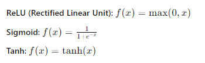
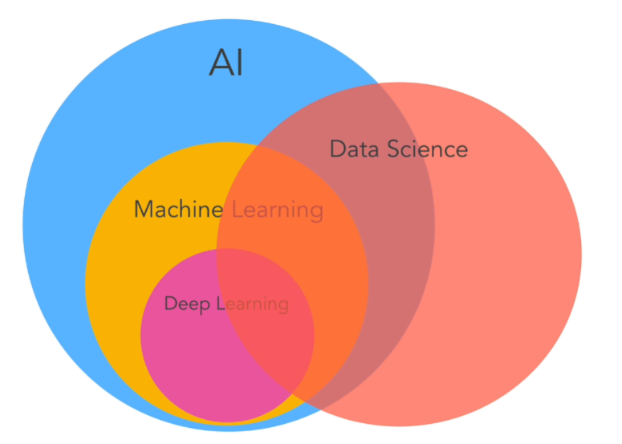
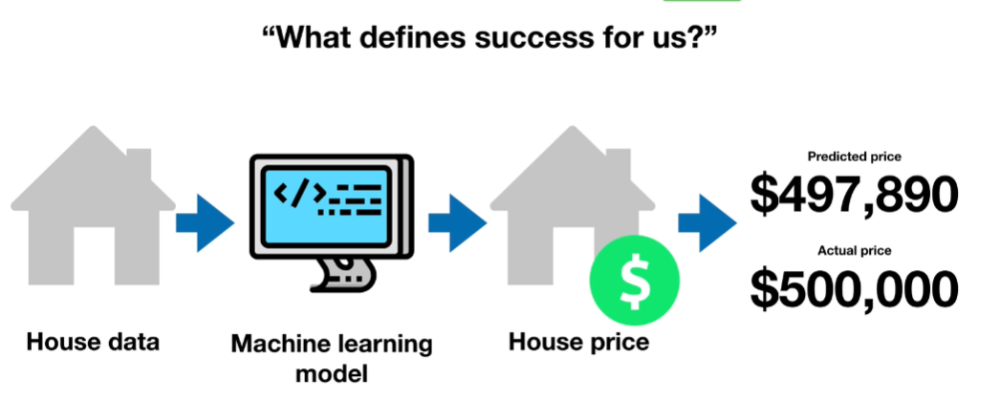
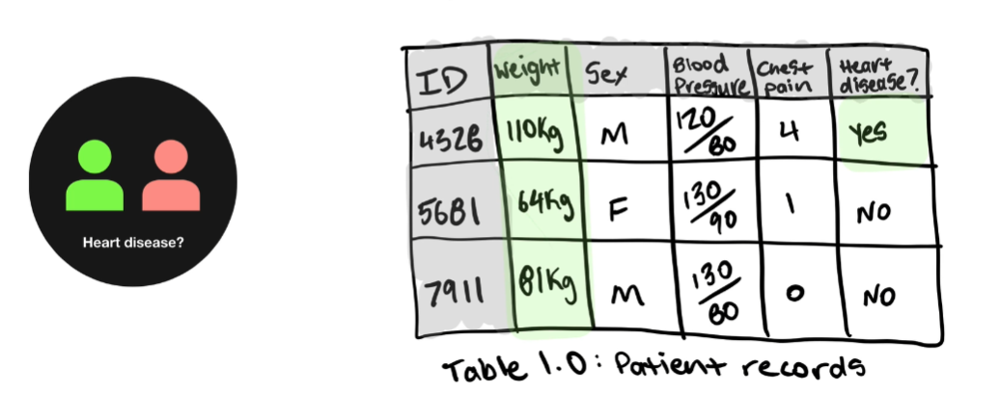

# AI

## Machine Learning

- There are 3 main types of machine learning
  - **Supervised learning**
    - Training a model on labeled data
  - **Unsupervised learning**
    - Finding patterns in unlabeled data
  - **Reinforcement learning**
    - Training a model to make decisions based on rewards and penalties

## Neural Networks

- **Basic Architecture of Neural Network**
  - Neural network is composed of layers of nodes
  - The basic architecture includes an input layer, one or more hidden layers and output layer
  - Each node in a layer is connected to nodes in the subsequent layer
  - Each connection has an associated weight sum of inputs to produce an output

## Convolutional Neural Network (CNN)

  - CNN are specialized for processing grid-like data such as images
  - They use convolutional layers to automatically detect spatial hierarchies of features
  - Traditional neural networks or fully connected networks do not have this structure and treat all input data equally without considering spatial relationships

## Deep Neural Networks (DNN)

- Class of artificial neural networks with multiple layers between the input and output
- They are called deep because they have more than one hidden layer which allows them to model complex relationships in data
- **Structure**
  - **Input Layer**
    - This Layer consists of neurons that receive the input data
    - The number of neurons in this layer corresponds to the number of features in the input data
  - **Hidden Layers**
    - These Layers are responsible for transforming the input into something the output layer can use
    - Each hidden layer consists of neurons that apply activation functions to the weighted sum of inputs from the previous layer
  - **Output Layer**
    - This layer consists of neurons that produce the final output of the network
    - The number of neurons in this layer depends on the type of task

- **Neurons and Activation Functions**

- **Neuron**
  - The basic unit of neural network
  - It performs a weighted sum on its inputs and passes the result through an activation function

- **Activation Functions**
  - Functions that introduce non-linearity into the network, allowing it to learn complex patterns
  - Common activation functions include:
  
    
     
- **Training of DNN**

  - **Forward Propagation**
    - The process of passing input data through the network to get the output
  
  - **Loss Function**
    - A function that measures how well the network predictions match the actual data
    - Common loss functions include Mean Squared Error (MSE) for regression and Cross-Entropy Loss for classification

  - **Backpropagation**
    - The process of adjusting the weights of the network to minimize the loss function
    - It involves calculating the gradient of the loss function with respect to each weight and updating the weights using gradient descent

- **Types of Layers in DNN**
  - **Dense Fully Connected Layers**:
    - Each neuron in the layer is connected to every neuron in the previous layer
  - **Convolution Layers**
    - Used mainly in **Convolutional Neural Networks(CNN)** for processing grid-like data  
    - They apply convolution operations to the input

  - **Recurrent Layers**
    - Used in **Recurrent Neural Networks (RNN)** for processing sequential data
    - They maintain a hidden state that captures information from previous inputs

- **Optimization Techniques**
  - **Gradient Descent**
    - An algorithm to minimize the lost function by iteratively adjusting the weights in the opposite direction of the gradient
  - **Regularization**
    - Techniques to prevent overfitting by adding a penalty to the loss function

- **Common Architectures**
  - **Feedforward Neural Network (FNN)**
    - A basic type where connections do not form cycles
  - **Convolutional Neural Network (CNN)**
    - Specialized for processing image data with convolutional layers
  - **Recurrent Neural Network (RNN)**
    - Designed for sequential data with hidden states to capture information over time
  - **Long Short Term Memory (LSTM)**
    - A type of RNN designed to overcome the vanishing gradient problem by maintaining memory cell

- **Applications**
  - **Image Recognition**
    - Classifying images into categories
  - **Natural Language Processing**
    - Task such as text classification
    - Language translation
    - Sentiment analysis
  - **Speech Recognition**
    - Converting spoken language into text
  - **Autonomous Systems**
    - Enabling self driving cars and robots to perceive and navigate their environment

- **Challanges**
  - **OverFitting**
    - When the model performs well on training data but poorly on unseen data
    - Regularization and data augmentation can help mitigate this problem
  - **Computational Cost**
    - Training deep networks can be resource intensive
    - Specialized hardware like GPU and technique like model quantization and pruning can help
  - **Interpreting Models**
    - Deep Networks are often seen as black boxes making it hard to understand their decision making process

## Large Language Models (LLM)

- Deep learning models trained on vast amounts of text data to understand and generate human language
- They are used in AI inference for tasks such as text generation, translation, summarization and question answering
- (GPT, BERT,...)
- Type of AI model designed to understand and generate human language
- They are typically based on deep learning architectures, specifically neural networks and are trained on vast amounts of text data

- **NN architecture**
  - LLM are built using deep neural networks often based on architectures such as **Transformers**
  - Those excel in processing sequential data like text
  - **Tranformers**
    - They use self attention mechanisms to weigh the importance of different words in a sentence 
    - Allowing them to capture long range dependencies and contextual relationships better than previous architectures like RNN or LSTM

- **Key Components**
  - **Tokenization**
    - Before feeding text into a LLM, the text is tokenized
    - Which means breaking it down into smaller units (tokens)
    - These tokens can be words, sub-words, or even characters depending on the tokenization strategy
  - **Embeddings**
    - Tokens are converted into embeddings, which are dense vector representations that capture the semantic meaning of the tokens
    - These embeddings are the input to the neural network
  - **Self-Attention Mechanism**
    - Allows the model to weigh the importance of each token in a sentence relative to other tokens
    - This helps the model understand the context and relationships between words
  - **Positional Encoding**
    - Since transformers do not inherently understand the order of tokens, positional encoding is added to the input embeddings
    - So it gives the model information about the position of each token in sequence
  
- **Training LLMs**
  - **Pre-training**
    - LLms are typically pre-trained on a large corpus of text using unsupervised learning objectives such as:
      - **Masked Language Modelling (MLM)**
        - Used in models like BERT where some tokens in the input are masked and the model learns to predict the masked tokens
      - **Causal Language Modelling (CLM)**
        - Used in models like GPT where the model predicts the next token in a sequence given the previous tokens
  - **Fine Tuning**
    - After **pre-training** LLMs are often fine tuned on specific tasks or datasets using supervised learning
    - This step adapts the pre-trained model to perform well on particular applications such as sentiment analysis, question answering or translation

## CUDA and OpenCL

- **CUDA**
  - CUDA is parallel computing platform and API model created by NVIDIA
  - To use CUDA, we write functions called kernels that run on the GPU
  - We manage memory allocation on the GPU and use CUDA specific keywords like **__global__**, **cudaMalloc** or **cudaMemcpy**

## Device Driver

- **Device Driver Development**

  - **Key considerations include**: 
    - Understanding the kernel architecture
    - Managing resources efficiently
    - Ensuring thread safety
    - Handling interrupts
    - Providing user friendly interface
    - Performance optimization and ensuring compatibility with different hardware configurations are also crucial

## Kernel

## General Questions

- **Problem Solving and Debugging**
  - Can you describe a challenging bug you encountered and how you resolved it?
    - Answer: [Provide a specific example from your experience]. Describe the problem, the debugging steps you took, the tools you used (e.g., GDB for C++), and the eventual solution.

- **Describe how you would optimize a deep learning model to run efficiently on an FPGA?**

  -  First, I would identify the computationally intensive parts of the model. 
  -  Then, I would map these parts to the FPGA using hardware description languages like VHDL or Verilog or higher-level synthesis tools. 
  -  Optimizations would include parallelizing operations, minimizing data transfer between the CPU and FPGA, and utilizing FPGA-specific features such as DSP slices.

- **How would you handle data marshaling between different hardware components (e.g., CPU, GPU, FPGA)?**

  - I would use efficient data transfer protocols like DMA (Direct Memory Access) to minimize CPU involvement. 
  - Implementing a buffer management system to handle data flow and synchronization mechanisms like semaphores or mutexes to ensure data integrity and consistency are also essential.

- **How would you optimize a neural network for power efficiency without significantly compromising accuracy?**

  - Use techniques like quantization to reduce the bit-width of weights and activations, which can lead to significant power savings.
  - Apply pruning to remove less significant weights, which reduces the model size and the number of operations.
  - Implement power-aware training algorithms that take power consumption into account during the training process.
  - Use energy-efficient hardware accelerators and optimize the deployment of the model on such hardware.

- **What are the key considerations when choosing a data format for neural network inference at the edge?**
  
  - The trade-off between precision and power consumption or memory usage. Higher precision formats like 32-bit floating-point offer higher accuracy but consume more power and memory.
  - The impact of quantization on model accuracy. Techniques like post-training quantization or quantization-aware training can help mitigate accuracy loss.
  - The specific hardware capabilities of the edge device, as some devices are optimized for certain data formats.
  - The nature of the application, as some applications might tolerate minor accuracy loss for significant power savings.

- **How does lossy compression affect neural network inference, and when would you consider using it?**

  - Lossy compression can introduce inaccuracies in the model's predictions, which might not be acceptable for all applications.
  - It is suitable for static data where the impact on accuracy can be thoroughly evaluated and deemed acceptable.
  - Dynamic data that changes frequently is less suited for lossy compression due to the risk of unpredictable accuracy loss.
  - Examples of lossy compression techniques include quantization and weight pruning, which need careful evaluation to balance efficiency and accuracy.

- **What tools or methods do you use to evaluate the impact of quantization on neural network performance?**

  - Use quantization-aware training to simulate the effects of quantization during the training phase and adjust the model accordingly.
  - Employ post-training quantization tools provided by frameworks like TensorFlow Lite, PyTorch, or ONNX to evaluate and fine-tune the quantized model.
  - Use benchmarking tools to measure the performance of the quantized model in terms of both accuracy and efficiency.
  - Analyze the model's sensitivity to quantization by conducting experiments that vary the bit-width and observing the resulting impact on performance.

- **Can you walk us through the process of developing a software component for an FPGA that accelerates a specific neural network operation?**

  - Begin with profiling the neural network to identify the computational bottlenecks.
  - Choose the specific operation to be accelerated based on its computational intensity and potential for parallelization.
  - Write the corresponding FPGA code, often using HDL languages like VHDL or Verilog, or high-level synthesis tools like Vivado HLS.
  - Optimize the data flow and memory access patterns to ensure efficient execution on the FPGA.
  - Test the FPGA component independently before integrating it with the rest of the neural network inference pipeline.
  - Iterate on the design, using feedback from performance measurements to further refine the implementation.

- **Describe a time when you collaborated with hardware engineers to optimize a software solution. What challenges did you face and how did you overcome them?**

  - Provide a specific example from your experience where you worked closely with hardware engineers.
  - Highlight the importance of clear communication to understand hardware constraints and requirements.
  - Discuss any technical challenges, such as synchronizing software and hardware components, and how you resolved them.
  - Emphasize the iterative process of testing and optimizing the solution to meet performance goals.

## Questions for him

1. **About the Company's Technology and Direction**
  
  - Can you share more about TurboNext.AI's approach to integrating your chips with existing AI hardware like GPUs? How does this integration enhance AI inference performance?
  - This question shows your interest in the company’s core technology and how it stands out in the market. It also helps you understand the technical challenges and innovations involved.
  
2. **About the Team and Collaboration**

   - How do software engineers collaborate with hardware engineers and AI data scientists at TurboNext.AI? Can you describe a typical project workflow?
   - Understanding the collaboration dynamics will give you insight into the company’s work culture and how interdisciplinary teams work together.

3. **About Tools and Processes**

- What tools and methodologies do you use for developing and optimizing neural network models at TurboNext.AI? How do you ensure models are both accurate and efficient?
- This question indicates your interest in the technical processes and tools used by the company, and it helps you understand their approach to model development and optimization.

4. **About Challenges and Future Developments**

- What are some of the biggest challenges TurboNext.AI is currently facing in developing power-efficient AI solutions, and how do you foresee overcoming them?
- This question shows your awareness of industry challenges and your interest in the company’s future plans and strategies.
 
5. **About Specific Technologies**

- How does TurboNext.AI leverage FPGA technology for AI acceleration, and what unique advantages does this bring compared to other hardware solutions?
- This question is technical and specific, showing your understanding and interest in FPGA technology and its application in AI.\

6. **About Innovations and Research**

- Can you elaborate on any recent innovations or research projects at TurboNext.AI that you are particularly excited about?
- This question allows the interviewer to share exciting developments and demonstrates your enthusiasm for cutting-edge technology and innovation.
  
7. **About Career Growth and Development**

- What opportunities for professional development and growth does TurboNext.AI offer its engineers? How do you support continuous learning and skill advancement?
- This question shows that you are thinking about your long-term career and are interested in growing with the company.
  
8. **About Company Culture and Values**

- How would you describe the company culture at TurboNext.AI? What values are most important to the team?
- Understanding the company culture is essential to ensure it aligns with your values and work style.
  
9. **About Quantization and Compression Techniques**

- Given your expertise, what are some of the latest advancements in quantization and compression techniques for neural networks that you find most promising?
- This question shows your interest in the interviewer’s expertise and keeps the conversation focused on cutting-edge technologies.

10.  **About the Impact of the Role**

- How does the role of a Systems Software Engineer at TurboNext.AI directly contribute to the company’s mission and goals?
- This question helps you understand the impact of your potential role within the company and shows that you are looking to make a meaningful contribution.
Asking these questions will demonstrate your knowledge, curiosity, and genuine interest in both the position and the company, helping you leave a positive impression on your interviewer.

# UDEMY

## Machine Learning

- Subset of AI
- Approach to achieve AI through systems that can find patterns in set of Data
- Involves the development of algorithms and statistical models enabling computers to perform tasks without explicit instructions
- It relies on patterns and inference from data to make decisions or predictions
- The goal is to enable machines to learn from experience, improving their performance over time autonomously 
- There is lot of overlap with Data Science

  

- Machine Learning is using algorithm to learn about different patterns in data
- Then taking the results what it learned to make predictions about the future using similar data

- **Types**
  - **Supervised**
    - We have some group and ML is trying to identify what is in which group
    - Classification
    - Regression

  - **Unsupervised**
    - The group does not exist
    - So ML will create them
    - Clustering
    - Association Rule Learning
    
  - **Reinforcement**
    - Skill acquisition
    - Real time learning
    - Teaching machines with try and error, with rewards and punishments
    - 

- **Deep Learning**

- One of the techniques to implement machine learning
- 

## Machine Learning Framework

1. **Problem Definition**

  - What problem are we trying to solve?
  - Supervised? Unsupervised? 
  - Classification? Regression?

2. **Data**

  - What kind of data do we have?
  - Structured? Unstructured?

3. **Evaluation**

  - What defines success for us?

    

4. **Features**

  - What do we already know about the data?

    

5. **Modelling**

  - Based on our problem and data, what model should we use?
  - 

6. **Experimentation**

  - How could we improve?
  - What can we try next?

## Data Engineering

- Data engineer is collecting data from various sources and produce and maintains it in databases
- Create Data pipeline

- **Data**
  - What is data?
  
  - **Structured Data**
    - DataBase, Excel sheet

  - **Semi-Structured Data**
    - Often stored in XML, CSV or JSON

  - **Unstructured Data** 
    - PDF, Email, etc...

  
  - **Binary Data**
    - MP3, PNG, MP4, etc...

- **Data Mining**
  - Extracting  (preprocessing) some knowledge from the Data

- **Big Data**
  - So much Data we need to run it on cloud usually
  - Too much Data for single computer or database

- **Data Pipeline**
  - 

## PANDA

## NumPy

## Scikit-learn

## Tensorflow