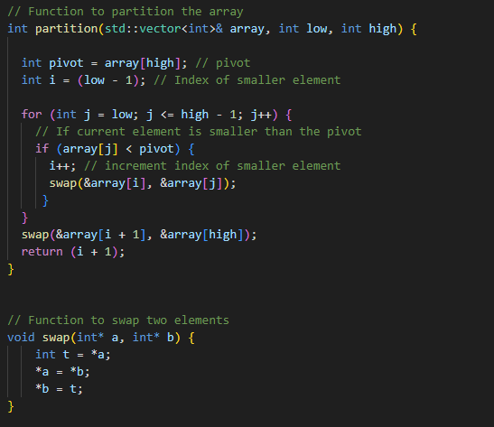

# Algorithms

## Understanding Algorithms:

- Algorithms are step-by-step procedures or formulas for solving a problem. 
- They are essential in programming for processing data and performing tasks efficiently.
- Familiarity with common algorithms like sorting (e.g., quicksort, merge sort), searching (e.g., binary search), and graph algorithms (e.g., Dijkstra's algorithm for shortest paths) is important.

## Algorithm Complexity

- Knowledge of Big O notation is crucial. It describes the performance or complexity of an algorithm, especially in terms of time (time complexity) and space (space complexity).
- Understanding how changes in input size affect performance helps in optimizing code.

### Big O Notation

- Mathematical notation used to describe the upper bound of the time complexity or space complexity of an algorithm
- It characterizes the performance of an algorithm in terms of the size of the input data (n)
- This notation provides a high-level understanding of the algorithm in terms of efficiency and scalability
- Crucial in comparing the efficiency of different algorithms
- It help to predict performance

**Key Concepts**

- **Upper Bound**
  - Big O provides an upper limit on the time an algorithm will take or the space it will use in the worst-case scenario
- **Input Size(n)**
- **Ignoring Constants**
  - Big O notation abstracts away constants and less significant terms
  - For example O(2n) is simplified to O(n) and O(n^2 + n) to O(n^2)

- **Common Big O Types:**

  - **O(1) - Constant Time** 
    - The algorithm takes the same amount of time regardless of the input size
    - For example: Algorithm that determines if a number is even or odd
  - **O(log n) - Logarithmic Time**  
    - The complexity increases logarithmically with the input size
    - Algorithms that divide the problem in half each time (Binary Search,...)
  - **O(n) - Linear Time**
    - The complexity is directly proportional to the input size
    - For example: Iterating through an array to find an element and so on
  - **O(n * log n) - Log-Linear Time**
    -  Common in algorithms that break problems down into smaller parts, solve them individually and ofthen combine solutions (Merge Sort,...)
  - **O(n^2) - Quadratic Time**
    - Time complexity increases quadratically with the input size
    - It is common in algorithms with nested iterations over the data set
  - **O(2^n) - Exponential Time**
    - The time complexity doubles with each adition to the input data set
    - Common in brute-force algorithms for solving problems
  - **O(n!) - Factorial Time**
    - Extremely slow with growing n
    - Common in algorithms that generate all permutations of a dataset 

### Space Complexity
 
- Creating array of size n -> O(n) space complexity
- Creating Matrix n x n -> O(n^2) space complexity
- When we are using recursive calls, each function call is added to the call stack and picks up actual space in memory

### Time Complexity

## Algorithm Design Techniques

- Familiarity with techniques like recursion, divide and conquer, dynamic programming, and greedy algorithms.
- Data Storage Structures

## Application in Problem Solving

- Knowing when to use a particular data structure or algorithm based on the problem requirements. For example, choosing between a hash table or a binary search tree based on the need for ordered data.

## Common Algorithms

### Sorting Algorithms

#### Bubble Sort

- The algorithm gets it name because smaller elements "bubble" to the top of the list
- It is stable sort meaning that it maintains the relative order of equal sort items
- It can detect if the list is already sorted and stop early
- It is not very efficient on large lists and is generally used for educational purposes to introduce the concept of sorting algorithms

##### Steps

1. **Starts at the beginning of the array:**

- The algorithm compares the first two elements

2. **Compare and swap:** 

- If the first element is greater than the second element, they are swapped

3. **Move to next pair:**

- Move to the next pair of elements and repeat the comparison and swap if necessary

4. **Complete the pass:**

- Continue this process for the entire array
- By the end of this first pass the largest element will "bubble up" to the end of the array
  
5. **Repeat:**

- Repeat the entire process for the remaining elements (excluding the last element which is already on the correct position)

6. **Termination:**

- The algorithm stops when a pass through the array results in no swaps, indicating that the array is sorted

##### Complexity

- **Time Complexity:** 
  - O(n^2)
- **Space Complexity:**
  - O(1) as it only requires a single additional memory space for swapping

##### Examples

#### Insertion Sort

- Simple and intuitive sorting algorithm
- It builds the final sorted array one item at a time -> much less efficient than more advanced algorithms
- **Advantages:**
  - Simple to understand and implement
  - Efficient for small data sets and it is more efficient than other simple quadratic algorithms such as selection sort or bubble sort
  - It is a stable sort
  
##### Steps

1. **Starts with second element**

- Considering the first element to be a sorted sub-list of one element -> Starts with the second element

2. **Compare with sorted sub-list**

- Take this element and compare it to the elements in the sorted sub-list (everything to the left of the current position)

3. **Insert in the correct position:**

- Shift all the elements in the sorted sub-list that are greater than the current element to the right by one position and insert the current element at its correct position

4. **Move to the next element:**

- Move to the next element and repeat the process until the entire list is sorted

##### Complexity

- **Time Complexity:**
  - O(n^2) 
- **Space Complexity:**
  - O(1) as it only requires a single additional memory space for the value being inserted

##### Examples

#### Selection Sort

- ToDo

#### Quick Sort Algorithm

- Highly efficient sorting algorithm and is based on a dived and conquer approach
- It works by selecting a 'pivot' element from the array and partioning the other elements into two sub-arrays, according to whether they are less than or greater than the pivot
- The sub-arrays are then sorted recursively
- This can be done in-place requiring small additional amounts of memory to perform the sorting

##### Steps

###### Choose a Pivot

- This can be any element from the array
- Common strategy includes picking the first element, the last element, random element or median element

###### Partioning

- Rearrange the array so that all elements with values less than pivot come before the pivot, while all elements with values greater than pivot come after it
- After partitioning the pivot is in its final position
- This is called the partition operation

###### Recursively Apply

- Recursively apply the above steps to the sub array of elements with smaller values and separately to the sub-array of elements with greater values

###### Base Condition

- The recursion stops when the sub-array has less than or equal to one element ( as a singe element or empty array is always sorted)

##### Complexity

- **Average Time Complexity:** 
  - O(n * log n)
- **Worst Time Complexity:** 
  - O(n^2)
  - This happens when the smallest or largest element is always choosen as the pivot. However this is rare especially if the pivot selection is randomized
- **Space Complexity:**     
  - O(log n)
  - This is becuase of the recursion stack. The actual sorting is done in-place
  
##### Key Points

- Quick Sort is not a stable sort, which means that the relative order of equal sort items is not preserved
- It is efficient for large data sets and often performs better than other O(n * log n) algorithms like merge sort or heap sort

##### Example

- **Function quickSort** 
  - Takes the array or portion of it and recursively sorts it
  - It does it by partitioning the array around the pivot (selected by the partition function) then sorting sub-arrays before and after the pivot
- **Function partition** 
  - Rarranges the elements in th array so that all elements less than pivot come before it and all elements greater come after it
  - Pivot is then placed to its correct position
- This implementation uses the last element as the pivot

#### Merge Sort Algorithm

- Efficient, stable, divide-and-conquer comparision based sorting algorithm
- It is particularly good for sorting larga data sets and performs well on linked lists

##### Concept

1. **Divide:** 
   - The array is recursively split into two halves until each sub-array contains a single element or is empty.
2. **Conquer:**
   - Each sub-array is then merged back together in a sorted manner
3. **Combine:**
   - The sorted sub arrays are combined to form the final sorted array

##### Steps

1.  **Divide the Array:**
    - If the array has more than one element we divide it in half
    - We keep dividing the resulting sub arrays until we have sub arrays that are empty or contain only one element   
2.  **Merge Sub-Arrays:**
    - The merging process involves comparing elements of the sub-arrays and combining them in sorted order
    - This is done by creating a new array and filling it by choosing the smallest or largest element from the sub-arrays in each comparison
3.  **Repeat the Process:**
    - This process of dividing and merging continues recursively witch each level of recursion merging two sub-arrays at a time
4.  **Final Sorted Array:**
    - The final step is when all sub-arrays are merged back int oa single sorted array
  
##### Complexity

- **Time Complexity:**
  - With Arrays: 
    - O(n * log n) 
    - Division of array in half (log n) divisions
    - Merging arrays in linear time (n)
  - With Linked Lists:
    - O(n * log n) 
    - Same division and merging
- **Space Complexity:**
  - With Arrays: 
    - O(n) 
    - Due to the temporary arrays used for merging
  - With Linked Lists:
    - O(log n) for recursive version
    - O(1) for iterative version
  
##### Key Points

- Merge Sort is paticularly useful for sorting linked lists in O(n * log n) time
- It is stable sort, which means it preserves the input order of equal elements in the sorted output
- Merge Sort is often preferred for sorting a linked list whereas Quick Sort is preferred for arrays
- The additional space complexity of O(n) can be a disadvantage compared to algorithms like Quick Sort which sorts in place

##### Examples

- In the example above the recursive approach is used but be aware of stack overflow for very large lists, in which case an iterative approach might be better

#### Heap Sort

1. **Heap Data Structure**

- A binary heap is complete binary tree that satisfies the heap property
- In max heap, every parent node is greater than or equal to its child nodes
- In min heap, every parent is less than or equal to its child nodes

2. **Building Heap**

- The first step in Heap Sort is to transform the list into a max heap or min heap (if sorting in descending order)
- This is done using a process known as "heapifying" 

3. **Sorting the Array**

- Once the heap is built, the root of the heap is guaranteed to be the first element of the array
- Swap this root element with the last element of the array and reduce the heap size by one. The last element now is at its final position
- "Heapify" the root of the tree again so that the largest element is at the root
- Repeat this process until all elements are sorted

##### Complexity

- **Time Complexity**
  - O(n * log n) - Heapify process is O(log n) and it is called n times
- **Space Complexity**
  - O(1) - Heap Sort sorts the array in place and requires a constant amount of extra space

##### Characteristics

- In-place sorting
- Not stable - The relative order of equal elements might no be preserved
- Good for large data sets:
  - Particularly efficient for data sets that are too large to fit into memory
  - Effective when we need to sort large data sets with minimal space complexity.
- However it is less efficient than other O(n * log n) sorting algorithms in practical scenarios

##### Examples

### Searching Algorithms

#### Binary Search

- Efficient algorithm for finding an item from a sorted list of items.
- It works by repeatedly dividing in half the portion of the list that could contain the item, until we have narrowed down the possible locations to just one

##### Concept

1.  Compare the target value to the middle element of the array
2.  If they are not equal the half in which the target cannot lie is eliminated and the search continues on the remaining half
3.  If the elements are equal, the position of the middle element is returned as the result
4.  This process is repeated until the target value is found or the remaining array to be searched is empty

##### Conditions

- The list must be sorted
- Binary search is used on a list, not on linked list because random access is slover in linked list

##### Steps

1.  Find the middle element
2.  Compare the middle element with the target value
    - If the target value equals to the middle element, return index
    - If the target value is less than the middle element, repeat the search for the left half
    - If the target vallue is greater than the middle element, repeat the search for the right half
3.  If the target is not found and the array can not be split further, the item is not in the array
  
##### Complexity

- **Time Complexity:**
  - Best Case: O(1) - This occurs when the central index is the target to be found
  - Other Cases: O(log n) - Witch each comparison, half of the remaining elements are eliminated, leading to the logarithmic time complexity    
- **Space Complexity:**
  - Iterative Implementation: O(1)
  - Recursive Implementation: O(log n) - consumes space on the call stack

##### Advantages

- Highly efficient for larga datasets as long as the dataset is sorted
- Much faster than linear search (which is O(n)) in most cases

##### Limitations

- Only for sorted arrays
- For very small arrays, the overhead of the algorithm might not be worth it compared to a simple linear search
  
##### Examples

