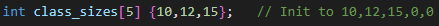
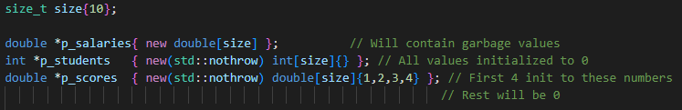
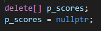
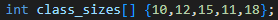

# Arrays

    - Stores element of the same type

## Array Initialization

### Static Initialization ToDo
    
    - We do not need to fill every declared slot of the array, the rest will init to 0
    

### Dynamic Initialization ToDo

    - Arrays are allocated on the heap with the 'new' operator
    - Can also use the 'std::nothrow' version of new

    - To release memory allocated for an array we need to use 'delete[]' operator
    - We can not use 'std::size' and ranged base for loop on dynamically initialized arrays

## Array Declaration

### Omitting size

    - We can omit size of the array at declaration
    - The compiler will deduce the size from the number of elements

## std::size()  (C++17)

    - since C++17 we can use function std::size(array); to get the current size of the specified array

