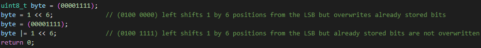
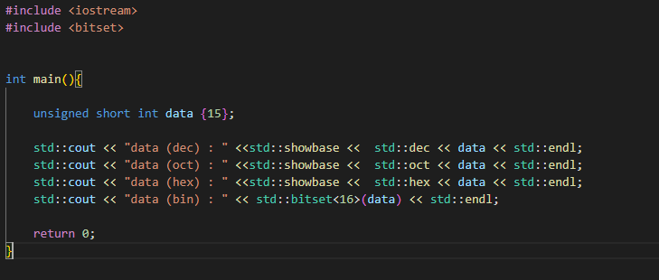
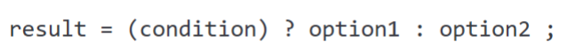

# Bitwise Operations

    Bitwise AND:	&
	Bitwise OR:     |
    Bitwise XOR:	^
	Left shift:     <<
	Right shift:	>>
					
        a >> b   - right shifts bits "a" by "b" number of positions		
	    <<                                         (1<<0)      (1<<1)     	 (1<<2)	      (1<<3)								
		1 << 3;  - left shifts 1 by 3 positions: 0000 0001 -> 0000 0010 -> 0000 0100 -> 0000 1000 	
		5 << 2;  - left shifts 101b by 2 positions: 0000 0101 -> 0000 1010 -> 0001 0100
		20 >> 2; - right shifts 10100b by 2 positions: 0001 0100 -> 0000 1010 -> 0000 0101

	Bitwise NOT:	~

	Operator |= does not change bits that are already stored and we are not interacting with them

How to print different number systems:

    

## Ternary Operators

