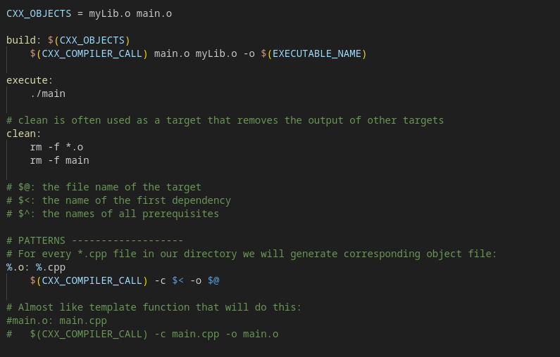
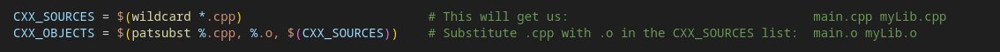
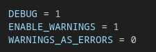
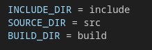
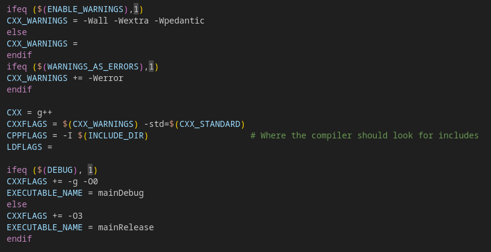
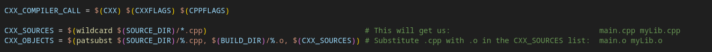
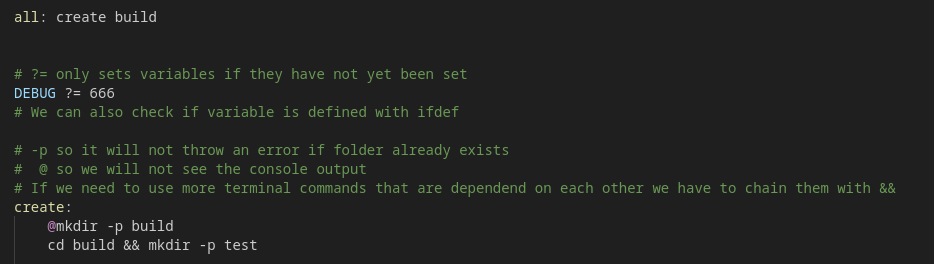

# Makefile

- Makefiles are usually used on unix-based compilers like g++ and clang
- Special file used with **make** build automation tool, which controls the generation of executables
- It is a script with series of rules
- Each rule specifies how to build certain targets from other files

## Basic Structure
  
- **Targets**
   
  
  
- This is the file or the action that make will produce or execute
- It can be an executable file, an object file, or even a label for particular command sequence
- **Dependencies:** 
  - These are files that target depends on
  - If any of these files change, the target will be rebuilt
- **Command:**
  - This is the shell command that make will execute to build the target
  - Each command must be preceded by a **tab** character 

  

## Linking

- If we have multiple source files we need to link them properly
- We can do it like this:

  

- Or we can create separate target for each files but then we need to add dependencies:

  

## Flags

- **CC:** 
  - Program for compiling C programs
  - default: cc 

- **CXX:**
  - Program for compiling C++ programs
  - default: g++

- **CFLAGS:**
  - Extra flags to give to the C compiler

- **CXXFLAGS:**
  - Extra flags to give to the C++ compiler

- **CPPFLAGS:**
  - Extra  flags to give to the C preprocessor

- **LDFLAGS**
  - Extra flags to give to the linker 
  

## Variables

- Variables can only be strings
- Single or double quotes for variable names or values have no meaning, it will be string either way
- For example we can set some flags:

  

- We can then access these variables with **$(variable_name)**:

  
  
- We can also call the targets with specified variables like this:

  

- **Concatenation**
  
  - IF we want to add to the string of already existing variable, we can use **+=**
  - In this example we are concatenating to the CXXFLAGS according to debug or release mode:
  
      

## Patterns

- We can create patterns to avoid code redundancy
- For example we can create pattern that for each .cpp file in the directory will create corresponding object file:

  

- **wildcard**

  - To better generate the list of all source files, we can use function called **wildcard**
  - This function is used to generate a list of filenames that match a specified pattern
  
    

  - From that list we can easily get object name list with using **patsubst** function which will substitute .cpp with .o

## Projects Template

- **Flags**
  - For our template we create flags for debugging, to enable warnings and to treat warnings as error but the last one is switched off by default

    
  
  - Then we separate our project into 3 separated folders for headers, source files and files generated by this makefile:

    

  - Then we create variables that the compiler call will use:

    
    

  - Then we complete the compiler call variable and fill lists of source files and object files:

    

  - Finally we create our targets
  - Targets that do not correspond to existing file name are called phony targets and should be mentioned in **.PHONY:** target
  - We also use pattern that will create object file for every source file

    

## Other

- It is good practice to create one main target called **all**
- It should be the first target in the makefile so it will be called if we do not specify the target 
- Also in the image below we can see additional info about some commands:

  