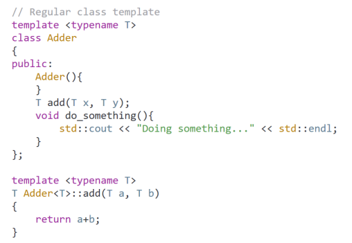
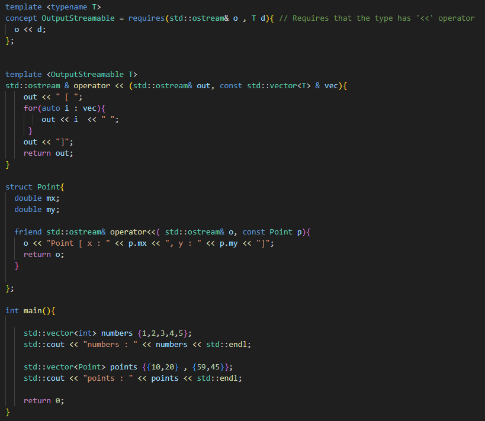

# Class Templates

- It is a class blueprint that can be used by compiler to generate more specific class instances
- It is not real C++ code just blueprint

ss
- The definition should show up in the header file because compiler will look only into header files to look for what it should generate template instances 
- All member function definitions moved into the header file, the compiler needs to see them there to generate proper template instances
- A template is only instantiated once, it is reused every time the type is needed in our code
- All the class members are inline by default so we are safe from ODR issues

## Constructors

## Destructors

## Instances of Class Templates

- Template instance is created for a given type only once
- Only Methods that are used are instantiated

## Non Type Template Parameters

- Traditionally Non Type Template Parameters could be only of int like types (int, size_t, ...)
- But since C++20 we can use more types like floating types or even some class types but it still shaky across compilers
- Even typename:

- But with this approach we are limited which types we can use in older C++ (even some compilers for C++20 can have problem):

- Non Type Template Parameters have few drawbacks. For example We need to have template statement for each member function definition outside the class
- Also a different instance is generated each time the non type template parameters values are different:

- So we should not used them if possible

## Default Values Template Parameters

## Explicit Template Instantiations

- The compiler generates the instances based on the arguments we provide
- Template instances are put exactly where our template class statements are in the code
- All members of the class template are instantiated, regardless of whether they are used or not
- This feature is useful to debug our class template code

## Template Specialization

- For example in class template like this:

- We can run into problem when we want to create instance for 'char *' and use the add method
- It will just add the adresses and thats not what we want
- So we can create additional class template specialization just for this type:

- Class template specializations are FULL classes, they are not templates.
- We must have the original template in the code as well
- **If their definitions show up in a header outside of the class definition and the header is included in the multiple files we will get ODR vioations!!**
- Methods declared inside class definitions are automatically inlined by the compiler, so they are constrained to the translation unit where they show up
- **If we are creating class template specialization, we need to fill every method that we want to use, it wont fill automatically from the original class template!!**
- It is separate class

## Specific Method Specialization

- It is possible to specialize just some specific method

- Again we need specialization for const char* but this time only for one specific method:

- Notice that we need to inline that function so it can be usable from header file (or put it into cpp file)

## Friends of Class Templates

### Friend Class

### Friend Function

## Operator '<<' for Class Templates

- It is important to add '<>' or '\<T\>' so the compiler will know that it is related to the template

- Or setup the friend definition inside the class tempalte:

## Type Traits and Static Asserts

- We need to #include \<type_traits\> 
- It is usefull when some types does not make any sense for our template:

- Or we can for example assert the need of default constructor with: std::is_default_constructible_v<T>

## Concepts C++20

- We need to #include \<concepts\>
- It is alternative to the static_assert approach to restraint some types
  

- If we have class splitted into declaration and definition then we need to add something:

- For the separated definition in cpp file we need to add 'requires' for each method definition for the code to be portable:

- Concept example:

