# Classes

- Mechanism to build our own types
- It is a blueprint for creating objects. 
- It is a user-defined data type, which holds its own data members and member functions, which can be accessed and used by creating instances (objects) of that class. 
- The class defines what type of data it contains and the functions or methods that can manipulate that data.
  
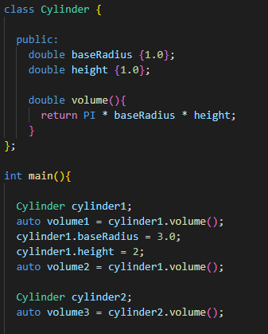

- Members of class are private by default
- Members can be raw stack variables, pointers or references
- Class methods (member function of a class) have access to the member variables even if they are  private
- Private members of classes are not accessible from the outside of the class definition

- Size of the class is sum of the size of its member variables but there could also be some padding that the compiler may add for memory alignment
- Memory alignment is used to ensure that data is efficiently accessed by the CPU and it typically involves adding padding bytes between data members to align them
  on memory addresses that are multiples of their size
- The functions are not counted into that because they are not stored as part if each individual object. Instead member functions are stored in a 
  separate code section of memory shared among all instances of the class

## Good practice

- For bigger classes it is better to create their own source and header file for them
- In the header there should be declaration of class methods and members
- In the source there should be bodies of the class methods

## Constructors

- Special class method that is called when an instance of a class is declared
- It has no return type and the same name as the class
- Initializes objects. It is automatically called when object is being created
- Usually initialize member variables of a class
- Types
  - Default constructor - Does not take any argument
  - Parametrized constructor - Passes arguments to the constructor
  - Copy constructor - Initializes object using another object of the same class
  - Move constructor - Allows a r-value object to be moved into a new object
 
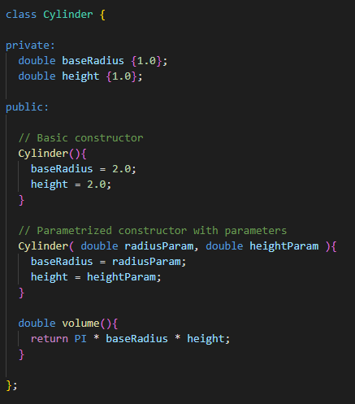

### Parametrized Constructor

- Constructor that uses its parameters to initilize object variables
- It can also use default parameters

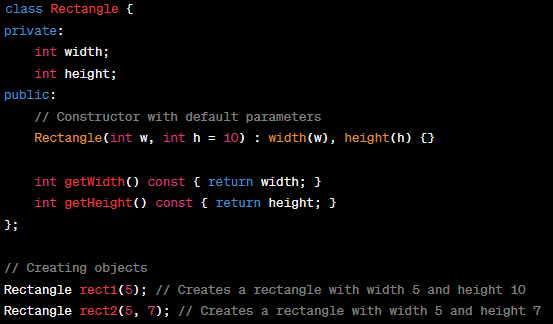

- But if we call parametrized constructor without some of his parameters that are defaulted to some value and there is also another constructor that has less parameters and it will be match for him as well, then the compiler will be confused because he does not know if he should call constructor with less parameters or the one that has some of the parameters defaulted.
- So we must be careful about that and use default parameters only when it will not colide with another constructor to avoid compiler error
- We should also be careful that we can declare default parameters only in class definition. When the function body is separated elsewhere we can not repeat the default parameters there again.

### Defaulted Constructor

- The moment we set up our own constructor (even only the Parametrized one), the compiler will NOT generate default constructor
- So if we still want to construct objects without parameters with the default constructor we need to put in our own default constructor

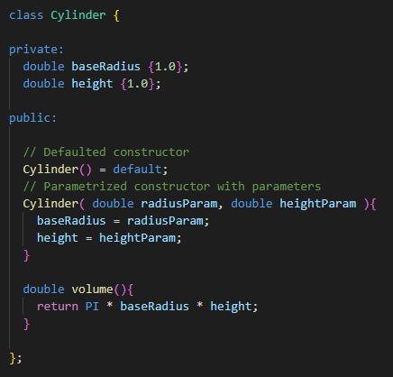

### Copy Constructor

- Initializes object using another object of the same class 
- Works only with the l-value references and copy semantics
- **Has to have const reference of the original object to copy as input parameter**
- Called when:
  - An object of the class is returned by value
  - An object of the class is passed (to a function) by value as an argument
  - An object is constructed based on another object of the same class
  - A compiler generates a temporary object
- It is however not guaranteed that a copy constructor will be called in all these cases, because the C++
  Standard allows the compiler to optimize the copy away in certain cases
- If we do not define our own copy constructor, C++ compiler creates default copy constructor for each
  class which does a member-wise copy between objects.
- We need to define our own copy constructor only if an object has pointers or run-time allocation for the resource like
  file handle, network connection, etc...
- Default copy constructor does only shallow copy
- In user defined deep copy we make sure that pointers of copied object point to new memory locations    
  (Shallow copy is something like reference?? If new object changes the origin one changes as well)
- Copy constructor can be made private
- When we make him private in a class, objects of that class become non-copyable. (or rectangle(const rectangle &r) = delete;)
 
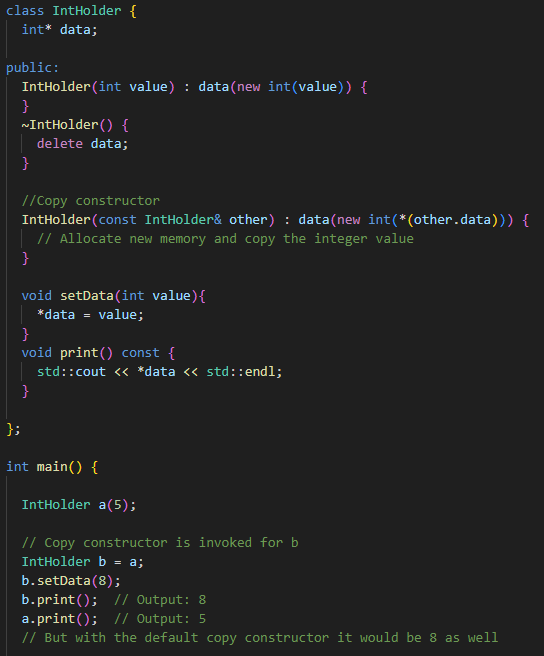

### Move Constructor

- Works only with the r-value references and move semantics (pointing to already existing object in memory)
- On declaring the new object and assigning it with the r-value, firstly a temporary object is created, and then that temporary 
  object is used to assign the values to the object. Due to this the copy constructor is called several times and increases the overhead 
  and decreases the computational power of the code. To avoid this overhead and make the code more efficient we use move constructors.
- They moves resources in the heap unlike copy constructor which copy the data of the existing object and assigning it to the new object, move constructor
  just makes the pointer of the declared object to point to the temporary object and nulls out the pointer of the temporary objects -> prevents unnecessarily copying data in the memory
- Prevents more than one object to point to same memory location

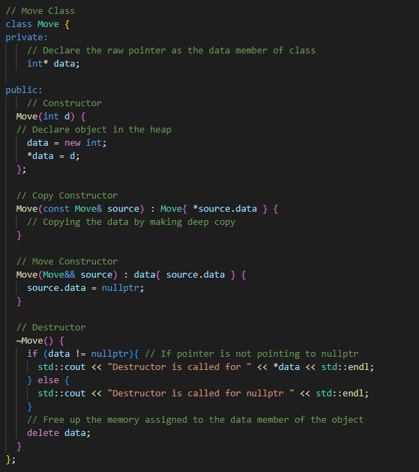
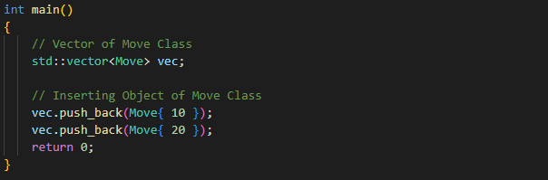

### Explicit Constructors

- If we are using normal parametrized constructor with one parameter then the compiler can implictily convert for example some number into the object
- If we want to forbid this implicit conversion we need to specify our constructor as 'explicit'

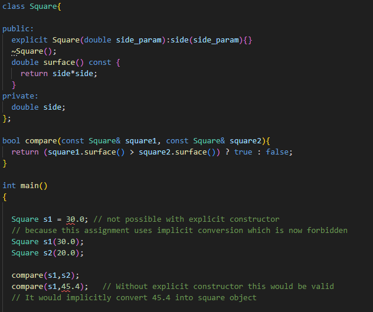

## Initializer List

- Instead of Member wise copy initialization:

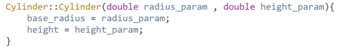

- We can use Initializer list:

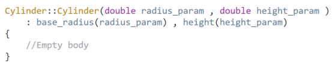

- Initializer list avoids unnecessary copies
- In some cases, they are the only way to initialize an object

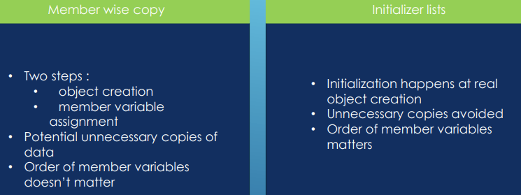

## Destructors

- Special methods that are called when an object dies
- They are needed when the object needs to release some dynamic memory or for some other kind of clean up

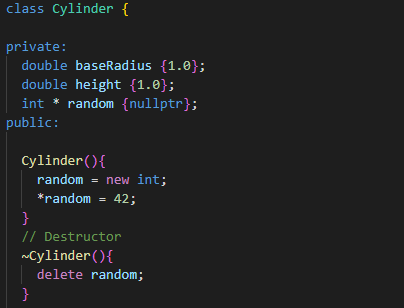

- Called when local stack object goes out of scope and when heap object is released with delete
- The destructors are also called in places that may not be obvious:
  - When object is passed by value to a function
  - When a local object is returned from a function

## Order of Constructors/Destructors Calls ToDo

- When we create objects like in the next screen, the destructor will actually be called in the reverse order
- Object that was constructed last will be destructed first
  
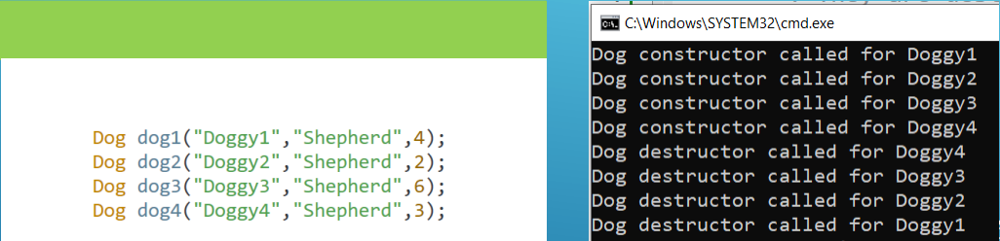

- It is because there could be some other objects that depends on object that was created before
- If we destroy the last object first we can avoid this problem

## Setters and Getters

- Methods to modify or read member variables of a class

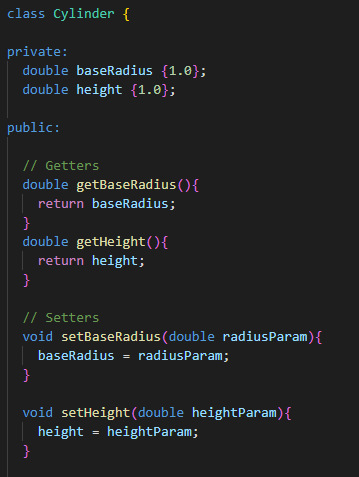

### Getters and Setters Combined

- We can combine getter and setter into one function using references

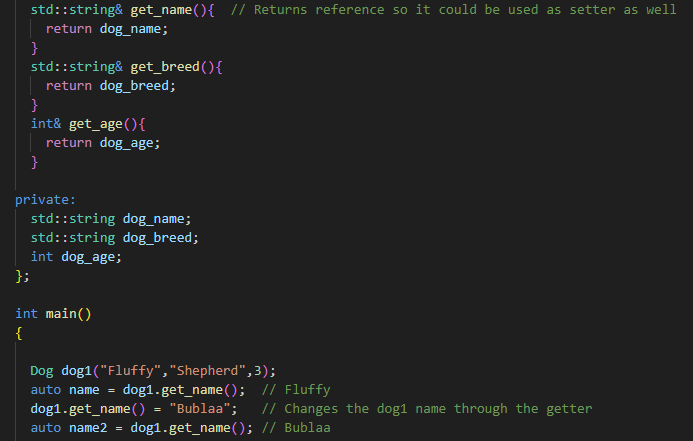

## Managing Objects With Pointers

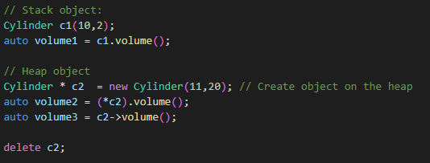

## This Pointer

- Each class member function contains a hidden pointer called 'this'
- That pointer contains the address of the current object, for which the method is being executed
- This also applies to constructor and destructors
- It can also help when solving names conflicts

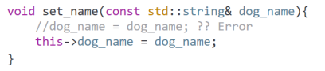

- We can also chain the class method calls if they are returning 'this' pointer. Could be useful for setters

- Chaining using references
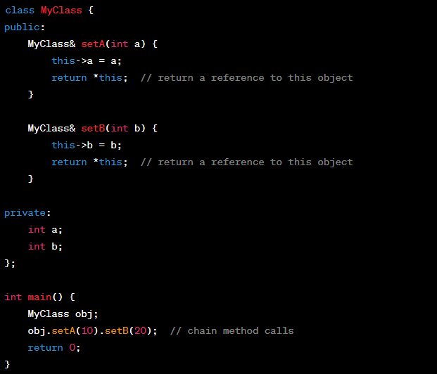

- Chaining using pointers
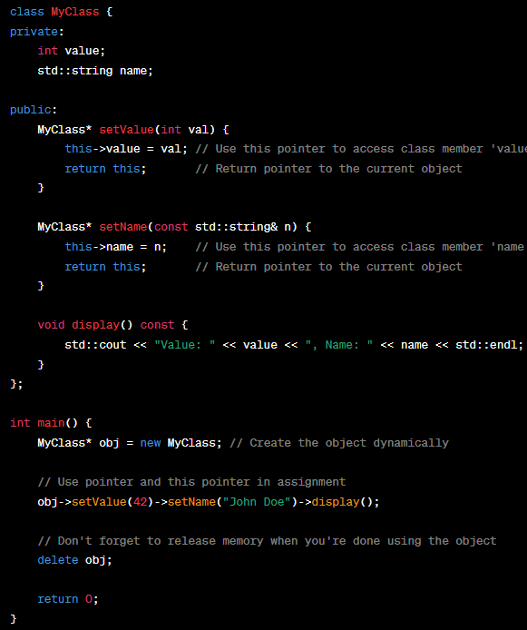
 
## Objects

- It is an instance of a class or struct
- It is concrete realization of the blueprint provided by the class or struct
- An object represents a specific piece of data and encapsulates both its attributes(member variables) and behaviors(member functions)

### Const Objects

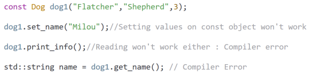

- Problem is that the compiler does not know that the getter functions or the print function will not modify the class
- We need to tell the compiler that the getters will not modify the class

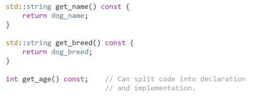

- We can also overload the function so for const object it will use const function but for normal object it will use normal function

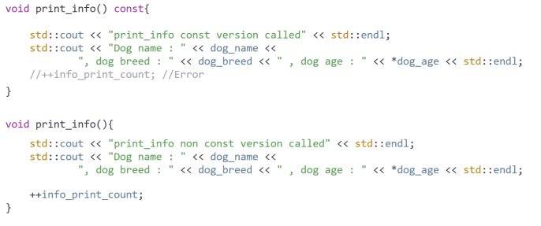

- Summary
  - For const objects we can only call const member functions
  - Const objects are completely non-modifiable
  - Any attempt to modify an objects member will result into compile error
  - We can not call any non-const function within a const function

### Dangling Pointers and References in Objects

- A pointer or reference is said to be dangling if it is pointing to or referencing invalid data
- A simple example for pointers is a pointer pointing to a deleted piece of memory
- Good practice is that after we delete our objects from memory we will set pointers to 'nullptr'

## Mutable Member Variables

- Variable which value can be changed even if the object or method it is within is declared as 'const'
- It can only be applied to non-static and non-const class member variables

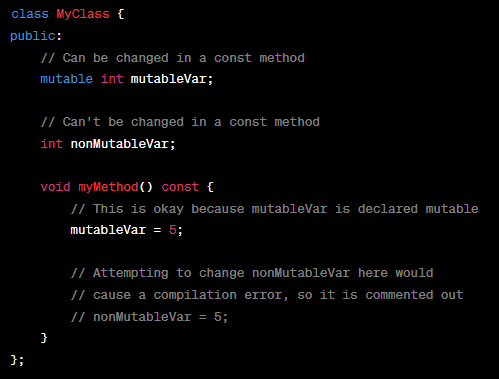

## Struct

- User defined data type that groups together multiple related variables under one name
- It is very similar to a class but with some differences in default access control and inheritance
- Useful when we want to organize related data together
- Default access control here is public while in 'Class' they are private by default
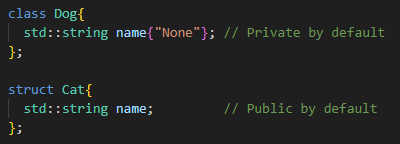
- Another difference is in default inheritance type which is public by default here as well
- But of course we can override these defaults same like with Classes

### Structured Bindings

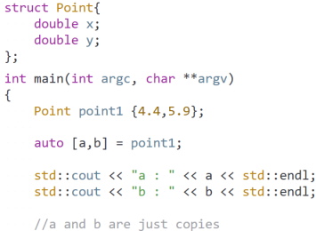

- **Rules of 3: If we have explicit destructor then we should have copy and move constructor as well!!   why?**