# Coding Exercises

## Arrays/Strings

- **LeetCode 88. Merge Sorted Array**

  
  
  

## Two Pointers 

- **LeetCode 125. Valid Palindrome**

  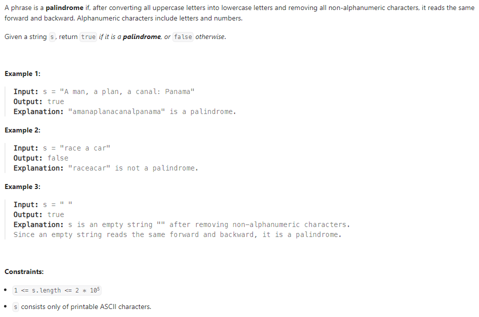
  
  

## Sliding Window

- **LeetCode 209 Minimum Size Subarray Sum**

  
  
  

  - O(n * log n) with binary search applied on length of the subwindow
    
    
    

- **LeetCode 228 Summary Ranges**

  

  ToDo

## Hash Map

- **LeetCode 383 Ransom Note**

  
  
  

- **LeetCode 205 Isomorphic Strings**

  
  
  

## Stack

- **LeetCode 20 Valid Parantheses**

  
  
  

  - or we can use hash map to reduce repetetive code

     

## Linked List

- **LeetCode 141 Linked List Cycle**

  
  
  

## Binary Tree

- **LeetCode 100 Same Tree**

  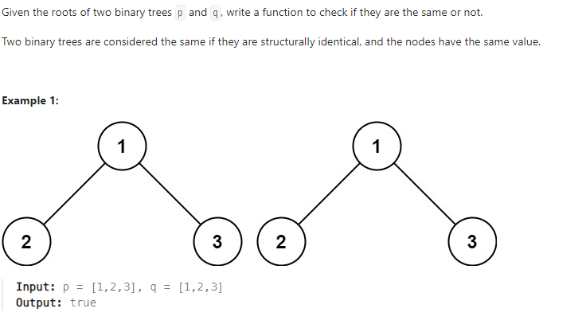
  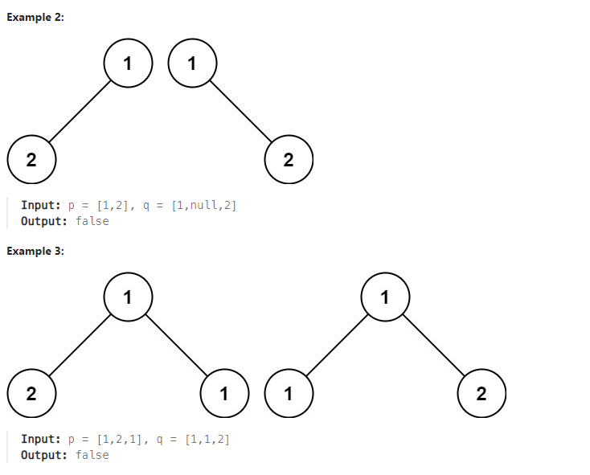
  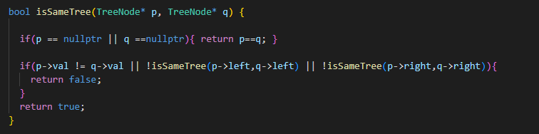

- **LeetCode 226 Invert Binary Tree**

  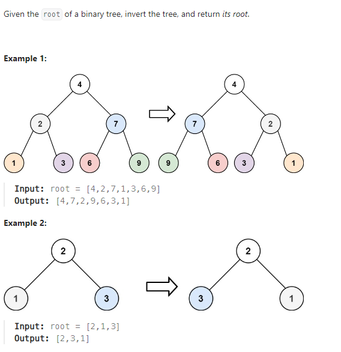
  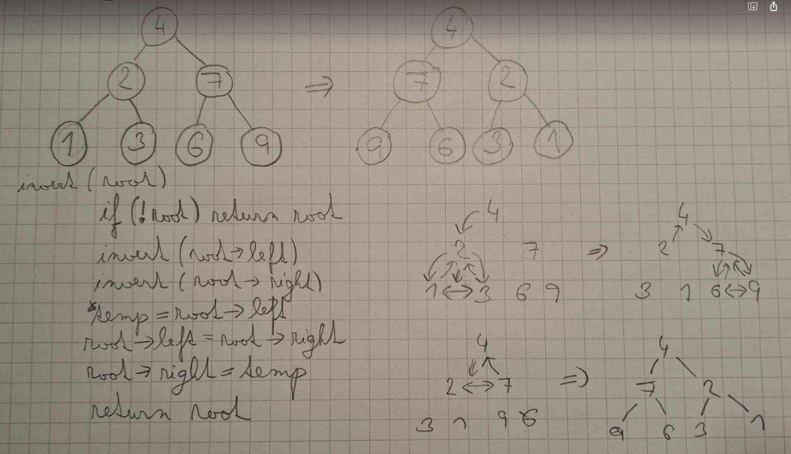
  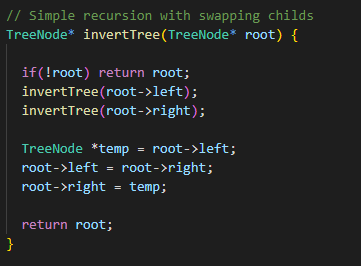

- **LeetCode 637 Average of Levels**

  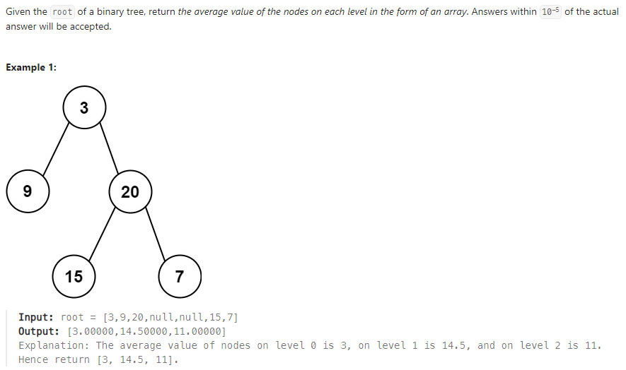
  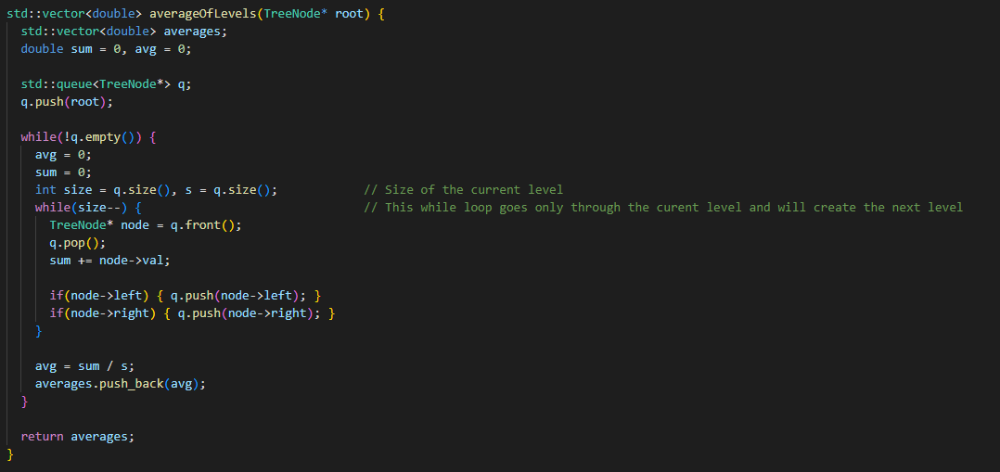

## Binary Search Tree

- **LeetCode 530 Minimum Absolute Difference**

  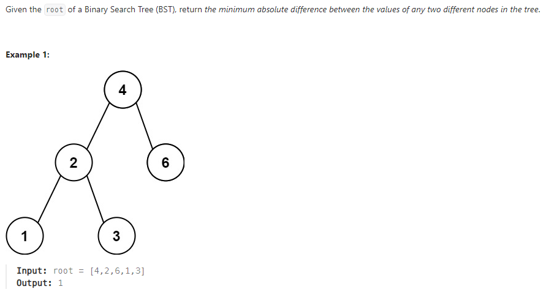
  

## Binary Search

- **LeetCode 35 Search Insert Position**
 
  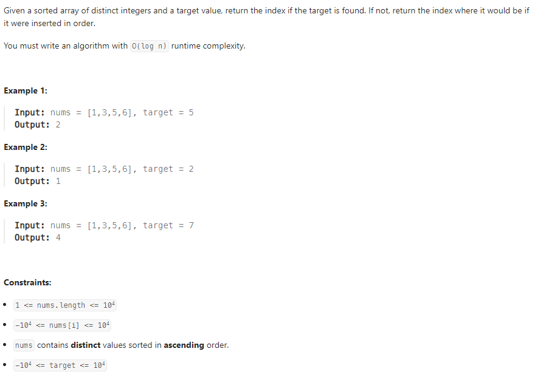
  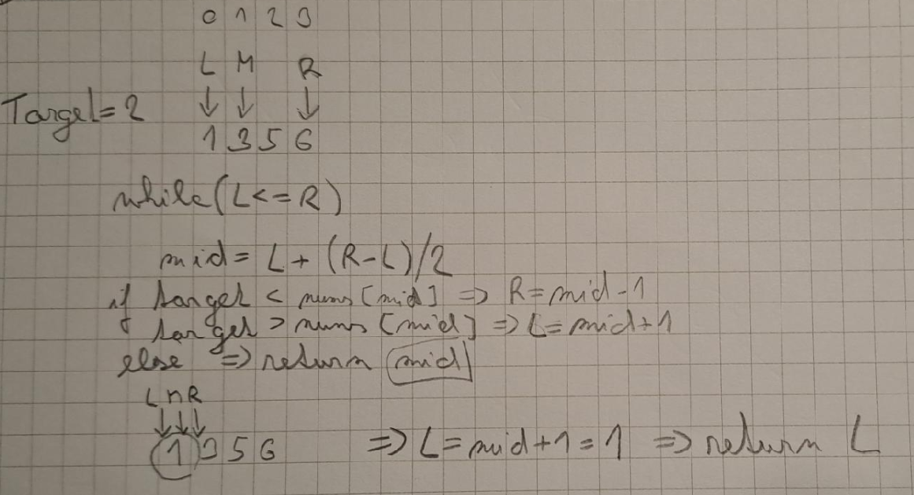
  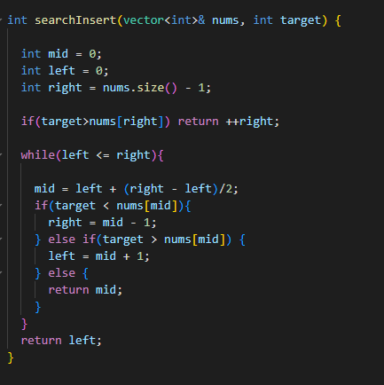

##

