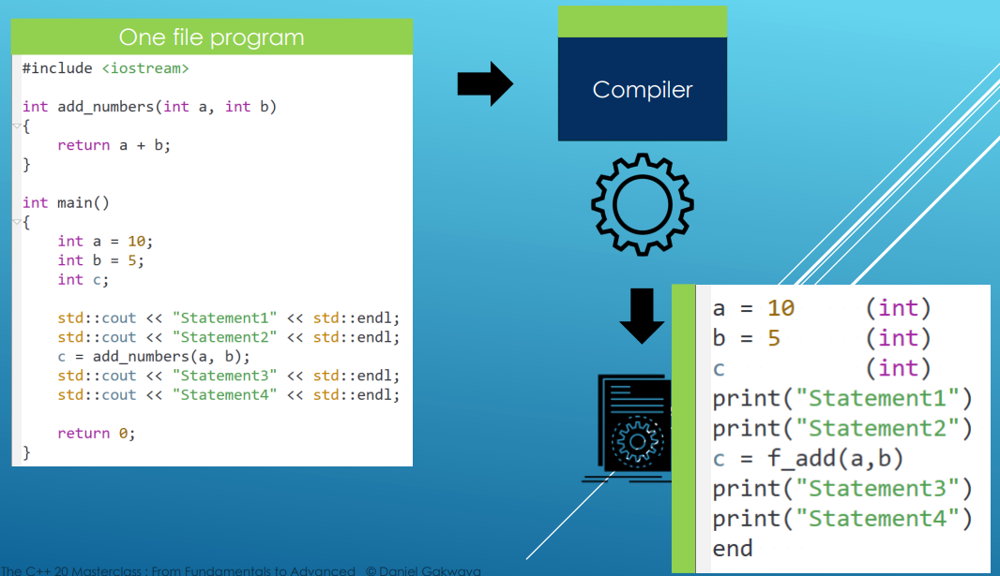
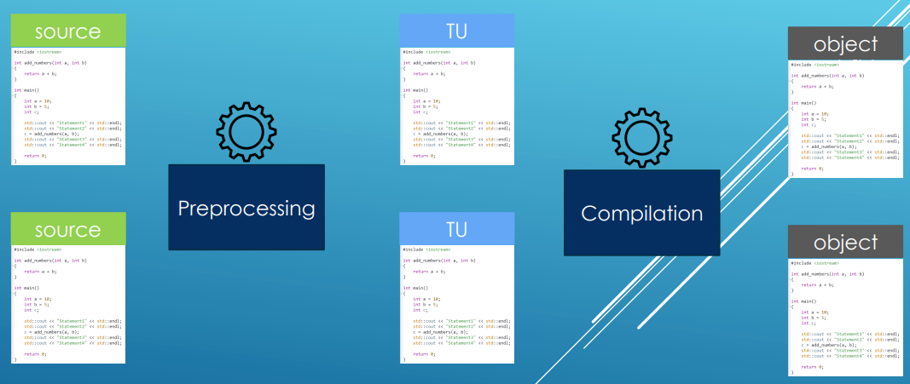
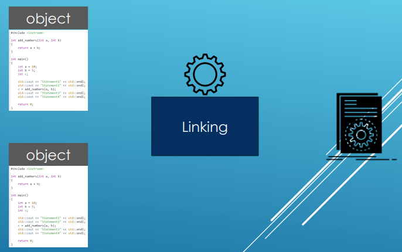

# Compilation

- Compilation is looking for declarations
  
- For single file:
  

- Multiple files:

- Compile and link in one go (main.cpp, utilities.cpp, utilities.h):
  - g++ -o app_name.exe main.cpp utilities.cpp
- Only compile:
  - g++ -c main.cpp utilities.cpp 
  - output will be main.o and utilities.o objects
- Link:
  - g++ -o main.o utilities.o
  - output is final binary file

# Linking

- Linking is looking for definitions
  
