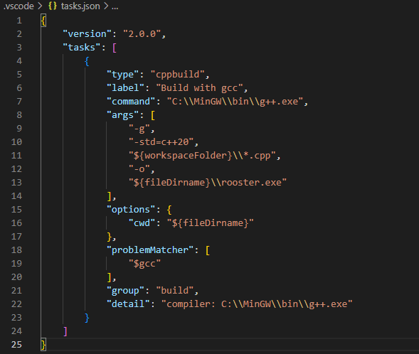

# Configuration Guide

## Install GCC & Clang

    - Download zip archive from winlibs.com
    - Setup environment variable path to the C:/mingw64/bin folder
    - We can try from powershell if its ready to go with 'g++ --version' and 'clang --version' commands

## Configure VS code for GCC

    - 'Terminal->Configure Tasks' -> Pick g++ compiler
    - tasks.json will open and we can edit it

    - '-g'
    - '-std=c++20'                          -> c++20
    - '${workspaceFolder}\\*.cpp'           -> build everything in this folder with .cpp extension
    - '-o', '${fileDirname}\\rooster.exe'   -> output will be rooster.exe  
                                            -> (We can then run the program with './rooster.exe' command)

### C++20 features unlock
    - 'View->Command Palette->C/C++:Edi Configuration (UI)-> Pick C++20

