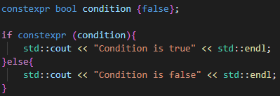
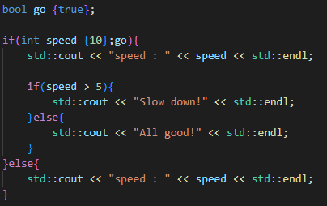
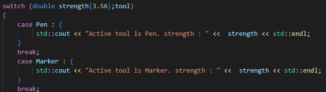

# Control Flow

## If constexpr

    - C++17 feature
    - Conditional programming at compile time (To save computing capacity during run time)
    - Number of things we can do during compile time increase with every new c++ release

    - In this picture we can see that compiler will decide which scope will be used
    - So this if is not decided during run-time anymore
  
## If with initializer

    - Often it is useful to declare variable inside of IF scope, but then we can 
      not use variable for else scope
    - Modern c++17 has solution for this
  
  

    - We can do the same with Switch as well

