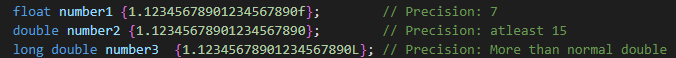
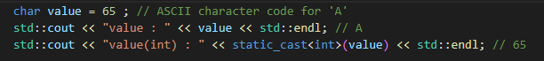
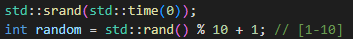

# Cpp Knowledge

## ToDo List

    - Get the sides from Udemy and start using images from them in this markdown

## Introduction ToDo
    
    - If I feel like some topic is complete then I will delete 'ToDo' from its title

## Entry Point ToDo

    - Main() function is usually the entry point of the program and returns Integer

## Comments ToDo

    - Compilers ignore comments
    - '//'              -> one line comment
    - '/* block */'     -> Comments whole block of code
    - ToDo some clever shortcuts for commenting

## Errors ToDo

    - Compile Time errors
    - Runtime Errors
    - Warnings

### Compile Time Error ToDo

    - If there is a compilation error in our code then the compilation will fail and binary wont be created
    - The most common Compile Time Error is of course missing semicolon ';'

### Run Time Error ToDo

    - Program will compile but then it can fail during its run process
    - For example dividing by zero or running out of memory

### Warning ToDo

    - Not serious enough for compiler to fail but compiler is telling us that there is something fishy in the code

## Statements and Functions ToDo

### Statement ToDo

    - Basic unit of computation in a C++ program
    - Every C++ program is a collection of statements organized in a certain way to achieve some goal
    - Statements end with a semicolon ';' in C++ 
    - Statements are executed in order from top to bottom 
    - Execution keeps going until there is a statement causing the program to terminate or run another sequence of statements

### Function ToDo

    - Must be defined before we can use it

    {return_type} {function_name} ({parameters}) {
        {function_body}
        return {value};
    }

## Program Execution Model ToDo

    - Get the slides from udemy  S07E36

##  Core Language and Libraries ToDo

### C++ Core Language ToDo

### Standard Library ToDo

    - #include <Standard_Library_Name>
    - For example: 
        - iostream
        - string
        - ...

### STL ToDo

    - Collections of container types

## Data Types ToDo

## Variables ToDo

    - Variable is a named piece of memory that we use to store specific types of data

### Int ToDo

    - Store decimals
    - Typically occupies 4 bytes of memory
    - Signed 4 bytes int has range:     -2^31 - + 2^31
    - Unsigned 4 bytes int has range :  0 - 2^32
    - Short int has 2 bytes
    - Long int has 4 or 8 bytes depending on the system
    - Long Long int has 9 bytes

### Double ToDo

    - 8 bytes with 15 precision
    - Double precision ToDo
    - Long double has 12 bytes and we need to initialize it with L
        - long double {1.154684849L}

### Float ToDo

    - 4 bytes with 7 precision
    - We should put suffix f when initializing float numbers otherwise it will be double by default
      and compiler will turn it into float but we can lose some data that wont fit
    - Example:  float number {1.123456465487f};

### Char ToDo

    - 1 Byte -> 256 values each linked to some character
    - It is possible to assign ASCII code to a char variable
    - We can choose to interpret either as a character or regular integral value

### Bool ToDo

    - 1 Byte so it could store 256 values but stores just 2 (true/false)
    - 0 -> false    1-255 -> true

### Void ToDo

### Auto ToDo

    - The compiler deduces the type

### Others ToDo

## Decleration ToDo

## Initialization ToDo

    - int x;            -> Just decleration. Compiler will put in some random garbage value

### Braced Initialization ToDo

    - int x{};          -> Initialized to zero
    - int x{10};        -> Initialized to 10
    - int x{a + b};     -> We can use expression as initializer
    - int x{2.9}        -> ERROR or WARNING
    - int x{doesnt_exist1 + doesnt_exist2}  -> Wont compile
    

### Functional Variable Initialization ToDo

    - int x();          -> ERROR 
    - int x(5);         -> Initialized to 5
    - int x(a + b);     -> We can use expression as initializer
    - int x(2.9);       -> It will compile but we will lose information about the fractional part
                        -> Implicit conversion from double 2.9 to int 2

### Assignment Initialization ToDo  

    - int x = 5;        -> Initialized to 5
    - int x = a + b;    -> We can use expression as initializer
    - int x = 2.9;      -> It will compile but we will lose information about the fractional part
                        -> Implicit conversion from double 2.9 to int 2
  

## Encodings ToDo

### Character encodings ToDo

    - ASCII was among the first encodings to represent text but it is not enough
      for languages with lots of characters
    - One of the most common universal encodings is Unicode

## Curiosities

    - If we type 'int x = 017;' C++ thinks its Octal number format which in this case is 15 in Decimal

## Non-attached yet

    - We can use 'std::getline(std::cin,variable);' to get the whole line even with spaces

### std::rand() and std::srand(seed)

    - std::rand(); generates a number [0-RAND_MAX]
    - std::rand() % 11; generates a number between [0-10]
    - same sequence each time the program runs -> use seed
      - std::srand(std::time(0)); 

