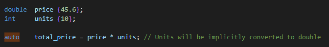
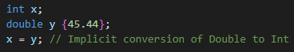
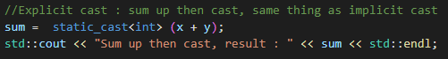

# Data Conversions

    - We can reach overflow or underflow during conversions
    - So we should be mindful of the valid range for specific data types
    - Compiler can throw Warning about overflows and underflows in the code

## Implicit Data Conversions

    - Happens by compiler without our involment 
    - Compiler aplies impilicit conversion when types are different in an expression
    - They are always done from the smallest to the largest data type

    - Or it could be done by assignment

## Explicit Data Conversions

    - Actively initiated by the developer

### Static cast

    - Static_cast<>() is checked by the compiler and if the types are not compatible
      we will get compile error

### Dynamic cast

### ...

