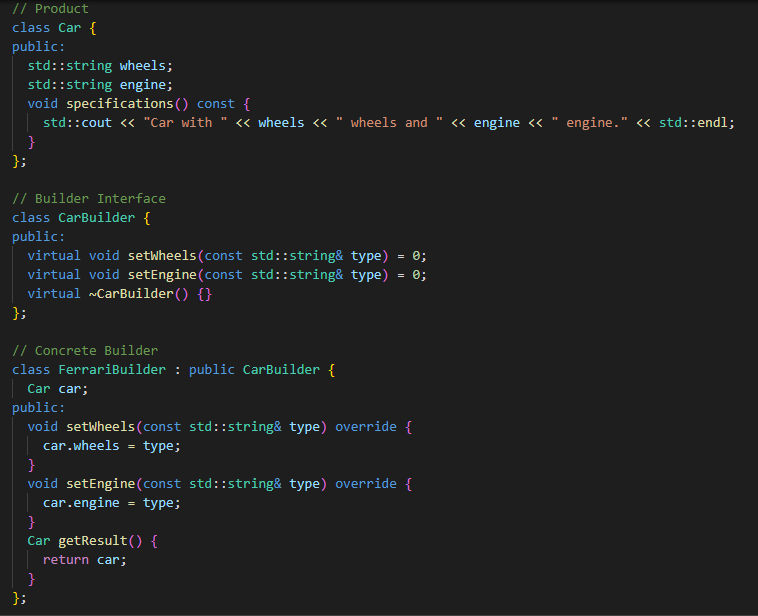
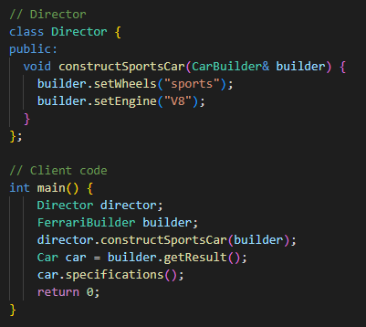
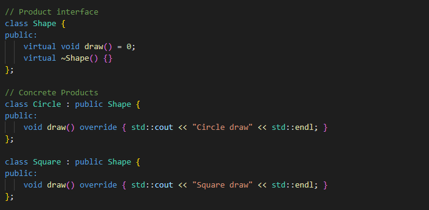
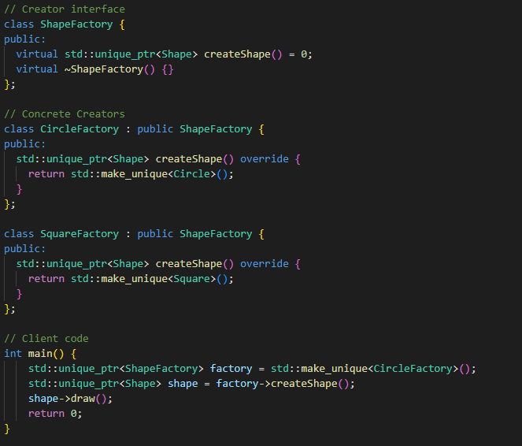

# Design Patterns

## Singleton

## Builder Pattern

- The builder pattern is used to create complex objects step by step
- The builder provides specific methods for creating the different parts of an object
- It is especially useful when an object has a large number of components or requires a lot of steps in its construction
- **When to use**
  - When the construction process of an object is complex and should be separated from the representation of the object
  - When we need to create several variations of an object

## Factory Method

- The Factory Method is a design pattern that provides an interface for creating objects in a superclass but allows subclasses to alter the type of objects that will be created. 
- Instead of calling a constructor directly, you call a factory method that will create the object for you. 
- This way, the code that uses the factory doesn't need to know the exact class that will be instantiated.
- **When to use**
  - When the creation process is complex or should be decoupled from the representation of the created object
  - When we want to provide library of classes and only expose their interfaces, not their implementations

