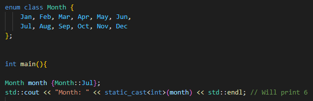
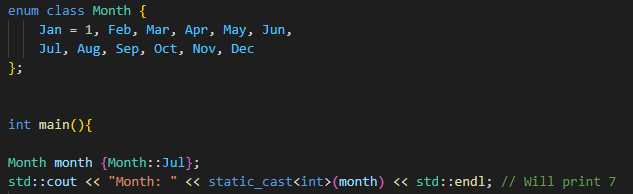
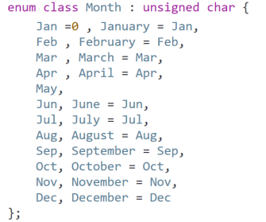

# Enums and Type aliases

# Enum

- To represent a range of value
  

- Each enumeration is represented by an integral value under the hood (starting from 0)
- But we can customize it

- We can even have negative integral values 
- Also we can have more enums representing the same value
- int is the default type associated with enums 
- But we can change that

- We can not implicitly converse to/from enum classes.