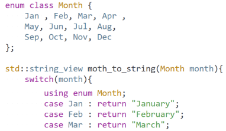
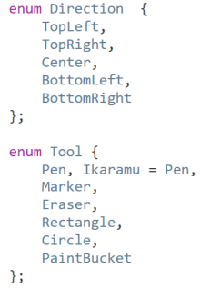
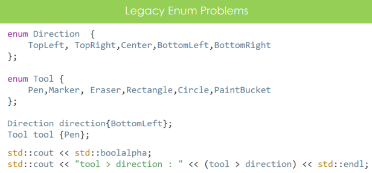
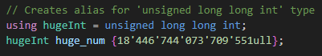
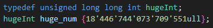

# Enums and Type aliases

## Enum (c++11)

- To represent a range of value
  

- Each enumeration is represented by an integral value under the hood (starting from 0)
- But we can customize it

- We can even have negative integral values 
- Also we can have more enums representing the same value
- int is the default type associated with enums 
- But we can change that

- We can not implicitly converse to/from enum classes.

- Since C++20 we can use 'using enum enum_name;' to avoid typing it all time

## Legacy enum (Old version)

- Not recommended anymore
- Legacy enums implicitly transform to int, which is good for std::cout, but that introduces the problem
  that we can compare different enum types which is very confusing
- Poblems with interchange of different enums:
  

## Type Aliases

- Allows us to give different names to types

## typedef

- Older syntax for type aliases -> not recommended in new code
- Instead use type aliases (nicer syntax)

