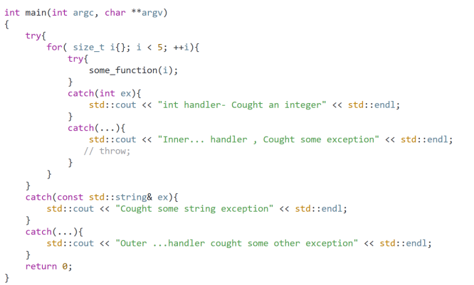
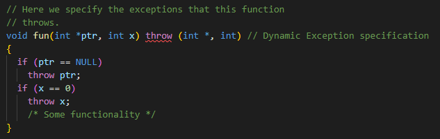

# Exceptions

- C++ built in mechanism to bring problems to the surface and possible handle them
- One of the advantages of C++ over the C
- We can use static_assert or assert to handle problems but exceptions are built in feature to handle errors
- For Run-Time anomalies or abnormal conditions that a program encounters during its execution.
- There are two types of exceptions:
    - Synchronous
    - Asynchronous (Beyond the program control (disc failure etc.))
- C++ keywords for exceptions handling:
    - Try   
      -  Block of code that can throw an exception
      - Allows you to define a block of code to be tested for errors while it is being executed    
    - Catch 
      - Block of code that is executed when a particular exception is thrown
      - Try and Catch keyword come in pairs
    - Throw 
      - Throws exception. Also used to list the exceptions that a function throws but does not handle itself
      - Lets us create a custom error

- There is special catch block called 'catch all' ( catch(...) ) that can be used to catch all types of exceptions.

## Why Exceptions

- Separation of error handling code from normal code
- Functions can handle any exceptions they choose: 
  - Function can throw many exceptions but we may choose to handle only some of them
  - Exceptions that are thrown but not caught are handled by the caller
- Grouping of Error Types
  - Both basic types and objects can be thrown as exception 
- If an exception is thrown but it is not caught anywhere, the program terminates abnormally

## Try and Catch Blocks

- We should never throw pointers to local variables because the local variables dies when we exit the try block so the pointer is pointing to garbage
- Allocating dynamic memory with 'new' in try block is also risky because we can exit before release the memory it causing leakage -> Better to use smart pointers
- If we throw exception and it is not handled, We will get crash
- Thrown objects must be copyable

- Thrown type must be the same as the catch parameter type
- For example in this code the first catch will not catch the exception and program would crash but we can have more catches for single try block
- So the second catch will catch the exception

- We can throw exceptions even without try block, for example in some function and then that function will be inside the try block
- But it is risky because we we call the function without try block it will crash

- When exception is thrown in the try block it will skip the rest of the code to the first catch that will catch it. We can see it in this nested functions setup: 

- We can choose to handle the exceptions at a level in our function call chain that makes sense for our application
- But the further we choose to handle our exception from where it was thrown, the more we risk for functions to not terminate normally and that can cause leaks

## Throwing Class Objects

- We should pass objects to the catch by reference so we will not make copies
- When we are throwing objects with inheritance, the base class catcher will catch even the derived objects !!
- So it is better to order the most derived class catcher first and the most base one last
- Or we can use polymorphism and then only one catch with the most base class type is needed

## Rethrown Exceptions

- We can rethrow exception:

## Program Custom Termination

- If an exception is not handled anywhere in the app, the function std::terminate() located in \<exception\> header will be called
- std::terminate will call std::abort() located in \<cstdlib\> to actually kill the program
- But we can also use our own terminate function instead of the standard one
  

- Even if we do not call std::abort() in our function, system will still kill our application

## Catch All Block

- We can use this block to catch any exception
  
  
  

- This block should be the last in the order of the catch blocks otherwise we wont get to use the specified catch blocks at all

## noexcept Specifier

- We can mark function with this specifier if we do not want to propagate any exception out of the function

- In the past it was possible to dynamically specify types of throws of the function but this was removed in C++17:

- Now we use the noexcept specifier instead

## Exceptions in Destructors

- All destructors are noexcept by default
- But we can cancel it:

- But it is not recommended anyway

## Standard Exceptions

- Standard Exceptions [here](https://en.cppreference.com/w/cpp/error/exception)

### Standard Exceptions Catching

- In the code above we are catching the most base standard exception so it will catch any standard exception and the polymorphism is used to get the most specified output there
- In this case it will throw bad_cast exception. We can find online what causes which standard exception

### Standard Exceptions Throwing

- When we are throwing standard exceptions we should use that standard exception that gives the most sense in that scenario to not confuse other developers

### Deriving from Standard Exception

- We can also derive from the standard exception and create our own subclass of the standard exception

