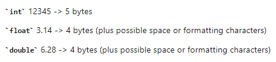
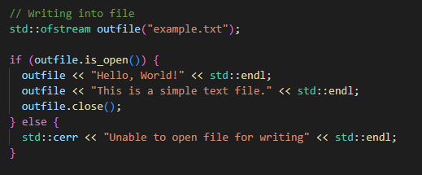
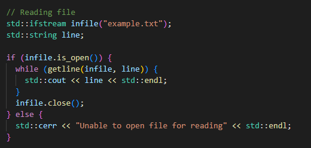
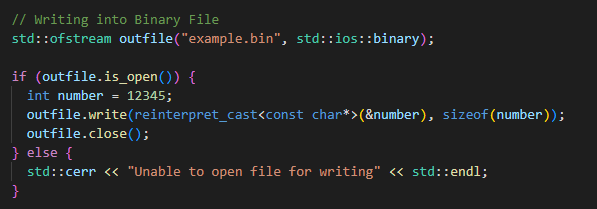
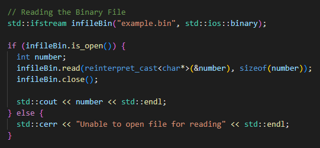

# File Management

- In C++ we have [\<fstream\>](https://en.cppreference.com/w/cpp/header/fstream) library
- This library provides facilities for both text and binary file input and output

## Text File

- In a text file, data is written as human-readable text.
- Which means each digit of a number or each character of a floating-point representation is stored as a separate character. 
- This typically results in larger file sizes compared to binary files.
- Size is determined by the number of characters needed to represent the data

  

- When dealing with text and only ASCII is used then in theory both text and binary file should be same size, but they are usually other characters as '\\n' etc...

### Writing

  

### Reading

  

  

## Binary File

- In a binary file, data is written exactly as it is stored in memory
- Size is determined by the size of the data type
- Here are the sizes of common data types:

- **char**: 1 byte
- **int**: Typically 4 bytes (depends on the system architecture)
- **float**: Typically 4 bytes
- **double**: Typically 8 bytes
- **short**: Typically 2 bytes
- **long**: Typically 4 or 8 bytes (depends on the system architecture)
- **bool**: Typically 1 byte

### Writing

  

### Reading

  

## Tips for File Management in C++

- **Check File Status**: Always check if a file stream is successfully opened before performing any operations.
- **Binary vs. Text Files**: Use std::ios::binary flag for binary files to avoid any newline translations or other modifications.
- **Closing Files**: Make sure to close files after operations to free up system resources.
- **Error Handling**: Implement error handling to manage file I/O failures gracefully.
- **Use RAII**: Consider using RAII (Resource Acquisition Is Initialization) principles to manage file streams with classes.