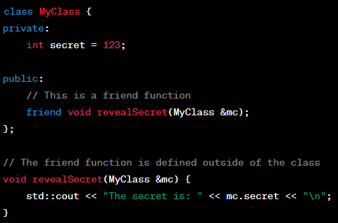
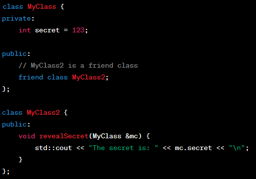

# Friends

- Giving access to our own member variables to external entities 
- External entities can be either functions or classes
- ?The friend function is first declared and alive somewhere?
- The declaration has to show up before we call the function
- The class determines who is its friend through friend declaration
- The friend declaration can appear in public or private section, either works the same
- We can have multiple friend functions in the same class
- Friend functions can be overloaded
- In the friend function we have to use this syntax: 'object_name.member_var_name'
- Friend functions are not member functions
- Friend functions do not have access to the this pointer

## Friend Function

- Friend function is not a member of a class but has access to the class private and protected members

## Friend Class

- Friend class is a class whose members have access to the private or protected members of another class

