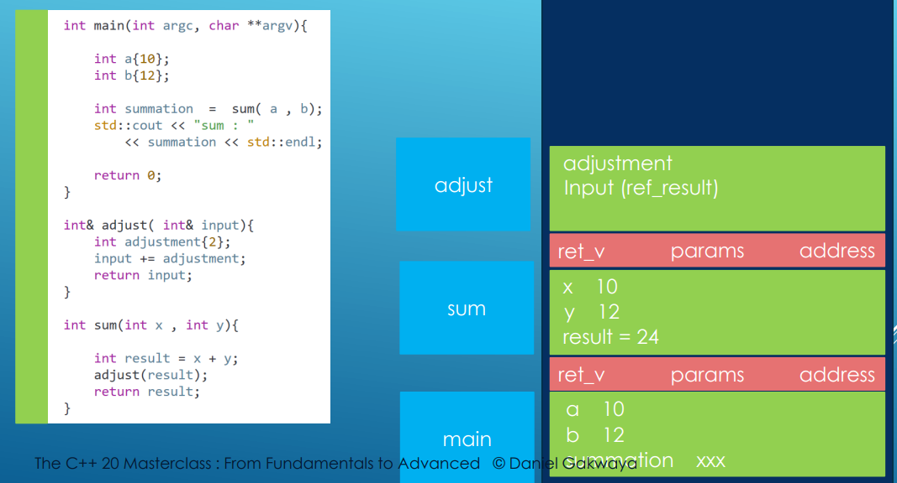

# Function call stack and debugging
 

## Function Call Stack

- Call Stack is a data structure that holds information about the active subroutines (functions) of a program
- This information includes hte variables local to the function, the functions arguments and the return address
- Call Stack operates in Last In First Out (LIFO) manner -> Last function that is called will be the first to finish and be removed from the stack
- When a function is called, a new stack frame is created and pushed onto the call stack. This stack frame holds the functions local variables, arguments and return address
- **Execution**:
  - As long as a function is executing, its stack frame will remain on the call stack
  - If the function calls another function, new stack frame for the called function is created and pushed on the top of the call stack
- When function finishes executing, its stack frame is popped off the call stack and control is returned to the function that is now on top of the call stack
- Popping of the stack frame is usually followed by the de-allocation of local variables and the recovery of the return address
- **Recursion**:
  - Each recursive call add a new stack frame onto the call stack 
  - Deep recursion can result in the stack overflow
- In multi-threaded programs, each thread has its own call stack allowing functions to be independently called and executed within each thread

## Debugging

- Running our program through some other program (debugger) to make it freeze at some point
- This gives the ability to execute it line by line, jumping into functions and examining the local variables in the current stack activation record

### Debugging in VS Code

- We need to setup Run/Debug configurations in launch.json files