# Functions

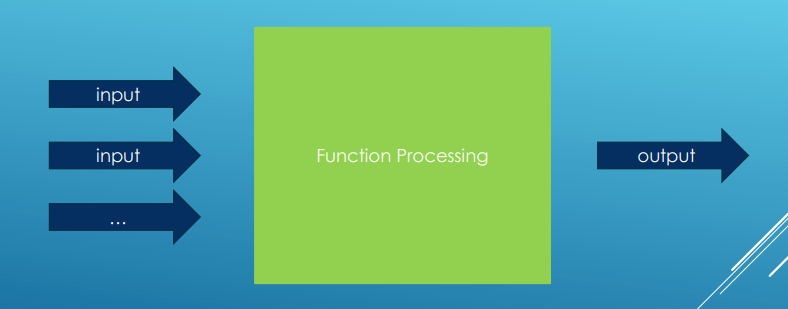

- Function signatures are its name and parameters
- Calling a function
  
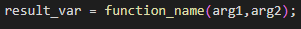

## Passing By Parameter

- We must be aware that without references or pointers, the function will make a copy of the input parameters

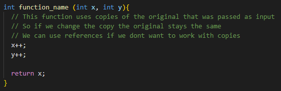
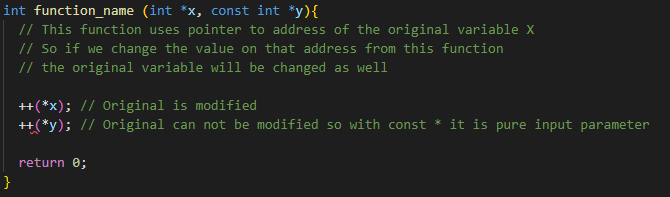
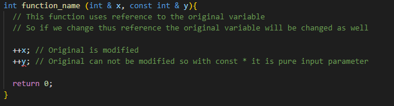

- Also if we do not want to change value passed by input parameter, we can always declare the input parameter as **const**
- If we are passing pointers or references via the function parameter then we should always declare them as **const** if they
are meant as input only parameter because otherwise the function could change the original.

- If we use array as input parameter, it will decay to the pointer so we can not access to its size information so we need to pass
another parameter with that information or use vector, etc.
- But if we pass the array as reference then we can still get to the information about size etc.

### Pass parameter by Value

- It is kinda OK if parameters are fundamental types (int, double, etc...)
- Not recommended for the relatively large types (user defined) because of the copy creations
- It makes copies so it can waste memory

### Pass parameter by Reference

- Does not make copies
- Changes to the parameter are reflected on the argument outside the scope of the function
- Saves memory
- Recommended for passing around large types
- When to use reference:
  - When we want to modify value outside of the function scope
  - We do not need to represent null or empty state
  - We want to avoid syntactic noise of pointer dereferencing

### Pass parameter by Pointer

- The pointer address itself is passed by value
- Can go through dereferencing the parameter and make the changes reflect outside the scope of the function
- Avoids copies (Pointer is very cheap to copy)
- Bad syntax
- When to use pointer:
  - We want to allocate memory dynamically inside the function
  - We want to pass an array or range of values
  - We want to represent nullable parameter (by passing a null pointer)
  - We want to explicitly convey the idea of ownership or shared ownership

### std::string_view parameters

- If we will use string reference as function parameter then we can not call it with string literal because
references does not support implicit conversion
- We can pass the string by value but then it will create copy
- Best way is to use string_view 

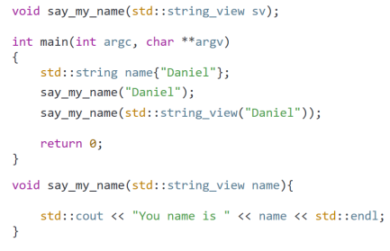

### Default Arguments

- If we want to have some default values, then we can specify them in the function declaration
- If we call this function without specific values then it will use the default values

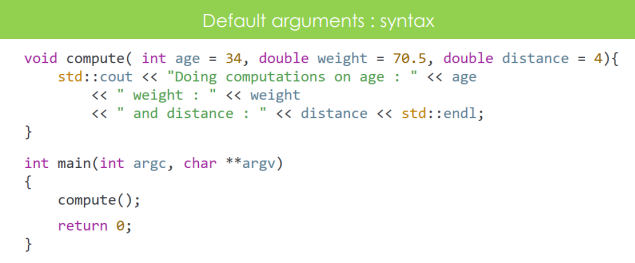
  
- If function declaration is separated from the function definition then we can specify the default values only in the declaration
  

## Separating function definition and declaration

- Sometimes it is more flexible to split the function into its header and body and keep the code for each in different places
- For example if we do not want to expose how to function works (Libraries etc.) so we share just the header file
- Or even in the same file but we want to just declare before main and put function body below main

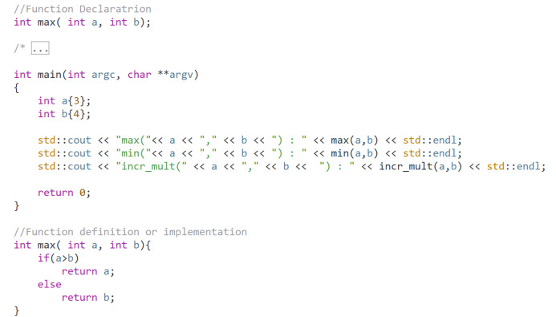 

- Often is good to declare function in separate file (header)

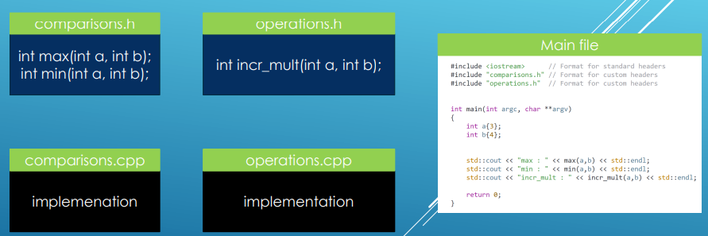

- The linker searches for definitions in all '.cpp' files in the project so the name of the file
does not need be the same as header file name.

## Implicit conversions

- When you pass data of a type different than what the function takes, the compiler will try to insert an implicit conversion from the type we pass 
to the type the compiler takes
- If the conversion fails, We will get a compiler error

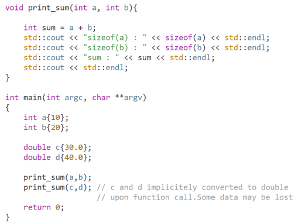

### Implicit conversions with references

- We can use them for read-only purposes
- IF we want to write to the reference it will be compile error even if it is not supposed to be const reference
- When we are trying to write, compiler is confused if it should modify the temporary (conversed) value or the original value so it will throw error

### Implicit conversion with pointers

- Compiler can not implicitly converse pointers from for example int* to double* 
- There are some exception when implicit conversion can be used on pointers

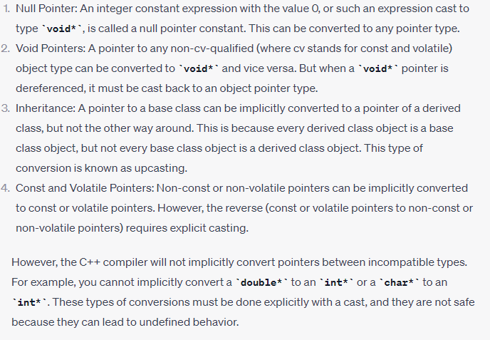

## constexpr Functions (C++11)

- Enables computations to be performed at compile time rather than at runtime (If possible)
- Allows the evaluation of expressions during compilation if the arguments are also compile time constants
- Can improve the performance of the code
- Conditions:
  - Function must have non-void return type
  - Function body cannot declare variables or define new types
  - Function body cannot contain 'try' block or 'throw' expressions
  - Function body must contain only one 'return' statement  (Not true since C++14)

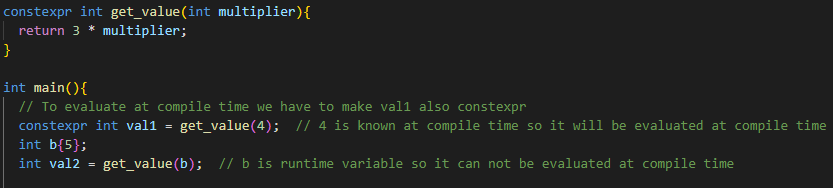

## consteval Functions (C++20)

- Enforces that a function must be executed during compile time
- Any function declared as 'consteval' must produce a compile time constant
- Unlike 'constexpr' functions, 'consteval' can not be evaluated at runtime
- Must have non-void return type 
- All its arguments must be literal types (constants)
- **Not all constants can be evaluated at compile time** (For example when they are initialized by runtime variables)

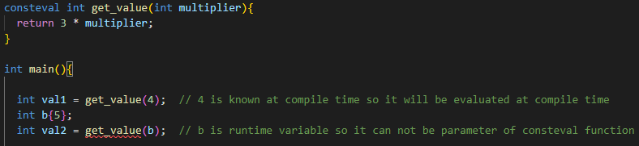

# Functions Output

## Output Parameter

- Output parameters should be passed in such a way that we can modify the arguments from inside the function
- We can use function parameter as output as well with non-const reference or pointer

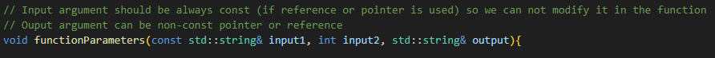

## Return from functions

### Return by value (default):
  
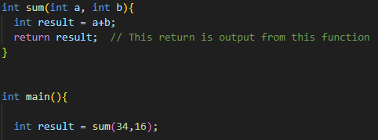

- In modern compilers, return by value is commonly optimized when possible and the function is modified
  behind our back to return by reference, avoiding unnecessary copies 
- For example in the code below, the address of result inside the function will be the same as the address
of str_result outside of that function, that means that compiler changes the return to the reference to avoid copies

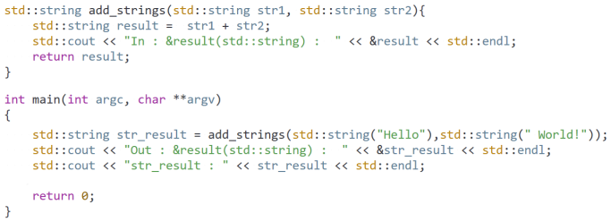

### Return by Reference

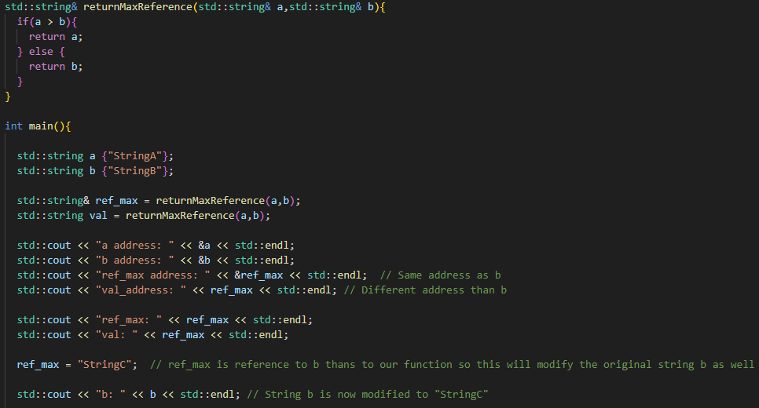

- **Do not** return reference to local variables !!

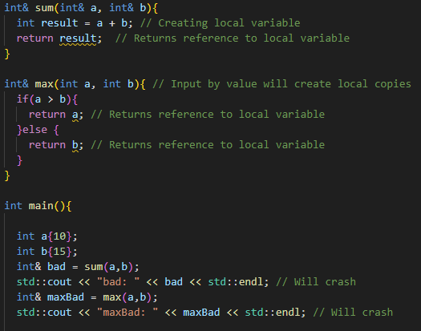

### Return by pointer

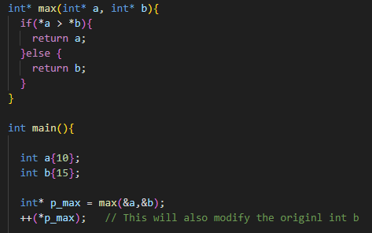

- **Do not** return pointers to local variables !! (Same as with references)
- We can return whole array through using return by pointer

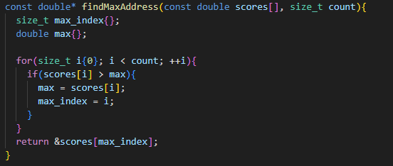

## Function return type deduction

- Lets the compiler deduce the return type of a function judging from return statements in the function
- We have to declare function together with its body/definition so the compiler can see the return type
- But there could be problems when compiler is confused by more returns of different types

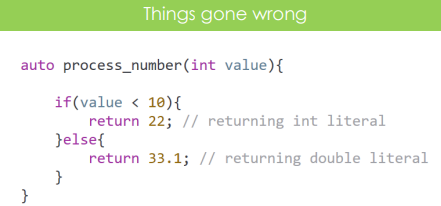

- We can fix that with casting to the same type

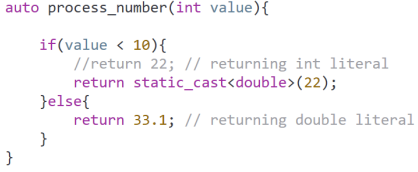

## std::optional (c++17)

- Helps to handle the optional output from the functions (for example if they failed) and some other things

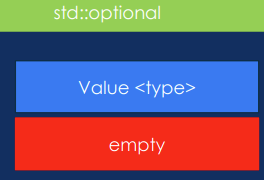

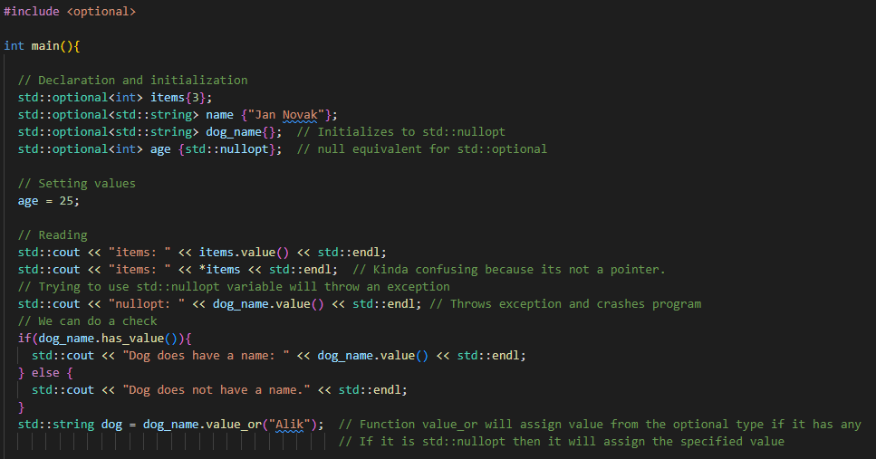

- **Never read from std::optional without checking if it is not empty otherwise the program can crash!**

### std::optional as return type

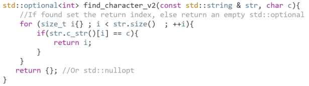

- If function fails we can return 'std::nullopt'
- So we can do check like this

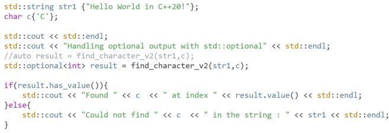

# Function overloading

- Two or more functions can have the same name but different parameters
- Can be considered as example of polymorphism feature 
- When an overloaded function is called, the compiler selects the proper function by examining the numbers, types and order
of the arguments in the call

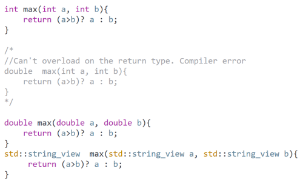

- We must be careful when using overloading with references because ambiguous calls may occur which will lead to compile errors
because compiler will not know if he should use for example string parameter or const string reference parameter
- When using const parameters by value we should be aware that compiler is making copies so it does not matter if it is const or not 
  and will not overload the non-const version
- But when using pointers, We can overload pointer with its pointer to const type parallel because there are no copies and they are two different types
- When we are using const pointer to overload pointer that there will be compiler error because the pointer itself is passed by value -> also copies
- Const reference can overload non-const reference of the same type no problem

# Inline Functions

- To avoid function call overhead. 
- Especially for the small functions
- When compiler sees call of the inline function he will replace it with the function body instead of jumping to the function location in memory
- This can make the program faster by avoiding the overhead of function calling protocol such as pushing and popping the stack, branching to and from the call etc.

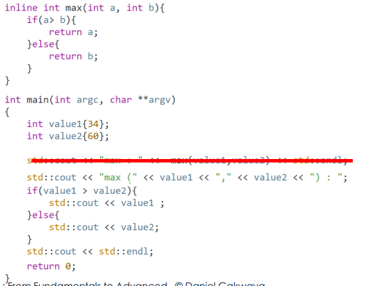

- They can increase the size of our application binary (Copying code)
- It is recommended to use them for short, frequently used functions
- Marking function 'inline' is just suggestion for the compiler. The compiler might agree and inline function or ignore it

- It is also useful for header-only libraries to allow inclusion in multiple source files without violating the One Definition rule
- All function templates and class templates are implicitly inline

# Recursion

- Mechanism under which a function repeatedly calls itself to achieve some goal
- Function that does recursion is called a recursive function

