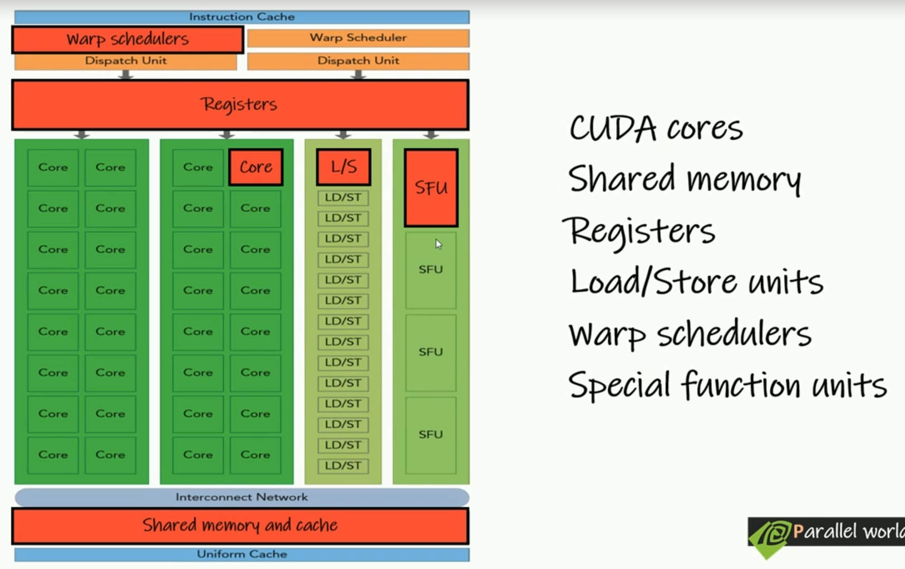
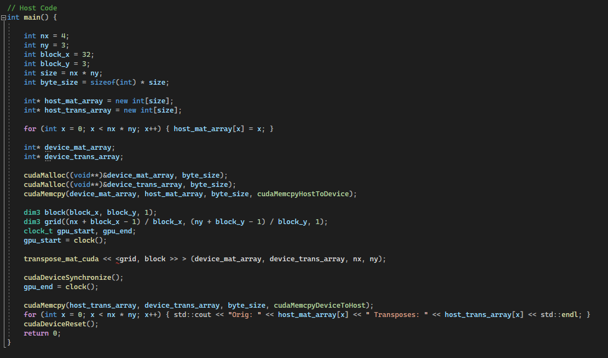

# Graphic Programming

## Parallel Programming

- **von Neumann Architecture**

  

- **Process**

  - Instance of a computer program that is being executed

    

- **Context**

  - Collection of data about process which allows processor to suspend or hold the execution of a process and restart the execution later
  - Memory Addresses, Program counter states, ...

- Multiple processes on single core CPU:

  

- This is possible thanks to context switching mechanism
- Round Robin Fashion execution of instructions

- **Thread**
  - Thread of execution is the smallest sequence of programmed instructions that can be managed independently by a scheduler
  - Thread is component of a process
  - Every process have at least one thread called main thread which is the entry point for the program

  

- **Concurrency vs Parallelism**

  - On the picture below the first one is concurrency which is on the hardware level in fact sequence
  - The second one is parallelism if we have more processor cores

  

  - **Concurrency** 
    - This is when multiple tasks are in progress simultaneously, but not necessarily executing at the same instant. 
    - Concurrency can be achieved by interleaving execution steps of different tasks, giving the illusion of simultaneous execution. 
    - This can happen on single-core processors through context switching, where the processor rapidly switches between tasks, or on multi-core processors where each core handles different tasks.

  - **Parallelism** 
    - This is when multiple tasks are executed literally at the same time, usually on multiple cores or processors.

- **Parallel Computing**

  - **Super computer** 
    - Computer with a high level of performance compared to general purpose computer
    - Performance of super computer is measured in floating point operations per second
  
  - **Heterogeneous Computing**
    - Heterogeneous computing refers to systems that use more than one kind of processor or cores
    - These systems gain performance or energy efficiency not just by adding the same type of processors but by adding dissimilar coprocessors, usually incorporating specialized processing capabilities to handle particular tasks

    - For example SmartPhone:

      

## GPU vs CPU

- **CPU**

  - **C**entral **P**rocessing **U**nit
  - Latency device with high lock speed
  - Smaller number of cores
  - Have optimization hardware like branch predictors
  - Context switching done by hardware
  - Can switch between thread if one thread stalls
  - Thread schedulers and dispatch units are implemented in hardware

- **GPU**
  - The **G**raphic **P**rocessing **U**nit as a specialized computer processor, addresses the demands of real time high resolution 3D graphics compute-intensive tasks
  - Through put device with low lock speed
  - Have thousands of cores
  - Does not have optimization hardware like branch predictors
  - Context switching done by software
  - For memory instruction latencies with L1 and L2 cache misses, thread are going to stall
  - Work item creation done in software

## CUDA

- **C**ompute **U**nified **D**evice **A**rchitecture
- Parallel computing platform and programming model developed by NVIDIA
- It allows developers to use NVIDIA GPUs for general purpose processing
- **CUDA** is proprietary to NVIDIA hardware

- **Key Concepts**
  - **C/C++**: Programming language extensions to C/C++ for writing CUDA programs
  - **Kernel**: A function that runs on the GPU. It is launched by the CPU and executed in parallel by many GPU threads
  - **Thread**: The smallest unit of execution. Thousands of threads run the kernel function in parallel
  - **Grid** 
    - An array of blocks. The grid is used to organize blocks for execution
    - Collection of all the threads launch for a kernel
    - Grid of 64 threads:

      

    - There is limitation of how many blocks there can be in the grid:
  
      

      or ?  --> Zjisti

      

  - **Block** 
    - Threads in a grid are organized into groups called thread blocks -> Block is subset of the grid
    - A group of threads that execute the same kernel. Each block runs independently
    - Grid organized into 8 blocks:

    

    - There is limitation for how many threads can be in one block:

    

- **Memory Model**

  - **Global Memory** - Accessible by all threads but has high latency
  - **Shared Memory** - Faster, on-chip memory shared among threads in a block
  - **Registers** - Fast, small memory for each threads
  - **Constant and Texture Memory** - Read-only memory spaces optimized for specific types of access patterns

- **Execution Model**

  - The CPU (host) launches kernels on the GPU (device)
  - Each kernel is executed by a grid of blocks where each block consists of multiple threads
  - Threads within a block can synchronize using **__syncthreads()**

- **Example**

  - **Adding Two Vectors**

    - This function will be executed in the GPU
    
      

    - Initializing and calling the CUDA function

      

- **Basic Steps of CUDA program**

  - Initialization of data from CPU
  - Transfer data from CPU context to GPU context
  - Kernel launch with needed grid/block size
  - Transfer results back to CPU context from GPU context
  - Reclaim the memory from both CPU and GPU

- Host Code (main function) is going to run in CPU
- Device Code is going to run in GPU

- **Device Code**

  - We need to add **__global__** or **__device__** before device function to specify that this function will run in CUDA enable device

    

  - Also every kernel function should be void type, if we need to return something we need to use CUDA runtime function calls

- **Host Code**

  - Syntax to call kernel function

    

- **Syntax of CUDA program**

    

  - But if we are specifying the number of thread and blocks by integers we can specify only one dimension
  - For more dimensions we can use **dim3**

    
    

  - Using **dim3** type:

    
    
 

- **Organization of threads in CUDA**

  - **threadIdx**
    - CUDA runtime uniquely initialized **threadIdx** variable for each thread depending on where that particular thread is located in the thread block
    - It is **dim3** type variable
    - It works same as indexes so the first thread in any dimension has Id = 0 in that dimension
    - We should keep in mind that it is block related so in the next block we will start at 0 once again

    
    

  - **blockIdx**
    - CUDA runtime uniquely initialized **blockIdx** variable for each thread depending on the coordinates of the belonging thread block in the grid
    - It is **dim3** type variable
  

    

  - **blockDim**
    - Variable consist number of threads in each dimension of a thread block
    - Notice all the thread block in a grid have same block size, so this variable value is same for all the threads in a grid
    - It is also **dim3** type

  - **gridDim**
    -  Variable consist number of thread blocks in each dimension of a grid
    -  Also **dim3** type

    

    

  - It is very common to use these variables to calculate array indices

- **Calculation of Indices**

  - This will work when we have the same number of threads as the number of elements in array:

    

  - But what if we will have 2 blocks with 4 threads each?
  - To get the right globally unique threadId to use as array indices we need to use other variables:
    - global_id = thread_id + blockIdx.x * blockDim.x 

      

  - **2D grid**

    - gid = tid + block_offset + row_offset
    - block_offset = blockIdx.x * blockDim.x
    - row_offset =  blockIdx.y * (gridDim.x * blockDim.x)
  
      

    - The memory access pattern is going to depend on the way we calculate our global index
    - We usually refer to calculate global indices in a way that, threads within the same thread block access consecutive memory locations or consecutive elements in the array
    - So if the block has more threads in Y dimension, We want to increment indexes in those rows before we will reach the first row of the next block in X dimension
    - So we need to adapt the equations:

      - tid = threadIdx.y * blockDim.x + threadIdx.x
      - block_offset = blockIdx.x * (blockDim.x * blockDim.y)
      - row_offset = blockIdx.y * (gridDim.x * blockDim.x * blockDim.y)

      
    
    - As we can see in the example's above output, the indices are consecutive within the 2*2 block

    - In GPU programming, particularly in CUDA, having threads within the same block access consecutive memory locations (or elements in an array) is a performance optimization strategy. 
    - This approach is primarily aimed at maximizing memory throughput and efficiency: 
      1. **Coalesced Memory Access**
      2. **Memory Bandwidth**
      3. **Cache Utilization**
      4. **Simplified Memory Access Patterns**

- **Timing**

  - We can use **clock()** function to get processor time consumed by the program 

    

  - **Trail and Error method**

    - We can run the CUDA program with different grid, block, shared memory, cache, memory access configurations and choose the best based on the execution time

- **Device Properties**

  - Properties can vary from device to device
  - When CUDA application is running on device with multiple capabilities, we need a way to query the device properties on the fly
  - **Properties**:
    - **name** - ASCII string identifying the device
    - **Major/minor** - Major and minor revision number defining the device compute capability
    - **totalGlobalMem** - Total amount of global memory available on the device in bytes
    - **maxThreadsPerBlock** - Maximum number of thread per block
    - **maxThreadsDim[3]** - Maximum size of each dimension of a block
    - **maxGridSize[3]** - Maximum size of each dimension of a grid
    - **clockRate** - Clock frequency in kHz
    - **sharedMemPerBlock** - Maximum amount of shared memory available to a thread block in bytes
    - **Warp size** - warp size for device
    - etc..

      

### Memory Transfer

- There is a need to transfer memory between host and device

  

- We can transfer memory between host and device with **cudaMemCpy()** function
- The syntax is:
  - **cudaMemCpy(destination ptr, source ptr, size in bytes, direction)**
  - **direction**:
    - **cudaMemcpyHostToHost**
    - **cudaMemcpyHostToDevice**
    - **cudaMemcpyDeviceToHost**
    - **cudaMemcpyDeviceToDevice**

- CUDA is providing functions similar to C functions:
  - **cudaMalloc** 
    - similar to C malloc
    - To allocate memory in the device
  - **cudaMemset** 
    - similar to C memset
    - sets value for given memory location
  - **cudaFree** 
    - similar to C free
    - To free memory in the device

- It is generally better for performance if the number of threads per block is a multiple of 32. 
- This is because CUDA hardware operates on groups of 32 threads called warps
- So if we have more threads than elements or tasks to process we need to pass the size of the array for example to check it:

  

- We should also be error checking:

  

- Or we can use macro alternative:

  

- But for the learning purposes I wont spam the code with these error check so the code is clearer

- **Transfer from Device to Host**

  - If the kernel function produce some result we need to transfer this result back to host
  - For example sum of two arrays:

      
      

### Execution Model

- **Understanding GPU**

  
   
  
  - We can see 16 SM - streaming multiprocessors
  - They have access to device in-build global memory and L2 cache
  - Streaming Multipocessor scheme:
  
    
    
  
   - More modern SM has specialized cores for some operations:
  
    

  - **CUDA Architecture**

    - CUDA follows SIMT architecture
    - **Single Instruction Multiple Threads (SIMT)**

      - Single instruction runs on multiple threads
      - Thread blocks are going to execute in single SM
      - Multipe thread blocks can be executed simultaneously on same SM depending on resource limitation
      - But one thread block can not be executing in multiple SM
      - If device can not run single block in one SM, then error will be returned

      

- **Warps**

  - Thread Blocks are divided into smaller units called Warps, each having 32 consecutive threads
  - Warps can be defined as the basic unit of execution in a SM
  - Once a thread block is scheduled to an SM, threads in the thread block are grouped into waprs
  - All the warps within one thread block will be executed in single SM
  - But usually only few of these warps can be executed at the same time on the hardware level

  - Even though we can have threads in 3 dimension, on the hardware level the threads are in 1 dimension only
  - So if we have 40 threads in X dimension but 2 blocks in Y dimension, on the hardware level it is 80 threads in X dimension 
  - That would mean 3 Warps **BUT** there can not be threads from different blocks in single Warp so in fact there will be 4 Warps
  - And there will be only 8 active and 24 in-active threads in 2nd and 4th Warp -> That is not efficient at all
  - Even if we run thread block with single thread, still CUDA runtime will assign Warp which means 32 threads -> 1 active, 31 in-active
  - **Problem**:
    - Even though they are in-active threads, still resource allocations are considering them
    - Having In-active threads in Warp is great waste of resources in SM
  - Therefore we should have number of threads in a block that is dividible by 32
    
  - There are no in-build variables to indicate Warp index but we can easily calculate it by dividing threadIdx.x by 32
    
  - **Warp Divergence**
  
    - If threads in the same warp execute different instructions then we say there is a warp divergence and that creates significant performance penalty
    - Because when we are for example executing if clause the threads, that are not matching that condition, will stall
    - Control flow statements like if/else statements, switch statements are giving us a hint of divergent code
    - But that does not mean that it is always that way
    - If the condition check has the same result for all the threads inside single Warp, then there is no Warp Divergence
  
- **Occupancy**

  - The ratio of active warps to maximum number of warps per SM
  - If our kernel use 48 registers per thread and 4096 bytes of Smem per block and block size is 128:
    - Reg per warp = 48*32 = 1536
    - 65536 regs per SM
    - Allowed warps = 65536/1536 = 42.67
    - There is also warp allocation granulity value
    - If this value is 4 then Warps allocation happens in group of 4 warps -> 42.67 -> 40
  - With shared memory usage:
    - 98304 regs per SM
    - Active blocks = 98304 / 4096 = 24
    - Active warp = 24 * 4 = 96
    - Active warp count is not limited by shared memory usage

  - **Occupancy Calculator**
    - The CUDA toolkit inclused a spreadsheet called the CUDA Occupancy Calculator 
    - Which assists you in selecting grid and block dimension to maximize occupancy for kernel

### Memory Model

- We can mesure some metric, for example:
  - Global Memory Load Efficiency
  - Global Memory Load Throughput
  - Global Memory Load Transactions
  - How many transactions are needed for one memory request

- **Locality**
  - Applications access a relatively small and localized oprtion of their address space at any point in time

- **Memory Types**

  

  - **Registers**
    
    - Fastest memory space in the GPU
    - Use to hold frequently accessed thread private variables and arrays if the indices are constant or can be determine at compile time
    - So the automatic local variables are stored in registers
    - Share their lifetime with the kernel
    - On Fermi GPU one thread can have maximum of 63 registers
    - But all other microarchitectures allows to have maximum 255 registers per thread

    - If a kernel function uses more registers than the hardware limit, the excess registers will spill over to local memory
    - This register spilling can have adverse performance consequences

  - **Local Memory**

    - Store variables which are eligible for registers but can not fit into the register space
      - Local Arrays with indices which can not resolve at compiler time
      - Large local structures
    - It is not an on-chip memory, allocates in DRAM so have high latency memory access

  - **Shared Memory**
    
    - Shared memory is on chip memory which is partitioned among thread blocks
    - \_\_shared\_\_
    - The L1 cache and shared memory for an SM use the same on-chip memory
  
  - **Constant Memory**

  - **Texture Memory**

  - **Global Memory**

  - **GPU Caches**

- We are working with at least two devices (CPU host and GPU device) so we need to manage two memories
- We need to explicitly transfer the memories back and forth
- Transfer speed between GPU and its memory is much higher (around 484 GB/s) than between GPU and CPU (for PCIe 3 its 15.75 GB/s)
- Therefore we should always try to minimize the Host to Device or Device to Host transfers

- **Pinned Memory**
  
  - Allocated host memory is by default non-fixed 
  - The GPU can not safely access data in non-fixed host memory
  - So when transferring the data from non-fixed host memory to device memory, the CUDA drivers first allocate temporarily fixed **Pinned Memory**
  - Then transfer the data from this host **Pinned Memory** into the device memory
  - So there is additional workload to copy from non-fixed memory to pinned memory
  - But CUDA runtime allows us to directly allocate this pinner memory using **cudaMallocHost(void ** devPtr, size_t count)** function and deallocate with **cudaFreeHost(void * ptr)**
  - And since this pinned memory can be accessed directly by device, it can be read and write with much higher bandwidth

    

  - But keep in mind that pinned memory is not available to host's operating system virtual memory
  - Also allocation and de-allocation of pinned memory is more expensive
  - For performance-critical applications, especially those involving frequent or large data transfers between the host and the GPU, pinned memory is preferred. 
  - For applications where memory efficiency and simplicity are more important, page-able memory is typically sufficient.

  - **Pageable Host Memory:** Default, flexible, efficient memory usage, slower transfers.
  - **Pinned Host Memory:** Faster transfers, necessary for asynchronous operations, more resource-intensive, limited availability.
  

- **AOS vs SOA**

  - **AoS**

    - Array of Structures

      

  - **SoA**

    - Structure of Arrays

      

    - SoA Makes full use of GPU memory bandwidth because there is no interleaving as we can see below
  
    

- **Partition Camping**

  - In partition camping, memory requests are queued at some partitions while other partitions remain unused
  - **Solution:**
    - Calculate the index values ix and iy using diagonal coordinate system which will make sure consecutive thread blocks to access nonconsecutive memory blocks
    - But within a single thread block we need threads with that thread block to access consecutive memory address to adhere the coalesced memory access
  
  - **Thread Block and Data Block mapping using Diagonal Coordinate System:**

      

#### Examples

- **Matrix Transpose**

  - The transpose of a matrix is an operator which flips a matrix over its diagonal
  - It switches the row and column indices of the matrix by producing another matrix denoted as A^T

    

  - To transpose matrix in C++ we basically just need to move the elements in 1d array in memory to the right spot as we can see above

    

  - **Code:**

    
    

#### Summary

- **Pinned Memory**
  - Memory which is not subjected to page fault operation
- **Zero Copy Memory**
  - Pinned memory that is mapped in to device address space
- **Unified Memory**
  - Pool of managed memory which can be access by both Host and Device

- **Global Memory Access Pattern**
  - **Align Memory Access**
  - **Coalesced Memory Access**

  - Global memory writes use only L2 cache

### CUDA Streams and Events

- **Grid Level Concurrency**
  - Concurrency achieved by launching multiple kernels to same device simultaneously and overlapping memory transfers with kernel execution

    

  - We need to transfer memory asynchronously

- **CUDA Stream**

  - A stream is a sequence of commands that execute in order
  - Different streams may execute their commands out of order with respect to one another or concurrently

- Functions with synchronous behaviour relative to the host block the host thread until they complete
- Functions with asynchronous behaviour relative to the host return control to the host immediately after being called

- **Launching Kernel Functions with different streams:**

  

- From host point of view all these kernel functions are called asynchronously
- But from device point of view it may not be the case depending on the relationship between stream1, stream2 and default stream

- **NULL Stream**
  - The NULL stream is the default stream that kernel launches and data transfers use if we do not explicitly specify a stream
  - Implicitly declared stream
  - Has synchronization relation ship with other asynchronous streams so NULL stream is commonly used as synchronization mechanism between multiple streams

  - **Blocking Behaviors of NULL stream**
    - Even though non-NULL streams are non-blocking with respect to the host, operations within a non-NULL stream can be blocked by operations in the NULL stream
    - Non-NULL streams are divided into:
      - **blocking** - NULL stream can block operations in this non-null stream
      - **non-blocking** - NULL stream will not block operations in this non-null stream

  - The NULL stream is an implicit stream which synchronizes with all other blocking streams in the same CUDA context
  - In general when an operations is issued to the NULL stream, the CUDA context waits on all operations previously issued to all blocking streams

- Streams created using **cudaStreamCreate()** are blocking streams
- Non blocking streams can be created with **cudaStreamCreateWithFlags(cudaStream_t *pStream, unsigned int flags)**
- Flags:
  - **cudaStreamDefault** - Default stream creation flag -> blocking
  - **cudaStreamNonBlocking** - Asynchronous stream creation flag

  

- **Tasks that can operate concurrently**

  - Computation on the host
  - Computation on the device
  - Memory transfers from the host to the device
  - Memory transfers from the device to the host
  - Memory transfers within the memory of a given device
  - Memory transfers among devices

- **Asynchronous Functions**

  - **cudaMemcpyAsync(destination pointer, source pointer, size, memory copy direction, stream);**

    - Host pointers should be Pinned Memory otherwise these memory transfers will be synchronous one

    

- **NVidia Visual Profiler (NVVP)**
  - Can be used to visualize how our program executes and it will also measure performance metrics as well
  - Our goal is to overlap kernel executions with memory transferring to reduce the overall execution time

- **Multiple Kernels**

  

- **Explicit and Implicit Synchronization**
  - **Explicit Synchronization** 
    - Synchronizing the device using **cudaDeviceSynchronize()** or **cudaStreamSynchronize()**
    - Synchronizing an event in a stream using **cudaEventSynchronize()** 
    - Synchronizing across streams using an event with **cudaStreamWaitEvent()**
    - 
    - 

  - **Implicit Synchronization**
    - page-locked host memory allocation
      - Pinned memory allocation using **cudaMallocHost()** or zero copy memory allocation using **cudaHostAlloc()** will blocked all the operations execution in the device until memory allocation in the host will finish
    - device memory allocation
    - device memory set
    - memory copy between two addresses to the same device memory
    - any CUDA command to the NULL stream
    - switch between L1/shared memory configurations

## OpenCL

- **O**pen **C**omputing **L**anguage
- Open standard for parallel computing on heterogeneous systems
- It supports a wide range of hardware, including GPUs,CPUs,FPGAs and more
- OpenCL is maintained by the Khronos Group
  
- **Key Concepts**
  - **Command Queue** - Commands for execution are placed in the command queue
  - **Program** - Consists of kernels and functions written in OpenCL C
  - **Kernel** - A function declared in a program and executed on an OpenCL device
  - **Buffer** - Memory objects used to store data to be processed by the kernel

- **Memory Model**
  - **Global Memory** - Accessible by all work items (threads)
  - **Local Memory** - Shared among work items in a workgroup
  - **Private Memory** - Exclusive to each work item (thread)

- **Execution Model**
  - The host(CPU) defines the context and command queues
  - Kernels are enqueued for execution on devices
  - Work items are grouped into work groups

## RAPIDS

- Suite of open-source libraries that enable end-to-end execution of data science and machine learning pipelines entirely on GPUs
- It provides significant speedups with an API that mirrors the most popular Data Science and Machine Learning libraries for Python, like Pandas and scikit-learn
- RAPIDS eliminates the need to know the technical details or learn how to deal with parallelism and GPU-specific languages like CUDA or OpenCL