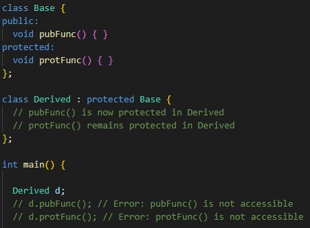

# Inheritance

- A defining feature of OOP in C++
- Code reuse is improved
- With public inheritance, derived classes can access and use public members of the base class, but can not directly access private members
- The same also applies to friends of the derived class. They have access to private members of derived class but do not have access to the base class

## Protected Members

- Can be accessible within the class that defines them just like 'private'
- Unlike 'private' they are also accessible by the derived classes
- They can not be access outside the class and its derived classes

## Public Inheritance

- Public members of the base class remain public in the derived class.
- Protected members of the base class remain protected in the derived class.
- Private members of the base class are not accessible from the derived class.

## Protected Inheritance

- All public members of base class will now be protected in derived class
- All protected members of base class stay protected in derived class
- Private members of base class are not accessible from derived class
- Protected inheritance is less common then public or private inheritance
- The derived class cannot be treated as a subtype of the base class, meaning objects of the derived class cannot be used wherever a base class object is expected.

- When Protected Inheritance changes its parent member visibility to protected it is changed for good
- So if we will derive new class from this changed class with public inheritance it will not change grandparent public members back to public but it will stay protected as it is in the parent class

## Private Inheritance

- All public members of base class will now be private in derived class
- All protected members of base class stay private in derived class
- Private members of base class are not accessible from derived class
- The derived class cannot be treated as a subtype of the base class, meaning objects of the derived class cannot be used wherever a base class object is expected.

- When Private Inheritance changes the members visibility, it is changed for good.
- Here it is even worse because both public and protected parents members are changed to private so this means that if we try to derive another class from this one, it will not have access to any parents members so it will not inherit any member because they are all private.
- But there is way around it with 'using' keyword so we can access something but it is a weird design

- Private inheritance but with 'using' keyword we can change some visibilities

- So in the deriver class we can have access to these members that we changed accessibility with 'using':

## Constructors with Inheritance

- Scenario:

- The order of constructors execution is from the most base to the lowest inheritance level
  
### Default Constructor

- We can see the order of constructors execution:

- In these example if we would want to build CivilEngineer object, but there would be no default constructor provided for the Person class, the compiler would throw an error!
- We should always provide a default constructor for our classes, especially if they will be part of an inheritance hierarchy

### Custom Constructor

- The question here is how to forward information from derived classes to the base class when constructing them with custom constructor
- Design on the next picture is not good because we can not access private members of the base class

- Initializer list with the base object members in it will not work either
- But we can use Initializer list with base class constructor:

- We need to use Initializer list because the base class constructor will be called first so calling it through initializer list is ok because it is called before the body of the derived constructor is executed, so the order is still same. The most base class constructor will be executed first

### Copy Constructors

- If we want to set up our own copy constructor:
- For the base class it is straight forward:

- But for the derived class it is more complicated
- We can not do it only for the derived class members like this:

- Because we would lose information for the base class members
- The next design si bad because we can not use private member of base class from the derived class context
- Also it would create temporary object for no reason and we are not reusing copy constructor we have in Person class

- The right way to do this:

- The compiler is smart enough to strip out the engineer part of the engineer object and it will send only the person part to the Person copy construct or

### Inheriting Base Constructors

- We can inherit the base constructor with 'using' keyword:

- This inherited base constructor will only initialize the base class members
- Copy constructor are not inherited. But we will not usually notice this as the compiler will insert an automatic copy constructor
- Inherited constructors are base constructors. They have no knowledge of the derived class. Any member from the derived class will just contain junk value
- Constructors are inherited with whatever access specifier they had in base class
- On top of derived constructors we can add our own that possibly properly initialize derived member variables
- Inheriting constructors adds a level of confusion to our code, it is not clear which constructor is building our object. It is recommended to avoid them and only use this feature if no other option is available

## Destructors with Inheritance

- Scenario:

- The most based class will be constructed first and destructed last
- The order of destructors is the opposite of the order of constructors

## Reused Symbols in Inheritance

- We can use the same names for variables in the child class like in the parent class

- But then the parents members will be hidden behind the child members with the same name
- So if we call these members with the child object the child members will be called
- But we can still access the parent members:

## Friend Class (Maybe already covered? Compare that) and its not really inheritance either

- Can access both private and protected members of other class in which it is declared as friend.
- It is sometimes useful to allow a particular class to access private members of other class.
- For example: LinkedList class may be allowed to access private members of Node

### Friend Function (Maybe already covered? Compare that)

- Like Friend class it can be given a special grant to access private and protected members.
- A friend function can be: 
  - Member of another class
  - Global function

- Friends should be used only for limited purpose because it lessens the value of encapsulation of separate classes in OOP
- Friendship is NOT mutual. If class A is a friend of class B, does not mean that B becomes friend of A automatically
- Friendship is NOT inherited

## Bordel

// ------ Inheritance ---------------------------------------------------------

// konstruktory a destruktory se nededi
class Rodic {

public:
	explicit Rodic(int x) : m_x{x}   // jednoparametrovy konstruktor si musim hlidat nechcem implicitni koverze
	{
		cout << __FUNCTION__ << endl;
	}
	~Rodic() 
	{
		cout << __FUNCTION__ << endl;
	}
	int getX()
	{
		return m_x;	
	}
	void set(int x) 
	{
		m_x = x;
	}
protected:
private:
	int m_x;
};

class Potomek : public Rodic {  // kdyby zde bylo napr private tak public rodice je zde private a neni to pak dedicnost

public:
	// C++11 Inheriting constructors
	using Rodic::Rodic; // Konstroktory se nededi musime tedy manualne povolit pristup k nim
	Potomek() : Rodic{42}, m_y{0}
	{
		cout << __FUNCTION__ << endl;
	}
	~Potomek()
	{
		cout << __FUNCTION__ << endl;
	}
	int getY()
	{
		return m_y;
	}
	using Rodic::set; // odstrani zastineni a vznikne pretizeni
	void set(int x, int y)
	{
		Rodic::set(x);  // jinak by byla zastinena ale po pouziti using tohle jiz neni treba
		m_y = y;
	}
protected:
private:
	int m_y = 20;

};

int dedicnost()
{
	cout << "Dedicnost \n";
	cout << "Velikost potomka " << sizeof(Potomek) << endl;

	Potomek instance{100};		// vola se konstruktor rodice
	cout << "x1 = " << instance.getX() << endl;
	cout << "y1 = " << instance.getY() << endl;
	
	Potomek instance2;			// vola se konstruktor potomka
	cout << "x2 = " << instance2.getX() << endl;
	cout << "y2 = " << instance2.getY() << endl;

	Rodic *ptr = &instance;
	Rodic &ref = instance;

	// Oriznuti instance
	//Rodic rodic = instance;

	//instance.Rodic::set(10);
	instance.set(10);
	instance.set(15,25);
	cout << "x3 = " << instance.getX() << endl;

	return 0;
}

int KonkretniZakladniTrida()
{
	cout << "Manazer/Zamestnanec \n";
	Manazer reditel{ "Jaroslav", "Falta", Datum{1,7,2015} };

	Zamestnanec ucitelka{ Retezec{"Jana"}, Retezec{"Nova"}, Datum{1,9,2010} };
	Zamestnanec skolnik{ Retezec{"Karel"}, Retezec{"Vojacek"}, Datum{1,1,1995} };

	reditel.add(&ucitelka);
	reditel.add(&skolnik);
	reditel.add(&skolnik);

	reditel.report();

	return 0;
}