# Interview Coding

## Algorithms

- **Cyrcular Buffer**
 
  - **Objective**
    - The buffer should be implemented with a fixed size, specified at the time of creation
    - Implement the following methods:
      - **void add(int item)**: Adds an item to the buffer. If the buffer is full it should overwrite the oldest data
      - **int get()**: Retrieves and removes the odest item from the buffer. If the buffer is empty it should return default value
      - **isEmpty()**: Returns true is the buffer is empty
      - **isFull()**: Returns true if the buffer is full
  
  - **Hints**
    - Use an array to store the buffer content
    - Keep track of the head and tail indices
    - Consider the edge cases such as adding to full buffer or retrieving from an empty one

  - **Solution**

    
    

- **Sum of Two numbers in Sorted Array**

  - **Objective**
    - Write a C++ program that determines if there are two distinct numbers in sorted array that add up to a specific target number
    - The function should return boolean value indicating whether such pair exists

  - **Requirements**
    - Implement a function with the following signature **bool hasPairWithSum(const std::vector<int>& numbers, int targetSum);**
    - The input vector **numbers** is sorted in ascending order
    - Optimize the function to have linear runtime complexity
  
  - **Hints**
    - Since the array is sorted, consider using two pointers o indices to travers array from both ends simultaneously
    - Think about how the sorted nature of the array can help optimize the search for the two numbers

    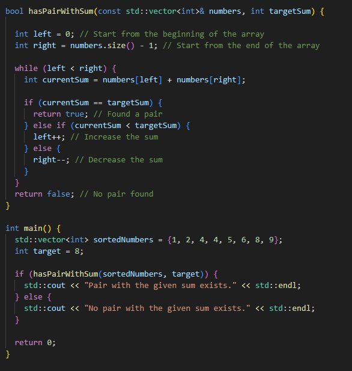

## Algorithms Data Structures

- **Merge Overlapping Intervals**
 
  - **Objective**
    - Write C++ program that merges overlapping intervals
    - We are given a collection of intervals represented as pairs of integers, where each pair represents the start and end of an interval
    - Our task is to merge all overlapping intervals and output the resulting intervals 
  - **Input**
    - A vector of pairs where each pair is an interval: { {1,3}, {2,6}, {8,10}, {15,18} }
  - **Output**
    - A vector of merged intervals. For the given example: { {1,6}, {8,10}, {15,18} }

  - **Requirements**
    - Implement function that takes a vector of interval pairs and returns a vector of mergd intervals
    - The input can contain intervals in any order and the intervals in the output should be sorted

  - **Hints**
    - Sort the intervals based on their starting points
    - Iterate through the sorted intervals and merge them if they overlap

  - **Solution**
    

- **Version-Control System**
  - Write a C++ program that simulates a basic version-control system for text files
  - This system should support saving versions of a file, restoring any saved version and viewing the history of changes

  - **Requirements**
    - Implement a class **VersionControl** with the following methods:
      - **void saveVersion(const std::string& content)**: Saves the current version of the content
      - **std::sting getVersion(int version)**: Retrieves the content of a specific version number. If the version does not exist, return an empty string
      - **std::vector<std::string> getHistory()**: Returns list of all saved version contents
    - Assume each call **saveVersion** increments the version number starting from 1 and maintain all versions of the content
    - Optimize for quick saves and version retrieval

  - **Hints**
    - Use suitable STL container to store the versions of the content
    - Consider the trade-offs in space and time complexity based on the container you choose 

  - **Solution**

    

## Data Structures

### Array

- **Inserting in an array**

  - ToDo

- **Deleting in an array**

  - ToDo

- **Linear search in an array**

  - Given an array arr[] of n elements, write a function to search a given element x in arr[]

  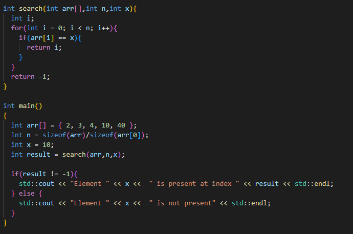  

  - Both Time and Space complexity are O(n) 

- **Binary search in an array**

  - Find a given number in sorted array
  - Try to have time complexity of O(log n)
  
  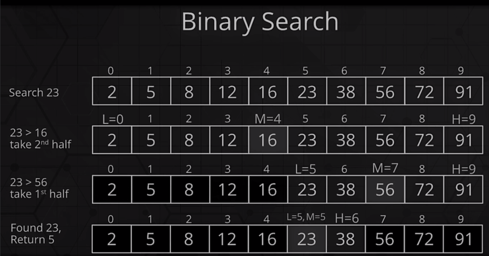

  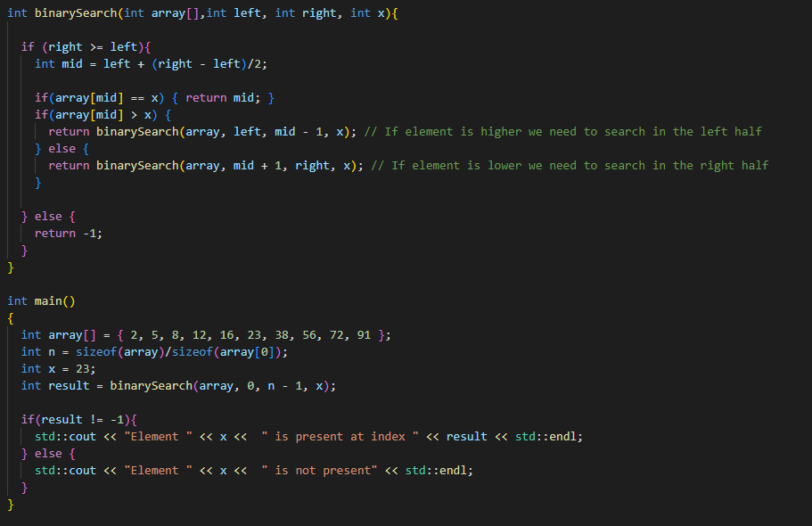

  - Space complexity - O(n)
  - Time complexity - O(log n)
  - We can also have iterative version. See **Algorithms.md**

### Linked List

- **Merge Two Sorted Linked Lists**

  - Write a function that merges two so

### Stack

- **The matching brackets problem**

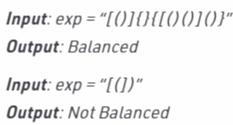
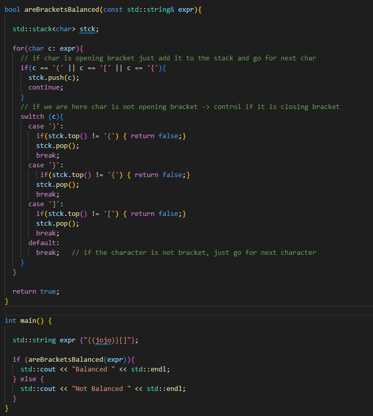

  - **Time Complexity:** O(n) just iterating through the string
  - **Space Complexity:** 
    - O(n) because we declared stack that is linear with number of character
    - We can do this with O(1) if we use do not use stack but just counter that will be increased with opening and decreased with closing bracket

 
- **Implement a Stack with Max API**
  - Design a stack that supports push,pop,top and retrieving the maximum element in constant time
  - Implement **MaxStack** class:
    - **MaxStack()** initializes the stack object
    - **void push(int x)** pushes element x onto the stack
    - **int pop()** removes the element on top of the stack and returns it
    - **int top()** gets the top element of the stack
    - **int getMax()** retrieves the maximum element in the stack
  
  

### Strings

- **Transforming String**
  - Change lowercase letter to uppercase and wise verse:

  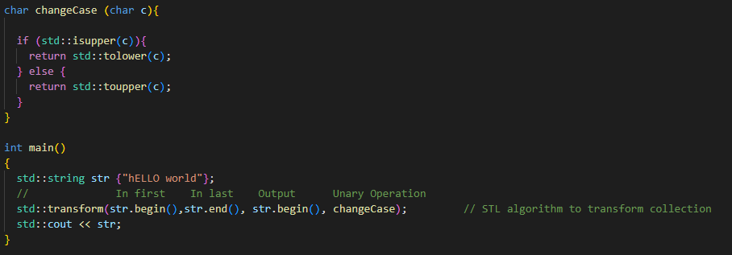

- **Count Vowels and Words**

  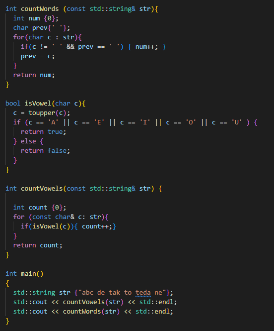

- **Reverse String**

  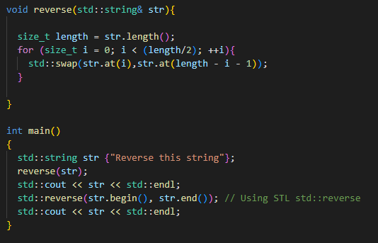

- **Palindrome Check**

  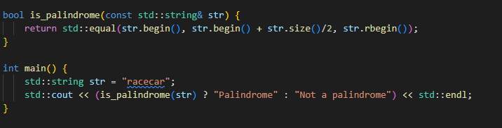

- **Anagram Check**

  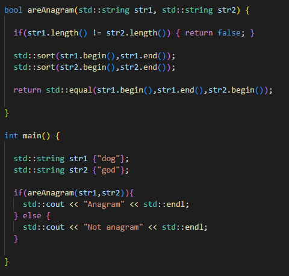

- **Custom String Compression Function**
  
  - **Objective**
    - Write a C++ program that implements a function to perform basic string compression using the counts of repeated characters
    - For exmaple: "aabcccccaaa" -> "a2b1c5a3"
    - If the compressed string would not become smaller than the original string, our function should return the original
    - We can assume that string has only uppercase and lowercase letters

  - **Requirements**
    - Implement function **compressString** that takes a string and returns a compressed string
    - The function shoud create the compressed string by concatenating repeated characters with their counts
    - The function should be case-sensitive
    - If the compressed string is longer than or equal to the original string, return the original string

  - **Hints**
    - Iterate through the string, keeping track of the current character count
    - When the current character changes, append the previous character and its count to the result
    - Consider edge cases, such as empty string or sting with all unique characters

  - **Solution**
    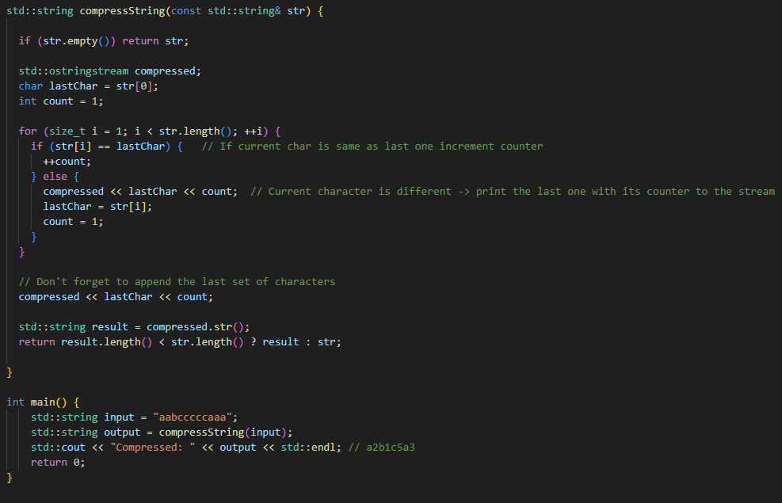

### Trees

- **Tree traversals**
  - **DFS (Depth First Search)**
    - Inorder
    - Preorder
    - Postorder

  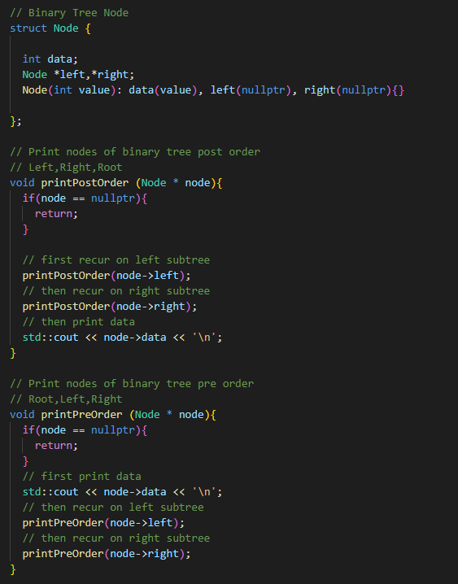
  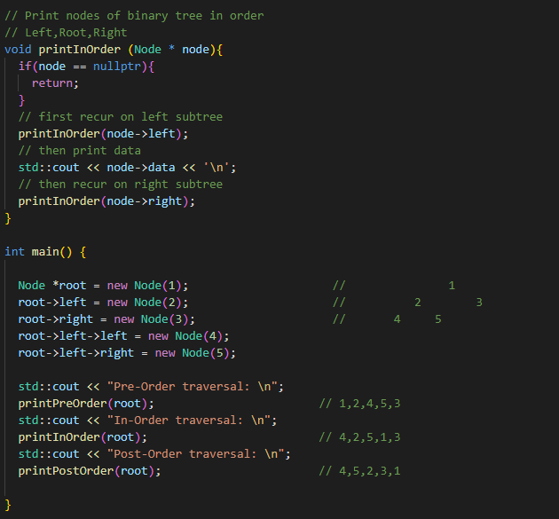

  - **BFS (Breadth First Search)**
    - Level order

  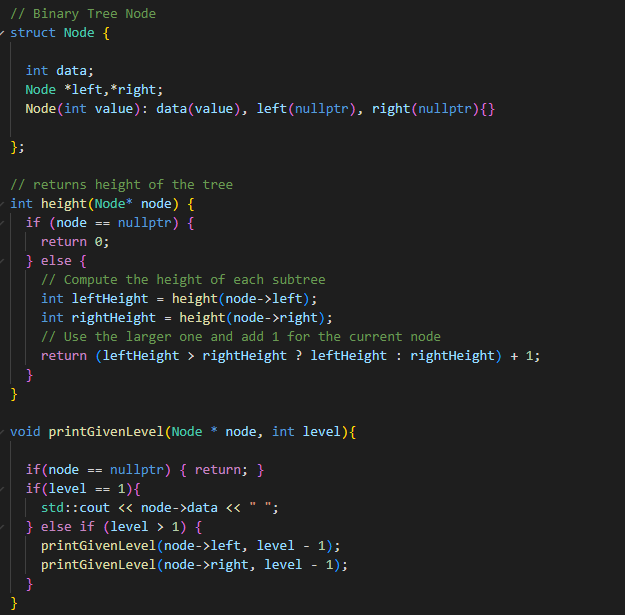
  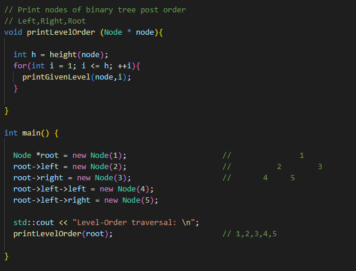

- **Check for Children Sum Property in a Binary Tree**
  
  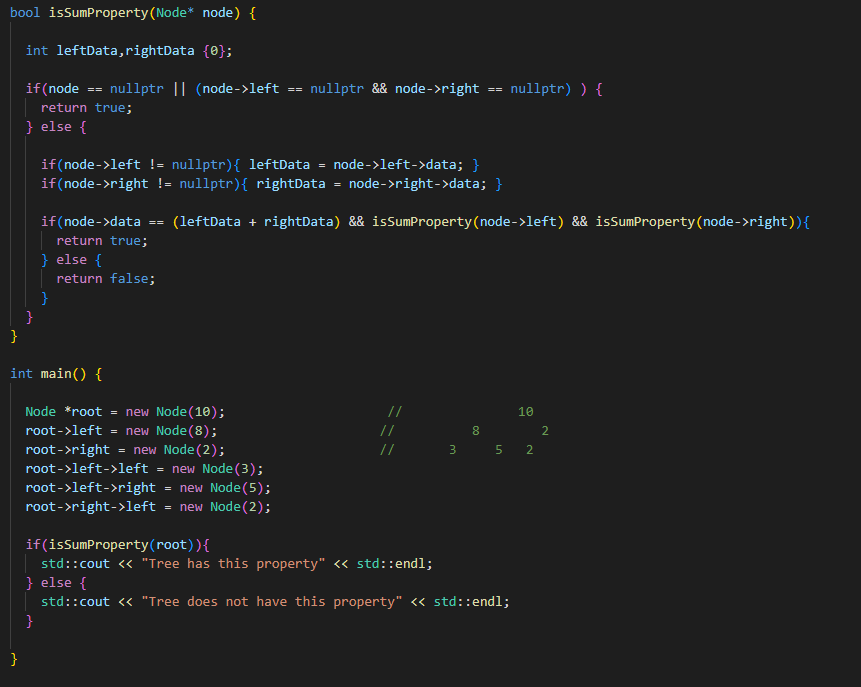

- **Sum of all nodes**
  
  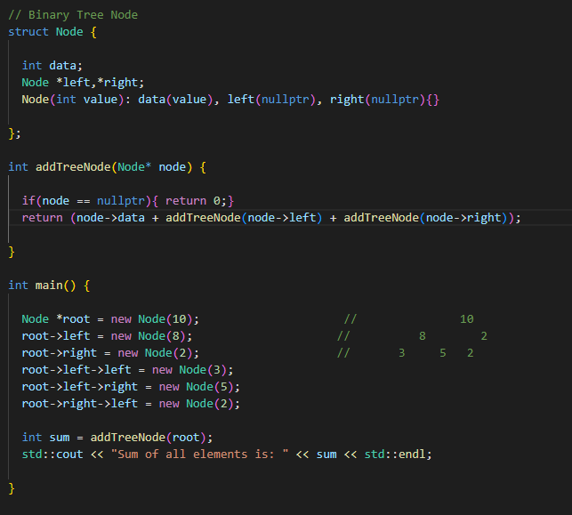

- **Check if all the leaves of a tree are at the same level**

  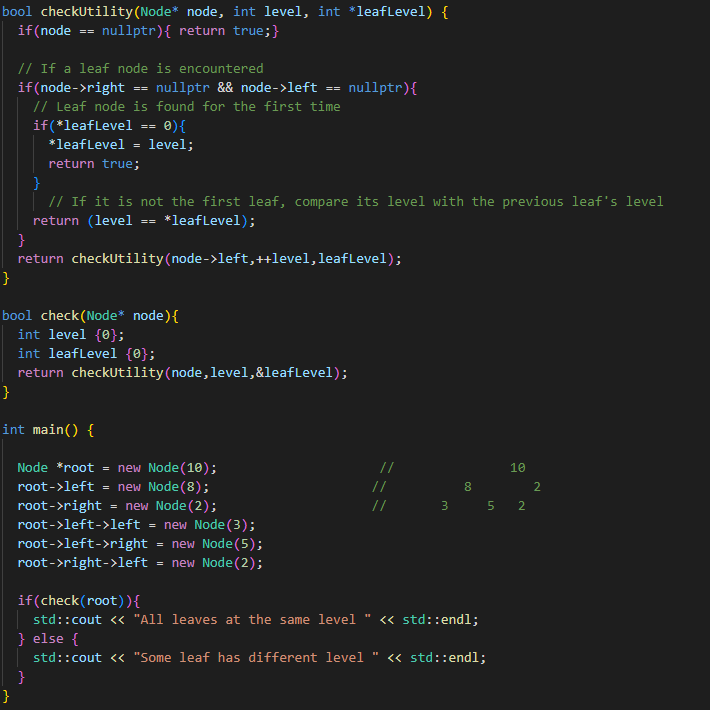
  - **Space Complexity** is O(1) we do not use any additional space
  - **Time Complexity** is O(n) traversing entire tree

- **Validate Binary Search Tree**
  - Write a function to validate that a given binary tree is a binary search tree (BST)
  - Binary search tree is a tree in which all the nodes follow:
    - The left subtree of a node contains only nodes with keys less than the node key
    - The right subtree of a node contains only nodes with keys greater than the node key
    - Both the left and right subtrees must also be Binary Search Tree
  - Implement function **bool isValidBST(TreeNode* root)** 

    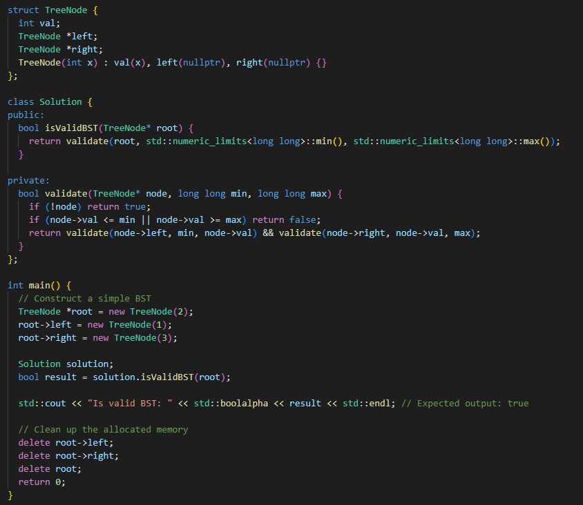

## File handling

- **Log Processor**
  - **Objective**
    - Write C++ program that reads log entries from a text file and filters our records based on a severity level
    - The program should then print the filtered records to the standard output
    - Each log entry in the file is on a new line and follows this format: [Severity] Message
    - For example: [INFO] Application started, [ERROR] An error occurred, [DEBUG] Debugging information
    - The severity level follows the order: INFO < DEBUG < ERROR
    - Read the log entries from a file named log.txt in the current directory
  - **Hints**
    - Use **std::ifstream** to read from the file
    - Use **std::map** or **std::unordered_map** to associate severity levels with and integer to simplify comparison
    - Process each line in the file and check if the severity level meets or exceeds the specified minimum before printing

  - **Solution**

    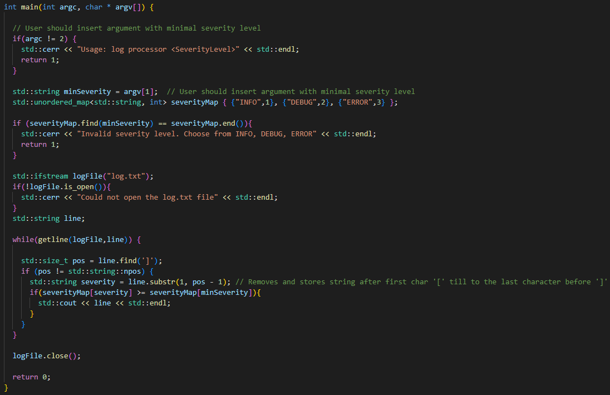

- **File Deduplication Tool**
  - **Objective**
    - Write a C++ program that reads a list of file paths from text file, identifies duplicate files based on their content and prints groups of duplicates to the standard output
    - Each group of duplicates should be printed on a new line with file paths separated by comma
  - **Requirements**
    - Read the list of file paths from a filed named "filelist.txt" in the current directory
    - Use a hash function (SHA-1,MD5, std::hash) to generate hash value for the contents of each file
    - Files with the same hash are considered duplicates
    - Print each group of duplicate file paths on a new line
  - **Hints**
    - Consider using **std::unordered_map** to map hash values to lists of file paths
    - Use **std::ifstream** to open and read contents of files

  - **Solution**

    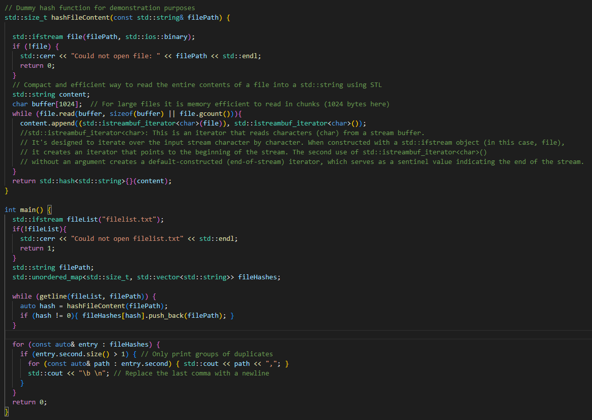

- **Log File Parser**
  - Create a function to analyze log files
  - Each entry in the log file follows the format: **[timestamp] [log level] [message]**
  - Your task is to write a function that parses a string containing log file entries and returns the number of entries that are marked as **ERROR**
  - **Example:**
    - [2023-02-25 18:22:30] INFO Backup started
    - [2023-02-25 18:23:30] ERROR Disk not found
    - [2023-02-25 18:24:00] INFO Attempting retry
    - [2023-02-25 18:25:00] ERROR Timeout reached
    - [2023-02-25 18:26:30] INFO Backup completed
  - **Function Signature:**
    - Parse the string **logData** which contains the log file entries
    - Each log entry is separated by a newline character
    - Count the number of log entries with a log level of **ERROR**
    
  - **Instructions:**
    - Implement function int countErrorLogs(const std::string& logData)
    - Consider edge cases such as an empty log or a log without any errors
    - Write a few test cases to demonstrate to correctness of our solution

  - **Solution**

  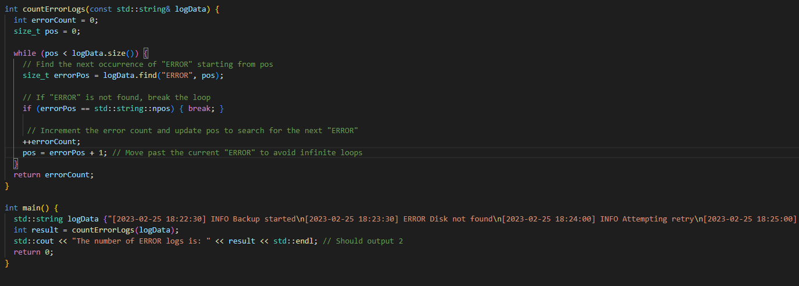

## Sorting

- **In-place sorting** - modifies only the given array so it does not use any additional space for sorting
- **Internal vs External sorting** - External is used for massive data (Merge sort could be used for that)

- **STL sort()**
  - Time complexity: O(n * log n)

  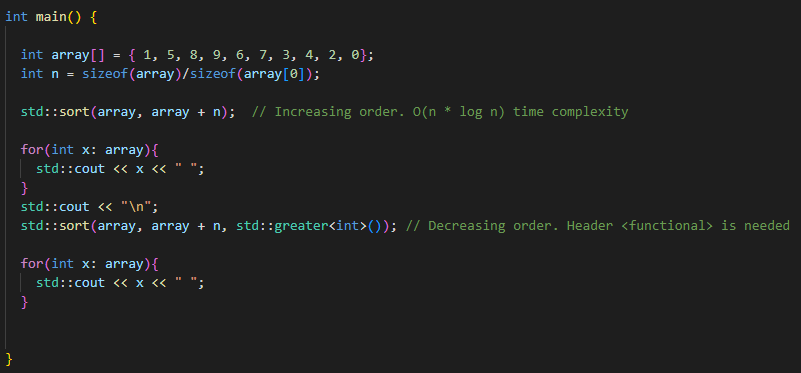

- **Bubble Sort**
  - Does not have the best time and space complexity
  - The simplest sorting algorithm

  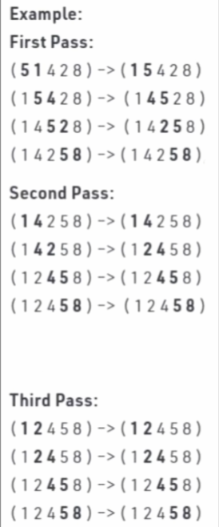
  

  - Space complexity: O(1)
  - Time complexity: O(n^2)  
  
- **Quick Sort**
  - More efficient than bubble sort

  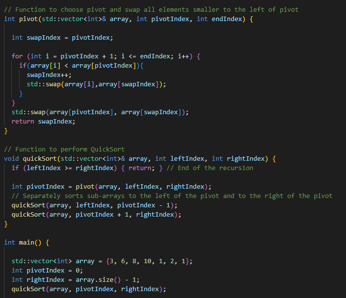
  

  - **Function quickSort** 
    - Takes the array or portion of it and recursively sorts it
    - It does it by partitioning the array around the pivot (selected by the partition function) then sorting sub-arrays before and after the pivot
  - **Function partition** 
    - Rarranges the elements in th array so that all elements less than pivot come before it and all elements greater come after it
    - Pivot is then placed to its correct position
  - This implementation uses the last element as the pivot

- **Merge Sort**

  - Good for large data
  
  
  

  - With Linked List:
  
  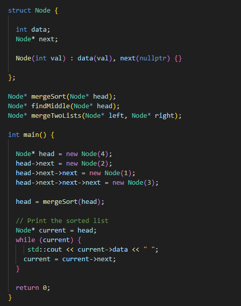
  

