# Interview Questions

## Algorithms

- What does the Big O notation primarily indicate about algorithm? **The maximum time and space complexities in the worst cases**
- What is the Big O notation for the worst-case scenario of a binary search algorithm? **O(log n)**
- What is the time complexity of the standard dynamic programming implementation of the Fibonacci sequence? **O(n)**
- What is the time complexity of accessing an element in hash table? **O(1)**
- What is the worst case time complexity of the Quick Sort? **O(n^2)**
- What is the time complexity of binary search in a sorted array of n elements? **O(log n)**
- Which data structure is most efficient for implementing a priority Queue? **Binary Heap**
- What is a fundamental characteristic of a dynamic programming approach to problem-solving? 
  - **Dividing the problem into smaller overlapping subproblems and combining their solutions** - Learn more

### STL Algorithms

- Which of the following algorithms are part of the STL? **sort(),merge(),unique(),partition()**
- Which STL algorithm can be used to rearrange elements such that they are divided into two groups (e.g. odd and even numbers)? **std::partition**
- What is the time complexity of **std::sort** algorithm? **O (n * log n)**
- What does **std::transform** do when applied to a range of elements? **It modifies each element in-place based on given unary operation**
- What is the purpose of the **std::accumulate** algorithm? **To compute sum of a range of elements, possibly starting with an initial value**
- Which algorithm checks if a condition is true for all elements in a range? **std::all_of**
- What STL function is used to create a heap from a range of elements? **std::make_heap**
- Which algorithm merges two sorted ranges into one? **std::merge**
- What does **std::unique** do when used on a sorted range? **Removes all but the first element from every consecutive group of equivalent elements**

## C vs C++

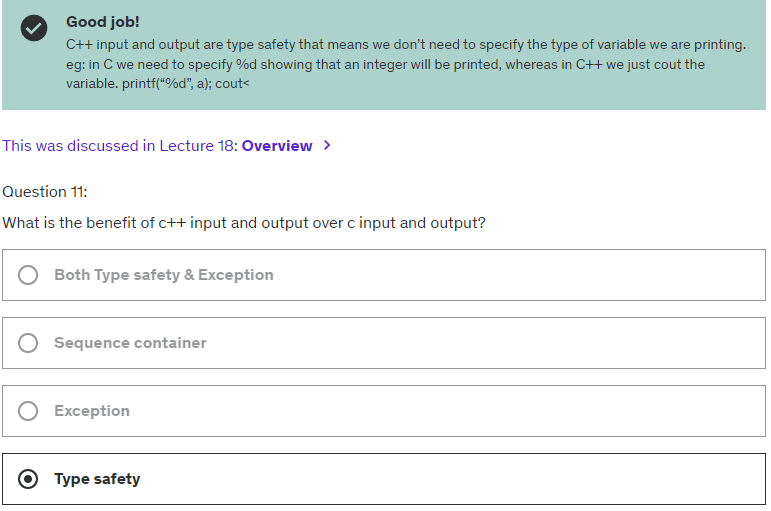

- How do C and C++ primarily differ in terms of programming paradigm? **C is procedural, C++ is both procedural and object oriented**
- Is the STL available in C? **No, it is exclusive to C++**
- Which language performs stricter type checking? **C++ mostly because of its strong object-oriented features and templates**
- Can functions be overloaded in C? **No, this is a feature unique to C++**
- Which of the following is true? **Both use manual memory management but C++ offers more sophisticated tools**
- Which language supports built-in exception handling? **C++ with try, catch, and throw**
- How does the inline function feature differ between C and C++? **Both support inline functions but it is more commonly used in C++ due to its usage in templates and with classes**
- Which statement is true about variable initialization? 
  - **In C++, objects of built-in types that are not explicitly initialized have undefined values**
  - **In C++, static and global scope variables are initialized to zero, but local scope variables of built-in types have undefined values if not explicitly initialized. C behaves similarly in this regard.**

## C++11

- Introduced in C++11:
  - **Lambda expressions**
  - **std::thread**
  - **Range-based for loops**
  - **Auto keyword**

- **Lambda Expression**
  - Which of the following correctly declares a lambda expression in C++? **[=](int x){ return x*x; }**

## C++17

- **What does C++17 introduce to simplify the way we can unpack tuples, pairs, or structs?** 
  - Structured bindings provide a simpler syntax to unpack tuples, pairs, or structs into individual named variables.
- **Which feature allows the automatic deduction of the type of a non-type template parameter?**
  - Template argument deduction for class templates
- **How do inline variables benefit the management of global variables across multiple files in C++17?**
  - By allowing multiple definitions of the same variable
  - Inline variables allow for the definition of variables in header files that can be included in multiple translation units without violating the One Definition Rule (ODR).
- **Which C++17 feature provides extensive facilities for file and directory operations?**
  - Filesystem Library provides a standard way to manipulate files, directories and paths in a portable way
- **What is the purpose of std::optional?**
  - **std::optional** wraps a value in a container that may or may not contain a non-null value, providing a safer alternative to raw pointers for optional values.
- **What significant addition was made to the STL algorithms in C++17 to enhance performance?**
  - C++17 introduced parallel versions of many STL algorithms, which can automatically take advantage of multiple processor cores.
- **How does std::variant enhance type safety in C++17?**
  - By allowing unrelated types to be stored in a single container safely
  - **std::variant** holds a value that could be one of several specified types and ensures type-safe access to the contained value
- **What is the benefit of using constexpr if statements in C++17?**
  - They allow for compile-time polymorphism.
  - Provides a way to conditionally compile code based on a constant expression value
  - Unlike the regular if statement, which is evaluated at runtime, if constexpr is evaluated at compile time, making it suitable for conditional compilation in template code
- **What functionality does std::invoke provide in C++17?**
  - It enables the invocation of a callable object with a set of arguments.
  - Provides uniform syntax to call any callable object, function pointer or member function pointer with given set of arguments
- **What role do deduction guides play in C++17?**
  - They allow the compiler to deduce the type of template arguments automatically. 

## Classes

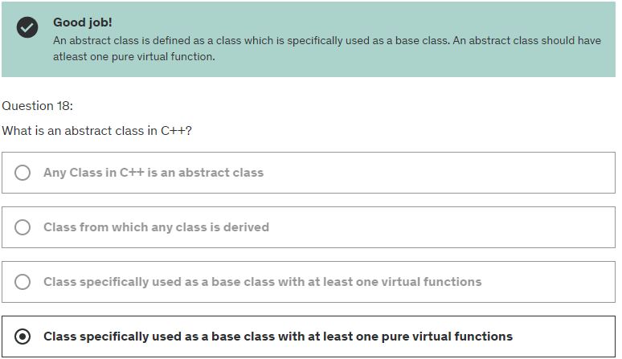
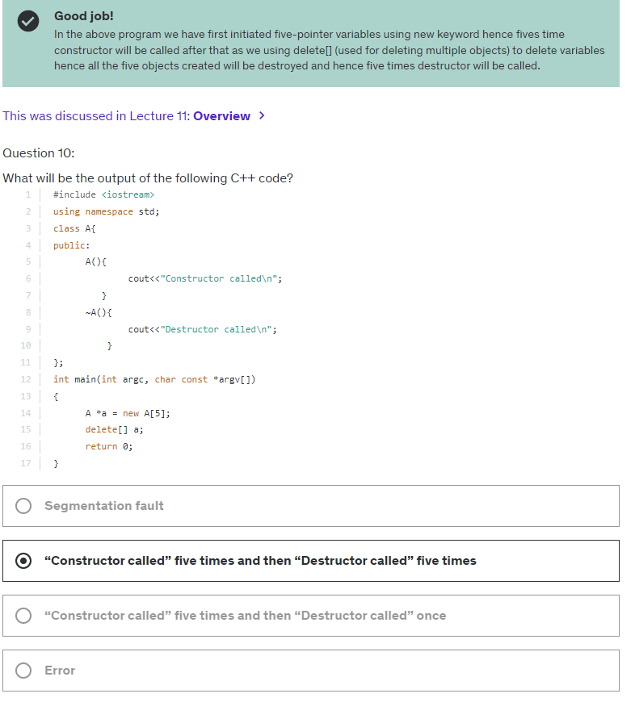
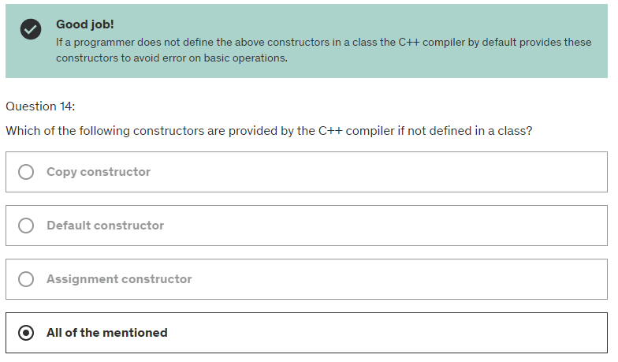

- **How can you prevent a C++ class from being instantiated?** 
  - Make all constructors private or protected
- **What is the effect of declaring member function as static in C++ class?**
  - The function can be called on the class itself without an object instance
- **What is the default access specifier for members of a class in C++?** Private
- **Which constructor is called when no arguments are passed to a newly created object?** Default Constructor
- **What is the most common use of inheritance in C++?** To create relationships between classes
- **What feature of classes in C++ allows polymorphism?** Virtual functions, allowing program to call different functions based on the actual object type at runtime.
- **How does encapsulation benefit class design in C++?** It enhances the security of the class by hiding its implementation details
- **Which characteristic defines an abstract class in C++?** It must contain at least one pure virtual function. 
- **What is true about inline functions?** They are expanded in line when invoked potentially making the code faster.

## Compiler

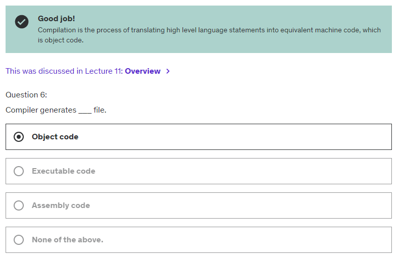

- The process of generating executable code files from object code files in programming involves multiple steps and tools. Here's a simplified overview of how it typically works:

  - **Compiler:** 
    - The compiler translates the source code into object code. For each source code file, the compiler generates a corresponding object file. These object files contain machine code but are not yet ready to be executed as a complete program.

  - **Linker:** 
    - The linker is the tool that takes these object files and combines them into a single executable file. During this process, the linker resolves references between the object files, such as function calls and global variables, and it may also link in code from libraries.

  - **Loader:** 
    - When you run the executable, the loader is the part of the operating system that loads the executable file into memory, sets up the necessary environment for it, and starts its execution.

- So, while the compiler generates the object files, it's the linker that actually produces the final executable code file. The process can vary depending on the programming language and development environment, but this is the general workflow for languages like C and C++.

- **Preprocessing:** The first step involves handling directives for the preprocessor, such as #include and #define. This step occurs before actual compilation, where the preprocessor expands the code but doesn't compile it.

- **Compilation:** The compiler then takes the preprocessed code and converts it into assembly language, which is still human-readable but closer to machine code. This is where the syntax checking, optimization, and translation into assembly code happen. The output of this stage is often referred to as object code, and these are contained in object files. These files are machine code but not yet linked into an executable.

- **Assembly:** The assembly language code is then converted into machine code by an assembler, usually integrated into the compiler. The output at this stage is still in the form of object files.

- **Linking:** Finally, a linker takes these object files and combines them into a single executable program. The linker resolves references to undefined symbols, which are pieces of code that are declared but not defined within the object files. This includes linking libraries and other external code references into the final executable.

- **What is the main function of the linker?** To combine object files into a single executable
- **What is the difference between static and dynamic linking?** 
  - Static linking includes library code in the executable, dynamic linking does not. 
  - Dynamic linking involves loading the library code as needed at runtime, not embedding it directly into the executable
- **What are object files?** 
  - Intermediate files generated by the compiler from source files
  - They are compiled but not fully linked versions of the source files
  - Containing machine code and data that can be linked to create an executable
- **Which of the following best describes a compilation error?**
  - An error detected by the compiler related to syntax or language rules
- **What typically causes linker error?** 
  - Missing definitions for declared functions or variables
  - Often due to missing object files or libraries
- **Why are header files important in compilation?** 
  - They provide declarations of functions and variables used across multiple files
  - They enable separate compilation and linking
- **What is the role of preprocessor directives?** 
  - They modify the  code before compilation based on specific rules
  - Like including other files, conditional compilation and defining macros
- **How can the compilation speed be improved in large projects?**
  - By using precompiled headers
- **How does modular programming affect the compilation process?**
  - It allows for separate compilation of individual modules

## Database

- **Which of the following are commonly used for database interaction in C++ applications?** ODBC, SQL, PostgreSQL, Oracle, SQLite
- **What is a primary advantage of using an index in a database?** Improves query performance
- **Which library is commonly used for connecting to a MySQL database?** MySQL Connector/C++ provides API for connecting to MySQL database
- **How do you execute a basic SQL query?** 
  - Using a dedicated C++ SQL library
- **What is a common method in C++ to store the results fetched from an SQL query?**
  - Using result-set objects provided by the database connector
- **Why are prepared statements important when executing SQL commands in a C++ application?**
  - They improve performance and provide security against SQL injection.

## Data Structures

- **What data structure is primarily used to implement a priority queue?** Heap
- **Which data structure is best suited for implementing a Least Recently Used Cache?**
  - Hash Table combined with doubly linked list  => O(1) access and update time
- **Which STL container is used to implement dynamic array?** std::vector
- **What data structure is std::map implemented as?** Binary search tree
- **Which STL container adapts a container to provide queue functionality?** 
  - std::queue provides FIFO data structure interface, adapting underlying container like std::deque or std::list
- **How is graph most commonly represented in C++?** 
  - std::vector of std::vectors
  - A graph is often represented as an adjacency matrix using std::vector of std::Vectors or as an adjacency list using a std::vector of std::list
- **Which technique is commonly used to handle collisions in hash table?**
  - Separate chaining, involving using a list of entries with the same index, commonly implemented with a linked list in each bucket of the hash table
- **Which operation is most efficient in a priority queue implemented as a binary heap?**
  - Insertion in a binary heap is very efficient, typically requiring O(log n)
- **What is doubly-linked list typically used for?**
  - To enable efficient bidirectional traversal
- **What is balanced binary tree used for?**
  - To minimize the depth of the tree and ensure O(log n) search time
  - They maintain a low height to ensure that operations like search, insertion or deletion can be performed in O(log n) time
- **What is the primary advantage of using std::set?**
  - Maintaining a sorted  collection of unique elements
  - std::set is typically implemented as a balanced binary search tree ensuring that elements are stored in a sorted manner and each element is unique
- **Why would you used a std::list over std::vector?**
  - When we need to frequently add and remove elements from the middle of the container
  - std::list being doubly-linked list provides efficient insertion and deletion in the middle of the list as these operations do not require elements shifting
- **Which data structure uses LIFO principle?** Stack
- **Which STL container is used for implementing FIFO?** std::deque, std::queue
- **What is unique characteristic of a std::map?** Stores key-value pairs with unique keys
- **What does std::vector represent?** Dynamic Array

- **Binary Search Tree (BST)**
  - In Binary search tree, in what order are elements arranged in an in-order traversal? 
    - In order is *Left,Root,Right* and BST has everting lower than node in the left subtree and everything higher in right subtree so it means -> **Ascending Order**  

## Data Types

- **What will be output of this code when integer has 4 bytes?**
  
  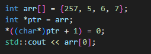

  - It will be 1 because pointer is casted to char pointer which has only 1 byte so it will zero the second byte of the 257 integer so it will zero the 256 bit

- **What is the size of char?** 1 byte
- **Which data type should be used for a variable that requires high precision for storing floating-point numbers?** long double
- **What happens when an integer variable exceeds its maximum value?** 
  - It leads to undefined behavior
  - It typically leads to wraparound due to overflow
- **What is the effect of the unsigned modifier on an integer?** Allows to store only positive values and zero
- **What is the purpose of the auto keyword when declaring variable?** To let compiler deduce the type of the variable
- **What is enum used for?** To declare a set of named integer constants
- **What is implicit type conversion?** When the conversion is performed automatically by the compiler
- **What is size of a pointer?** 4 bytes on 32-bit system and 8 bytes on a 64-bit system
- **How is struct in C++ typically used?** To create complex data types

## Debugging

- **What is the purpose of breakpoint?** To pause program execution at a specific point
- **Which tool is commonly used for memory leek detection?** Valgrind
- **What is the purpose of the assert function?** To terminate the code if a boolean expression evaluates to false
- **Why is it important to read compiler error messages carefully?** To identify exactly where and what the coding error is
- **What is the benefit of using watch variables in a debugger?**  To monitor the changes in the value of a variable during debugging
- **What is a conditional breakpoint?** A breakpoint that is triggered only when a specified condition is met
- **Why is analyzing the call stack useful in debugging?** To identify the sequence of function calls leading to the current point of execution
- **How can log messages assist in the debugging process?** By recording the flow of execution and the state of the application.
- **How do you typically investigate runtime errors that do not occur during compilation?** By reviewing the program’s source code and logic.

## Design Patterns

- Which design pattern is primarily concerned with creating an object by hiding the creation logic, rather than instantiating objects directly? 
  - **Factory Method** - Used for creating objects where the creation logic is encapsulated in a method rather than directly using the **new** operator 

## Error Handling

- Which feature is specifically designed for error handling?  **Exceptions**
- What will happen if a destructor throws an exception? **Program will terminate immediately**
  - Throwing exception from destructor is bad practice because it can lead to program termination if the destructor is called during the stack unwinding process of another exception
  - If exception is thrown and not caught within the same context -> **std::terminate** is called
- What is the purpose of the **noexcept** specifier in C++? **To indicate that a function does not throw any exception**

## Functions

- **Inline Functions**

  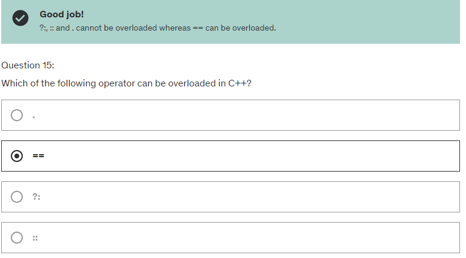

- What is the primary benefit of using lambda expressions? **They allow for the creation of unnamed inline functions**

## Keyword

- **auto**
  - storage duration specifier
  - specifies automatic storage duration, meaning the variable is automatically allocated and de-allocated
  - Declares an automatic type deduction for variables

- **delete**
  - Frees dynamically allocated memory

- **Extern**

  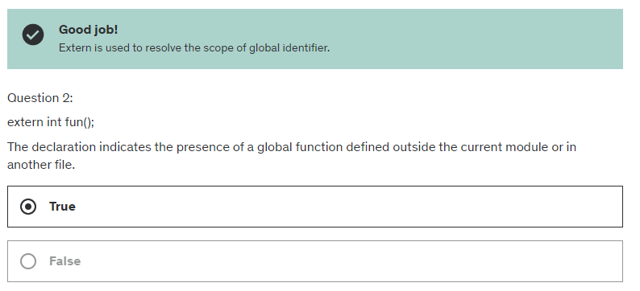
 

- **register**

  - storage duration specifier
  - hints that the variable should be stored in a CPU register for quick access

## Memory Management

- Which of the following are automatic storage duration specifiers in C++? **register, auto**
- What is the result of executing a recursive function without a base case? **Stack overflow**
- Which C++ feature ensures that resources are automatically released once they are no longer needed? **Smart Pointers**

## Multithreading

- Which of the following is used to protect shared data in concurrent programming? **Mutexes**
- Which of the following can be used for thread synchronization in C++? **std::mutex, std::lock_guard, std::atomic, std::future**
- Which of the following are used to manage thread execution? **std::thread,std::async**
- Which Windows specific function is used to create a new thread? **CreateThread() it is WinAPI function**
- What is the purpose of the **join()** function? **To ensure that a thread completes its execution**
- Consider a C++ program where multiple threads need to read a shared data structure while one thread updates it. Which synchronization mechanism is most suitable to prevent race conditions? **std::shared_mutex**

### Concurrency

- What is the primary purpose of the *std::async* function? **To perform asynchronous task execution**
  - **std::async** is used to run a function asynchronously (potentially in a new thread) and returns **std::future** that will eventually hold the result of the function execution
  

## Network Programming

- **Protocols**
  - Which Protocol is used for reliable, connection-oriented data transfer? **TCP, HTTP, SMTP, FTP**
  - What does HTTP stand for? **HyperText Transfer Protocol**

## OOP

-Which of the following best describes **Polymorphism**? **Classes derived from the same base class can have different implementations of the same methods**

## Operators

- **Modulo**

  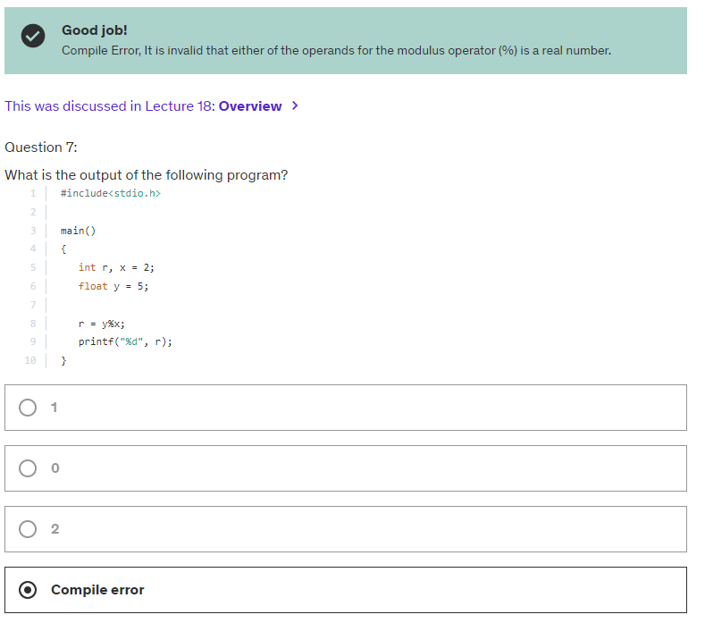

- **Priorities**  

  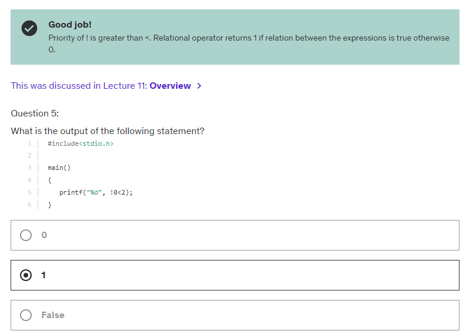

- **Overloading**

  

## Optimization

- Which of the following keywords can be used to improve performance by avoiding unnecessary copies of objects? **std::move**

## Parameters

- What is difference between pass by value and pass by reference in C++?
  - When passing argument by value a copy of the argument is created and passed to the function
    - Any modification made to the argument within the function do not affect the original value
  - When passing argument by reference:
    - Any modification made to the argument within the function affect the original value   

## Preprocessing

  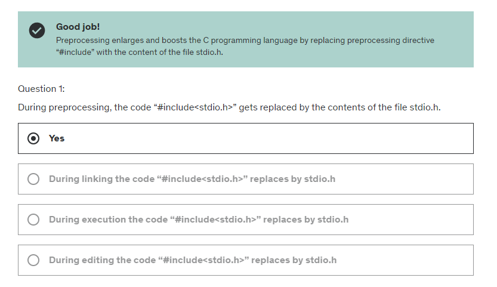

## Specifiers

- Which of the following is a correct way to declare a pointer to a constant integer in C++? **Both const int * ptr and int const * ptr**

## Templates

- Which future allows C++ to generate functions or classes that can handle different data types? **Templates**

## Testing

- What is a common framework used for unit testing? **Google Test**

## WinAPI

- What is the primary use of the WinAPI? **Providing low-level access to system resources**