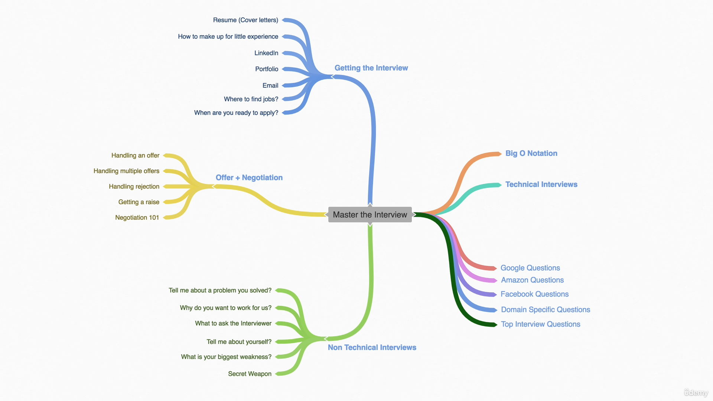
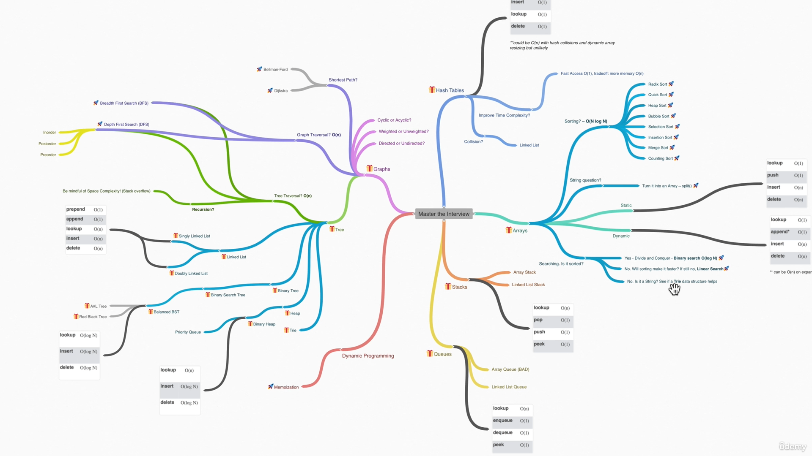

# Interviews

- **Non-Technical Part**
    
  

- **Technical Part**

  

## Data Structures

- Arrays
- Stacks
- Queues
- Linked Lists
- Trees
- Tries
- Graphs
- Hash Tables

## Algorithms

- Sorting
- Dynamic Programming
- BFS + DFS
- Recursion

## Threads

