# Lambdas (c++11)

- Allows us to write an inline function which can be used for short snippets of code that are not going to be reused and are not worth naming
- A mechanism to set up anonymous functions. Once we have them set up, we can either give them names and call them or we can even get them
  to do things directly
-	Lambdas are a C++ construct (C++11+) that allows to write un-named functions “in place”, 	which makes the STD Library algorithms much more usable. 
-	They provide a handy way to connect a signal to a slot inline (right away)

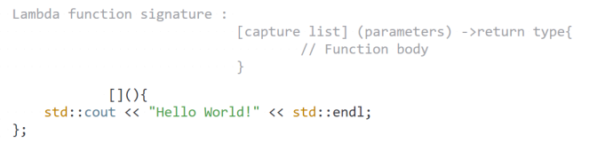

- We can call lambda directly or give it a name and call it later:

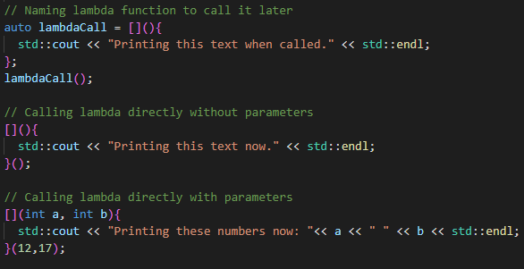

- We can also return some value from the lambda function and store it

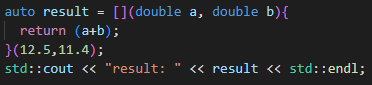

- Generally return-type in lambda expression are evaluated by compiler itself and ->return-type part can be ignored
- But we can specify it like this:

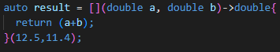

- Some examples:

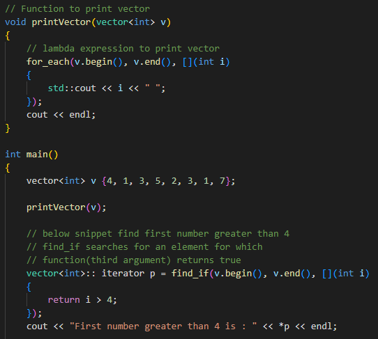
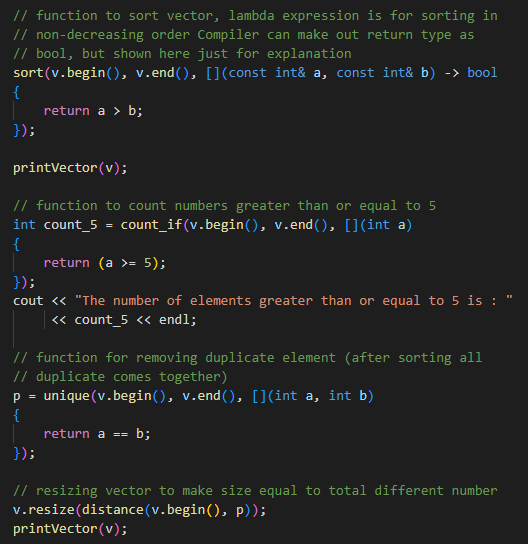

## Capture List

- A lambda expression can have more power than an ordinary function by having access to variables from the enclosing scope.

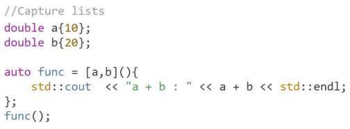

- By default the capture list capture by value and these values are **const !**:

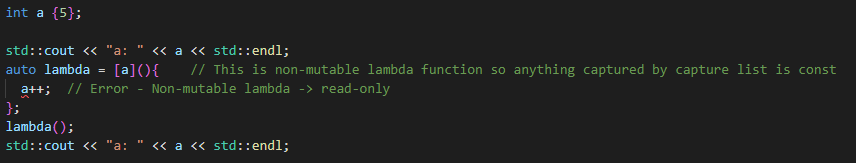

- If we want to modify the copy we need to define lambda as mutable:

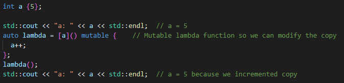

- Or we can capture by reference if we want to modify the original from the function

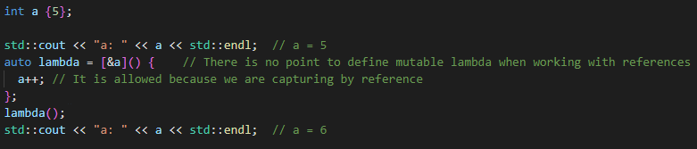

- We can capture external variables from enclosing scope by three ways:
  - Capture by reference  
    - [&] this will capture, every values that is available, by reference
    - [&a] this will capture just value named 'a' by reference
  - Capture by value      
    - [=] this will capture, every value that is available, by value
    - [a] this will capture just value named 'a' by value
  - Capture by both       [a,&b]
- Lambda with empty [] can access only those variables which are local to it.
- Examples:

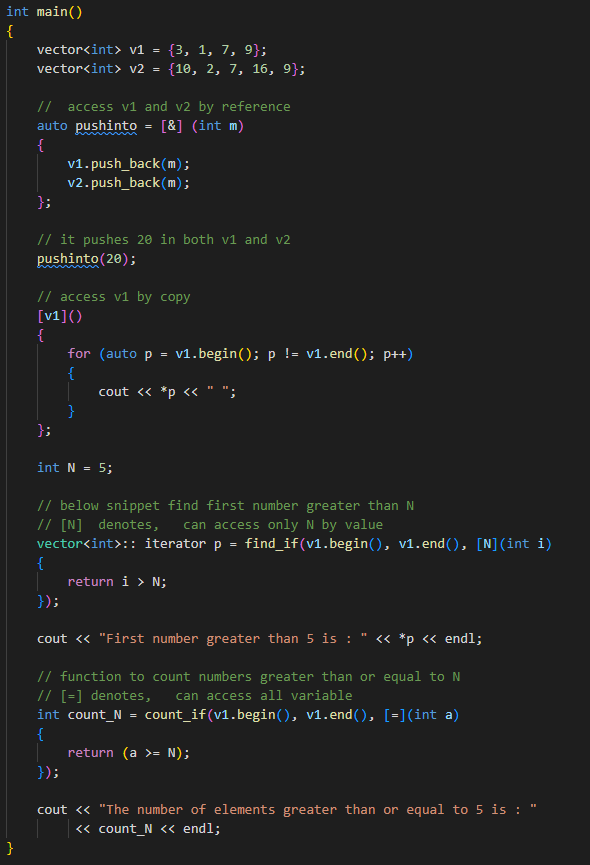

