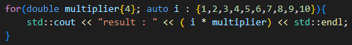

# Loops

## While

## Do While

## For

## Ranged Based For

### Range Based For with Initializer (C++20)

    - since C++20 we can run Ranged base for loop with initializer inside its declaration
    - Better to use range based for just with containers rather than plain arrays
    - 

## break

    - Breaks out of the loop immediately and causes execution of the statement following the loop

## continue

    - Skips current iteration of the loop and goes to the next one