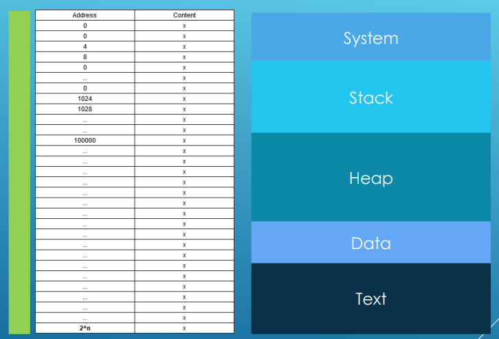
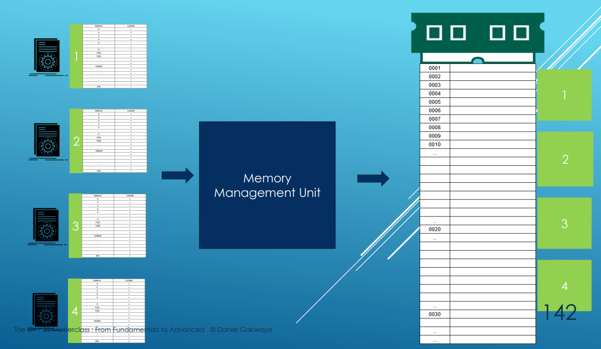
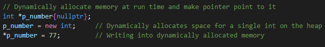
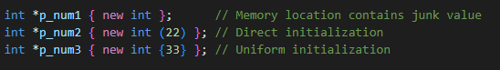
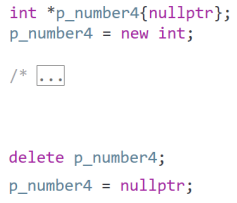
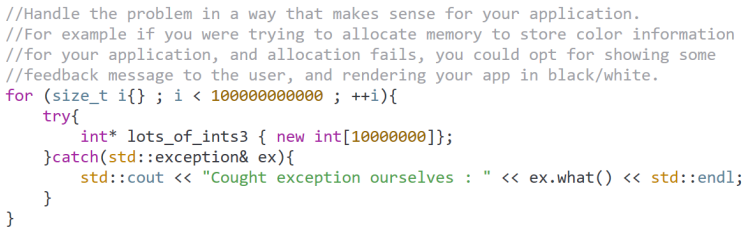
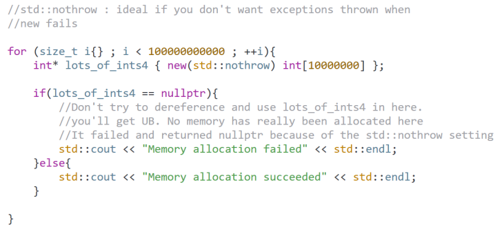
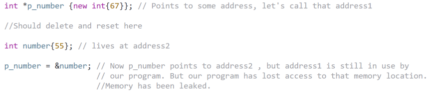
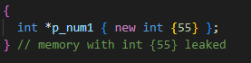

# Memory 

## Program memory map

    - program is using RAM (Random Access Memory) 
    - The memory map is a standard format defined by the OS and all programs written for that OS 
      must conform to it

    

### Stack ToDo

    - Is going to store local variables, function calls, etc.
    - Memory is finite
    - The developer is not in full control of the memory lifetime
    - Lifetime is controlled by the scope mechanism

### Heap ToDo

    - Additional memory that can be queried for at run time
    - Memory is finite
    - The developer is in full control of when memory is allocated and when it is released
    - Lifetime is controlled explicitly trough operators 'new' and 'delete'

### Text 

    - Section that will load the actual binary of a program

### Virtual memory

    - A trick that fools our program into thinking it is the only program running on our OS
      and all resources belong to it.
    - Each program is abstracted into a process and each process has access to the memory range
      0 - ((2ⁿ)-1) where N is 32 or 64 depends on 32/64 bit system

### Memory Management Unit (MMU)

    - The entire program is not loaded in real memory by the CPU and MMU
    - Only parts that are about to be executed are loaded
    - Making effective use of real memory (RAM), a valuable and lacking resource
    - On the next picture we can see that MMU will assert its separate block for each separate program
        

## Dynamic Memory Allocation

    - Allocate dynamic memory through 'new'
    - When we allocate some dynamic memory, that part of memory belongs to our program
    - The system can not use it for anything else, until we return it
  
  

  

    - Every time we use 'new' to make some dynamical allocation we MUST use 'delete' 
      to release that part of memory back when we do not need it anymore!!
    - Good practice when releasing memory is to reset pointer back to nullptr   
  
  

    - Be careful to call delete twice -> It will crash
    - After releasing pointer we can reuse it and allocated some different part of memory again

### When 'new' fails

    - In some rare cases, the 'new' operator will fail to allocate dynamic memory from the heap
    - When that happens and we have no mechanism in place to handle that failure, an exception will be thrown
      and our program will crash
    - 'new' fails rarely and we can see many programs that assume that it always works and do not check it
    - But we should check and handle that through the exception mechanism
    

    - Or we can use 'std::nothrow' so it wont throw exception and it will be nullptr instead

### Memory Leaks

    - When we loose access to memory that is dynamically allocated

    - Double allocation will also create memory leak

    - Or when we escape the scope without calling delete

