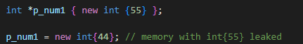

# Memory 

## Program memory map

    - program is using RAM (Random Access Memory) 
    - The memory map is a standard format defined by the OS and all programs written for that OS 
      must conform to it

    

### Stack

    - Is going to store local variables, function calls, etc.
    - Memory is finite
    - The developer is not in full control of the memory lifetime
    - Lifetime is controlled by the scope mechanism
    - Adjoins the heap area and grew in opposite direction to the heap growth -> when stack pointer meets
      the heap pointer free memory was exhausted
    - Contains the program stack (LIFO structure) typically located in the higher parts of memory
    - Automatic variables are stored here along with information about function calls
    - Each time function is called, the address of where to return to and certain information about
      the callers environment are saved on stack
    - The newly called function then allocates room on the stack for its automatic and temporary variables
    - Also known as temporary memory

#### Stack Allocation

    - The allocation happens on contiguous blocks of memory
    - The size of memory to be allocated is known to the compiler (compiler-time) and whenever a function
      is called, its variables get memory allocated on the stack
    - Whenever the function call is over the memory for the variables is de-allocated
    - Programmer does not have worry about memory allocation and de-allocation of stack variables
    - Any value stored in the stack memory scheme is accessible as long as function has not completed its
      execution and currently is in running state
    - Safer than Heap allocation because the data stored can only be access by owner thread
    - Memory allocation and de-allocation is faster compared to the Heap memory allocation
    - Less storage space compared to Heap

#### Stack Overflow

    a) If we declare large number of local variables or declare an array or matrix of large size
    b) If function recursively call itself infinite times then the stack is unable to store large number
       of local variables used by every function call 

### Heap

    - Additional memory that can be queried for at run time
    - Memory is finite
    - The developer is in full control of when memory is allocated and when it is released
    - Lifetime is controlled explicitly trough operators 'new' and 'delete'
    - Dynamic memory allocation usually takes place on the heap
    - The Heap area begins at the end of the bss segment and grows to larger addresses from there
    - Is managed by 'malloc','realloc' and 'free'
    - The Heap are is shared by all shared libraries and dynamically loaded modules in process

#### Heap Allocation

    - The memory is allocated during the execution of instructions (run-time)
    - It is called heap because it is pile of memory space available to the programmer to allocate/de-allocate
    - Every time when we made an object it is always created in Heap-space and the referencing information to
      these objects are always stored in stack
    - Data stored in Heap are accessible or visible to all threads

#### Heap Overflow

    a) If we continuously allocate memory and we do not free that memory space after use it may result in 
       memory leak
    b) If we dynamically allocate large number of variables

### Initialized Data Segment

    - Portion of virtual address space of program, which contains the global variables and static variables 
      that are initialized by the programmer
    - Not read-only because values can be altered at run time
    - Can be further classified into read-only and read-write (const global -> read-only)

### Uninitialized Data Segment (BSS)

    - Often called BSS segment, named after an assembler operator that stood for Block Started by Symbol
    - Data in this segment is initialized by the kernel to arithmetic 0 before the program start executing
    - Uninitialized data starts at the end of the data segment and contains all global variables and static 
      variables that are initialized to zero or do not have explicit initialization in the source code

### Text Segment

    - Section that will load the actual binary of a program
    - Also known as code segment
    - Section of program in object file or in memory, which contains executable instructions
    - As memory region a text segment may be placed below heap or stack in order to prevent heaps and stack 
      overflows from overwriting it
    - It is sharable so that only single copy needs to be in memory for frequently executed programs
    - Often read-only

### Virtual memory

    - A trick that fools our program into thinking it is the only program running on our OS
      and all resources belong to it.
    - Each program is abstracted into a process and each process has access to the memory range
      0 - ((2ⁿ)-1) where N is 32 or 64 depends on 32/64 bit system

### Memory Management Unit (MMU)

    - The entire program is not loaded in real memory by the CPU and MMU
    - Only parts that are about to be executed are loaded
    - Making effective use of real memory (RAM), a valuable and lacking resource
    - On the next picture we can see that MMU will assert its separate block for each separate program
        

## Dynamic Memory Allocation

    - Allocate dynamic memory through 'new'
    - When we allocate some dynamic memory, that part of memory belongs to our program
    - The system can not use it for anything else, until we return it
  
  

  

    - Every time we use 'new' to make some dynamical allocation we MUST use 'delete' 
      to release that part of memory back when we do not need it anymore!!
    - Good practice when releasing memory is to reset pointer back to nullptr   
  
  

    - Be careful to call delete twice -> It will crash
    - After releasing pointer we can reuse it and allocated some different part of memory again

### When 'new' fails

    - In some rare cases, the 'new' operator will fail to allocate dynamic memory from the heap
    - When that happens and we have no mechanism in place to handle that failure, an exception will be thrown
      and our program will crash
    - 'new' fails rarely and we can see many programs that assume that it always works and do not check it
    - But we should check and handle that through the exception mechanism
    

    - Or we can use 'std::nothrow' so it wont throw exception and it will be nullptr instead

### Memory Leaks

    - When we loose access to memory that is dynamically allocated

    - Double allocation will also create memory leak

    - Or when we escape the scope without calling delete

## Memory Management To Do

- **Static Memory Allocation**

  - Memory is allocated at compile-time
  - global variables, static variables, arrays
  - **Global Variables**
    
    - Declared outside any function
  
  - **Static Variables**
  
    - Can be inside or outside functions
  
- **Automatic Memory Allocation**

  - Memory is allocated on the stack at runtime
  - Local variables within functions
  - The memory is allocated when the function is called and de-allocated when the function goes out of scope
  

- **Dynamic Memory Allocation**

  - Memory is allocated on the heap at runtime
  - Requires manual allocation and deallocation using **new** and **delete**

## Best Practices

- **Prefer Automatic Variables**
  - Use automatic stack variables whenever possible, as they are managed automatically and have minimal overhead
- **Use Smart Pointer**
  - Avoid using raw pointers for managing dynamically allocated memroy

- **Use RAII**
  - Resource Acquisition Is Initialization 
  - To manage resources

- **Avoid Dangling Pointer**
  - Ensure that pointers are set to **nullptr** after deleting the memory they point to
  - Be cautious with pointers that might outlive the memory they point to

- **Minimize Use of Global Variables**
  - Global variables can lead to unexpected side effects and make the program harder to understand and maintain

## Caches

- Cache is a small fast memory component that stores copies of frequently accessed data from main memory (RAM)
- Caches are used to reduce the time it takes to access data and improve overall system performance
- They are curcial in bridging the speed gap between the CPU and the slower main memory
  
- **Types**
  
  - **CPU caches**
    - Small, fast memroy locations within the CPU that store copies of frequently accesse memory data
    - **L1 Cache**
      - Smallest and fastest, located inside the CPU core
    - **L2 Cache**
      - Larget than L1 but slower, but still faster than RAM
    - **L3 Cache**
      - Even Larger and shared across multiple CPU cores

- **Cache Operations**
  - **Cache Hit**
    - When the data requested by the CPU is found in the cache
  - **Cache Miss**
    - When the data requested is not in the cache, requiring it to be fetched from RAM
  - **Eviction**
    - When the cache is full, old data is removed to make room for new data

- **Cache Coherency**

  - In multi-core systems, maintaining consistency of data in all caches is crucial. 
  - This is handled by cache coherency protocols, ensuring that all caches have the most recent data.

- **Caches in C++ programming**

  - **Data Locality**
    - **Temporal Locality** - Accessing the same memory location repeatedly within a short period
    - **Spatial Locality** - Accessing memory locations that are physically close to each other

  - C++ programmers can optimize for cache performance by organizing data and code to maximize locality
  
  - **Data Structures**
    - Arrays vs Linked Lists:
      - Arrays have better spatial locality since elements are stored contiguously in memory
      - Lined Lists have poor locality due to scattered memory location
    - Structures of Arrays vs Arrays of Structures:
      - SoA can improve spatial locality by grouping similar data types together
      - AoS can cause scattered memory access

  - **Loop Optimalizations**
    - **Loop Unrolling**
      - What is it? ToDo
      - Reduces the overhead of loop control and increases the amount of work done per iteration
      - Improving cache performance
    - **Blocking**
      - Divides loops into smaller blocks to improve cache hit rates by working on subsets of data that fits into the cache
      - Example ToDo
  
  - **Cache Aware Algorithms**
    - Algorithms can be designed to minimmize cache misses
    - **Matrix Multiplication**
      - Using blocking techniques to ensure that sub-matrices fit into the cache 
    - **Searching and Sorting Algorithms**
      - Choosing algorithms that access memory sequentially rather than randomly
  
  - **Compiler Optimizations**
    - Modern C++ perform various optimizations to improve cache utilization
    - **Inlining** - Reduces function call overhead and improves instruction cache utilization
    - **Prefetching** - Instructs the CPU to load data into the cache before it is actually needed
    - **Cache Blocking** - Reorganizes loops to improve data locality

  - **Tips**
    - Use profiling tools to indentify cache performance bottlenecks
    - Choose data structures that promote good locality
    - Use alignment directives to ensure data is aligned to cache line boundaries
    - Avoid excessive context switching and large woring sets that excced cache capacity