# Move Semantics

## Lvalues and Rvalues

### Lvalue

- Things we can grab an address for and use at a later time
  
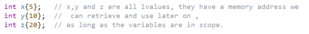

### Rvalue

- Transient or temporary in nature
- They only exist for a short time and are quickly destroyed by the system when no longer needed

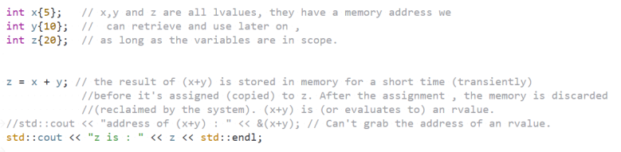
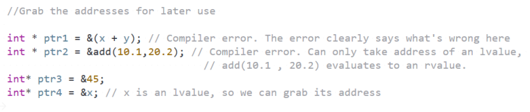

- The Benefits for Rvalues become apparent when we pass temporary objects as function parameters
- Those can be direct temporary objects created on the fly or those returned from functions or expressions

## Rvalue References

- When a Rvalue reference is bound to Rvalue. the life of the Rvalue is extended and we can manipulate it through the Rvalue reference

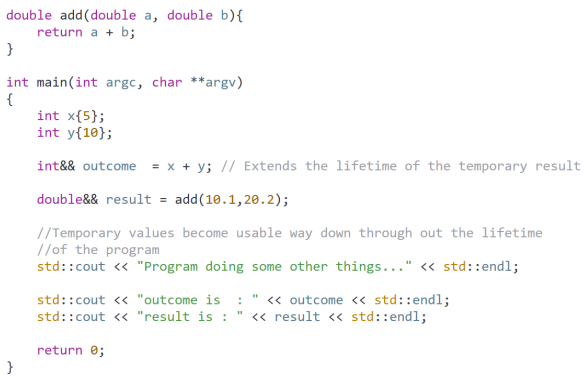

### Passing by Rvalue Reference

- If by any chance an Rvalue happens to be assigned a name, it is treated by the compiler as if it is a Lvalue.
- If it is assigned or copy assigned from, the copy constructor or the copy assignment operator will be called
- Rvalue reference is Lvalue when named:

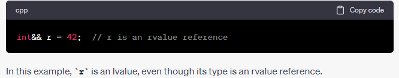

- When simply assigned:
  
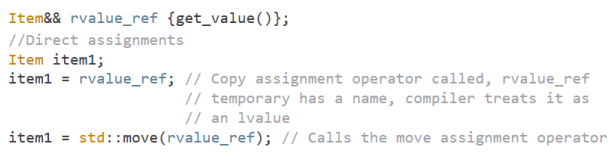

- Passing to a function:

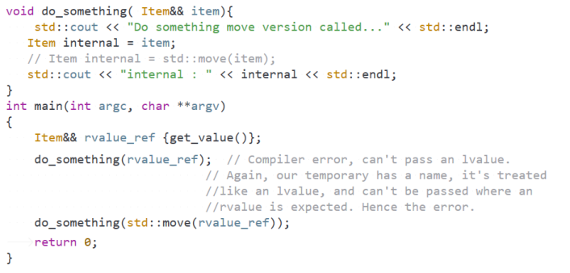

## Moving Temporaries

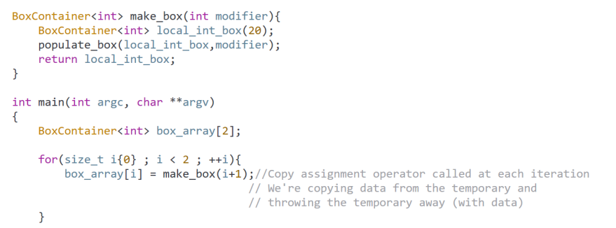

- In this example we are creating temporary that is assigned to box array and then deleted which is waste
- We can avoid that with Move Constructor (When we are creating new object): 

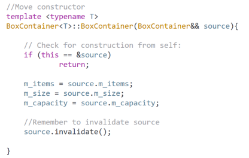

- Or Move Assignment operator (When we are assigning to the already existing object):

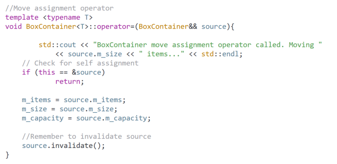

- The same example with move assignment operator constructor:

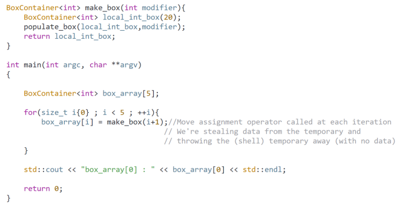

## Moving Lvalues with std::move

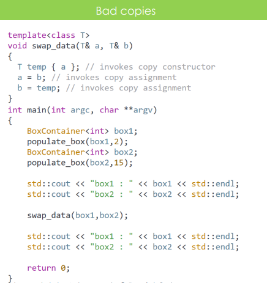

- This example can not use regular move assignment operator because it uses Lvalues so the copy assignment operator will be invoked
- But we can use std::move for Lvalues:

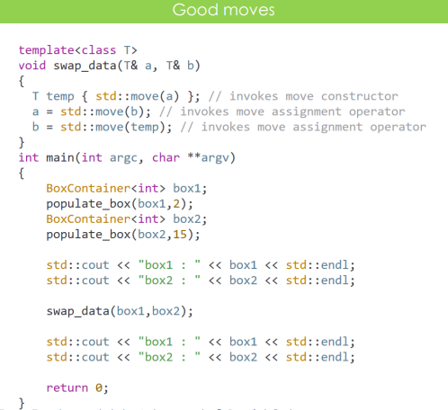

- std::move does not move data by itself, it just casts its parameter to Rvalue
- The moving of data is done when we construct an object from the resulting Rvalue or if we assign it to another object of our class
- So we still need move assignment operator and move constructor implemented for our class

## Move Only Types

- A type whose Copy Constructor and Copy Assignment Operator have been deleted -> Its objects can not be copied
- The Move Constructor and Move Assignment Operator are however left -> Its object can only be moved

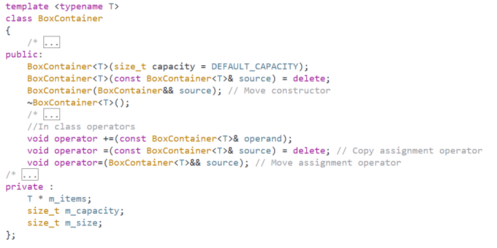

- Motivation:
  - Unique Ownership: For types that model the concept of unique ownership (like std::unique_ptr)
  - Non-Duplicable Resources: Some resources can not be easily duplicated or should not be. For example file handles, network sockets, etc.
  - Performance: Making a type move-only can implicate that transferring the resources is lightweight and wont involve deep copying
  - Thread Safety: Simplifies its thread safety guarantees, ensures that the execution context is not inadvertently shared or duplicated across threads
  - Resource limitation 