# MultiThreading

## Introduction

- Some classes here are move-only to support RAII (Resource Acquisition Is Initialization) idiom
  - Object acquires ownership in the constructor
  - Object releases ownership in the destructor
  - The resource instance can be moved from one object to another

- Each thread has its own entry point function
  - When the thread starts, it executes the code in this function
  - When the function returns the thread ends
  - The main thread continues to execute its own code
  - It does not wait for the other threads, unless we explicitly tell it to

- **Thread**
  - Single sequence stream within a process
  - Software thread
  - For example an object of the C++ std::thread class
  - Because threads have some of the properties of processes, they are sometimes called lightweight process

- **Thread vs Process**
  - Threads are not independent of one other like processes
  - As a result thread shares with other threads their code section, data section and OS resources like open files and signals
  - But like processes thread has its own program counter, register set and stack space

- **Task**
  - Higher level abstraction
  - Some work that should be performed concurrently

- **Why MultiThreading?**
  - To improve application through parallelism
  - Thread creation is much faster
  - Context switching between thread is much faster
  - Threads can be terminated easily
  - Communication between threads is faster

- Multithreading is not supported by the C language standard -> **POSIX Threads** (**Pthreads**) has to be used in C.
- In C++11+ we have **std::thread**

## Concurrency

- Performing two ore more activities at the same time
- For example if there is some long task and we want to see feedback during the processing of that task (For example Download progress)

- **Hardware Concurrency**

  - Modern computers have multiple processors
  - Different processors can perform different activities at the same time (Even within the same program)
  - They are known as "hardware threads"
  - Each processor follows its own thread of execution through the code

- **Software Concurrency**

  - Modern operating systems support "software threading"
  - A program can perform multiple activities at the same time
    - These activities are managed by the operating system
  - Typically there are more software thread than hardware threads

## std::thread (C++11)

- The base level of concurrency
- Rather low level implementation
- Maps onto a software thread
- Managed by the operating system
- Similar to Boost threads, but with some important differences:
  - No thread cancellation
  - Different argument passing semantics
  - Different behavior on thread destruction

- **Launching a Thread**

  - We need to create an std::thread object defined in [\<thread\>](https://en.cppreference.com/w/cpp/thread/thread) header
  - The constructor starts a new execution thread
  - The parent thread will continue its own execution
  - std::thread constructor takes a callable object - Thread's entry point function
    - The execution thread will invoke this function
  - The entry point function
    - Can be any callable object
    - Can not be overloaded
    - Any return value is ignored

  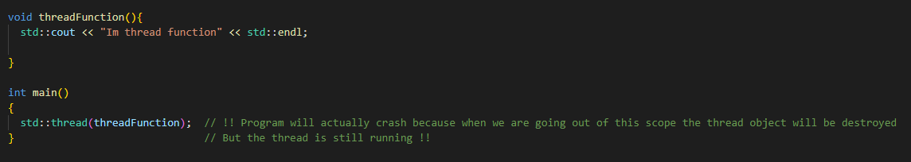 

## Launching

- We can launch a thread by creating an std::thread object
- The constructor will starts a new execution
- The parent thread will continue its own execution
- The constructor takes a callable object (entry point function)
- The execution thread will invoke this function
- The entry point function
  - Can be any callable object
  - Cannot be overloaded
  - Any return value is ignored

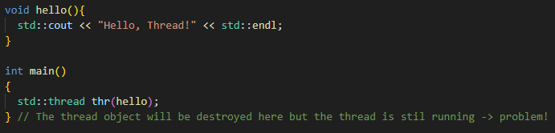

- As shown in the picture above We must be careful about thread termination
- We can also use functor as a thread entry point:

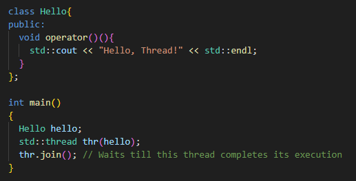

## Thread Termination

- If the parent thread completes its execution it will call destructor of the child thread
- But that can happen while the child is still running and that is a problem
- By default the destructor calls std::terminate() which will terminate all threads 
- We can avoid this by joining the threads

- **Join a thread**

  - std::thread has a join() member function
  - This is a "blocking" call
    - Does not return until the thread has completed execution
    - The parent has to stop and wait for the thread to complete
  - Prevents std::thread's destructor calling std::terminate()
  - The program can continue after the std::thread object is destroyed
    
  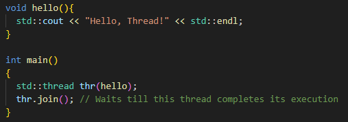

## Thread Function

- **Thread Function with Arguments**

  - We can pass arguments to the entry point function
  - We list them as extra arguments to the constructor

  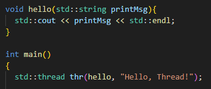

  - The std::thread object owns the arguments
    - lvalue arguments are passed by value
    - rvalue arguments are passed by move

  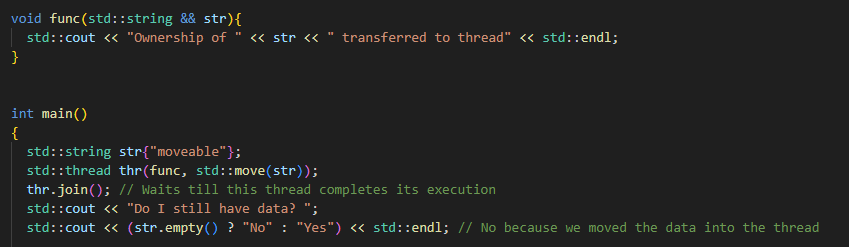

  - But we can pass argument by reference also with use of a reference wrapper
    - Wrap the argument in a call to std::ref()
    - Use std::cref() for constant reference
    - **Beware of dangling references!**

  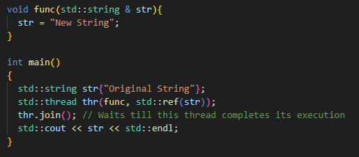

- **Member Function**

  - We can use a member function as the entry point
  - Requires an object of the class

  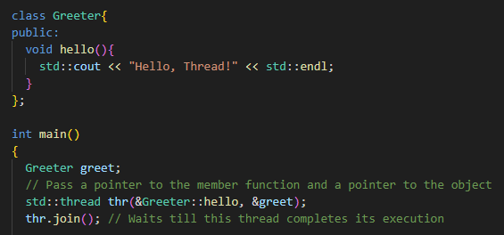

- **Lambda Function**

  - We can also use lambda function as the entry point:

  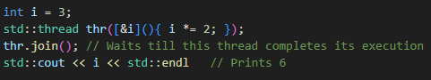

  - We can pass arguments as well:

  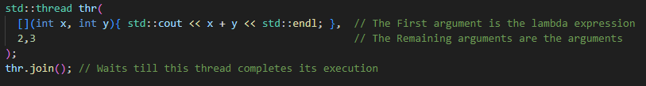

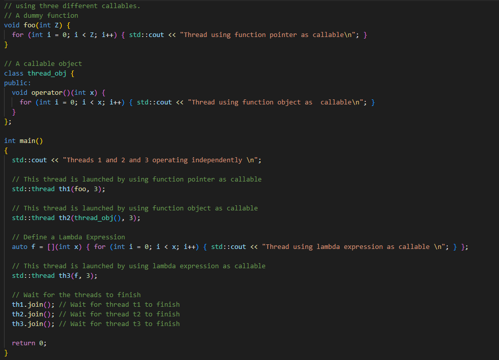

## Synchronization Issues

- Different threads execute on different cores
- They may share data
- This can cause synchronization issues
- Example of synchronization issue:
  - Core 1's thread modifies the shared data
  - Core 1 writes the new value to its store buffer
  - Core 2's thread wants to use the shared data
  - Core 2 pre-fetches the shared data or loads it from cache
  - Core 2 gets the old value
  - Core 2's thread does its computation using the old value
  - Core 1's store buffer writes the new value to cache
- Solution to this issue is to make sure Core 1 buffer will flush before Core 2 fetches the shared data

## System Thread Interface

- std::thread uses the system's thread implementation
- We may need to use the thread implementation directly
- Some functionality is not available in standard C++ like:
  - Thread Priority
    - Give a thread higher or lower share of processor time
  - Thread Affinity
    - Pin a thread on a specific processor core

- **native_handle()**

- Each execution thread has a "handle"
  - Used internally by the system's thread implementation
  - Needed when making calls into the implementation's API
  - Necessary when we want to perform operations that are not supported by the standard C++ thread interface and We need to directly use platform-specific or implementation-specific features.
- Returned by the native_handle() member function

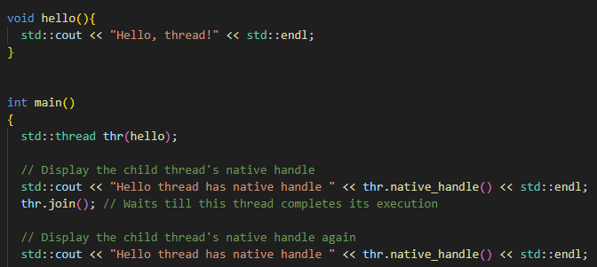

- **std::thread ID**

- Each execution thread has a thread identifier
- Guaranteed to be unique
  - Could be used to store std::thread objects in associative containers
  - A new thread may get the ID of an earlier thread which has completed

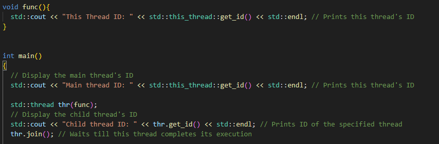

- **Pausing Threads**

- We can pause a thread or make it "sleep"
  - std::this_thread::sleep_for()
- Takes an argument of type std::chrono::duration
  - C++14 - std::this_thread::sleep_for(2s);
  - C++11 - std::this_thread::sleep_for(std::chrono::seconds(2));
- This also works with single threaded programs (Pauses main thread)

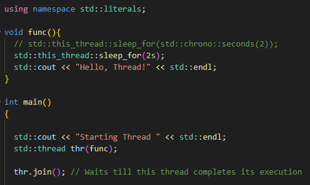

## std::thread Class

- Implemented using RAII
  - Similar to std::unique_ptr, std::fstream etc.
  - The constructor acquires a resource
  - The destructor releases the resource
- An std::thread object has ownership of an execution thread
  - Only one object can be bound to an execution thread at a time
- Move-only class 
  - std::thread objects can not be copied
- Move operations
  - Transfer ownership of the execution thread
  - The move-from object is no longer associated with an execution thread
- For passing std::thread object we must use 'move'

- When we need to return std::thread object, the compiler will automatically move it for us

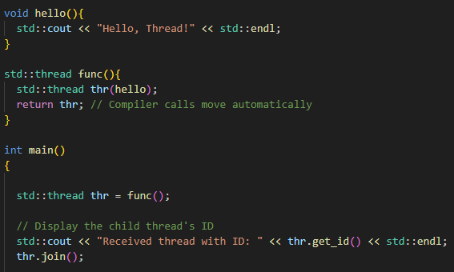

## Threads and Exceptions

- Each thread has its own execution stack
- This stack is "unwound" when the thread throws an exception
  - The destructor for all objects in scope are called
  - The program moves up the thread's stack until it finds a suitable handler
  - If no handler is found, the program is terminated
- Other threads in the program can not catch the exception
  - Including the parent thread and the main thread
- Exceptions can only be handled in the thread where they occur
  - Use try/catch block in the normal way

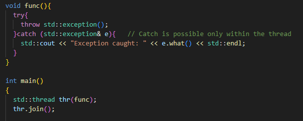

- If we do not handle exception within the thread where it is thrown, it will terminate all threads including main thread

- **Exception in Parent Thread**

  - The destructors are called for every object in scope
    - Including std::thread's destructor
    - This checks whether join() or detach() have been called
    - If neither, it calls std::terminate()
  - We must call either join() or detach() before the thread is destroyed
  - Possibe solution:
    
  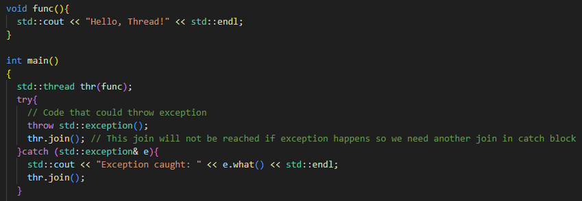

  - But the above solution is verbose and not very elegant
  - **RAII** solution:
    - Better solution is to use RAII idiom
    - Wrap the **std::thread** object inside a class
    - The class's destructor calls join() on the **std::thread** object  
  - An **std::thread** object can only be joined once
  - The **joinable()** member function
    - Returns false if **join()** or **detach()** have already been called
    - Or if the thread object is not associated with an execution thread
    - Returns true if we need to call **join()**

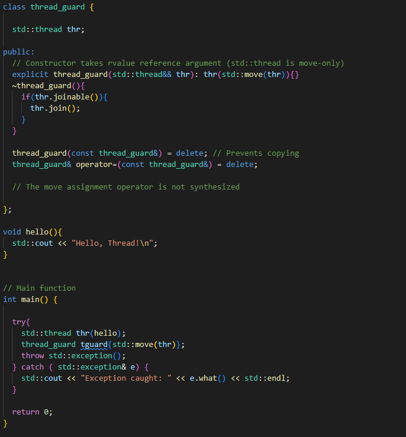

  - The thread_guard destructor is called first
  - If necessary it calls thr.join() and waits for the execution thread to finish
  - The thread_guard's **std::thread** member is then destroyed
  - It is not associated with an execution thread
  - Its destructor does not call **std::terminate()**

- **Stopping thread**
  - Execution threads can be interrupted or stopped (**Killed**, **Cancelled**, **Terminated**)
  - In general, abruptly terminating a thread is not a good idea
  - **std::thread** does not support this
    - The operating system can be used to stop the underlying execution thread

## Managing a Thread

- **Detaching a Thread**

  - Instead of calling join(), we can call detach()
    - The parent thread will continue executing
    - The child thread will run until it completes or the program terminates
    - Analogous to a "daemon" process
  - When an execution thread is detached:
    - The std::thread object is no longer associated with it
    - The destructor will not call std::terminate()

## Multiple Threads

- **std::thread** version:
  
  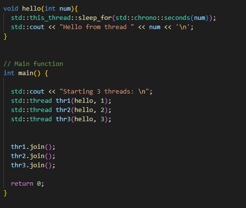

- **POSIX** version:
  
  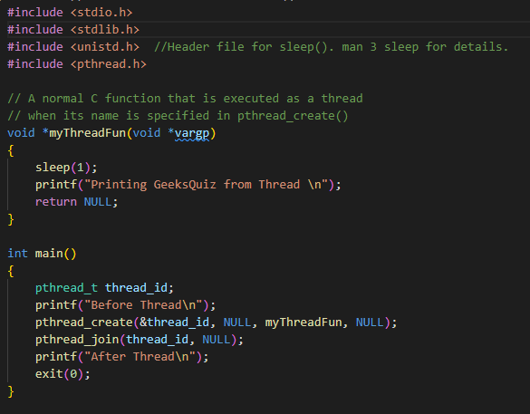

- **Data sharing between threads**
  - The threads in a program share the same memory space
    - It is very easy to share data between the threads
  - The only requirement is that the data is visible to the thread functions
    - Global or static variable, for global thread functions
    - Static class member for class member thread functions
    - Local variable captured by lambda expressions (by reference)
  - Threads interleave their execution
  - Threads can interfere with each other actions
  - Modifying shared data can cause data corruption
    - This is the main source of bugs in concurrent programs

- **Data Race**
  - Occurs when:
    - Two or more threads access the same memory location
    - And at least one of the threads modifies it
    - And the threads are not synchronized when they access the memory location
    - Potentially conflicting accesses to the same memory location
  - Only safe if the threads are synchronized
    - One thread accesses the memory location at a time
    - The other threads have to wait until it is safe for them to access it
    - In effect the thread execute sequentially while they access it
  - Data race causes undefined behavior
    - The program is not guaranteed to behave consistently

  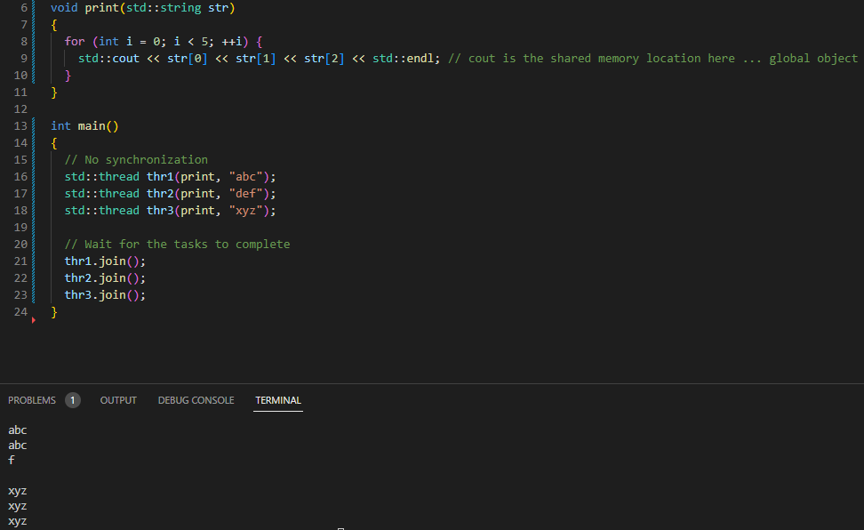

  - In the example above, the thread are interrupting each other
  - Threads can be interrupted during output
  - Other threads can run and write their output
  - The output from different threads is interleaved
  - The consequences od a data race however can be much more serious than just interleaved output
    - Incorrect results
    - Incorrect program flow
    - "Torn" writes and reads
    - Objects which are improperly constructed or destroyed

- **Race Condition**
  - The outcome is affected by timing changes
    - e.g. One client clears a database table
    - Another client inserts an entry into the same table
  - A data race is a special case of race condition
    - The outcome depends on when threads are scheduled to run
- **Memory Location**
  - In C++ "memory location" is a scalar object:
    - A build-in variable
    - A pointer
    - An element in a container
  - Or a scalar sub-object:
    - A struct or class member which is a scalar object
  - Also an obscure case:
    - A series of contiguous bitfields within the same word
    - Unless they contain a zero-length bitfield

- **Compound Objects**
  - C++ STL containers are memory locations
    - Multiple threads modifying the same object may conflict
    - Should be synchronized
  - For our own types we can choose the behavior
    - Classes can provide their own synchronization
    - Easier to work with
    - Calling a sequence of member functions may be problematic
    - Usually better to implement them as memory locations

## Thread Synchronization

  - Mechanism which ensures that two or more concurrent processes or threads do not simultaneously execute some particular program segment known as **critical section**
  - Processes access to critical section is controlled by using synchronization techniques
  - When one thread starts executing the critical section, the other thread should wait until the first thread finishes
  - If proper synchronization techniques are not applied, it may cause **race condition** where the value of variables may be unpredictable and vary depending on the timings of context switches
  - **Mutex**
    - Mutex is a lock that we set before using a shared resource and release after using it
    - When the lock is set, no other thread can access the locked region of code
    - So we see that even if thread 2 is scheduled while thread 1 was not done accessing the shared resource and the code is locked by thread 1 using mutexes then thread 2 can not even access that region of code
    - Mutex lock will only be released by the thread who locked it

  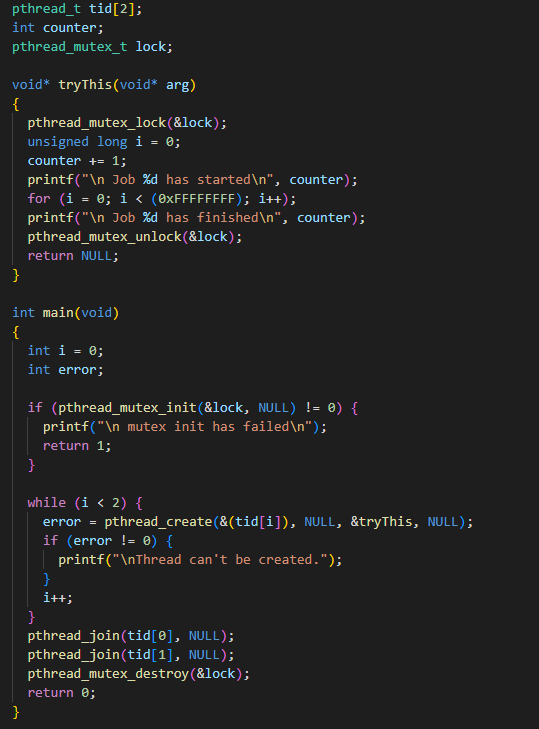

    - **Shared Mutex**
      - defined in <shared_mutex> header
      - It can be locked in two different ways
        - **Exclusive Lock**
          - No other thread may acquire lock
          - No other thread can enter a critical section
          - std::lock_guard<std::shared_mutex>
          - std::unique_lock<std::shared_mutex>
        - **Shared Lock**
          - Other threads may acquire a shared lock
          - They can execute critical sections concurrently  
          - std::shared_lock<std::shared_mutex>
          - Thread which has a shared lock can enter a critical section

  - **lock_guard**
    - Mutex wrapper that provides RAII style mechanism

  - **std::future**
    - used for asynchronous computations

  - **Conditional Variable**

    - They are defined in [\<condition_variable\>](https://en.cppreference.com/w/cpp/thread/condition_variable) header
    - **wait()**
      - Takes an argument of type **std::unique_lock**
      - It unlocks its argument and blocks the thread until a notification is received
    - **wait_for()** and **wait_until()**
      - Re-lock their argument if a notification is not received in time
    - **notify_one()**
      - Wake up one of the waiting threads
      - The scheduler decides which thread is woken up
    - **notify_all()**
      - Wake up the waiting threads

    - Thread A tells the condition variable it is waiting
    - Thread B notifies the condition variable when it updates the string
    - The condition variable wakes thread A up
    - Thread A then uses the string
    
    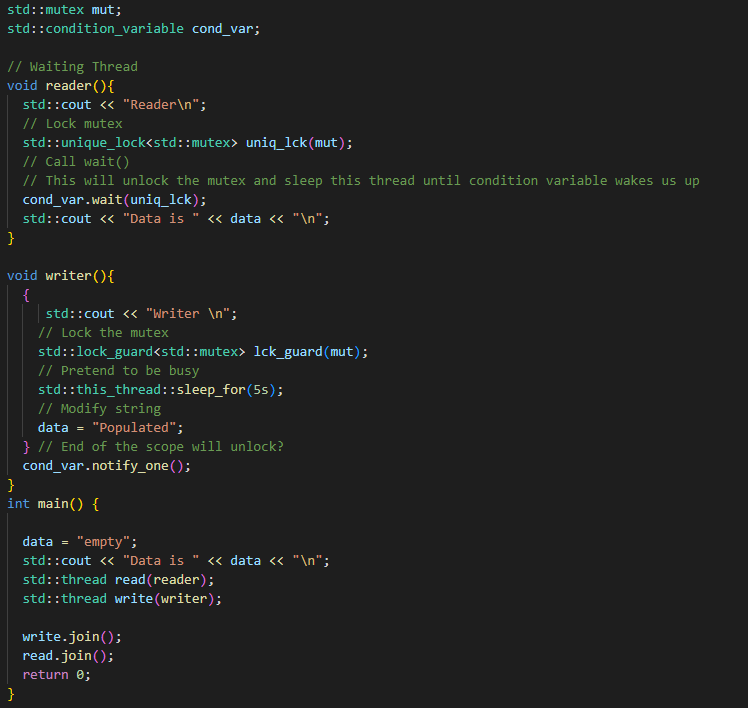

  - **Atomic Types**

    - **Atomic Operations**
      - Operations on atomic types are performed as a single, indivisible step. 
      - This means that no other thread can see an intermediate state or interfere with the operation. 
      - Common operations include reading (load), writing (store), and atomic modifications such as increment, decrement, or bitwise operations.
    - **Memory Order**
      -  Atomics in C++ also involve memory ordering semantics, which dictate the visibility of memory operations across threads. 
      -  There are several memory order options ranging from memory_order_relaxed (least strict, only guarantees atomicity) to memory_order_seq_cst (most strict, full sequential consistency).

    - **std::atomic Template**
      - The std::atomic template can be instantiated with any TriviallyCopyable type that is also CopyConstructible and CopyAssignable. This includes most built-in types like int, float, pointer types, and user-defined types meeting these criteria.
    - **Lock-Free Property** 
      - Atomic types are usually implemented in a way that does not require locking. 
      - They're often implemented using machine-specific instructions that are more efficient than locks. 
      - However, not all atomic types are guaranteed to be lock-free. 
      - You can check if an instance of std::atomic is lock-free using its is_lock_free() member function.

    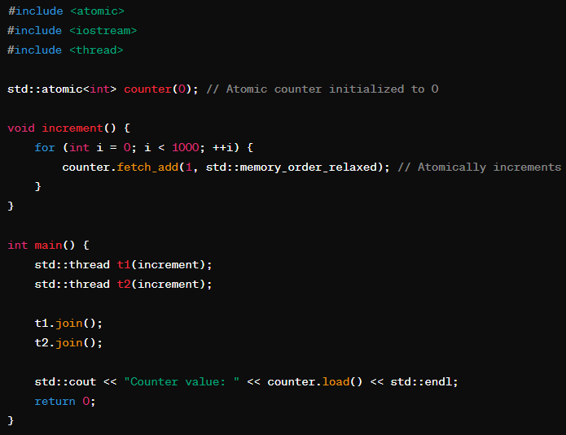

## Deadlock

- Thread is deadlocked when it can not run
- Often used to refer to **mutual deadlock**
  - Two or more threads are waiting for each other
  - Thread A waits for thread B to do something
  - Thread B is waiting for A to do something
  - The classic example involves waiting for mutexes

  - Thread A locks mutex 1
  - Thread B lock mutex 2
  - Thread A wait to lock mutex 2
  - Thread B wait to lock mutex 1

  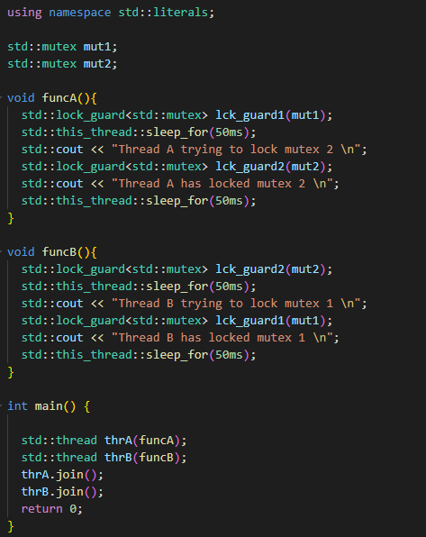

  - Can also occur when waiting for:
    - The result of computation performed by another thread
    - A message sent by another thread
    - A GUI event produced by another thread
  - The second most common problem in multi-threading code 

- **Avoidance**
  - Both threads try to acquire locks in the same order
    - The successful thread then tries to lock mutex2
  - Lock multiple mutexes in a single operation
  - C++ provides library for this
    - **std::scoped_lock  (C++17)**
      - Very similar to std::lock_guard except it cna lock more than one mutex at the same time: std::scoped_lock scope_lck(mut1,mut2,...);
      - The mutexes are locked in the order given in the constructor call
    - **std::try_lock**
      - Also locks multiple mutexes in single operation: std::try_lock(uniq_lk1, uniq_lk2);
      - Returns Immediately if it cannot obtain all the locks
        - On failure it returns index of the object that failed to lock
        - On success it returns -1

## Livelock

- A program can not make progress
  - In Deadlock the thread are inactive
  - In Livelock the threads are still active
- Livelock can result from badly done deadlock avoidance
  - A thread cannot get lock
  - Instead of blocking indefinitely it backs off and tries again

## Asynchronous processing

- C++ provides several ways to implement asynchronous programming:

- std::async: This function runs a function asynchronously (potentially in a new thread) and returns a std::future that will eventually hold the result of that function.
- std::thread: You can manually create threads using std::thread. Each thread can execute tasks concurrently.
- Thread Pools: Libraries like Boost.Asio or Intel’s Threading Building Blocks (TBB) provide more sophisticated ways to handle asynchronous tasks, including thread pools.
- Callbacks, Promises, and Futures: These are mechanisms to handle the results of asynchronous operations, allowing a non-blocking design in your application.

## Thread Pool

- A design pattern used in concurrent programming to manage a collection of reusable threads
- These threads can be used to perform a variety of tasks providing an efficient way of managing resources, especially in high-load scenarios
- Using thread pool helps minimize the overhead associated with thread creation and destruction, especially in applications that require the execution of large number of short lived tasks

## Volatile

int some_int = 100;

while(some_int == 100)
{
   // our code
}

- When this program gets compiled, the compiler may optimize this code, if it finds that the program never ever makes any attempt to change the value of some_int
- So it may be tempted to optimize the while loop by changing it from while(some_int == 100) to something which is equivalent to while(true) so that the execution
could be fast (since the condition in while loop appears to be true always). 
- However, sometimes, optimization (of some parts of your program) may be undesirable, because it may be that someone else is changing the value of some_int from outside the program which compiler is not aware of, since it can't see it, but it's how you've designed it. 
- In that case, compiler's optimization would not produce the desired result!
- So, to ensure the desired result, we need to somehow stop the compiler from optimizing the while loop. 
- That is where the volatile keyword plays its role:
  - **volatile int some_int = 100;**

## Lazy Initialization

- It means that we declare variable but we initialize later just before we need it
- Common Pattern in functional programming
- A variable is only initialized when it is first used
- This is useful when the variable is expensive to construct
- Can be used in multi-threaded code
  - But we need to avoid data races

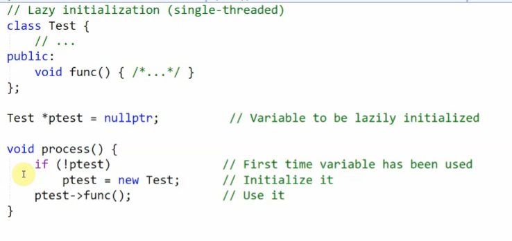

- but the code above is not thread safe

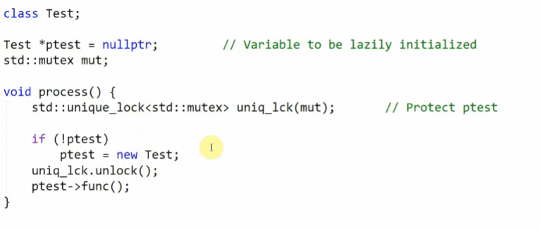