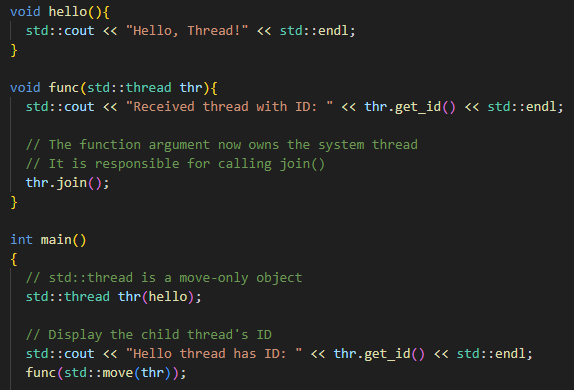

# MultiThreading

- Some classes here are move-only to support RAII (Resource Acquisition Is Initialization) idiom
  - Object acquires ownership in the constructor
  - Object releases ownership in the destructor
  - The resource instance can be moved from one object to another

## Concurrency

- Performing two ore more activities at the same time
- For example if there is some long task and we want to see feedback during the processing of that task (For example Download progress)

### Hardware Concurrency

- Modern computers have multiple processors
- Different processors can perform different activities at the same time (Even within the same program)
- They are known as "hardware threads"
- Each processor follows its own thread of execution through the code

### Software Concurrency

- Modern operating systems support "software threading"
- A program can perform multiple activities at the same time
  - These activities are managed by the operating system
- Typically there are more software thread than hardware threads

## Launching

- We can launch a thread by creating an std::thread object
- The constructor will starts a new execution
- The parent thread will continue its own execution
- The constructor takes a callable object (entry point function)
- The execution thread will invoke this function
- The entry point function
  - Can be any callable object
  - Cannot be overloaded
  - Any return value is ignored

- As shown in the picture above We must be careful about thread termination
- We can also use functor as a thread entry point:

## Thread Termination

- If the parent thread completes its execution it will call destructor of the child thread
- But that can happen while the child is stil running and that is a problem
- By default the destructor calls std::terminate() which will terminate all threads 
- We can avoid this by joining the threads

### Join a thread

- std::thread has a join() member function
- This is a "blocking" call
  - Does not return until the thread has completed execution
  - The parent has to stop and wait for the thread to complete
- Prevents std::thread's destructor calling std::terminate()
- The program can continue after the std::thread object is destroyed
  

## Thread Function

### Thread Function with Arguments

- We can pass arguments to the entry point function
- We list them as extra arguments to the constructor

- The std::thread object owns the arguments
  - lvalue arguments are passed by value
  - rvalue arguments are passed by move

- But we can pass argument by reference also with use of a reference wrapper
  - Wrap the argument in a call to std::ref()
  - Use std::cref() for constant reference
  - **Beware of dangling references!**

### Member Function

- We can use a member function as the entry point
- Requires an object of the class

### Lambda Function

- We can also use lambda function as the entry point:

- We can pass arguments as well:

## Synchronization Issues

- Different threads execute on different cores
- They may share data
- This can cause synchronization issues
- Example of synchronization issue:
  - Core 1's thread modifies the shared data
  - Core 1 writes the new value to its store buffer
  - Core 2's thread wants to use the shared data
  - Core 2 pre-fetches the shared data or loads it from cache
  - Core 2 gets the old value
  - Core 2's thread does its computation using the old value
  - Core 1's store buffer writes the new value to cache
- Solution to this issue is to make sure Core 1 buffer will flush before Core 2 fetches the shared data

## System Thread Interface

- std::thread uses the system's thread implementation
- We may need to use the thread implementation directly
- Some funcionality is not available in standard C++ like:
  - Thread Priority
    - Give a thread higher or lower share of processor time
  - Thread Affinity
    - Pin a thread on a specific processor core

### native_handle()

- Each execution thread has a "handle"
  - Used internally by the system's thread implementation
  - Needed when making calls into the implementation's API
  - Necessary when we want to perform operations that are not supported by the standard C++ thread interface and We need to directly use platform-specific or implementation-specific features.
- Returned by the native_handle() member function

### std::thread ID

- Each execution thread has a thread identifier
- Guaranteed to be unique
  - Could be used to store std::thread objects in associative containers
  - A new thread may get the ID of an earlier thread which has completed

### Pausing Threads

- We can pause a thread or make it "sleep"
  - std::this_thread::sleep_for()
- Takes an argument of type std::chrono::duration
  - C++14 - std::this_thread::sleep_for(2s);
  - C++11 - std::this_thread::sleep_for(std::chrono::seconds(2));
- This also works with single threaded programs (Pauses main thread)

## std::thread Class

- Implemented using RAII
  - Similar to std::unique_ptr, std::fstream etc.
  - The constructor acquires a resource
  - The destructor releases the resource
- An std::thread object has ownership of an execution thread
  - Only one object can be bound to an execution thread at a time
- Move-only class 
  - std::thread objects can not be copied
- Move operations
  - Transfer ownership of the execution thread
  - The move-from object is no longer associated with an execution thread
- For passing std::thread object we must use 'move'

- When we need to return std::thread object, the compiler will automatically move it for us

## Threads and Exceptions

- Each thread has its own execution stack
- This stack is "unwound" when the thread thows an exception
  - The destructor for all objects in scope are called
  - The program moves up the thread's stack until it finds a suitable handler
  - If no handler is found, the program is terminated
- Other threads in the program can not catch the exception
  - Including the parent thread and the main thread
- Exceptions can only be handled in the thread where they occur
  - Use try/catch block in the normal way

- If we do not handle exception within the thread where it is thrown, it will terminate all threads including main thread

### Exception in Parent Thread

- The destructors are called for every object in scope
  - Including std::thread's destructor
  - This checks whether join() or detach() have been called
  - If neither, it calls std::terminate()
- We must call either join() or detach() before the thread is destroyed
- Possibe solution:
  

- But the above solution is verbose and not very elegant
- **RAII** solution:
  - Better solution is to use RAII idiom
  - Wrap the std::thread  

## Managing a Thread

### Detaching a Thread

- Instead of calling join(), we can call detach()
  - The parent thread will continue executing
  - The child thread will run until it completes or the program terminates
  - Analoguos to a "daemon" process
- When an execution thread is detached:
  - The std::thread object is no longer associated with it
  - The destructor will not call std::terminate()

