# MultiThreading

- **Introduction**

  - Some classes here are move-only to support RAII (Resource Acquisition Is Initialization) idiom
    - Object acquires ownership in the constructor
    - Object releases ownership in the destructor
    - The resource instance can be moved from one object to another

  - Each thread has its own entry point function
    - When the thread starts, it executes the code in this function
    - When the function returns the thread ends
    - The main thread continues to execute its own code
    - It does not wait for the other threads, unless we explicitly tell it to

  - **Thread**
    - Single sequence stream within a process
    - Software thread
    - For example an object of the C++ std::thread class
    - Because threads have some of the properties of processes, they are sometimes called lightweight process

  - **Thread vs Process**
    - Threads are not independent of one other like processes
    - As a result thread shares with other threads their code section, data section and OS resources like open files and signals
    - But like processes thread has its own program counter, register set and stack space

  - **Task**
    - Higher level abstraction
    - Some work that should be performed concurrently

  - **Why MultiThreading?**
    - To improve application through parallelism
    - Thread creation is much faster
    - Context switching between thread is much faster
    - Threads can be terminated easily
    - Communication between threads is faster

  - Multithreading is not supported by the C language standard -> **POSIX Threads** (**Pthreads**) has to be used in C.
  - In C++11+ we have **std::thread**

## Asynchronous Processing

- C++ provides several ways to implement asynchronous programming:

- std::async: This function runs a function asynchronously (potentially in a new thread) and returns a std::future that will eventually hold the result of that function.
- std::thread: You can manually create threads using std::thread. Each thread can execute tasks concurrently.
- Thread Pools: Libraries like Boost.Asio or Intel’s Threading Building Blocks (TBB) provide more sophisticated ways to handle asynchronous tasks, including thread pools.
- Callbacks, Promises, and Futures: These are mechanisms to handle the results of asynchronous operations, allowing a non-blocking design in your application.

## Asynchronous Programming

- **Synchronous** - Wait for each task to complete
- **Asynchronous** - Continue without waiting for tasks to complete
  - Tasks starts another task, the current task can continue
  - The new task runs in the background
- **Advantages**
  - The current task can do other work (if it does not require the data)
  - The current task only blocks when it needs the data
  - This maintains throughput and user satisfaction

- **Blocking and Multi-Threading Programs**
  - Blocking is undesirable in threaded programs
    - Blocking reduces throughput and responsiveness of the blocked thread
    - Any threads which join with this thread will also be blocked
  - Particularly in a critical section
    - Any threads which are waiting to enter the critical section are also blocked
    - Possibility of deadlock if we are using locks
  - Using asynchronous programming reduces the need to block but may not avoid it completely

- **Blocking Synchronization**
  - Blocking operations
  - Synchronized by mutexes - Thread is blocked until another thread unlocks the mutex
  - Atomic Operations - Thread is blocked until another thread completes an atomic operation 

- **Non-Blocking Synchronization**
  - Non-Blocking operations
  - Synchronized by message queues
    - A thread pushes a message onto a concurrent queue
    - Another thread takes the message of the queue and processes it
    - The first thread continues running without waiting
  - The message often consist of callable objects
    - The message is processed by invoking the callable object
  - C++ does not have a standard concurrent queue
    - Available in Boost, Microsoft PPL, Intel TBB

- Asynchronous programming can be used to perform parallel operations
  - Start new threads which all perform the same task
  - Collect the result from each thread as it completes its task
  - Combine the results into the final answer
- It can also be used in single-threaded programs
  - Using operating system features 

- **std::packaged_task** 
  
  - Defined in \<[future](https://en.cppreference.com/w/cpp/thread/future)\>
  - Encapsulates a task
    - A callable object for task's code
    - An **std::promise** for the result of the task
  - Provides a higher level of abstraction
  - Template class 
    - The parameter is the callable object signature: std::packaged_task<int(int,int)> ptask(...);
  - The constructor takes the callable object as argument
  - Also functor class -> operator() overloaded
    - Invokes the calable object
    - Stores the return value in the promise object
  - **get_future()** - returns std::future object associated with the promise
  - **std::pacaged_task** is a move-only class
  - **Usage:**
    - Pass a callable object to the constructor
    - The packaged task start when operator() is called
      - In the same thread by calling it directly
      - In a new thread, by passing the task to std::thread constructor
    - We call **get_future()**
    - We call **get()** on the returned future object or **wait()** and friends

  - Synchronous example:

    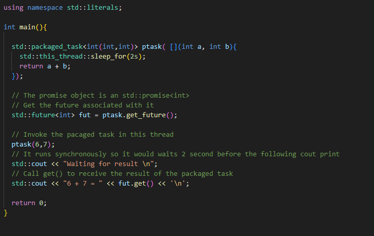

  - Asynchronous example:

    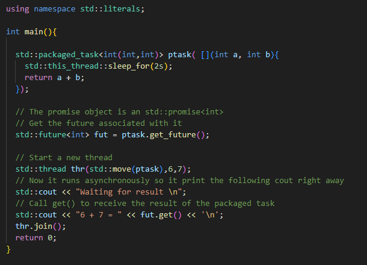

  - Avoids boilerplate code -> cleaner and simple code 
  - **Applications:**  
    - Create a container of packaged_task objects
      - Threads do not start up until we are ready for them
    - Useful for managing threads
      - Each task can be run on a specified thread
      - Thread scheduler runs threads in a certain order
      - Thread pool consists of threads waiting for work to arrive

- **std::async()** 
  
  - Defined in \<[future](https://en.cppreference.com/w/cpp/thread/future)\>
  - Higher-level abstraction than **std::thread**
    - We can execute a task with **std::async()** which uns in the background
    - This allows us to do other work while the task is running
    - Alternatively, it can run synchronously in the same thread
  - Similar syntax to **std::thread** constructor
    - The task function is the first argument
    - Followed by the arguments to the task function

  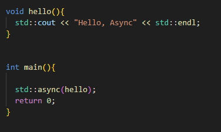

  - **std::async()** returns an **std::future** object that contains the resut of the task
  - We can call get() on the future or wait() and friend
  - This can be in a different thread from the call to **std::async()**

    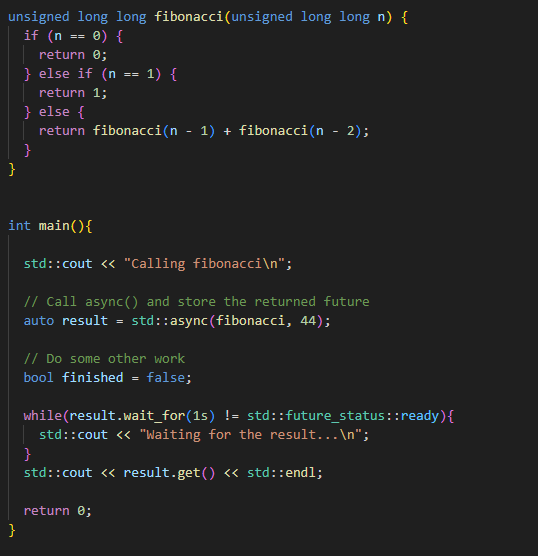

  - **Exceptions**

    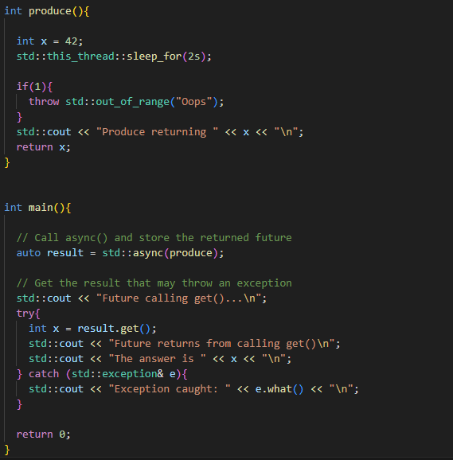 

  - **Launch Options**
    - **std::async()** may start a new thread for the task or it may run the task in the same thread
    - Controlled by the "launch flag" (Optional argument to **std::async()**)
    - **std::lauch::async**
      - A new thread is started for the task
      - The task is executed as soon as the thread starts
    - **std::launch::deferred**
      - Nothing happens until **get()** is called on the returned future
      - The task is then executed("lazy evaulation")
    - **Default: Both Flags Are Set**
      - The implementation decidec whether to start a new thread
      - Lack of certainty
        - The task could execute synchronously or concurrently with the initiating thread
        - It could execute concurrently with the thread that calls **get()**
        - If **get()** is not called, the task may not execute at all
      - Thread-local storage (**TLS**) - We do not know which thread's data will be used

    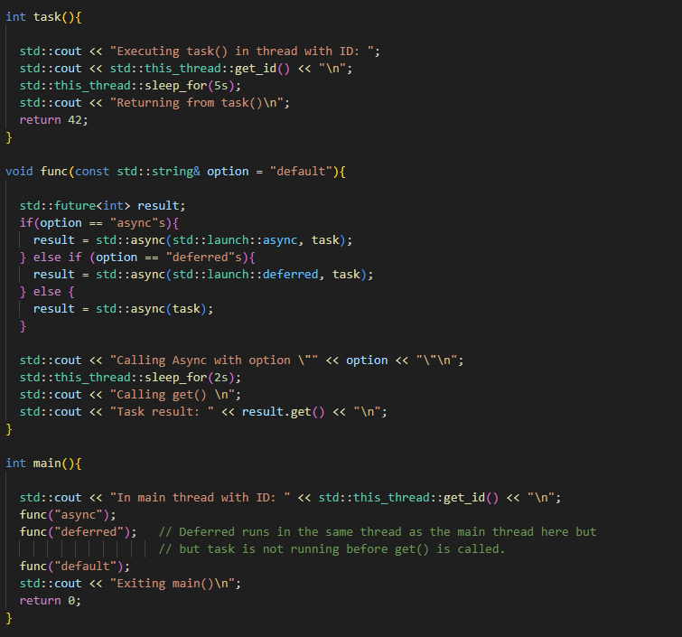

    - **Launch Policy Recommendations**
      - Use the **async** launch option if any of these are true:
        - The task must execute in separate thread
        - The task must start immediately
        - The task will use thread-local storage
        - The task function must be executed even if get() is not called
        - The thread receiving the future will call **wait_for()** pr **wait_until()**
      - Use the **deferred** launch option if
        - The task must run in the thread which calls **get()**
        - The task must be executed, even if no more threads can be created
        - You want lazy execution of the task
      - Otherwise, let the implementation choose with the **default** launch option

  - **wait()** - Returns nothing
  - **wait_for()** and **wait_until()** 
    - Returns **std::future_status::ready** if the result is available
    - Returns **std::future_status::timeout** if the time out has expired
    - Returns **std::future_status::deferred** if the result is being lazily evaluated
  - In lazy evaluation, the task does not run until **get()** is called

- **Choosing a Thread Object**
  - We now havethree different ways to execute a task
    - Create an **std::thread** object
    - Create an **std::packaged_task** object
    - Call **std::async()**
  
  - **Pros of std::async()**
    - The simplest way to execute a task
    - Easy to obtain the return value or to catch any exception thrown in the task
    - Choice of running the task sync or async
    - Higher level abstraction than **std::thread**
    - The library manages the threads and the inter-thread communication for the programmer
    - No need to use shared data
  - **Cons of std::async()**
    - Can not detach tasks
    - A task executed with **std::launch::async** is implicitly joined -> we can not leave the scope before the task is completed
    - The returned future's destructor will block until the task completes

      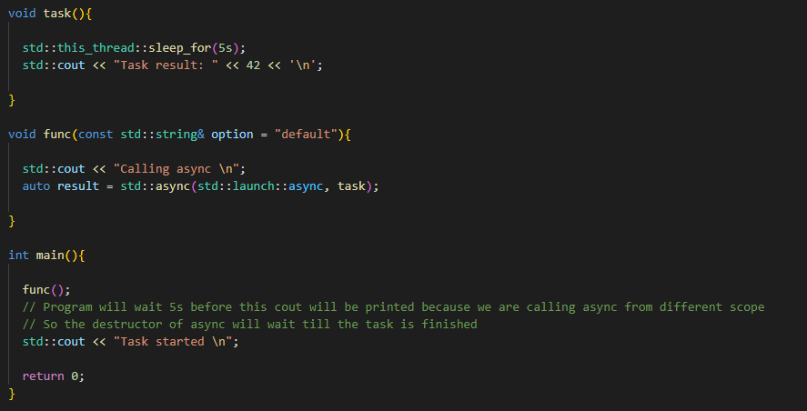

  - **Pros of std::packaged_task**
    - The best choice if we want to represent tasks as objects -> To create a container of tasks
    - A lower-level abstraction than **std::async()**
    - Can control when a task is executed
    - Can control on which thread it is executed

  - **Pros of std::thread**
    - The most flexible
    - Allows access to the underlying software thread
    - Useful for features not supported by standard C++
    - Can be detached
  
  - **Recommendations**
    - For starting new thread in general -> Use **std::async()**
    - For containers of thread objects -> Use **std::packaged_task**
    - For starting detachable thread or for more specialized requirements -> Use **std::thread** 

- **C++ asynchronous limitations**
  - Lacks a number of important features
    - Continuations - "Do this task, then do that task"
    - Only supports waiting on one future at a time
    - Waiting on multiple threads has to be done sequentially
    - Concurrent queue missing
  - But we can use **3rd Party Libraries**
    - Microsoft Parallel Patterns Library
    - Apple Grand Central Dispatch
    - Intel oneAPI Thread Building Blocks
    - HPX

## Atomic Types

- **Integer Operations**
  
  - Integer Operations are usually a single instruction
    - Provided the data is correctly aligned and fits into a single word
  - Thread can not be interrupted while performing integer operations
  - Do we still need to lock a shared integer?

      
  
  - In the example above the result should be 1'000'000 but it is much less. Why when integer operation can not be interrupted?
    - The **++** operation is a single instruction but **++counter** involves three operations:
      - Pre-fetch the value of count from L1 cache
      - Increment the value in the processor core register
      - Publish the new value of count into the L1 cache
    - The thread could use an outdated value in its calculation or publish its result after a thread which ran later

    

    - We need to make sure that
      - Thread B uses the latest value for counter
      - Thread A publishes its result immediately
    - A mutex does this internally when we call **lock()** and **unlock()**
    
     

    - Here, we can do this by declaring counter as **atomic**
  
  - **Atomic Keyword**

    - The compiler will generate special instructions which
      - Disable pre-fetch for counter
      - Flush the store buffer immediately after doing the increment
    - This also avoids some other problems
      - Hardware optimizations which change the instruction order
      - Compiler optimizations which change the instruction order
    - The result is that only one thread can access counter at a time
    - This prevents data race but it also makes the operation take much longer

  

- **Atomic Types**

  - All operations on the variable will be atomic
  - C++11 defines an atomic template
    - In the [\<atomic\>](https://en.cppreference.com/w/cpp/header/atomic) header
    - The parameter is the type of the object
    - The parameter must be a type which is "trivially copyable"
      - Scalar Type
      - Class where all the copy and move constructors are trivial
    - Normally only integer types and pointers are used
    - For more complex types, locks may be silently added
      - Locking a mutex takes longer
      - **To avoid this**, use a pointer to the type
    - The object must be initialized: **std::atomic\<int\> x = 0;**
  - We can assign to and from the object
  - These are two distinct atomic operations -> Other threads could interleave between them
  - Operations such as **++** are atomic
    - Fetch old value
    - Increment
    - Store new value

    

  - In high performing codes we prefer atomic to mutexes because it is faster

  - **Double-Checked Locking**

    - One solution is to make the initialized object atomic
    - Atomic types do not support the "." or "->" operators
    - We must copy to a non-atomic pointer before we can use it:

      - std::atomic\<Test*\> ptest = nullptr;
      - Test *ptr = ptest;
      - ptr->func();

  - **Atomic Pointer**

    - If we are initializing some potentially big class we want to do it only once
    - But doing it with mutex could be problematic:
    - 
      - This statement represents 3 separate operation (allocates memory, initializes it, stores address of the memory to this variable)    
      - But the compiler is allowed to switch the order of the operations so it is possible it allocates memory, then stores address and then initializes it ->
      - This means if another thread will check between storing address and initializing it, it can access this allocated memory with garbage values 
      - We can have static variable instead of pointer but it could also be solved with **std::atomic\<Test*\> ptest**

      

- **Volatile Keyword**

  - May change without explicit modification
    - Prevents some compiler optimizations
    - Typically used when accessing hardware
  - Often mistakenly used in threading
    - Some programmers expect the Java/C# behavior
    - Has no impact on thread safety
  
    

- **Atomic Operations**

  - **Member Functions for Atomic Types**
    - **store()** - Atomically replace the object value with its argument
    - **load()** - Atomically return the object value
    - **operator =()**, **operator T()** - Synonyms for **store()** and **load()**
    - **exchange** - Atomically replace the object value with its argument and returns the previous value
  - Atomic pointers support pointer arithmetic:
    - **fetch_add()** synonym for **x++**
    - **fetch_sub()** synonym for **x--**
    - **-=** and **+=** operators
  - Integer specializations have these as well and also:
    - Atomic bitwise logical operations **&, |, ^**

  

- **std::atomic_flag**
  - Boolean atomic type that has less overhead than **std::atomic<bool>**
  - It has only 3 operations:
    - **clear()** sets flag to false
    - **test_and_set()** sets flag to true and returns previous value
    - **operator=()**
  - Must be initialized to false - atomic_flag lock = ATOMIC_FLAG_INIT;

- **Spin Lock**
  - An alternative to locking a mutex or using a condition variable
  - Spin lock is essentially an infinite loop
    - It keeps "spinning" until a condition becomes true
  - We can use **std::atomic_flag** to implement a basic spin lock
    - The loop condition is the value of the flag
    - Each thread calls **test_and_set() in a loop
    - If it returns true - Some other thread has set the flag and is in the critical section -> iterate again
    - If it returns false - This thread has set the flag -> exit the loop and proceed into the critical section
    - After the critical section set the flag to false

    

  - **Pros**
    - A spinning thread remains active (A mutex may block the thread)
    - It can continue immediately when it gets the lock (With mutex, the thread may need to be reloaded or woken up)
      
  - **Cons**
    - Processor-intensive
    - Only suitable for protecting very short critical sections
    - And/or very low contention
    - Performance can be heavily impacted if spinning threads interrupt each other
    - Usually only used in operating systems and libraries 
  
  - Often used to implement **std::mutex**

## Clocks

- **std::chrono**
  - **chrono::system_clock**
    - Gets time from operating system
    - May change unpredictably
    - We can use it for time points
  - **chrono::steady_clock**
    - Always increases steadily
    - We can use it for measuring intervals
  - 

- **try_lock_for()** and **try_lock_until()** may return later than requested due to scheduling issues but they will never return too early

## Concurrency

- Performing two ore more activities at the same time
- For example if there is some long task and we want to see feedback during the processing of that task (For example Download progress)

- **Hardware Concurrency**

  - Modern computers have multiple processors
  - Different processors can perform different activities at the same time (Even within the same program)
  - They are known as "hardware threads"
  - Each processor follows its own thread of execution through the code

- **Software Concurrency**

  - Modern operating systems support "software threading"
  - A program can perform multiple activities at the same time
    - These activities are managed by the operating system
  - Typically there are more software thread than hardware threads

## Code Execution

- Modern computers support four different ways:
  - **Sequential**
    - A single instruction processes one data item
    
  - **Vectorized**
    - A single instruction processes several data items
    - Requires suitable data structure and hardware support
    - All the element must be contiguous (no gap in memory)
  - **Parallelized**
    - Several instructions each process one data item at the same time
    - Requires suitable algorithm
  - **Parallelized + Vectorized**
    - Several instructions each process several data items at the same time
    - Requires suitable algorithm, data structure and hardware support
  
- **Execution Policy Objects**
  - Global objects in \<[execution](https://en.cppreference.com/w/cpp/header/execution)\>  C++17
    - In the **std::execution** namespace
  - We can pass a policy object as an optional first argument:  

    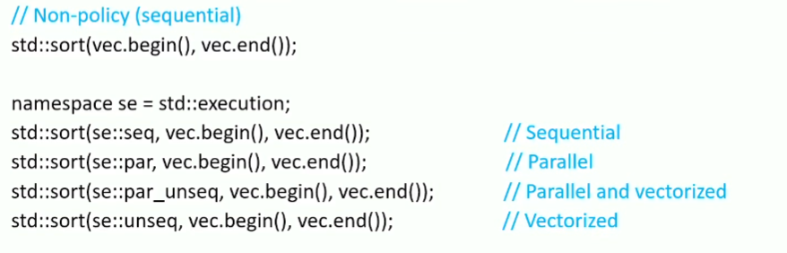

  - **Sequential C++17 Execution Object**
    - All operations are performed on single thread (The thread which calls the algorithm)
    - Operations will not be interleaved
    - May not necessarily be executed in a specific order

    

  - **Parallel C++17 Execution Object**
    - Operations performed in parallel across a number of threads
    - May include the thread which calls the algorithm
    - **Guarantees**
      - An operation will run on the same thread for its entire duration
      - Operations performed on the same thread will not be interleaved
      - But may not necessarily be executed in a specific order
    - **Cautions**
      - Operations performed on different threads may interleave
      - The programmer must prevent data races
      - Parallel Execution with Data Race:

      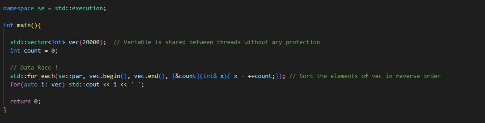

  - **Unsequenced C++20 Execution Object**
    - Operations are performed on a single thread (thread which calls the algorithm)
    - **Guarantees**
      - Operations will not be interleaved
    - **Cautions**
      - Operations may not necessarily be executed in a specific order
      - The programmer must avoid any modification of shared state between elements or between threads
      - Memory allocation and deallocation
      - Mutexes, locks and other forms of synchronization

    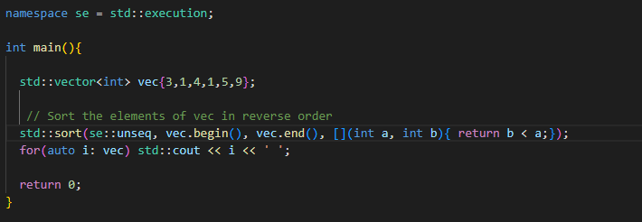

  - **Parallel Unsequenced Execution**
    - Operations performed in parallel across a number of threads
    - **Cautions**
      - Operations performed on the same thread may be interleaved
      - They may not necessarily be executed in a specific order
      - An operation may be migrated from one thread to another
      - The programmer must avoid data races
      - The programmer must avoid any modification of shared state between elements or between threads

    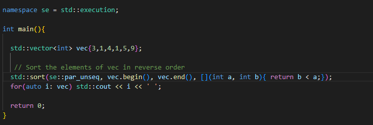

- **Algorithms and Execution Policies**
  - Most functions in \<[algorithm](https://en.cppreference.com/w/cpp/algorithm)\> were respecified in C++17
    - An optional argument for the execution police was added
  - Some algorithms are naturally sequential -> these were left unchanged
    - e.g. **equal_range()**
  - Some algorithms in \<[numeric](https://en.cppreference.com/w/cpp/numeric)\> now have two versions:
    - The C++14 version
    - A new version with policy support
    - The new versions have new names:
      - **accumulate()** -> **reduce()**
      - **partial_sum()** -> **inclusive_scan()**, **exclusive_scan()**
    - There is also a new fused algorithm with policy support:
      - **transform()** + **inner_product()** -> **transform_reduce()**
  
- **When to use Parallel Algorithms**

  - **Cons**
    - May not have any effect
      - Not supported on some compilers
      - Not fully implemented on all compilers
      - May fall back to non-policy version
    - Extra overhead
      - The algorithm may start up new threads
      - The algorithm must manage these threads
  - Do not use an execution police if:
    - Your code has to be portable to other compilers
    - The task ise essentially sequential
    - Operation order is important
    - The algorithm call throws exceptions (Unless immediate termination is acceptable)
    - Preventing data races cots more than not using the execution policy
  - Consider using an execution policy if:
    - Measurement shows a worthwhile improvement in performance
    - It can be done safely and correctly

- **Which Execution Policy**
  - **Sequenced** execution is mainly used for debugging
    - Same as non-policy, but allows out of order execution and terminates on exceptions
  - **Parallel unsequenced** execution
    - Has the most potential to improve performance
    - Also has the strictest requirement
    - Use when data races can not occur
    - Use when Code does not modify shared state
  - **Parallel** execution
    - Use when vectorization is not safe
    - Data races can not occur but code modifies shared state
  - **Unsequenced** execution
    - Can be used with single threading
    - If code does not modify shared state

## Deadlock

- Thread is deadlocked when it can not run
- Often used to refer to **mutual deadlock**
  - Two or more threads are waiting for each other
  - Thread A waits for thread B to do something
  - Thread B is waiting for A to do something
  - The classic example involves waiting for mutexes

  - Thread A locks mutex 1
  - Thread B lock mutex 2
  - Thread A wait to lock mutex 2
  - Thread B wait to lock mutex 1

  

  - Can also occur when waiting for:
    - The result of computation performed by another thread
    - A message sent by another thread
    - A GUI event produced by another thread
  - The second most common problem in multi-threading code 

- **Avoidance**
  - Both threads try to acquire locks in the same order
    - The successful thread then tries to lock mutex2
  - Lock multiple mutexes in a single operation
  - C++ provides library for this
    - **std::scoped_lock  (C++17)**
      - Very similar to std::lock_guard except it can lock more than one mutex at the same time: std::scoped_lock scope_lck(mut1,mut2,...);
      - The mutexes are locked in the order given in the constructor call
    - **std::try_lock**
      - Also locks multiple mutexes in single operation: std::try_lock(uniq_lk1, uniq_lk2);
      - Returns Immediately if it cannot obtain all the locks
        - On failure it returns index of the object that failed to lock
        - On success it returns -1

## Exceptions

- Each thread has its own execution stack
- This stack is "unwound" when the thread throws an exception
  - The destructor for all objects in scope are called
  - The program moves up the thread's stack until it finds a suitable handler
  - If no handler is found, the program is terminated
- Other threads in the program can not catch the exception
  - Including the parent thread and the main thread
- Exceptions can only be handled in the thread where they occur
  - Use try/catch block in the normal way

- If we do not handle exception within the thread where it is thrown, it will terminate all threads including main thread

- **Exception in Parent Thread**

  - The destructors are called for every object in scope
    - Including std::thread's destructor
    - This checks whether join() or detach() have been called
    - If neither, it calls std::terminate()
  - We must call either join() or detach() before the thread is destroyed
  - Possibe solution:
    
  

  - But the above solution is verbose and not very elegant
  - **RAII** solution:
    - Better solution is to use RAII idiom
    - Wrap the **std::thread** object inside a class
    - The class's destructor calls join() on the **std::thread** object  
  - An **std::thread** object can only be joined once
  - The **joinable()** member function
    - Returns false if **join()** or **detach()** have already been called
    - Or if the thread object is not associated with an execution thread
    - Returns true if we need to call **join()**

  - The thread_guard destructor is called first
  - If necessary it calls thr.join() and waits for the execution thread to finish
  - The thread_guard's **std::thread** member is then destroyed
  - It is not associated with an execution thread
  - Its destructor does not call **std::terminate()**

- **Stopping thread**
  - Execution threads can be interrupted or stopped (**Killed**, **Cancelled**, **Terminated**)
  - In general, abruptly terminating a thread is not a good idea
  - **std::thread** does not support this
    - The operating system can be used to stop the underlying execution thread

## Launching

- We can launch a thread by creating an std::thread object
- The constructor will starts a new execution
- The parent thread will continue its own execution
- The constructor takes a callable object (entry point function)
- The execution thread will invoke this function
- The entry point function
  - Can be any callable object
  - Cannot be overloaded
  - Any return value is ignored

- As shown in the picture above We must be careful about thread termination
- We can also use functor as a thread entry point:

## Lazy Initialization

- It means that we declare variable but we initialize later just before we need it
- Common Pattern in functional programming
- A variable is only initialized when it is first used
- This is useful when the variable is expensive to construct
- Can be used in multi-threaded code
  - But we need to avoid data races

- but the code above is not thread safe

## Livelock

- A program can not make progress
  - In Deadlock the thread are inactive
  - In Livelock the threads are still active
- Livelock can result from badly done deadlock avoidance
  - A thread cannot get lock
  - Instead of blocking indefinitely it backs off and tries again

## Lock-Free Programming

- Threads execute critical sections concurrently 
  - Without data races
  - But without using the operating system locking facilities
- Avoid or reduces some of the drawbacks of using locks
  - Race conditions caused by forgetting to lock or using the wrong mutex
  - Lack of composability
  - Risk of deadlock
  - High overhead
  - Lack of scalability caused by coarse-grained locking
  - Code complexity and increased overhead caused by fine-grained locking
- **Pros**
  - If done correctly, threads can never block each other
    - No possibility of deadlock or livelock
    - If a thread is blocked, other threads can continue to execute
    - Useful if work must be completed within a time limit (real time systems, etc...)
- **Cons**
  - Very difficult to write code which is correct and efficient
  - The extra complexity makes it unsuitable for many applications
  - Should be used only if
    - A data structure in the program is subject to high contention which causes unacceptable performance
    - And the lock-free version brings performance up to acceptable levels
- **Locking vs Lock-Free**
  - Both programming styles are used to manage shared state
  - **Locks**
    - Traffic lights control access
    - Stop and wait until able to proceed into critical section
    - Global state is consistent
      - Provided we only access shared data inside a locked region
      - No other threads will see our changes until the lock is released
    - Logical consistency
      - When working inside a locked region, global state will not change
    - Code Order
      - Statements will execute in the same order as in the source code or at least they will appear to
    - None of these assumptions apply to lock-free programs
  - **Lock-Free**
    - Motorway-style intersection
    - Traffic from different levels can go over the same section at the same time
    - Traffic from one level can merge with traffic from a different level without stopping
    - If not done carefully, collisions can occur
    - Shared data may have different values in different threads
    - The value may change between in "if" statement and its body
    - Statements may execute in a different order from the source code

- **Transactions**

  - Transactional model of lock-free programming - **ACID**
  - Atomic / All or Nothing
    - Transaction either complete successfully ("commit")
    - Or it fails and leaves everything as it was ("rollback")
  - Consistent 
    - The transaction takes the database from one consistent state to another
    - As seen by other users, the database is never in an inconsistent state
  - Isolated 
    - Two transactions can never work on the same data simultaneously
  - Durable
    - Once a transaction is committed it can not be overwritten until the next transaction sees the result of the commit 
    - There is no possibility of losing an update
  
- **Atomic Instructions** - Basically only way to write lock-free program is with the use of Atomic Instructions   

- **Lock-Free examples**
  
  - **Lock-Free Queue**

    - No internal or external locks
    - The queue is only accessed by two threads
      - Producer - inserts elements into the queue
      - Consumer - removes elements from the queue
    - The consumer and producer never work on adjacent elements
    - The two threads always work on different parts of the queue

      
      
      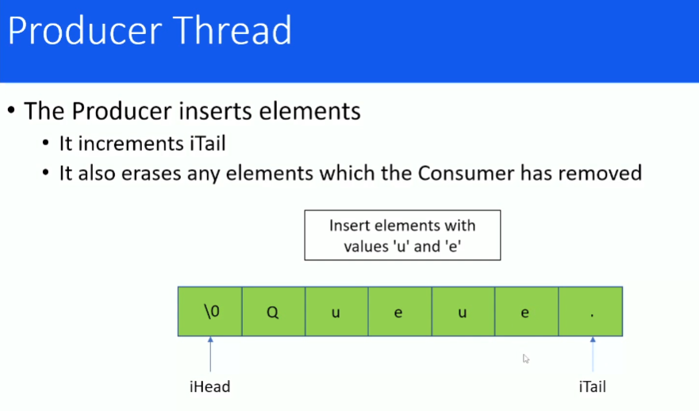
      

    - Result is we tried to do it lock-free but we failed:

      

## Managing a Thread

- **Detaching a Thread**

  - Instead of calling join(), we can call detach()
    - The parent thread will continue executing
    - The child thread will run until it completes or the program terminates
    - Analogous to a "daemon" process
  - When an execution thread is detached:
    - The std::thread object is no longer associated with it
    - The destructor will not call std::terminate()

## Multiple Threads

- **std::thread** version:
  
  

- **POSIX** version:
  
  

- **Data sharing between threads**
  - The threads in a program share the same memory space
    - It is very easy to share data between the threads
  - The only requirement is that the data is visible to the thread functions
    - Global or static variable, for global thread functions
    - Static class member for class member thread functions
    - Local variable captured by lambda expressions (by reference)
  - Threads interleave their execution
  - Threads can interfere with each other actions
  - Modifying shared data can cause data corruption
    - This is the main source of bugs in concurrent programs

- **Data Race**
  - Occurs when:
    - Two or more threads access the same memory location
    - And at least one of the threads modifies it
    - And the threads are not synchronized when they access the memory location
    - Potentially conflicting accesses to the same memory location
  - Only safe if the threads are synchronized
    - One thread accesses the memory location at a time
    - The other threads have to wait until it is safe for them to access it
    - In effect the thread execute sequentially while they access it
  - Data race causes undefined behavior
    - The program is not guaranteed to behave consistently

  

  - In the example above, the thread are interrupting each other
  - Threads can be interrupted during output
  - Other threads can run and write their output
  - The output from different threads is interleaved
  - The consequences od a data race however can be much more serious than just interleaved output
    - Incorrect results
    - Incorrect program flow
    - "Torn" writes and reads
    - Objects which are improperly constructed or destroyed

- **Race Condition**
  - The outcome is affected by timing changes
    - e.g. One client clears a database table
    - Another client inserts an entry into the same table
  - A data race is a special case of race condition
    - The outcome depends on when threads are scheduled to run
- **Memory Location**
  - In C++ "memory location" is a scalar object:
    - A build-in variable
    - A pointer
    - An element in a container
  - Or a scalar sub-object:
    - A struct or class member which is a scalar object
  - Also an obscure case:
    - A series of contiguous bitfields within the same word
    - Unless they contain a zero-length bitfield

- **Compound Objects**
  - C++ STL containers are memory locations
    - Multiple threads modifying the same object may conflict
    - Should be synchronized
  - For our own types we can choose the behavior
    - Classes can provide their own synchronization
    - Easier to work with
    - Calling a sequence of member functions may be problematic
    - Usually better to implement them as memory locations

## Parallelism

- **Concurrency vs Parallelism**
  - Sometimes useful to distinguish Concurrency from Parallelism
  
  - **Concurrency** 
    - Describes conceptually distinct tasks
      - Separation of concerns
      - Can run on a single core
    - These tasks often interact (Wait for an event, Wait for each other, etc...)
    - The tasks often overlap in time
    - Concurrency is a feature of the program structure
  
  - **Parallelism**
    - The tasks are identical
    - They all run at the same time (Run on multiple cores to improve scalability)
    - These tasks run independently of each other (They are not supposed to interact with each other)
    - Parallelism is a feature of the algorithm being run

- **Explicit Parallelism**
  - The programmer specified how to parallelize the work
    - Involves more work for the programmer
    - Can produce better performance
    - Not scalable
  - Mainly useful when writing for specific hardware
  - Or if the work naturally divides into a fixed number of tasks

- **Implicit Parallelism**
  - The decision is left to the implementation
  - Makes the best use of available resources
  - Usually the best option
  
- **Task Parallelism**
  - Distributed processing also known as **Thread-Level Parallelism (TLP)**
  - Split a large task into smaller tasks
  - The sub-tasks run concurrently on separate threads
  - e.g Database server runs many threads to reduce latency

- **Data Parallelism**
  - Distributed data
    - Data set is divided up into several subsets
    - Process all the subsets concurrently
  - Each thread works on one of the subsets
  - A final "reduce" step
    - Collects the result for each subset
    - Combines the partial results into the overall result
  - Also know as **vector processing** or **vectorization** (Used in Graphic Processor Units)
  - Modern CPUs have support for vectorization
  - Can improve data locality
    - Program processes 20 MB of data
    - A core has 4 MB of cache
    - Each core processes 1/5 of the data
    - All the data each core needs is in cache -> No fetches from RAM, No Interaction with cache controller

  - Data Parallelism with **std::async()**:
    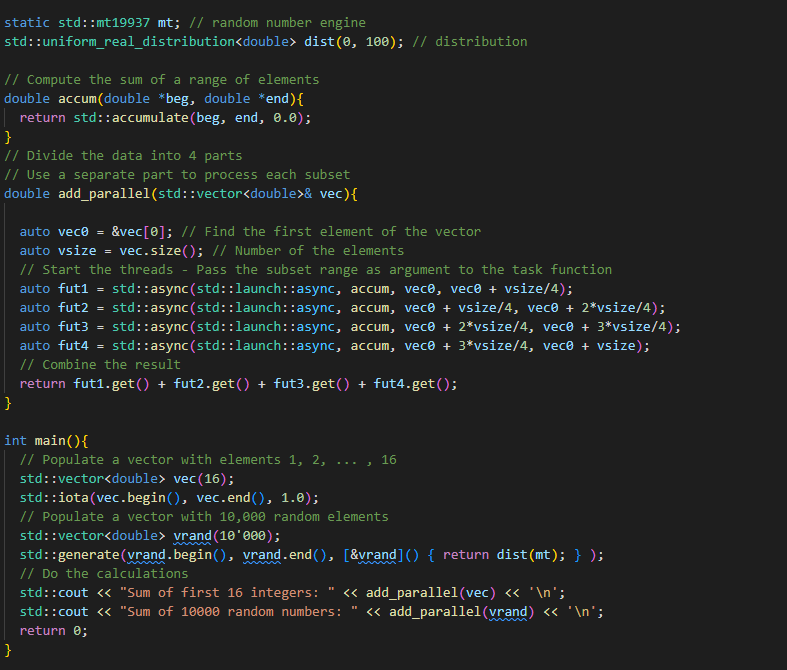
  
  - Data Parallelism with **std::packaged_task**:
    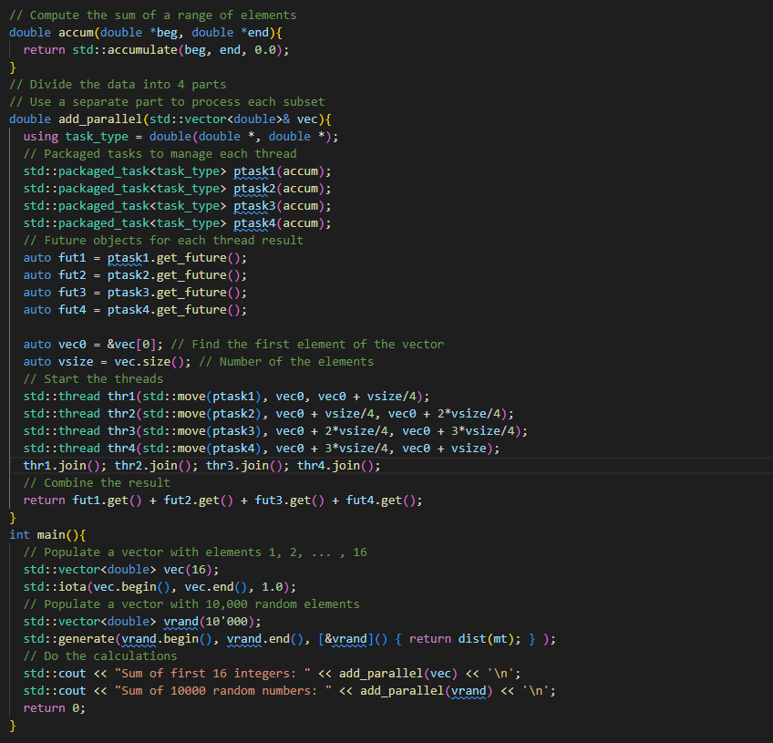

- **Pipelining**
  - Dependent tasks
    - Task B requires output from Task A, Task C requires output from Task B
    - B can not start until A has completed and produced its output
  - If A,B and C are processing a stream of data
    - A processes first item in stream
    - B starts processing A's output
    - A starts processing the next item
  - Perform dependent tasks sequentially but process data concurrently

- **Graph Parallelism**
  - Similar to pipelining but with an arbitrary graph of dependencies

## std::thread Class

- Implemented using RAII
  - Similar to std::unique_ptr, std::fstream etc.
  - The constructor acquires a resource
  - The destructor releases the resource
- An std::thread object has ownership of an execution thread
  - Only one object can be bound to an execution thread at a time
- Move-only class 
  - std::thread objects can not be copied
- Move operations
  - Transfer ownership of the execution thread
  - The move-from object is no longer associated with an execution thread
- For passing std::thread object we must use 'move'

- When we need to return std::thread object, the compiler will automatically move it for us

## std::thread (C++11)

- The base level of concurrency
- Rather low level implementation
- Maps onto a software thread
- Managed by the operating system
- Similar to Boost threads, but with some important differences:
  - No thread cancellation
  - Different argument passing semantics
  - Different behavior on thread destruction

- **Launching a Thread**

  - We need to create an std::thread object defined in [\<thread\>](https://en.cppreference.com/w/cpp/thread/thread) header
  - The constructor starts a new execution thread
  - The parent thread will continue its own execution
  - std::thread constructor takes a callable object - Thread's entry point function
    - The execution thread will invoke this function
  - The entry point function
    - Can be any callable object
    - Can not be overloaded
    - Any return value is ignored

   

## Shared Data

- **Critical Sections**
  - A region of code
  - Must only be executed by one thread at a time
  - Usually when accessing a shared resource (shared data, network connection, hardware device, ...)
  - The thread enters the critical section
    - It start executing the code in the critical section
  - The thread leaves the critical section
    - It has executed all the code in the critical section
  
  - **Locking Protocol**
    - One thread can enter the critical section
      - All the other threads are locked out
      - Only this thread can execute the code in the critical section
    - The thread leaves the critical section
      - One of the other threads can now enter it
    - 

- **Mutexes**
  
  - **MUT**ual **EX**clusion Object
  - A mutex has two states
    - Locked
    - Unlocked
  - The Mutex is used to exclude threads from entering the critical section
  - The threads agree to respect the mutex
  - **Locking**
    - If the mutex is unlocked, a thread can enter the critical section
    - IF the mutex is locked, no thread can enter until it becomes unlocked
    - A thread locks the mutex when it enter the critical section
    - A thread unlocks the mutex when it leaves the critical section
  - Mutexes are synchronizing the threads:
    - Threads can not interleave when they execute in the critical section
    - There is no data race
  - Unlocking a mutex publishes any changes
    - Thread A modifies shared data
    - The new value is now available to other threads
    - It will be seen by the next thread which accesses the shared data
  - **Acquire-Release** Semantics
    - A thread locks a mutex - It **acquires** exclusive access to the critical section
    - The thread unlocks the mutex
      - It releases exclusive access to the critical section
      - It also releases the result of any modifications
      - The next thread that locks the mutex will acquire these results
    - These Semantics impose ordering on the threads 
      - There is no data race
      - The shared data is always in a consistent state
    
  - **std::mutex**
    - Defined in \<[mutex](https://en.cppreference.com/w/cpp/thread/mutex)\>
    - We can use a mutex to implement locking
    - A mutex object must be visible in all task functions which uses it
    - It must also be defined outside the task functions
      - Global/Static variable with global task
      - Class data member with member task function
      - Variable captured by reference with lambda expressions
    - **std::mutex interface**
      - Three main member functions
      - **lock()**
        - Tries to lock the mutex
        - If not successful, wait until it locks the mutex
      - **try_lock()**
        - Tries to lock the mutex
        - Returns immediately 
        - If not successful returns **false** or **true** otherwise
      - **unlock()**
        - Releases the lock on the mutex

    - **Example:**

      - Eliminate interleaving with mutex, the accesses to the critical section are synchronized
      - Output will be 5x "abc", 5x "def", 5x "xyz" but with random order
      - We do not know which 5x series will be first which second and which last...

      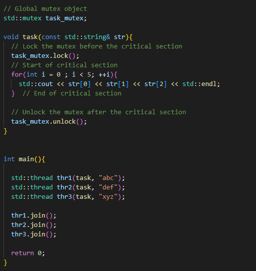

    - **Drawbacks:**
      - Calling **lock()** requires a corresponding call to **unlock()**
      - **unlock()** must always be called even if
        - There are multiple paths through the critical section
        - An exception is thrown
      - Relies on the programmer to get it right
      - For these reasons we do not normally use **std::mutex** directly

  - **Mutex Wrapper Classes**
    - The C++ library provides mutex wrapper classes (Classes with mutex object as a private member)
    - Defined in \<[mutex](https://en.cppreference.com/w/cpp/thread/mutex)\>
    - These use the **RAII** idiom for managing resources
    - In this case, the resource is lock on a mutex
    - The constructor locks mutex
    - The destructor unlocks mutex
    - We create the wrapper class on the stack
      - The mutex will always be unlocked when the object goes out of scope
      - Including when an exception is thrown

  - **std::lock_guard**

    - To solve problem with mutex that was not unlocked for some unexpected reason like thrown exception:

        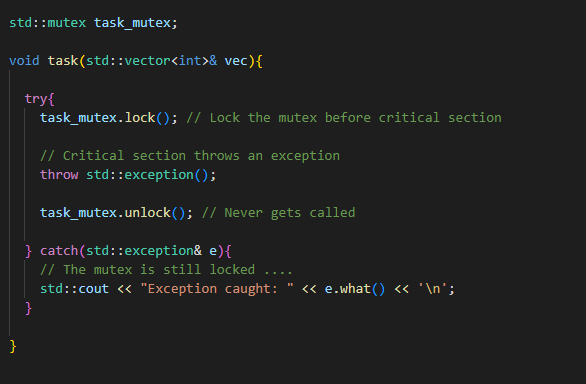
     
    - All other threads which are waiting to lock the mutex are blocked
    - If **main()** is joined on these blocked threads it will be blocked as well -> The entire program will be blocked

    - **std::lock_guard** is a vary basic mutex wrapper 
    - It has constructor and destructor only
    - The constructor takes a mutex object as argument and locks that mutex
    - The destructor unlocks the mutex member
    - It is a template class
    - The template parameter is the type of the mutex

      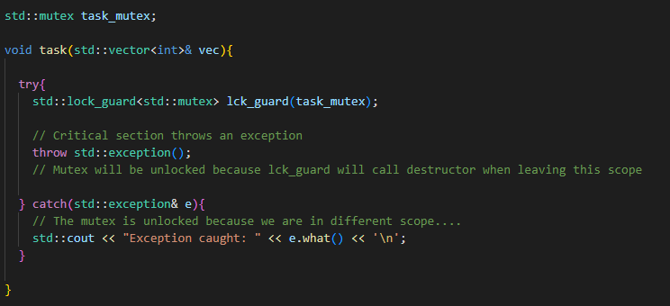

    - In **C++17** the compiler can deduce the mutex type:

      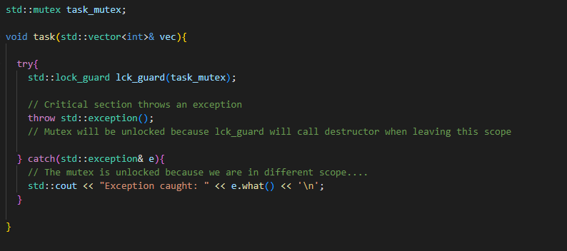

    - However the drawback with **std::lock_guard** is that we can not unlock it manually before we reach the end of the scope...
    - The end of the scope that will call the destructor is the only way we can unlock the mutex

  - **std::unique_lock**
  
    - Another mutex wrapper
    - The same basic features as **std::lock_guard**
      - Mutex data member
      - Constructor locks the mutex
      - Destructor unlocks it
    - But it also has **unlock()** member function
      - We can call this after the critical section
      - Avoids blocking other threads while we execute non-critical code
    - If we do not call **unlock()**, the destructor will unlock the mutex (The lock is always released)

    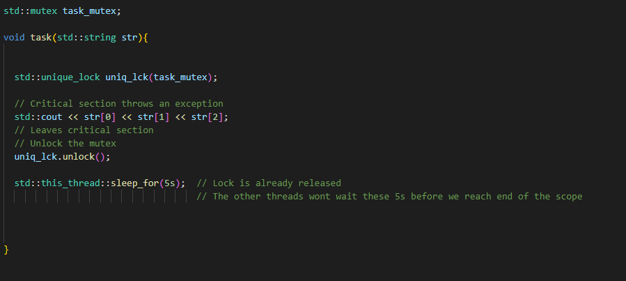

    - **Constructor Options**
      - The default
        - Call the mutex lock() member function
      - Try to get the lock
        - Do not wait if unsuccessful
        - (Timed mutex) Wait with a time-out if unsuccessful
      - Do not lock the mutex
        - It will be locked later
        - Or the mutex is already locked
      - We can also use optional second argument:
        - **std::try_to_lock**
          - Call the mutex **try_lock()** member function
          - The **unique_lock::owns_lock()** member function checks if the mutex is locked
        - **std::defer_lock**
          - Does not lock the mutex
          - We can lock it later by calling the **lock()** member function
          - Or by passing the **std::unique_lock** object to **std::lock()**
        - **std::adopt_lock**
          - Takes a mutex that is already locked
          - Avoids locking the mutex twice

    - **Move Semantics**
      - A **std::unique_lock** can not be copied
      - It can be moved
        - The lock is transferred to another **std::unique_lock** object
        - Can only be done within the same thread
      - We can write function that creates a lock object and returns it
        - The function could lock different types of mutex depending on its arguments
        - Factory design pattern

    - **Member Functions**
      - **std::unique_lock** has member function even for timed_mutex 
      - These are:
        - **try_lock_for()**
        - **try_lock_until()**
        - These are forwarded to the wrapped mutex -> Will only compile if the mutex supports the operation

        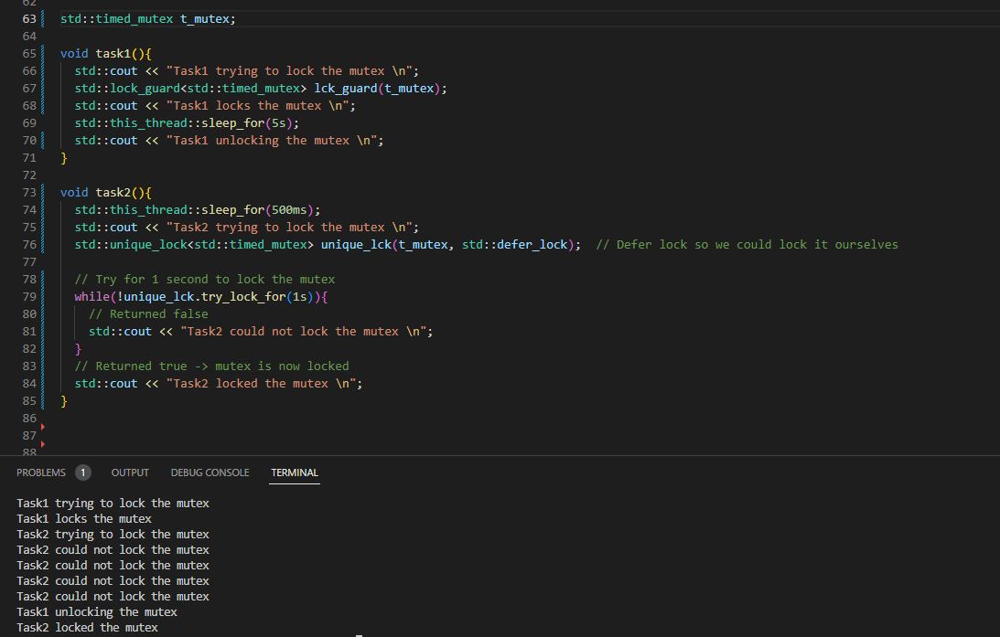

    - **std::unique_lock** is much more flexible than **std::lock_guard** 
    - But requires slightly more storage and is slightly slower
    - **Recommendations**
      - Use **lock_guard** to lock mutex for an entire scope
      - Use **unique_lock** if we need to unlock within the scope
      - Use **unique_lock** if we need the extra features

  - **Multiple Locking**
  
    - A thread locks an **std::mutex**
    - It must not call **lock()** again until it has called **unlock** (Undefined behavior otherwise)
    - **std::recursive_mutex**
      - Its **lock()** member function can be called repeatedly without calling **unlock()** first
      - Normally a sign of bad design
  
  - **std::timed_mutex**
    - Similar to **std::mutex** but with extra member functions
      - **try_lock_for()** - Keep trying to lock the mutex for a specified duration

        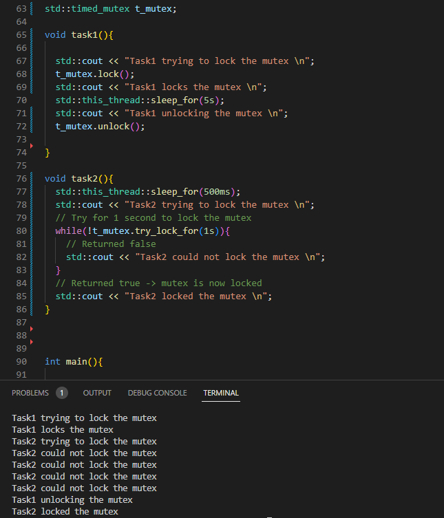

      - **try_lock_until()** - Keep trying to lock the mutex until a specified time

        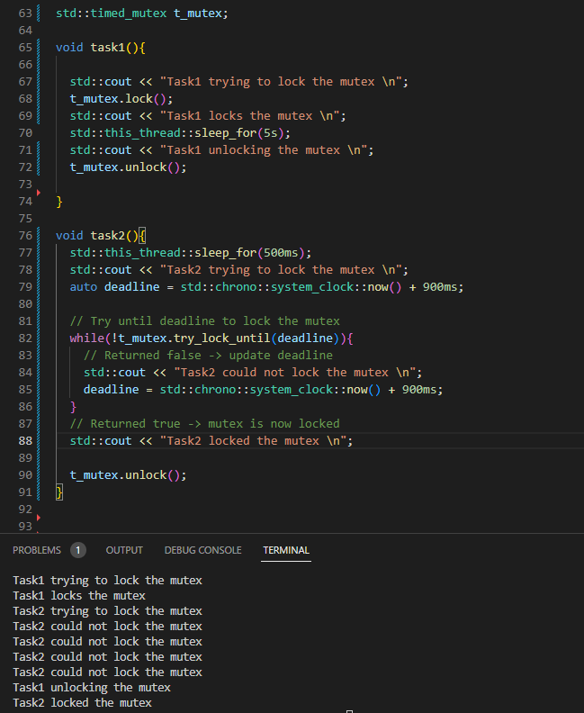

      - Both of these functions return True if the mutex was locked or false otherwise
       

  - **std::recursive_timed_mutex**
    - Mix between recursive and timed mutex

- **Internal Synchronization**

  - Multiple threads accessing the same memory location
    - With modification
    - Must be synchronized to prevent data races
  - C++ STL containers need to be externally synchronized (e.g. by locking mutex before calling a member function)
  - Our own types can provide internal synchronization
    - An **std::mutex** as a data member
    - The member functions lock the mutex before accessing the class data
    - They unlock the mutex after accessing the class data
    
  - **Example: Wrapper for std::vector** 
    - **std::vector** acts as a memory location
    - We may need to lock the mutex before calling it member function
    - Alternatively we could write an internally synchronized wrapper for it
    - A class which:
      - Has an **std::vector** data member
      - Has an **std::mutex** data member
      - Member functions which lock the mutex before accessing the **std::vector**
      - Then unlock the mutex after accessing it
    - An internally synchronized class

    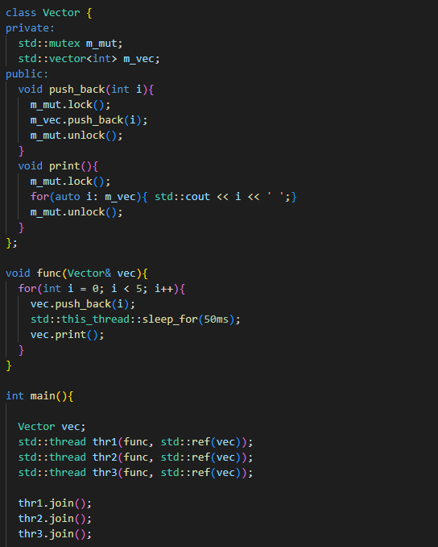

## Synchronization Issues

- Different threads execute on different cores
- They may share data
- This can cause synchronization issues
- Example of synchronization issue:
  - Core 1's thread modifies the shared data
  - Core 1 writes the new value to its store buffer
  - Core 2's thread wants to use the shared data
  - Core 2 pre-fetches the shared data or loads it from cache
  - Core 2 gets the old value
  - Core 2's thread does its computation using the old value
  - Core 1's store buffer writes the new value to cache
- Solution to this issue is to make sure Core 1 buffer will flush before Core 2 fetches the shared data

## System Thread Interface

- std::thread uses the system's thread implementation
- We may need to use the thread implementation directly
- Some functionality is not available in standard C++ like:
  - Thread Priority
    - Give a thread higher or lower share of processor time
  - Thread Affinity
    - Pin a thread on a specific processor core

- **native_handle()**

- Each execution thread has a "handle"
  - Used internally by the system's thread implementation
  - Needed when making calls into the implementation's API
  - Necessary when we want to perform operations that are not supported by the standard C++ thread interface and We need to directly use platform-specific or implementation-specific features.
- Returned by the native_handle() member function

- **std::thread ID**

- Each execution thread has a thread identifier
- Guaranteed to be unique
  - Could be used to store std::thread objects in associative containers
  - A new thread may get the ID of an earlier thread which has completed

- **Pausing Threads**

- We can pause a thread or make it "sleep"
  - std::this_thread::sleep_for()
- Takes an argument of type std::chrono::duration
  - C++14 - std::this_thread::sleep_for(2s);
  - C++11 - std::this_thread::sleep_for(std::chrono::seconds(2));
- This also works with single threaded programs (Pauses main thread)

## Transferring Data

- So far we have used shared variables to share data between threads
- Conditional variables can signal to another thread that shared data has been modified but can not directly transfer data from one thread to another
- But we can transfer data with **std::future** and **std::promise**
- Together they set up a "shared state" between threads
- The shared state can transfer data from one thread to another
  - No shared data variables
  - No explicit locking

- **Producer-Consumer Model**
  - Futures and Promises use a producer-consumer model
  - A producer thread will generate result
  - A consumer thread waits for the result
  - The producer thread stores the generated result in the shared state
  - The consumer thread reads the result from the shared state
  - 
- **std::promise** object is associated with the producer
  - The promise object stores the result in the shared state
- **std::future** object is associated with the consumer
  - The consumer calls a member function of the future object
  - The function blocks until the result becomes available
  - The member function reads the result from the shared state
  - The member function returns the result

  

- **Exception Handling**
  - Futures and Promises also work with exceptions
    - The promises stores the exception in the shared state
  - This exception will be rethrown in the consumer thread
  - The producer throws the exception to the consumer
  
  

  - **std::make_exception_ptr()**
    - To throw an exception ourselves we could:
      - Throw the exception inside a try block
      - Write catch block that calls set_exception()
    - C++11 has **std::make_exception_ptr()**
      - Takes the exception object we want to throw
      - Returns a pointer to its argument
      - Pass this pointer to set_exception()
      - Avoid "boilerplate" code
      - Better code generation

  

- **std::future and std::promise**
  - An promise object is associated with a future object
  - Together they create a **shared state**
    - The promise object stores a result in the shared state
    - The future object gets the result from the shared state

  - **std::future**
    - Template class defined in \<future\>
    - The parameter is the type of the data that will be returned
    - Represents a result that is not yet available
    - One of the most important classes in C++ concurrency
      - Works with many different asynchronous objects and operations, not just std::promise
    - An **std::future** object is not usually created directly
      - Obtained from an std::promise object
      - Or returned by an asynchronous operation
    - **get()** member function
      - Obtains the result when ready
      - Blocks until the operation is complete
      - Fetches the result and returns it
    - **wait()** and friends
      - Block but do not return a result
      - wait() blocks until the operation is complete
      - wait_for() and wait_until() block with a timeout

  - **std::promise**
    - Template class defined in \<future\>
    - The parameter is the type of the result
    - Constructor creates an associated std::future object
    - Sets up the shared state with it
    - **get_future()** member function
      - returns the associated future
      - std::promise\<int\> prom;
      - std::future fut = prom.get_future();
    - **set_value()** 
      - Sets result to its argument
    - **set_exception()**
      - Indicates that an exception has occurred
      - This can be stored in the shared state

- **Multiple Threads**
  
  - **Example**:
    - Single producer thread
    - Multiple consumer threads

  - **std::future** is designed for use with a single consumer thread
    - Can not be safely shared between threads
    - Can not be copied -> Move-only class

  - The code in the example below can work properly sometimes but sometimes it will not so it is unsafe code

    

  - **std::shared_future**
    - Each thread has its own object
    - They all share the same state with the **std::promise**
    - Calling **get()** or **wait()** from different copies is safe

    

  

## Thread Function

- **Thread Function with Arguments**

  - We can pass arguments to the entry point function
  - We list them as extra arguments to the constructor

  

  - The std::thread object owns the arguments
    - lvalue arguments are passed by value
    - rvalue arguments are passed by move

  

  - But we can pass argument by reference also with use of a reference wrapper
    - Wrap the argument in a call to std::ref()
    - Use std::cref() for constant reference
    - **Beware of dangling references!**

  

- **Member Function**

  - We can use a member function as the entry point
  - Requires an object of the class

  

- **Lambda Function**

  - We can also use lambda function as the entry point:

  

  - We can pass arguments as well:

  

## Thread Pool

- A design pattern used in concurrent programming to manage a collection of reusable threads
- These threads can be used to perform a variety of tasks providing an efficient way of managing resources, especially in high-load scenarios
- Using thread pool helps minimize the overhead associated with thread creation and destruction, especially in applications that require the execution of large number of short lived tasks

## Thread Synchronization

  - Mechanism which ensures that two or more concurrent processes or threads do not simultaneously execute some particular program segment known as **critical section**
  - Processes access to critical section is controlled by using synchronization techniques
  - When one thread starts executing the critical section, the other thread should wait until the first thread finishes
  - If proper synchronization techniques are not applied, it may cause **race condition** where the value of variables may be unpredictable and vary depending on the timings of context switches
  - **Mutex**
    - Mutex is a lock that we set before using a shared resource and release after using it
    - When the lock is set, no other thread can access the locked region of code
    - So we see that even if thread 2 is scheduled while thread 1 was not done accessing the shared resource and the code is locked by thread 1 using mutexes then thread 2 can not even access that region of code
    - Mutex lock will only be released by the thread who locked it

  

    - **Shared Mutex**
      - defined in <shared_mutex> header
      - It can be locked in two different ways
        - **Exclusive Lock**
          - No other thread may acquire lock
          - No other thread can enter a critical section
          - std::lock_guard<std::shared_mutex>
          - std::unique_lock<std::shared_mutex>
        - **Shared Lock**
          - Other threads may acquire a shared lock
          - They can execute critical sections concurrently  
          - std::shared_lock<std::shared_mutex>
          - Thread which has a shared lock can enter a critical section

  - **lock_guard**
    - Mutex wrapper that provides RAII style mechanism

  - **std::future**
    - used for asynchronous computations

  - **Conditional Variable**

    - They are defined in [\<condition_variable\>](https://en.cppreference.com/w/cpp/thread/condition_variable) header
    - **wait()**
      - Takes an argument of type **std::unique_lock**
      - It unlocks its argument and blocks the thread until a notification is received
    - **wait_for()** and **wait_until()**
      - Re-lock their argument if a notification is not received in time
    - **notify_one()**
      - Wake up one of the waiting threads
      - The scheduler decides which thread is woken up
      - Only one of the threads which called **wait()** will be woken up
      - The other waiting threads will remain blocked
      - A different reader thread processes the data each time
    - **notify_all()**
      - Wake up the waiting threads
      - The condition variable wakes up all the threads which have called **wait()**
      - The threads could wake up in any order
      - All the reader threads process the data

    - Thread A tells the condition variable it is waiting
    - Thread B notifies the condition variable when it updates the string
    - The condition variable wakes thread A up
    - Thread A then uses the string
    
    

    - std::condition_variable only works with std::mutex
    - There is also std::condition_variable_any
      - Works with any mutex-like object
      - Including our own types
      - May have more overhead

  - **Conditional Variable with Predicate**

    - The example in the previous lecture has a problem
    - **wait()** will block until the condition variable is notified
    - If the writer calls **notify()** before the reader calls **wait()**
      - The condition variable is notified when there are no threads waiting
      - The reader will never be woken up
      - The reader could be blocked forever
    - This is known as **lost wake-up**
    - Occasionally, the reader could be woken up for no reason. This is called **spurious wakeup**
      - The condition variable can occasionally wakes the reader up even when no notify() was called
      - This is due to the way that std::condition_variable is implemented
    - Fortunately, there is a way to solve both spurious and lost wake-ups -> **wait() with predicate**
    - **wait()** takes an optional second argument: a predicate
    - Typically the predicate checks a shared bool
      - The bool is init to false
      - It is set to true when the writer sends the notification
    - The reader thread will call this predicate
    - It will only call **wait()** if the predicate returns false
    - **Using wait() with predicate**:
      - Add a shared boolean flag, initialized to false
      - In the **wait()** call ,provide a callable object that checks the flag

      
      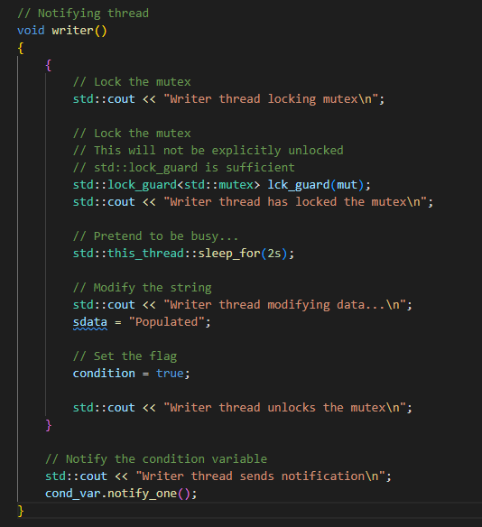

    - **Lost Wake-up Avoidance**
      - The writer notifies the condition variable
      - The reader thread locks the mutex
      - The reader thread calls the predicate
      - If the predicate returns true
        - Lost wake-up scenario - the writer has already sent a notification
        - The reader thread continues with the mutex locked

    - **Spurious Wakeup Avoidance**
      - The writer notifies the condition variable
      - The reader locks the mutex
      - The reader calls the predicate
      - If the predicate returns false
        - Spurious wake-up scenario - the writing thread has not sent a notification
        - The reader thread calls **wait()** again

    - **Multiple Threads**
      -  Condition variables are particularly useful here
         -  Multiple threads are waiting for the same event

  - **Condition Variable Example**

    

    - **data_cv**
      - The fetching thread notifies this when it has new data
      - The progress bar waits on it and updates itself
    - **completed_cv**
      - The fetching thread notifies this when the download completes
      - The progress bar waits on it and exits
      - The processing thread waits on it and processes the data
    - We use predicates with the condition variables to avoid lost and spurious wake-ups

    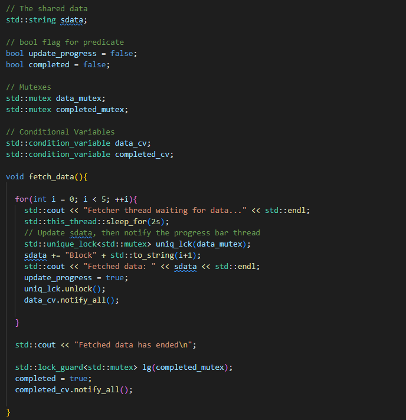
    
    

  - **Atomic Types**

    - **Atomic Operations**
      - Operations on atomic types are performed as a single, indivisible step. 
      - This means that no other thread can see an intermediate state or interfere with the operation. 
      - Common operations include reading (load), writing (store), and atomic modifications such as increment, decrement, or bitwise operations.
    - **Memory Order**
      -  Atomics in C++ also involve memory ordering semantics, which dictate the visibility of memory operations across threads. 
      -  There are several memory order options ranging from memory_order_relaxed (least strict, only guarantees atomicity) to memory_order_seq_cst (most strict, full sequential consistency).

    - **std::atomic Template**
      - The std::atomic template can be instantiated with any TriviallyCopyable type that is also CopyConstructible and CopyAssignable. This includes most built-in types like int, float, pointer types, and user-defined types meeting these criteria.
    - **Lock-Free Property** 
      - Atomic types are usually implemented in a way that does not require locking. 
      - They're often implemented using machine-specific instructions that are more efficient than locks. 
      - However, not all atomic types are guaranteed to be lock-free. 
      - You can check if an instance of std::atomic is lock-free using its is_lock_free() member function.

    

## Thread Termination

- If the parent thread completes its execution it will call destructor of the child thread
- But that can happen while the child is still running and that is a problem
- By default the destructor calls std::terminate() which will terminate all threads 
- We can avoid this by joining the threads

- **Join a thread**

  - std::thread has a join() member function
  - This is a "blocking" call
    - Does not return until the thread has completed execution
    - The parent has to stop and wait for the thread to complete
  - Prevents std::thread's destructor calling std::terminate()
  - The program can continue after the std::thread object is destroyed
    
  

## Volatile

int some_int = 100;

while(some_int == 100)
{
   // our code
}

- When this program gets compiled, the compiler may optimize this code, if it finds that the program never ever makes any attempt to change the value of some_int
- So it may be tempted to optimize the while loop by changing it from while(some_int == 100) to something which is equivalent to while(true) so that the execution
could be fast (since the condition in while loop appears to be true always). 
- However, sometimes, optimization (of some parts of your program) may be undesirable, because it may be that someone else is changing the value of some_int from outside the program which compiler is not aware of, since it can't see it, but it's how you've designed it. 
- In that case, compiler's optimization would not produce the desired result!
- So, to ensure the desired result, we need to somehow stop the compiler from optimizing the while loop. 
- That is where the volatile keyword plays its role:
  - **volatile int some_int = 100;**

