# Namespaces

- Feature of C++ programming language to avoid name conflicts
- This way we can create functions with same name just under different namespace

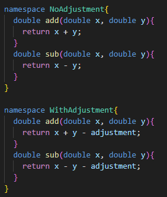

- We can even separate the namespaces into more blocks

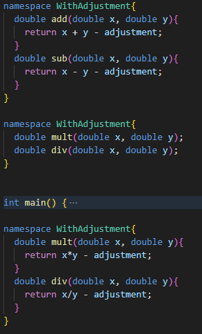

- The functions are called through their namespaces like this:

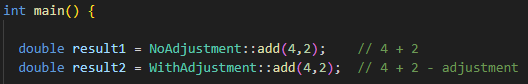

## Namespaces across multiple files

- We can use namespaces across multiple files
- But we should be careful when we want to use the same namespace 

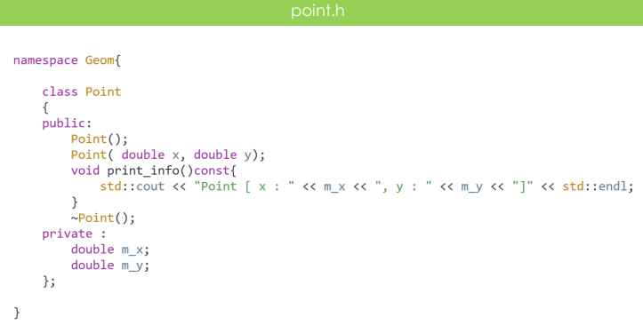
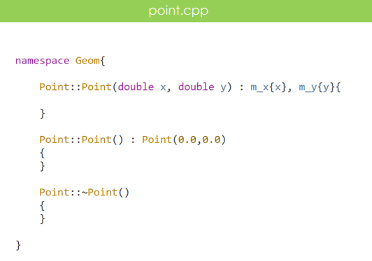

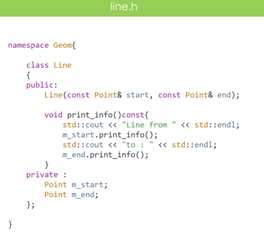
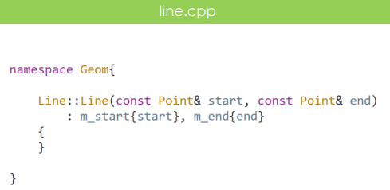

- Main:

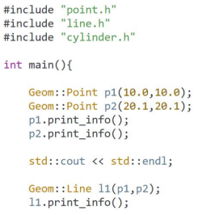

## Default Global Namespace

- Anything outside of any specified namespace lives in the default global namespace
- We can call functions and variables from the default global namespace through the '::' operator
- It can be useful when we are inside of some namespace and we want to specify to call something from the outside

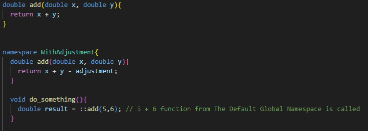

## Built in Namespaces

- There are already lot of build in namespaces from different libraries so we should be aware of that
and try to not named our namespaces with the same name

### Namespace std

- The most used one is 'std' from the C++ standard libraries

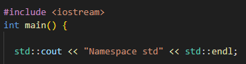

## Using

- To call things from specified namespaces without specifying the namespace name

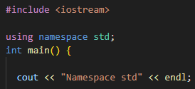

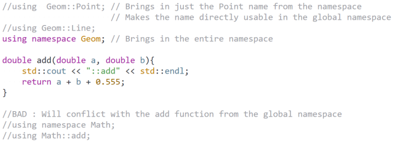

## Anonymous Namespaces

- Allows us to create namespaces without name
- Useful for creating a unique scope and ensuring that their contents have internal linkage (Internal linkage means that it is meant only for that single source file)

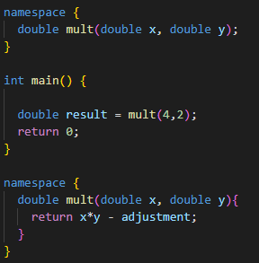

- When the compiler sees an anonymous namespace declaration it will generate an internal name for the namespace
- The generated unique namespace is not accessible to us, the developers
- There can only be one anonymous namespace for a single translation unit (cpp file)
- If we set up multiple anonymous namespace blocks, they will just be extensions to the first one
- Anonymous namespaces in different translation units are completely separated, the compiler generates different unique namespace names for them
- Because we do not have access to the compiler generated namespace name, names declared inside anonymous namespaces are only reachable in the Translation Unit
  where they were declared

- Because they are not usable from other source files, we can use them to avoid name conflicts
- Also when we see anonymous namespace in some code it is a hint that its content is intended just for that single source file

## Nested Namespaces

- We can set up namespaces inside of other namespaces
- Inner namespaces have direct access to thinks declared in the outer namespace
- But outer namespaces has to go through the inner namespace name to access thinks declared there

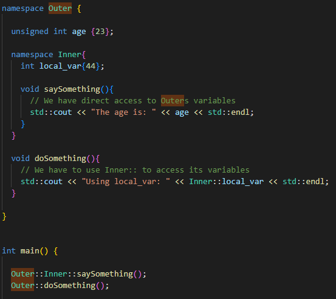

## Namespace Aliases

- To set up reasonable name for long namespaces

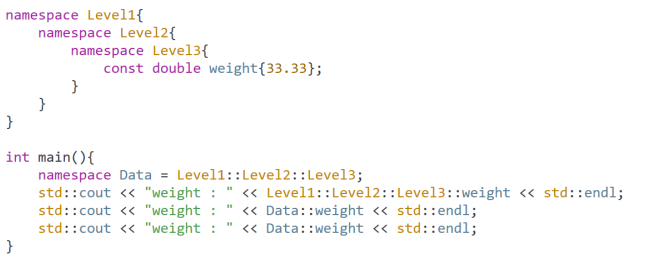