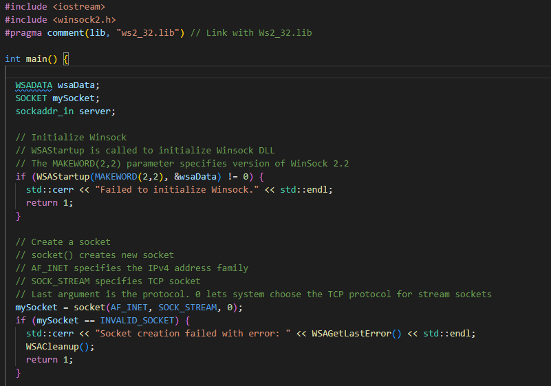
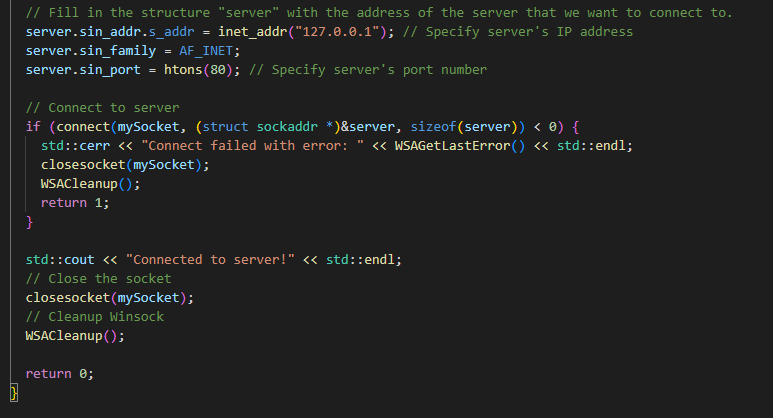
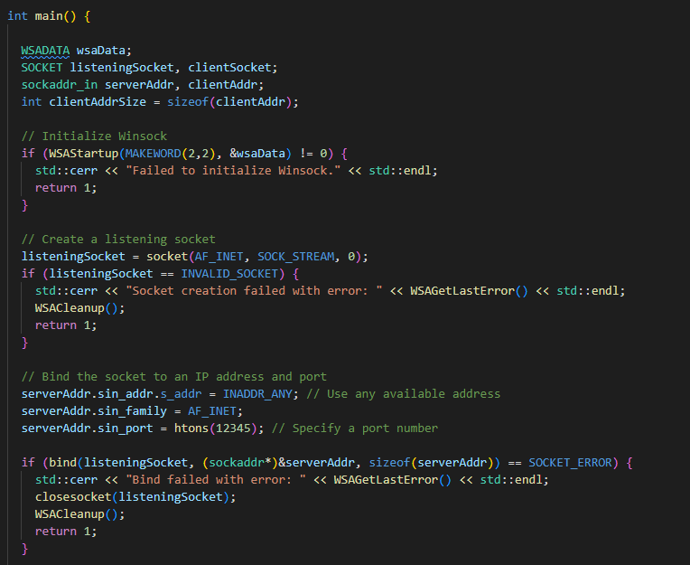
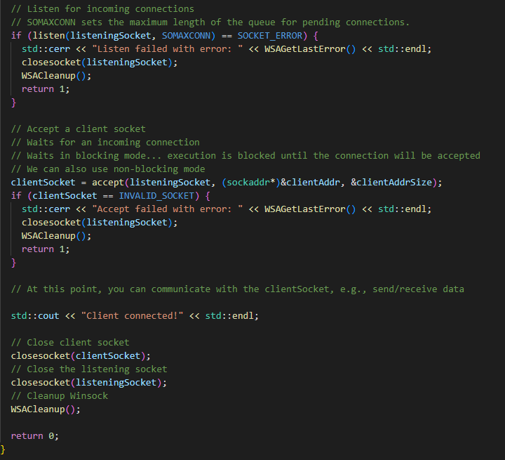
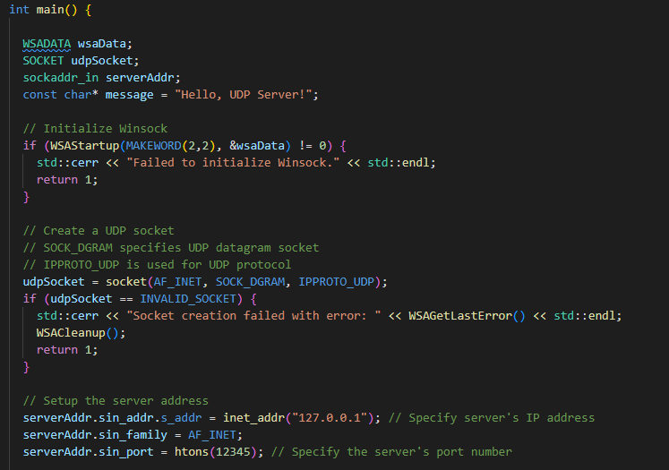
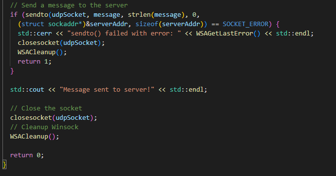
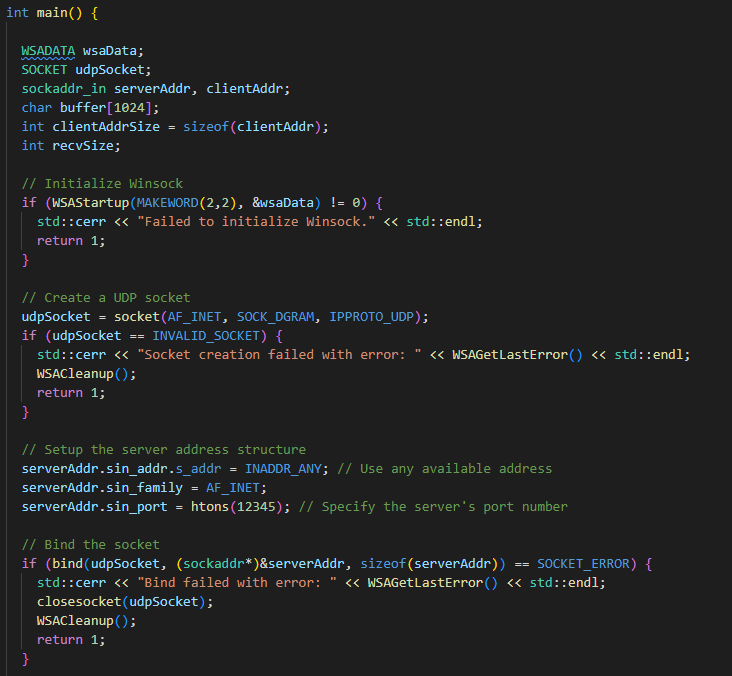
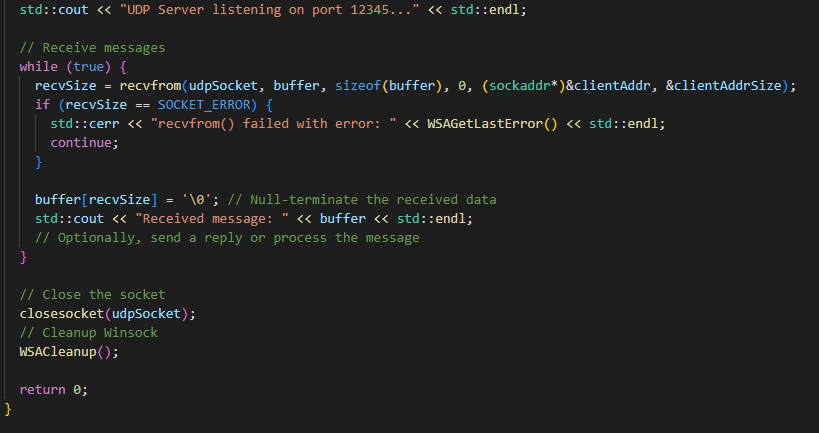

# Network Programming

## Basic Concepts

- **Sockets**
  - The fundamental building block of network communication
  - A socket is an endpoint in a communication channel used for bidirectional data exchange between two systems
- **TCP/IP**
  - Transmission Control Protocol and Internet Protocol are the core protocols for the internet communication
  - TCP is used for reliable, connection oriented communication
  - IP handles routing and delivery of data

- **UDP**
  - User Datagram Protocol is connectionless protocol used for applications that require fast but not necessarily reliable transmission such as streaming audio/video

- **Port Number**
  - Way to identify specific processes or services on a machine
  - Each socket is bound to specific port number

- **IP Address**
  - The address used to identify each computer or device on a network
  - It can be IPv4 or IPv6

- **Domain Name System (DNS)**
  - Translates humans readable domain names (like www.example.com) into IP addresses

## Implementing Network Communication

- **Creating a Socket**
  - Creating a socket involves specifying the protocol (TCP or UDP) and then binding it to an address and port
- **Communication**
  - **TCP**
    - **Server:** Listen for connections, accept an incoming connection and then read/write data
    - **Client:** Connect to a server, then send/receive data
  - **UDP**
    - UDP does not require establishing a connection
    - Data are sent directly to the recipient's address and port

- **Handling Data Transmission**
  - Data sent over the network must be serialized (converted into a byte stream) and then deserialized on the receiving end 

- Creating TCP client with WinAPI (WinSock):
    
    
    

- Creating TCP server (blocking mode) with WinAPI:

    
    

- Creating UDP client with WinAPI:
    
    
    

    - Instead of establishing connection (as with TCP), data is sent directly using **sendto()**, which requires the destination address as a parameter

- Creating UDP server with WinAPI:

    
    

- **Blocking Mode**
  
  - The **accept()** function by default, blocks the execution of our program until client connects
  - Also the functions **recv()**, **send()**, **recvfrom()** and **sendto()** are blocking as well
  - In other words, it waits indefinitely for an incoming connection
  - This behavior is known as **blocking mode**
  - In single threaded application the server does nothing until a client connects
  - In multi threaded application we can have one thread dedicated to listening for new connections, allowing the program to perform other tasks in parallel

- **Non-Blocking Mode**
  - In this mode **accept** returns immediately with failure status if there is no incoming connection at the time it is called
  - Our program can then do other work and try **accept** again later
  - This typically involves setting the socket using **fnctl** function on Unix/Linux systems or the **ioctlsocket** function on Windows with the **FIONBIO** flag

- **Timeouts and Alternatives**
  - Another approach to avoid blocking is to use **select** or **poll** system calls
  - These calls can monitor multiple sockets for activity with specified timeout
  - They wait until a client si ready to connect, data is ready to be read etc... up to specified timeout
  - For Servers that handle multiple clients, using non-blocking sockets with **sellect**, **poll** or similar mechanism or employing multi-threaded or asynchronous I/P model are common approaches

- sending/receiving
- reading/writing

## Challenges

- Network disconnections and data transmission error must be managed gracefully
- Managing multiple simultaneous connections often requires multi-threading or asynchronous I/O
- Implementing encryption (like TLS/SSL) is crucial for protecting data, especially over public networks
- Network programming must often account for differences in how different operating systems handle sockets and networking

## Network protocols

### UDP

### TCP

- Transmission Control Protocol is responsible for ensuring that data is reliably transmitted across the network
- It is a connection-oriented protocol which means a connection is established and maintained until the application programs at each end have finished exchanging messages
- **Funcionality**
  - It ensures the reliable delivery of data from sender to receiver, making sure that data arrives in order and without errors
  - TCP checks for errors in the data received. If any packet is found to be missing or corrupted it requests a retransmission
  - It manages data pacing between the sender and the receiver ensuring that the rate at which the data is sent does not overwhelm the receiver
  - TCP also detects network congestion and reduces the transmission rate accordingly, which helps in efficient data transmission

### IP

- Internet Protocol is responsible for addressing and routing our data to its destination by defining IP addresses
- It is like assigning a unique address to every device on the internet
- **Data Packeting**
  - IP takes chunks of data, packages them into packets and marks them with their destination addresses
- **Routing**
  - IP is in charge of routing packets to their destination
  - It uses IP addresses to determine the best path for the packets to travel across the network

- **IPv4 vs IPv6**
  - IPv4 is based on a 32-bit address scheme allowing 4,3 billion addresses
  - IPv6 is uses a 128-bit address scheme to support almost unlimited number of devices

### TCP/IP

- TCP/IP work together where IP handles the address part ensuring the data is sent to the right destination and TCP ensures the data is delivered correctly and reliably
- When data is sent over the internet, TCP divides the data into chunks, or packets, and adds a TCP header with its own information.
- IP then adds its own header to each packet and handles the routing of the packets to the destination
- This combination allows for end-to-end communication over the internet, ensuring that data send from one device reaches the target device accurately and in order
- TCP/IP is used for almost all web-based communications, including browsing websites, sending emails, transferring files etc...

#### Layers

- TCP/IP protocol is conceptualized into four layers:

  - **Application Layer**
    - This is the topmost layer in the TCP/IP model, closes to the end-user
    - It includes high-level protocols used by applications to send and receive data over the network ensuring that software can effectively communicate over the internet or other IP networks
    - Common protocols at this layer include **HTTP**(HyperText Transfer Protocol), **HTTPS**, **FTP**, **SMTP** and **DNS**
  - **Transport Layer**
    - This layer is responsible for providing communication services directly to the application processes running on different hosts
    - Key protocols include **TCP** and **UDP**
  - **Internet Layer**
    - This layer handles the movement of packets around the network
    - It is responsible for routing, addressing and packaging data packets
    - The core protocol in this layer is the Internet Protocol **IP** which defines IP addresses that uniquely identify the location of devices on the network
  - **Network Interface Layer (Link Layer)**
    - It concerns itself with the physical and hardware aspects of the networking process
    - It includes the protocols and methods used to transmit data over the physical network
    - This layer is where we find Ethernet, Wi-Fi and other technologies that define the physical and data link standards used to actually send and receive bits over a network medium 

### HTTP

### FTP

### SMTP

### DNS

### Ethernet

## Security

- **Encryption**

  - **Secure Sockets Layer (SSL)**
    - Standard security technology that establishes an encrypted link between a web server and a browser
    - This link ensures that all data passed between the web server and browsers remain private and integral
    - Industry standard and is used by millions of websites in the protection of their online transactions
    
    - **Encryption**
      - SSL encrypts data exchanged, ensuring that it remains confidential
      - This means that even if the data is intercepted it can not be read pr tampered with
    - **Authentication**
      - Part of the SSL protocol involves providing a certificate to prove the server identity 
      - This ensures that users are connecting to the actual website and not a fraudulent one
    - **Use Cases**
      - Originally, SSL was widely used for securing transactions, data transfer and logins

  - **Transport Layer Security (TLS)**
    - Successor to SSL and is more secure and updated version of the protocol
    - Though SSL is still widely referred to out of habit, most modern secure connections are actually using TLS

    - **Upgraded Security**
      - TLS provides stronger encryption algorithm and has the ability to work on different ports
      - Additionally, TLS includes a feature that can detect tampering, forgery or interception of the data
    - **Backward Compatibility**
      - While TLS is the successor to SSL, it is designed to be backward compatible with SSL
      - However the use of SSL is now strongly discouraged due to known security vulnerabilities

    - TLS is also used to secure other types of communications such as email, messaging apps and VoIP services

  - **HTTPS**
    - When we visit a website with **HTTPS** in the URL it means that the website is using SSL/TLS to secure the connection
  