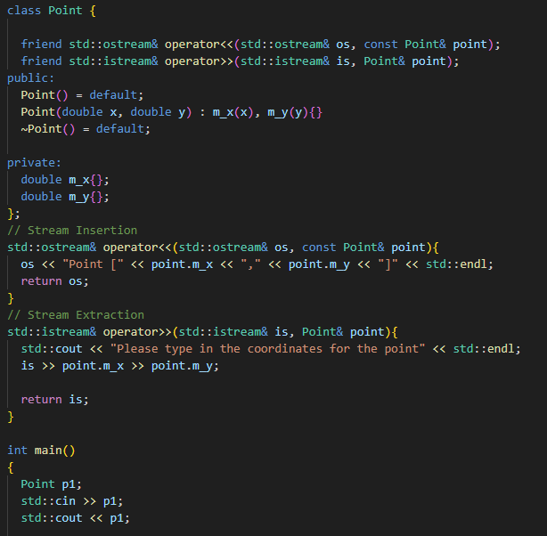

# Overloading

## Operator Overloading

- [List of operators](https://en.cppreference.com/w/cpp/language/operator_precedence)

### Operator Type

- There are two kinds of operators 
  - Unary ToDo
    - Works with one operand ('++', '--', ...)
  - Binary ToDo
    - Works with two operands ('+', '-', '*', '/', ...)

### Operator '+' (Binary)

- Binary operator
  
#### Class Member 

- The Left operand must be object of the same class

#### Non-Member

- Overloading operator with non-member function has some benefits:
  - The left operand does not need to be object of that class so we can have operands of different types on either side
  - Modifying existing class that we do not have access to (class from library, etc.)
  - Avoiding implicit conversions
  - Consistency with the Standard Library (C++ standard library often overloads operators as non-member functions)

### Operator '[]'

- The subscript operator is a binary operator
- It is one of the operators that **MUST** be set up as a member function

- Just reading:

- Reading/Writing thanks to reference lvalue:

### Operator '<<'

- We can overload this operator with member function but then the left operant must be object of the class so we would call it like this

### Operator '>>'

### Compound Operators

- For example '+' can be implemented in terms of '+='

### Custom Type Conversions

- Set up the transformation we want to support from our type to other types
- They can only be done as a member function
- If there is already constructor that could be used for that, the compiler will be confused what to use and will throw error

### Copy Assignment Operator '='

- If we have no custom copy assignment operator in place, the compiler is going to generate one for us
- The compiler generated one is going to do member wise copy (that means for pointers just shallow copy)
- Can only be done as member function

- We can also do copy assignment operator overload for other types so to one object type we can assign object of different type
- For example like this:

### Operator '++' (Unary)

#### Class Member Prefix

#### Non Member Prefix

#### Postfix

### Functors (Operator '()')

- Objects of a class that overloads the () operator

