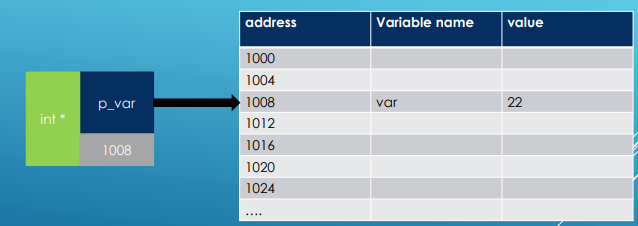
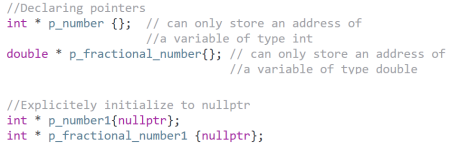

# Pointers

    - Has its own address in memory.
    - We can create pointer and assign it later.
    - Pointer can be NULL. 
    - We can increment pointer to get the next variable in memory:     p++;
    - Multi-level indirections:   int *ptr = &i; int **ptr1 = &ptr; int ***ptr2 = &ptr1;  
    - When Initialization we need to assign address (or NULL): int * ptr = &i;    Assigning:  *ptr = i;  or   ptr = &i;    

void swapPtr(int *a, int *b)
{
   int tmp = *a;  
   *a = *b;         // Dereferencing pointers to get value
   *b = tmp;
}

void swapRef(int &a, int &b)
{
  int tmp = a;      
  a = b;            // We have values and when we change them, the original is changing too
  b = tmp;
}

int PointersReferences()
{
    int i = 10;
    int &r = i;         // Reference
    int *p = &i;        // Pointer
    
    //          Name      Address
    //           i          0x20
    //           r          0x20
    //           p          0x24
    
    int var = 90;
    
  //  r = var;         // r = 90 -> i = 90    
  //  p = &var;        // *p = 90 
  //  *p = 60;         // *p = 60  and var = 60  (shares address)    
  
    cout << "i: " << &i << " r: " <<  &r <<  " p: " << &p << endl;  // Reference and Original value have the same address but pointer has its own even if he stores address of the value
        
    // Swap with pointers:
    int a = 5;
    int b = 10;
    cout << "a: " << a << " b: " <<  b << endl;     
    swapPtr(&a,&b);                                    // We have to give address for pointer init                 
    cout << "a: " << a << " b: " <<  b << endl;         
    swapRef(a,b);                                      // We have to give values for reference to make alias of
    cout << "a: " << a << " b: " <<  b << endl;      
  
        
	return 0;
}

// Lvalue vs Rvalue
//  - The original definition of lvalues and rvalues from the earliest days of C is as follows: 
//      - An lvalue is an expression e that may appear on the left or on the right hand side of an assignment, 
//        whereas an rvalue is an expression that can only appear on the right hand side of an assignment. 
//  For example:

  int a = 42;
  int b = 43;

  // a and b are both l-values:
  a = b; // ok
  b = a; // ok
  a = a * b; // ok

  // a * b is an rvalue:
  int c = a * b; // ok, rvalue on right hand side of assignment
  a * b = 42; // error, rvalue on left hand side of assignment

// For C++: 
//  - An lvalue is an expression that refers to a memory location and allows us to take the address of that memory location via the & operator. 
//  - An rvalue is an expression that is not an lvalue. 
