# Pointers

  - Has its own address in memory.
  - We can create pointer and assign it later.
  - Pointer can be NULL. 
  - We can increment pointer to get the next variable in memory:     p++;
  - Multi-level indirections:   int *ptr = &i; int **ptr1 = &ptr; int ***ptr2 = &ptr1;  
  - When Initialization we need to assign address (or NULL): 
    - int * ptr = &i;    Assigning:  *ptr = i;  or   ptr = &i;    
  - All pointer variables have the same size 
  - Do not try use pointer that is not initialized
  - Do not try work with a pointer that is pointing to nullptr

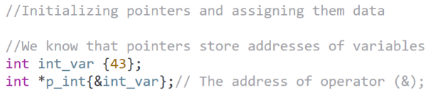

## Dereferencing pointers ToDo

## Pointer to char

  - pointer to char is special because we can also initialize it with C-string not only with single char
  - but then we should use const char * to avoid troubles

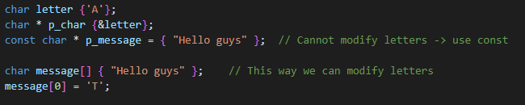

## Pointer to Const vs Const Pointer 

### Pointer to Const

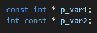

  - Word 'const' is left from the pointer
  - Can not modify variable to which it is pointing to
  - But it can modify the address that it is pointing to
  
### Const Pointer

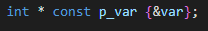

  - Word 'const' if right from the pointer
  - It can modify the variable that it is pointing to
  - But it can not modify address that it is pointing to

### Const pointer to const

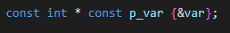

  - Can not modify variable to which it is pointing to
  - Can not modify address that it is pointing to either

## Pointers and Arrays ToDo

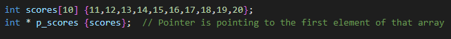

  - The array name is a special pointer that kind of identifies the entire array
  - We can not assign anything else to that special pointer

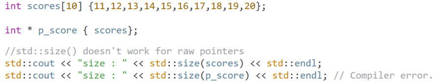

## Pointer Arithmetic

### Navigation 

  - Incrementing/Decrementing on the pointer is going to move the pointer address
    by the size of the pointed type
  - Incrementing
  
  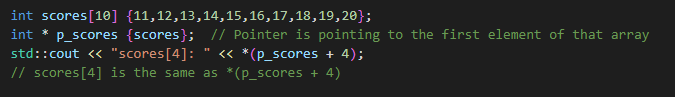

  - Decrementing

  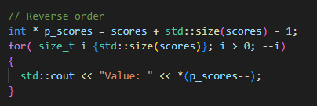

  - We can use different approach to play with array variables:

  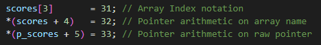

### Distance

  - C++ has special type for storing pointer distances called 'ptrdiff_t'
  - The reason is that pointers have different representation of different systems

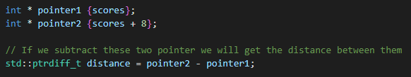

## Dangling pointers

  - Pointer that does not point to valid memory address
  - Trying to dereference and use a dangling pointer will result in undefined behavior
  - Causes: 
    - Uninitialized pointer
    - Deleted pointer
    - Multiple pointers pointing to the same memory (pointing to already deleted heap pointer)
  - Solutions:
    - Initialize our pointers
    - Reset pointers after delete
    - For multiple pointers make sure which pointer is the master pointer other pointers should only
      dereference when master pointer is still valid
  
  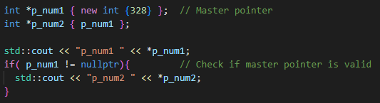

  - When solutions applied, We can compare pointer against nullptr and know if we can use it

## Pointers vs References example

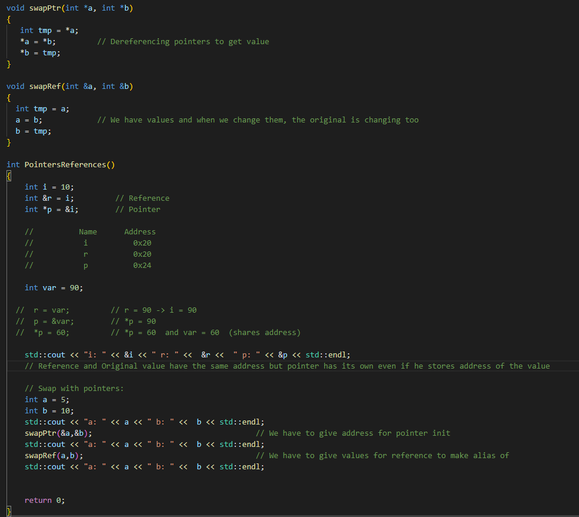

## Lvalue vs Rvalue

  - The original definition of lvalues and rvalues from the earliest days of C is as follows: 
    - An lvalue is an expression that may appear on the left or on the right hand side of an assignment, 
      whereas an rvalue is an expression that can only appear on the right hand side of an assignment. 

  For example:

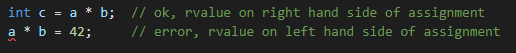
                    
                  
  - However that is not always true for C++ because functions can return references that we can assign to:
    - x = func();   // x is an lvalue, func() is an rvalue
    - func() = x;   // Not Legal in C but it is legal in C++

### For C++: 
  - An lvalue is an expression that refers to a named memory location and allows us to take the address of that memory location via the & operator. 
  - An rvalue is an expression that is not an lvalue.