# Polymorphism

- Polymorphism in general is the condition of occurring in several different forms
- Two types:
  - Run-Time polymorphism (virtual functions)
  - Compile-Time polymorphism (function overloading, operator overloading)

- Managing derived objects in memory through base pointers or references and getting right method called on the base pointer or reference
- Base class pointer or reference can takes multiple forms
- When we have different classes inheriting from the same base class we can do something like this:

- Circle, Rectangle and Oval all inherit from shape
- We can then set up function that will be same for all of them:

- Another benefit of polymorphism is that we can store different kind of objects in the same collection:

- Polymorphism does not need to start always at the top base class. We can start with polymorphism in derived class and it will work with its derived class but then of course we can not use the top base object pointer but pointer at that object where the polymorphism starts

## Polymorphic Objects

- Objects of a class type that declares or inherits at least one virtual function.
- Within each polymorphic object, the implementation stores additional information which is used by virtual function calls and by the RTTI features (dynamic_cast and typeid) to determine, at run-time the type with which the object was created.
- For non-polymorphic object, the interpretation of the value is determined from the expression in which the object is used and decided at compile-time

## Static Binding with Inheritance

- We would like this behavior:

- But the compiler just looks at the pointer type to decide which version of draw() to call
- It sees Shape* and calls Shape::draw() in all three cases in the picture 

## Dynamic Binding (Dynamic Polymorphism)

- We need to mark methods that are needed to be dynamically resolved as 'virtual'
- With dynamic binding the compiler is not looking at the type of the pointer but at the type of the actual object that the pointer is managing

- Dynamic binding is not free. Size of the object will increase because the program needs to keep track of information that allows us to resolve function calls dynamically.

## Slicing

- Once our data are sliced off, they are gone and there is no way to get them back

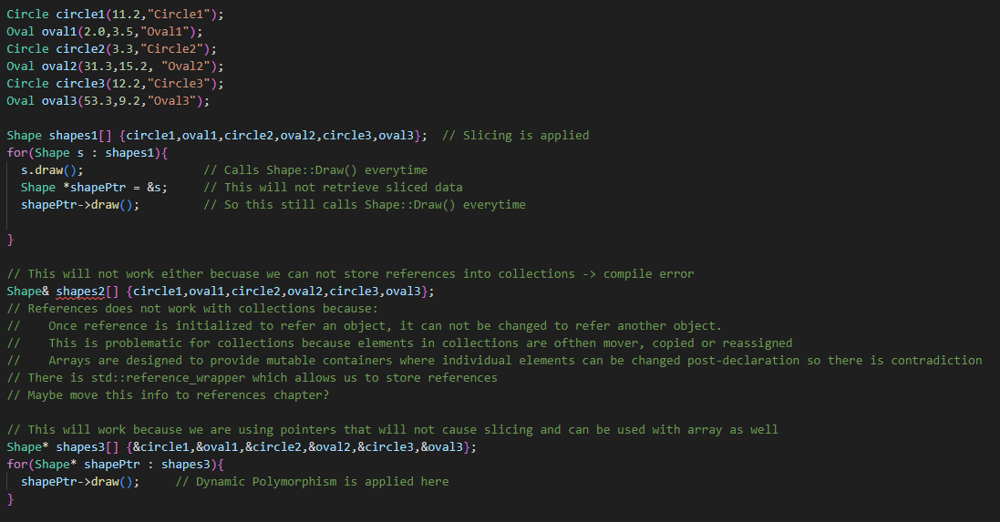

## Virtual Functions

- Declared in Base Class to be overridden by a derived class
- Ensures that the correct function is called for correct object, regardless of the type of reference or pointer used for function call
- Run-Time polymorphism -> Resolving of function call is done at Run-Time

### Rules

- Can not be static // Static are stored/created during compile-time ?to do?
- Can be friend function of another class  // ?friend function?
- Should be accessed by using pointer or reference of base class type to achieve Run-Time polymorphism
- Always defined in base class and overridden in derived class but it is not mandatory for derived class to override that function. In that case the base class function is being used.
- Class may have virtual destructor but can not have virtual constructor
- If class has at least one virtual function then we should use virtual destructor (See virtual destructors)

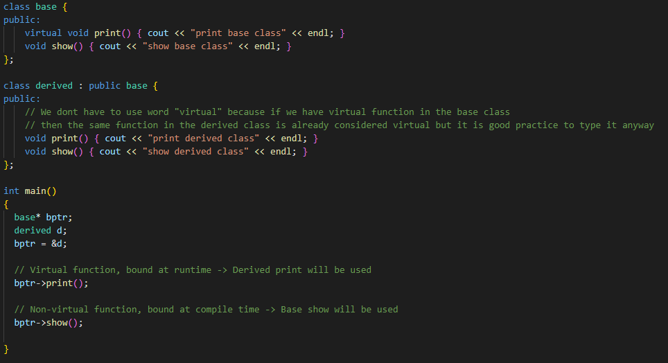

- We should use override to tell us that we want to override the virtual function and its not our mistake:  virtual void print() override { ... }

## Override (C++11)

- Introduced to avoid errors with typos when we are declaring virtual functions in derived classes
- With 'Override' compiler will inforce that our virtual function really exists in the parent class
  
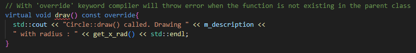

## Overloading

### Function Hiding

- If the parent class has some overloads of some function and we override (does not matter if we use 'override' or not) any of the variant in the derived class, all of the other overloads will now be hidden for that derived object so we need to override all of the overloads that we want to use with that object.

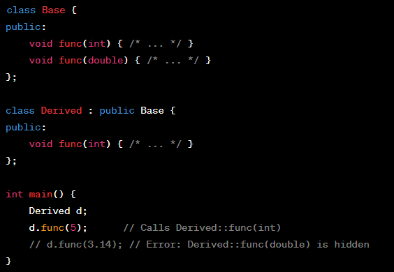

- Function Hiding with polymorphism:

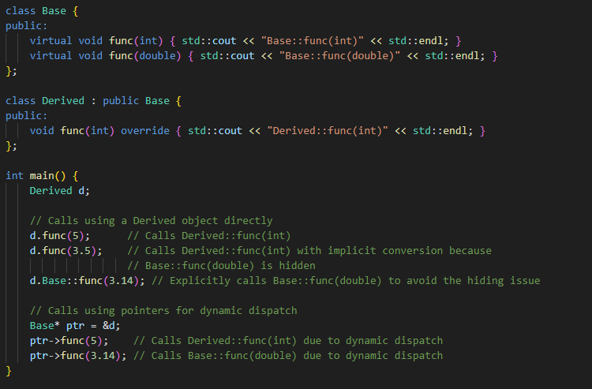

### Overloading downstream

- If we create new overload in the derived class that is not in the base class, we can not use it with polymorphism through the base class pointer because that function is not known to the base class

## Polymorphism and Inheritance with static members

- If we have some static member in the parent class, the derived class will inherit it but it will be shared with the parent:

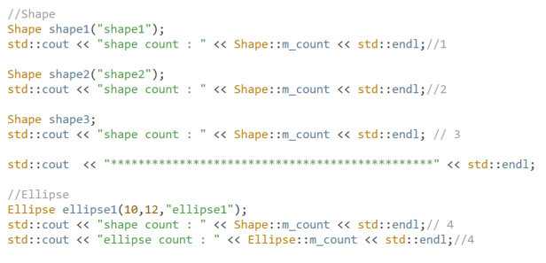

- If we want to have the same static member in the derived class but separated from the base class, we need to declare it in the derived class as well

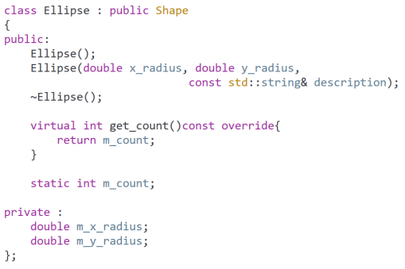
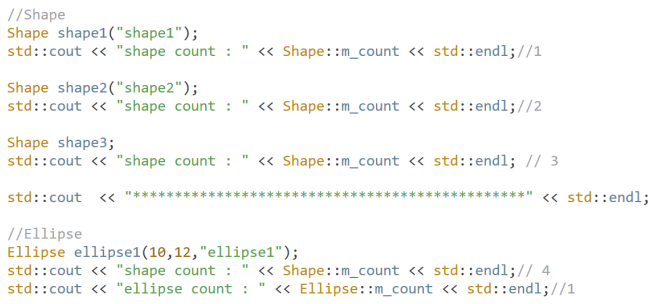

## Final (C++11)

- Restricts how we override methods in the derived classes
- Restricts how we can derive from a base class

- If we want to prohibit further overrides in derived classes we can use 'final' like this:
  
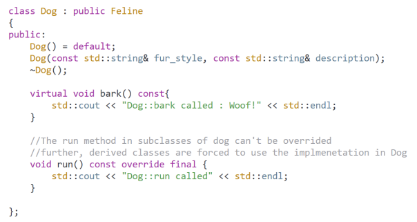

- Or if we want to prohibit any further inheritance we can use 'final' this way:

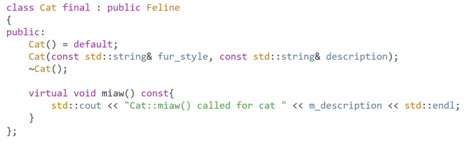

## Fun Fact

- 'Override' and 'Final' are not really C++ keywords but rather context-sensitive identifiers that act as keywords in specific context but can be used as names in other context

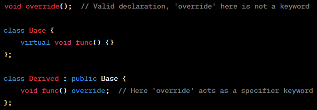

- It is like that because when they introduced them in C++11 these words could already be used in many codes as names so they did not want to break old codes but in modern C++ we should not use them as names

## Access Specifiers 

### With Dynamic Binding

- The base class access specifier wins when we are calling virtual functions through the base class pointer so this can lead to wierd scenarios
- So when we call the virtual function through the base class pointer the access specifier in the base class determines whether the function is accessible, regardless of the access specifier in the derived class
- In general, when the function call is done through dynamic binding, the access specifier of the base class is applied but if the call is done through static binding then the acces specifier of the derived class is applied

- Guideline:
  - Except for the base class, it is good to mark all other derived overrides as private, unless the specific problem requires otherwise

### With Static Binding

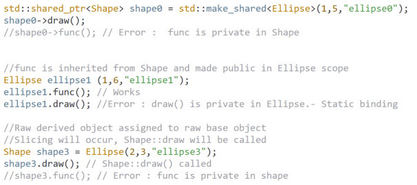

## Default Arguments

- Default arguments are handled at compile time
- Virtual functions are called at run time with polymorphism
- If we use default arguments with virtual functions, we might get weird results with polymorphism because default arguments are decided by static binding but virutal calls are decided by dynamic binding. Basically the base class default arguments will be used
- It is better to avoid default arguments with virtual functions

## Virtual Destructors

- With normal destructors we will have problems when destructing derived class through the base class pointer:

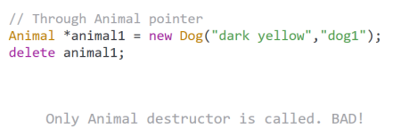

- So if we have some dynamic memory allocated in the derived class constructors it will just be leaked
- Solution to this problem is to mark our destructors as 'virtual'

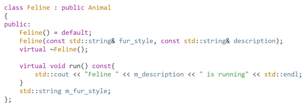

## Dynamic Casts

- Used for downstream transformation between our polymorphic types
- If we use the base pointer for the work with some derived object, We can access only virtual functions of that derived class, but if we need to use some non-virtual function from that derived class we can use dynamic cast to cast that base class pointer to derived class pointer
- Transforming from base class pointer or reference to derived class pointer or reference at run time
- Makes it possible to call non polymorphic methods on derived objects

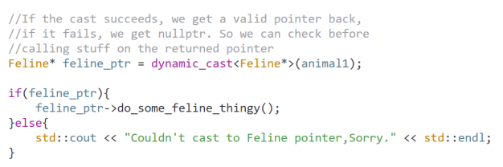

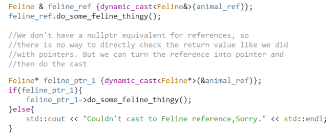

- But overusing down casts is a sign of bad design

## Warning

- **Never call virtual functions from constructors or destructors !!**
- Calling a virtual function from constructor or destructor will not give us polymorphic results
- The call will never go to a more derived class than the currently executing constructor or destructor -> static binding results

## Typeid() operator

- Peaking on the dynamic type of a base class pointer or reference
- Works only for polymorphic types
- Returns dynamic type if it can and the static type otherwise

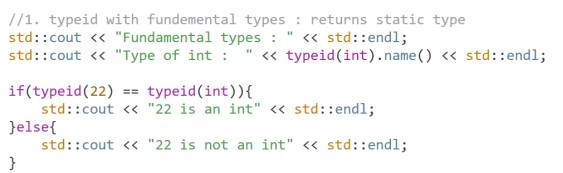

- Polymorphic types:

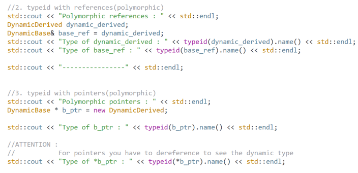

- It will print static for dynamic_derived but dynamic for base_ref because it is base class reference but it is referring derived object

## Pure Virtual Functions and Abstract Classes

- If we mark some function as pure virtual it means that they are not meant to be implemented in the base class but they will be implemented in the derived classes
- It also means that compiler will prevent us from creating objects of these base classes because they are now abstract classes

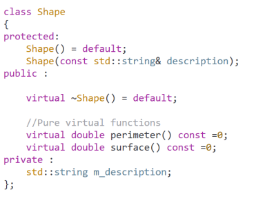

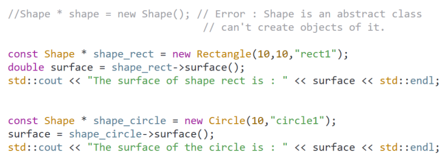

- Even only one pure virtual function will make our class abstract
- We can not create objects of an abstract class
- Derived classes from an abstract class must explicitly override all the pure virtual functions from the abstract parent class, if they do not, they themselves become abstract
- Pure Virtual functions do not have an implementation in the abstract class. They are meant to be implemented in the derived class
- We can not call the pure virtual functions from the constructor of the abstract class
- The constructor of the abstract class is used by deriving class to build up the base part of the object

## Abstract class as Interface

- An abstract class with only pure virtual functions and no member variable can be used to model interface
- An Interface is a specification of something that will be fully implemented in a derived class, but the specification itself resides in the abstract class
- We can attach interfaces to our types to give them some new function
- We attach interface by inheriting it

- We can for example have interface like this for printing our objects:
  
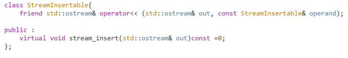

- In this implementation we can call virtual function of our objects and it will use polymorphism to use the most specified that we need

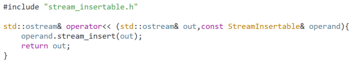

- Then we can attach this interface to our class and implement the virtual function that will be called from the operator overload

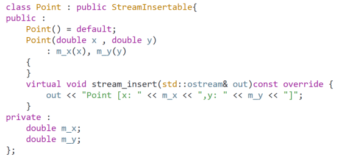
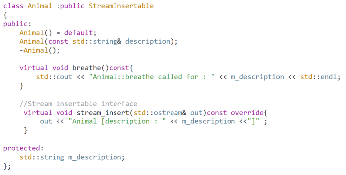