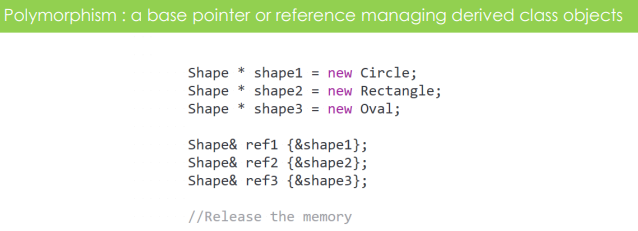
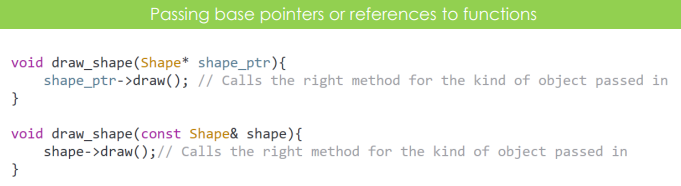
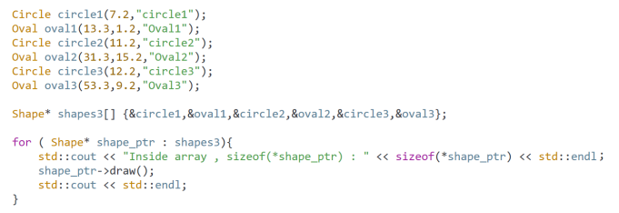
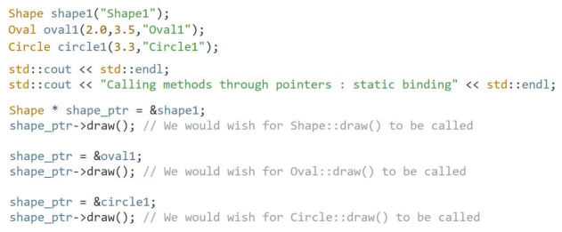
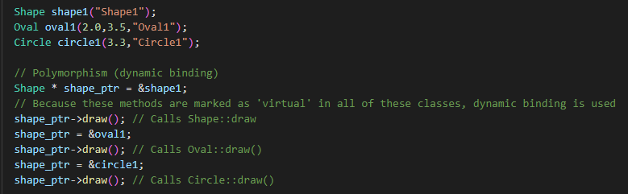
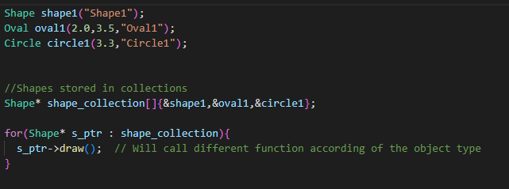

# Polymorphism

- Managing derived objects in memory through base pointers or references and getting right method called on the base pointer or reference
- Base class pointer or reference can takes multiple forms
- When we have different classes inheriting from the same base class we can do something like this:

- Circle, Rectangle and Oval all inherit from shape
- We can then set up function that will be same for all of them:

- Another benefit of polymorphism is that we can store different kind of objects in the same collection:

## Static Binding with Inheritance

- We would like this behavior:

- But the compiler just looks at the pointer type to decide which version of draw() to call
- It sees Shape* and calls Shape::draw() in all three cases in the picture 

## Dynamic Binding (Polymorphism)

- We need to mark methods that are needed to be dynamically resolved as 'virtual'
- With dynamic binding the compiler is not looking at the type of the pointer but at the type of the actual object that the pointer is managing

## Size of Polymorphic objects

- l
- l
- l
- l
- l
- l

- Two types:
  - Run-Time Polymorphism: Virtual Functions
  - Compile-Time Polymorphism: Function Overloading, Operator Overloading

// ------ Polymorphism ---------------------------------------------------------
//
// Two types:
//  - Run-Time polymorphism (virtual functions)
//  - Compile-Time polymorphism (function overloading, operator overloading)

// Compile-Time polymorphism
//
//  Function overloading
//      - When there are multiple functions with the same name but different parameters
//      - Function can be overloaded by change in number of arguments or/and change in type of arguments
//
class Geeks
{
    public:
      
    // function with 1 int parameter
    void func(int x) { cout << "value of x is " << x << endl; }
      
    // function with same name but 1 double parameter
    void func(double x) { cout << "value of x is " << x << endl; }
      
    // function with same name and 2 int parameters
    void func(int x, int y) { cout << "value of x and y is " << x << ", " << y << endl; }
};
  
int main() {
      
    Geeks obj1;
      
    // Which function is called will depend on the parameters passed
    // The first 'func' is called 
    obj1.func(7);
      
    // The second 'func' is called
    obj1.func(9.132);
      
    // The third 'func' is called
    obj1.func(85,64);
    return 0;
} 

//  Operator overloading
//      - For example: We can make operator + for string class to concatenate two strings.
//      - ?? add something interesting

class Complex {
private:
    int real, imag;
public:
    Complex(int r = 0, int i =0)  {real = r;   imag = i;}
       
    // This is automatically called when '+' is used with
    // between two Complex objects
    Complex operator + (Complex const &obj) {
         Complex res;
         res.real = real + obj.real;
         res.imag = imag + obj.imag;
         return res;
    }
    void print() { cout << real << " + i" << imag << endl; }
};
   
int main()
{
    Complex c1(10, 5), c2(2, 4);
    Complex c3 = c1 + c2; // An example call to "operator+"
    c3.print();
}

// ------ Polymorphic objects ---------------------------------------------------------
//
//  - Objects of a class type that declares or inherits atleast one virtual function.
//  - Within each polymorphic object, the implementation stores additional information which is used
//    by virtual function calls and by the RTTI features (dynamic_cast and typeid) to determine, at run-time,
//    the type with which the object was created.
//  - For non-polymorphic object, the interpretation of the value is determined from the expression in which the object is used
//    and decided at compile-time
//

#include <iostream>
#include <typeinfo>
struct Base1 {
    // polymorphic type: declares a virtual member
    virtual ~Base1() {}
};
struct Derived1 : Base1 {
     // polymorphic type: inherits a virtual member
};
 
struct Base2 {
     // non-polymorphic type
};
struct Derived2 : Base2 {
     // non-polymorphic type
};
 
int main()
{
    Derived1 obj1; // object1 created with type Derived1
    Derived2 obj2; // object2 created with type Derived2
 
    Base1& b1 = obj1; // b1 refers to the object obj1
    Base2& b2 = obj2; // b2 refers to the object obj2
 
    std::cout << "Expression type of b1: " << typeid(decltype(b1)).name() << '\n'
              << "Expression type of b2: " << typeid(decltype(b2)).name() << '\n'
              << "Object type of b1: " << typeid(b1).name() << '\n'
              << "Object type of b2: " << typeid(b2).name() << '\n'
              << "Size of b1: " << sizeof b1 << '\n'
              << "Size of b2: " << sizeof b2 << '\n';
}