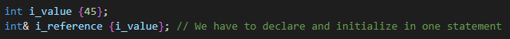
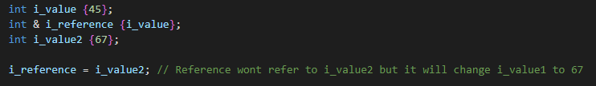
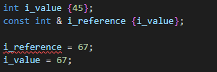
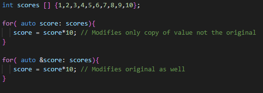
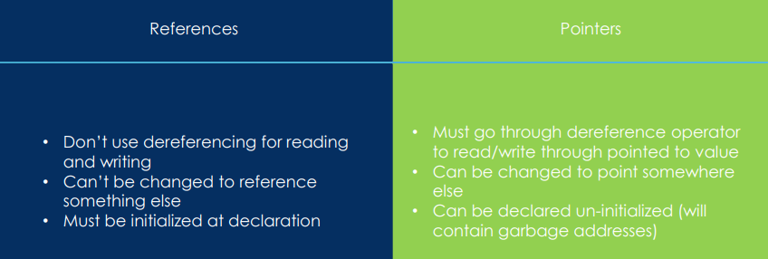

# References

- It is an alias for the original value
- Does not have its own address in memory => It has the same address as the original variable
- **We have to initialize reference when created !**
- If we increment reference the value of both reference and original is incremented
- If we pass something by reference into another function then if that function change it the original 
      is changed as well   (void changeSomething(&original){})

- References can not be changed to reference something else later
  

- References are somewhat like const pointers but they have much friendlier syntax

## Const Reference

- We can not modify reference but we still can modify the original if it is not const as well
- There is no such a thing as const int& const because reference can not refer to anything else then original by default
- **For const originals we can use only const references**

## References with ranged based for loop

## References vs Pointers  2 (Maybe its own markdown? ToDo )

