# Standard Template Library STL

- Containers
- Algorithms
- Iterators

## Containers

  - Containers store elements in different ways
  - The STL offers different containers for use in different scenarios to fit our particular use case in the best way possible
  - Choosing the right container for the job is very strong skill
  - If we do not know beforehand which container to choose, we can start with std::vector
  - More info [here](https://en.cppreference.com/w/cpp/container)

  ### Sequence Containers

  - For elements stored in a sequence
    
  #### std::vector

  - Storing stuff contiguously in memory and providing helper methods to manipulate the data
  - Defined in the [\<vector\>](https://en.cppreference.com/w/cpp/container/vector) header
  - Some basic functions:
    
    

  - Very fast lookup by index with '[]'
  - Inserting elements to the back is very fast when the capacity is enough
  - Inserting to the front is very expensive, we have to move all the elements to the right
  - Automatically grows its capacity to accomodate for new items if the old capacity is not enough
  - The most universal and used container
  - Supports both forward and reverse iterators

    

  - So we can use many iterator based functions like for example insert():

    

**Big O of Vector**

- Adding element to the end of the vector with **push_back()** has O(1) because it does not touch other elements
- Removing element from the end of the vector with **pop_back()** has O(1) because it does not touch other elements
- But if we are adding or removing elements from start of the vector then we need to re-index the whole vector so it is O(n)
- It is O(n) even if the element is in the middle because O notation is ignoring constants and it is worst case scenario based as well
- Searching element by value is O(n) because we need to go through the whole vector to find it if it is not sorted
- But Looking by the index is O(1) we can go straight to the index

#### std::array

- Storing stuff in a fixed size container
- Defined in the [\<array\>](https://en.cppreference.com/w/cpp/container/array) header
- Because this is fixed size container there is not that much of flexibility when inserting items
- Usually the data is inserted when array is created or with fill() method

- It is good when we want to enforce that our collection should be of given size
- Good replacement of raw arrays because it has more funcionality for example cross assigning
- Supports both forward and reverse iterator

#### std::deque

- Double Ended queue
- Defined in the [\<deque\>](https://en.cppreference.com/w/cpp/container/deque) header
- Very fast insertions and removals from both ends of the container
- Supports random access operators like '[]'
- The elements are not stored contiguously in memory however, they are stored and organized in such a way that insertions and removals from both ends of the deque:
  - Happens very fast
  - Do not require any element to be copied or moved
  - They never invalidate pointers or references to any other elements in the collection -> adding or removing elements and the both ends wont invalidate pointers or references to existing data

- When we insert at the iterator's position, the iterator will still point to the same element it was pointing to before the insertion
- But this is guaranteed only when we are inserting at the start or at the end
- When we are inserting at different position, due to the internal structure of std::deque, sometimes after an insertion, the iterator might point to the newly inserted element, especially when it causes some internal reallocation or movement of the chunks/blocks in the deque:

- Supports both forward and reverse iterators

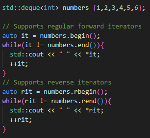

#### std::forward_list

- Defined in [\<forward_list\>](https://en.cppreference.com/w/cpp/container/forward_list) header
- Very fast insertions and removals in the middle of the container
- This is possible because each element has pointer to the next element

- It is implemented as a single linked list in memory
- The elements are not stored contiguously in the memory
- Supports only forward iterator because we have only pointers to the next element
- Poor memory locality makes things hard for the CPU optimizations when our list is being traversed
- Does not provide random access operators like '[]'
- To access a given item in the list, we have to perform a linear search from the beginning of the list
- Once we are at the correct location then the inserting and removing is very fast (just rewiring the pointers)
- Forward lists should be avoided. Vector is almost always better fit

- For insertion we can use 'insert_after' or 'emplace_after' the difference is:
  - insert_after copies or moves objects into the list
  - emplace_after directly construct the object in the container memory avoiding unnecessary copies 
  - Use insert_after when you already have an object and want to insert it (or copies of it) into the list
  - Use emplace_after when you want to construct an object in place within the list, especially when the construction might be more efficient than copying or moving an existing object.

- Other functions:
  

#### std::list

- Defined in [\<list\>](https://en.cppreference.com/w/cpp/container/list) header
- Very fast insertions and removals in the middle of the container
- Each element has two pointer. To the previous and to the next element.
- Both forward and reverse iterators are supported
- The elements are not stored contiguously in the memory 
- Poor memory locality makes things hard for the CPU optimizations when our list is being traversed
- Does not provide random access operators like '[]'

- It is really the same as forward_list but we have reverse operator here so we can use more functions because of it
- Also we do not need to use 'insert_after' or 'emplace_after' etc. now we can use 'insert', 'emplace', etc.

### Associative Containers

- Elements stored by key and ordering

#### std::set

- Defined in [\<set\>](https://en.cppreference.com/w/cpp/container/set) header
- Very fast searches for elements
- Orders its elements
- It does not matter in which order we insert the elements in
- This imposes one condition on the elements we can store in the set:
  - They must provide some way to compare elements so that they can be ordered
- The set internally uses operator '<' to order elements, and the types stored in the set must provide operator '<'
- Because elements are ordered, finding things in the set is very fast
- It is possible to customize how the set orders our element either through implementing operator< for our types or by specifying the comparator callback that the set will use to compare elements
- Does not allow duplcated elements to be stored in the container, if we try to insert a duplicate it will just be ignored
- To decide whetre it is a duplicate, it does not use operator== but instead: if !(x < y) && !(y < x)
- Supports both forward and reverse iterators
 

- We can customize the order comparator:

#### std::map

- Defined in [\<map\>](https://en.cppreference.com/w/cpp/container/map) header
- Supports operator '[]' but we are inserting key not index

- Stores key-value pairs
- Stores elements ordered by key in increasing order by default
- Does not store duplicate keys but it can store duplicate values
- Searches for keys are very fast because they are ordered

- We can set up key of any type
- Supports both forward and reverse iterators:

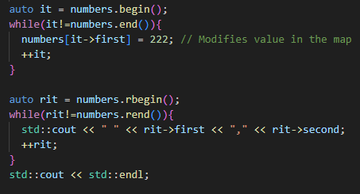

- We have many of the same functions as the set which is really similar container, map just stored key-value pairs
  

- We can also customize the order comparator here

#### std::multiset && std::multimap

- Variants of std::set and std::map that can store duplicates
- They are still ordered
- The rest of the methods are similar to std::map/std::set methods
- Multiset is defined in [\<set\>](https://en.cppreference.com/w/cpp/container/multiset) header
- Multimap is defind in [\<map\>](https://en.cppreference.com/w/cpp/container/multimap) header

### Unordered Associative Containers

- std::unordered_set and std::unordered_map are other variants of containers set and map but without ordering
- Internally they use hash map to order their elements, which makes operations on them even faster that their ordered counterparts
- It is possible to provide our own hash map to control how elements are ordered
- They are defined in  [\<unordered_set\>](https://en.cppreference.com/w/cpp/container/unordered_set) and  [\<unordered_map\>](https://en.cppreference.com/w/cpp/container/unordered_map) headers

- The operations are mostly similar to ordered set and map

### Container Adaptors

- Specialization of sequence containers
- Customizing and restraining the interface of some sequence containers to fit a particular purpose
- Mostly std::vector, std::list and std::deque
- 

#### std::stack

- Defined in [\<stack\>](https://en.cppreference.com/w/cpp/container/stack) header
- It is not a container. It is interface built on top of a few possible sequence containers (std::vector, std::list, std:deque) to allow a sellected set of few operations
- std::deque is the default container or std::stack
- std::stack works in order Last In First Out (LIFO) 
- To implement LIFO semantic, a stacks requires the underlying container to support back(), push_back() and pop_back()
- We access elements only from the top with the top() method
- We take out elements with the pop() method

- Clearing the stack:

- We can also specify the underlying container (deque is default one):

- Stack function complexities:

  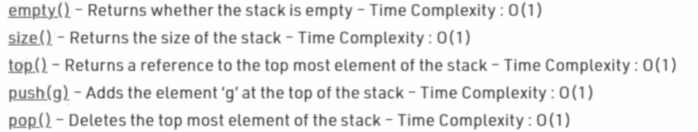
  

#### std::queue

- Defined in [\<queue\>](https://en.cppreference.com/w/cpp/container/queue) header
- Works in First In First Out (FIFO)
- To implement LIFO semantic, a stacks requires the underlying container to support back(), front(), push_back() and pop_front()
- std::vector does not support pop_front() so it can not be used but we can use std::list and std::deque(default one)

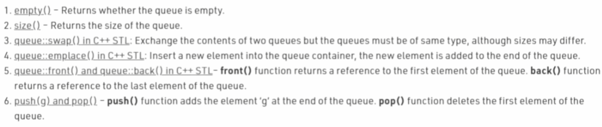

#### std::priority_queue

- Defined in [\<queue\>](https://en.cppreference.com/w/cpp/container/priority_queue) header
- Like queue but it orders its elements based on priority
- It uses a comparator function 'std::less<>' by default to compare and order elements
- It requires these methods: front(), push_back(), pop_back()
- std::vector(default one) and std::deque are possible options
- The elements are ordered using a comparator method
- We can control ordering through the operator< method of custom types stored in the collection or just by specifying a custom comparator functor

- Customizing comparator:

## Utility

### std::pair

- Is used to store two data components as a single entity
- Provides facilities to manipulate the components through the first and second data member
- Defined in [\<utility\>](https://en.cppreference.com/w/cpp/utility/pair)

## Iterators

- Traversing containers in a unified way, regardless of the internal structure of the container
- Each C++ container usually also defines iterators that traverse it

- We can use iterators in universal templates for containers:

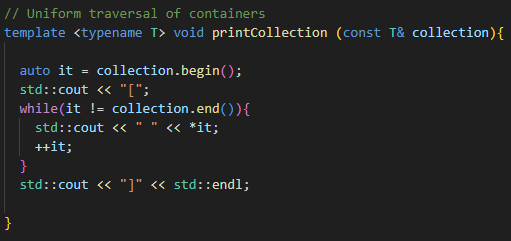

- More info [here](https://www.cplusplus.com/reference/iterator/)
  

### Reverse Iterators

- To travel through containers backwards

- If we increment reverse iterator it will move to the left (backwards)

### Constant Iterators

- We can not change the element that we are pointing to through this iterator

- There are even constant reverse iterators:

- When we are getting iterator with begin() or end() it will also return const iterator when the container itself is const:

### Comparing Iterators

- We can not compare iterators of different types

### Iterator Types

- We have different types of iterators based on what they guarantee

#### Input Iterators

- We can use input iterator to read from container
- If we dereference it we will get Rvalue -> We can not assign to it
- We can not use increment or decrement -> we can not move around with this iterator
- Can be dereferenced as an Rvalue
- Single pass from begining to end
- Supports: '++', '*' (read), '->' (read), '==', '!='

#### Output Iterators

- We can use ouput iterator to insert data into container
- If we dereference it we will get Lvalue so we get the original data from the container
- We can not use increment or decrement -> we can not move around with this iterator
- Can be dereferenced as an Lvalue
- Supports: '++', '*' (write), '->' (write), '==', '!='
  
#### Forward

- They can move forward in the collection ( '++' )
- It has also features of Input operator but if it is mutable then it can also be used to insert data
- Basically combination of input and output iterator
- Supports: '++', '*' (read, write), '->' (read, write), '==', '!='

#### Bidirectional

- They can move both forward and backward in the collection
- They have both '++' and '--'operator
- It has also features of Forward operator  

#### Random Access

- We can choose any element we want in the collection and we will get it straight away without moving there from begin() or end()
- Supports arithmetic operators '+' and '-' 
- Supports inequality comparisons ( '<', '>', '<=', '>=' )
- Supports compound assignment operator '+=' and '-='
- Supports offset dereference operator '[]'
- It has also features of Bidirectional operator  

#### Contiguous Iterator (C++20)

- Refines random access iterator by providing a guarantee the denoted elements are stored contiguously in the memory

### std::begin() and std::end()

- Template functions that return the begin and end iterator respectively for the underlying container passed as parameter
- These functions are usually helpful when we want our iterator based code to work even for regular raw C arrays
- C arrays support pointers and pointers meet all the requirements for random access iterators
- The requirement for the template argument is that the collection passed in should support these begin and end iterators

## Algorithms

- [Link to cppreference](https://en.cppreference.com/w/cpp/algorithm)
- The algorithms library defines functions for a variety of purposes that operate on ranges of elements
- Range is defined as (first, last) where last refers to the element past the last element to inspect or modify
  
- Sorting
- Finding
- Copying
- Filling
- Generating
- Transforming
- etc.

- We have legacy algorithms that work on iterator pairs
- Also we have range algorithms that work on containers directly
  

- **std::all_of std::any_of std::none_of**

  

- **std::for_each**

  

  

- **std::max_element std::min_element**

  - We have more overloads of these functions
  - We can use overload with just first and last iterator or we can use overload with added comparator

  

- **std::find**

  - This algorithm returns iterator of the element that we are searching for or the end iterator if it did not find it
  - **std::find** uses the **== operator** as a predicate -> Compares each element to the target value

  

- **std::find_if** 
  - Allow us to supply our own predicate
  - Pass a callable object as an extra argument
  - Allow us to change the definition of "equality"
  - The predicate takes an argument of the element type and returns bool
  - We can create a predicate with the lambda expression
    
    

  
  
- **std::copy**

  

  - There is also std::copy_if

- **std::sort**

  - Modifying algorithm
  - To sort out collections
  - Algorithm need random access iterator to work

  

- **std::transform()**

  - Copies + adjust elements from one collection into another
  - Does not extend the output collecting capacity
  - Takes an iterator range and a callable object
  - Applies the callable object to every element in the range
  - Store the result in a destination

  

  - **Binary overload of std::transform()**

    - **std::transform()** can take an extra argument
      - This represents a second source
      - The function object is now a binary operator
      - Applied to corresponding pairs of elements from each source
      - The result is stored in the destination

      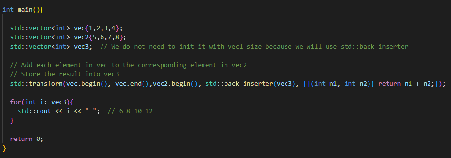

- **std::accumulate()**
  - Adds each element to an initial value
  - Returns the result
  - By default the operator **+** is used to perform the addition
  - We can pass a callable object as an optional fourth argument
  - Specified to execute sequentially
  - Can not be parallelized - Each operation must complete before the next one can start
  - Can not be vectorized - Each operation can only take two arguments
  
  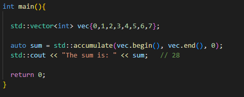

- **std::partial_sum()**
  
  - Calculates the sum of the elements so far
  - As with **std::accumulate()** the calculation must be done in fixed order

  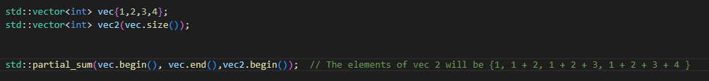

- **std::inner_product()**

  - Multiplies the corresponding elements of two containers together
  - Calculates the sum of these products

  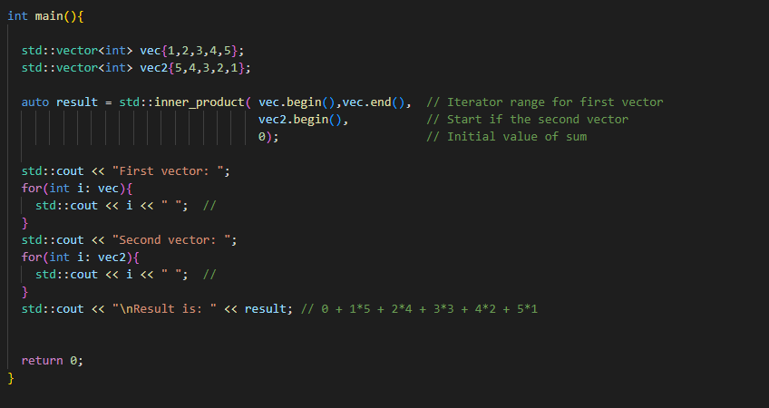

### Constrained Algorithms (C++20)

- C++20 provides constrained versions of most algorithms in hte namespace std::range
- In these algorithms a rance can be specified as either an iterator-sentinel pair or as a single range argument
- Projections and pointer to member callables are supported
- Additionally, the return types of most algorithms have been changed to return all potentially useful information

### Algorithms and Exceptions (C++14)

- Algorithms can throw exceptions
  - e.g. an algorithm call which applies a function to every element
  - The function throws an exception
- The exception will be handled by other code (if there is no handler -> execution ends)

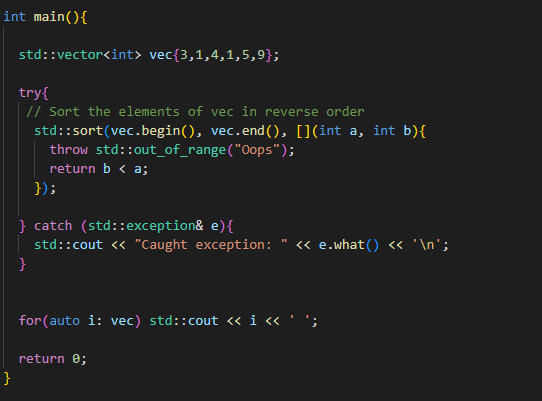

- **Execution policies (C++17)**
  - But this approach does not work with execution policies (C++17)
    - Maybe multiple threads
    - Each thread has its own execution stack
  - If and exception is thrown **std::terminate()** is called -> it will terminate all threads included main thread

  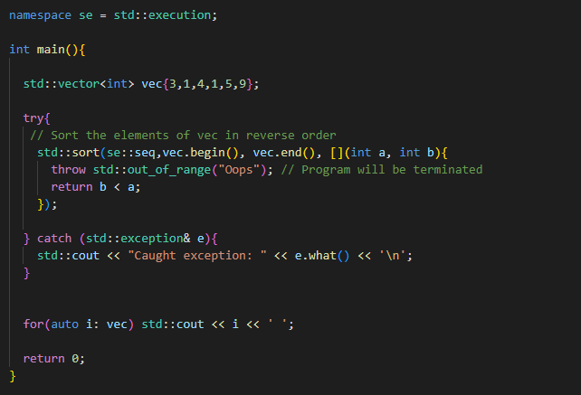
  

### Parallel Algorithms

- **std::reduce()**
  
  - Re-implementation of [**std::accumulate()**](#accumulate)
  - Supports execution policies

  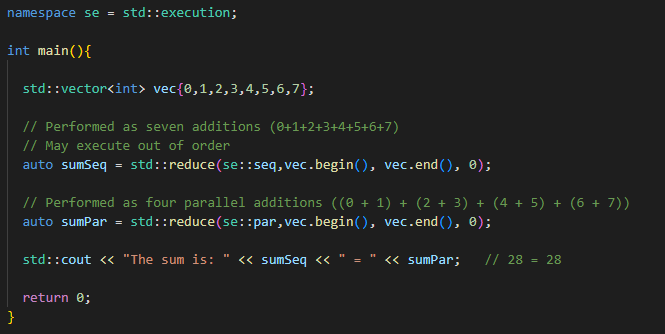
  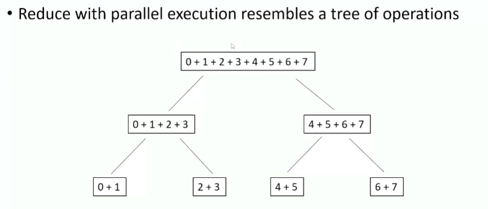

  - **Restrictions**
    - **std::reduce()** will not give the correct answer if reordering the operations or regrouping them alters the result
    - The operator used must be **Commutative** and **Associative**
  

- **std::inclusive_scan()**
  
  - Works the same way as [**std::partial_sum()**](#partialSum)  
  - But we can optionally add an execution policy

  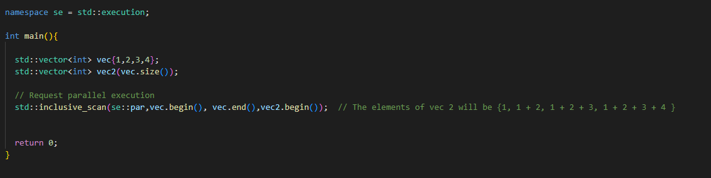

- **std::exclusive_scan()**
  
  - Similar to **std::inclusive_scan()** but excludes the current element
  - Takes an extra argument and uses it instead of the current element
  
  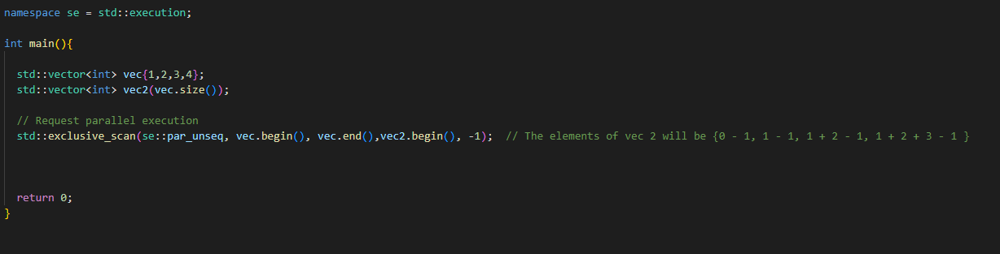
  

- **Transform and Reduce Pattern**

  - A very common pattern in parallel programming
  - Also known as **map and reduce**
    - Divide the data into subsets
    - Start each thread for each subset
    - Each thread calls **std::transform()**
    - **std::transform()** performs some operation on the thread subset
    - Call **std::reduce()** to combine each thread result into the final answer
  - Using separate algorithm calls slows things down
    - Each transform() thread has to store its result
    - reduce() can not start until all the transform() threads have finished
    - reduce() has to read the results from the transform() threads
    - reduce() may start up its own threads

- **std::transform_reduce()**

  - Combines the two functions to avoid the overhead of separate [**std::transform()**](#transform) and **std::reduce()**  calls
  - Is a re-implementation of [**std::inner_product()**](#innerProduct) 
  - Support for execution policies

  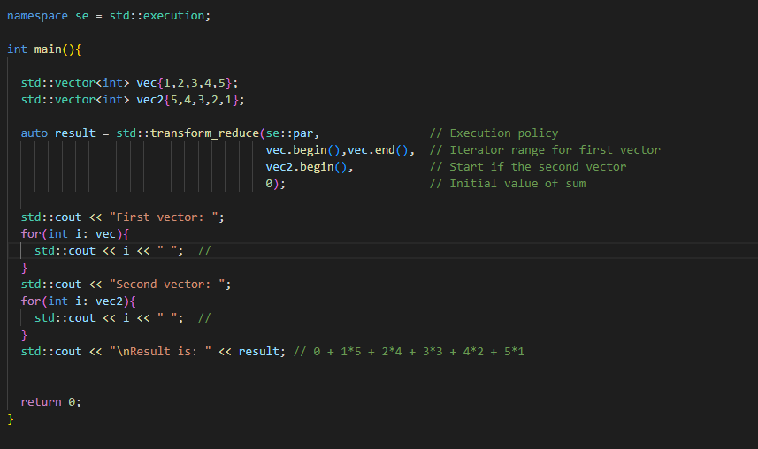

  - **Overload**

    - We can use our own binary functions instead of the default **+** and **\*** operators for the elements
    - We can replace **\*** operator by a **transform** function
      - Takes two arguments of the element type
      - Returns value of its result type
    - We can replace the **+** operator by a **reduce** function
      - Takes two arguments of the transform return type
      - Returns a value of the final result type
    - **Example:**

      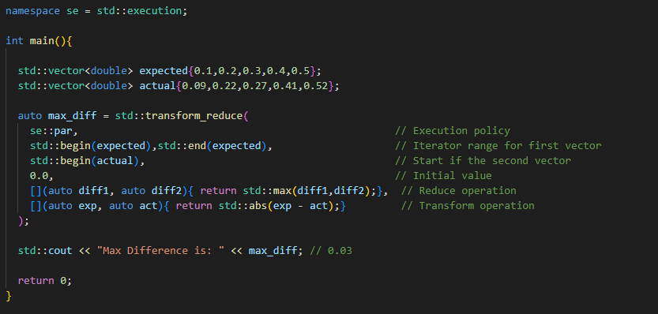

- **When to use Parallel Algorithms**

  - **Cons**
    - May not have any effect
      - Not supported on some compilers
      - Not fully implemented on all compilers
      - May fall back to non-policy version
    - Extra overhead
      - The algorithm may start up new threads
      - The algorithm must manage these threads
  - Do not use an execution police if:
    - Your code has to be portable to other compilers
    - The task ise essentially sequential
    - Operation order is important
    - The algorithm call throws exceptions (Unless immediate termination is acceptable)
    - Preventing data races cots more than not using the execution policy
  - Consider using an execution policy if:
    - Measurement shows a worthwhile improvement in performance
    - It can be done safely and correctly

- **Which Execution Policy**
  - **Sequenced** execution is mainly used for debugging
    - Same as non-policy, but allows out of order execution and terminates on exceptions
  - **Parallel unsequenced** execution
    - Has the most potential to improve performance
    - Also has the strictest requirement
    - Use when data races can not occur
    - Use when Code does not modify shared state
  - **Parallel** execution
    - Use when vectorization is not safe
    - Data races can not occur but code modifies shared state
  - **Unsequenced** execution
    - Can be used with single threading
    - If code does not modify shared state