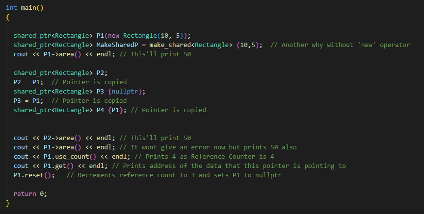

# Smart Pointers (C++11)

- For raw pointers we have to manually release memory ourself through the 'delete' operator
- Smart pointers are a solution offered by modern C++ to release the memory automatically when the pointer managing the memory 
  goes out of scope
- We need to include \<memory\> header

## Unique Pointers (unique_ptr)

- Stores only one pointer only
- we can assign different object by removing the current object from the pointer
- Memory is automatically released when the pointer goes out of scope

- We can also completely avoid the 'new' operator with 'make_unique' so it wont be confusing that we have 'new' but no 'delete'

- We can not even pass unique pointer by value to some functions because it would create a copy but we can use 'move' operator for that but that would reset our original pointer to
  nullptr which we usually do not want
- But we can pass unique_ptr by reference
- Returning by value:
  

- Having a functions return unique_ptr is the preferred way to do things, as we can turn that pointer into a shared_ptr at any time, but we can not turn shared_ptr into 
  the unique_ptr. 
- unique_ptr are much more flexible to work with in this case

## Shared pointer (shared_ptr)

- By using shared_ptr more than one pointer can point to this one object at a time and it will maintain a reference counter
  using use_count() method.
- If there are more pointers and any of them will go out of scope, the reference counter will decrement
- If there is only one pointer and it will go out of scope, the data that it points to will be deleted and memory released
- make_shared syntax is not supported yet for raw arrays
- If we want to use shared_ptr with arrays, then we have to use 'new' operator
- Or we can use some more useful collections

- We can also easily turn unique pointer into shared pointer if we 'move' unique pointer into shared pointer initialization

- **But we can not transform from shared pointer to unique pointer !!**
- **We also should not return shared pointers from functions by reference because it will brake the reference counter!!**

## Weak pointer (weak_ptr)

- Non owning pointers that do not implement '*' operator. We can not use them directly to read or modify data
- In this case a pointer will not have a stronghold on the object.
- The reason is if suppose pointer are holding the object and requesting for other objects then they may form Deadlock

- Usecase:

- If person_b shared pointer will go out of scope but the Person Beth itself wont be deleted because Person Allison has shared pointer pointing to Beth as well
- Then if person_a shared pointer will go out of scope, Person Alison will not be deleted because Person Beth has shared pointer pointing to it so we will lose both pointers
  and these two objects will be leaked
- We can solve this problem if we set up pointer to friend to be weak_ptr

- Now the reference count will go to 0 when the original pointer to person will go out of scope and the person will be deleted

## Summary 

- [recommended reading ](https://stackoverflow.com/questions/15648844/using-smart-pointers-for-class-members)

- We can also create generic template for smart pointer
  

