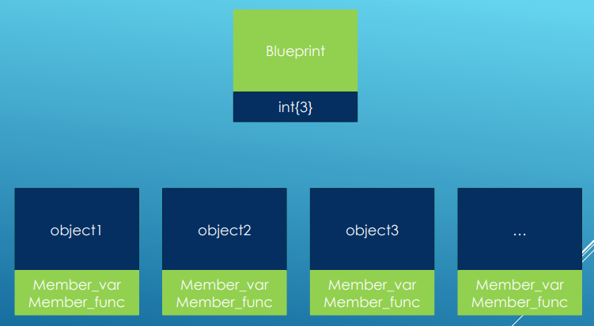
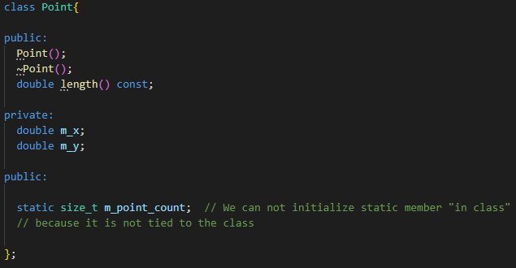
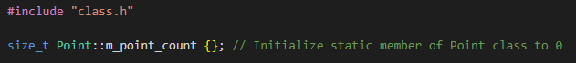
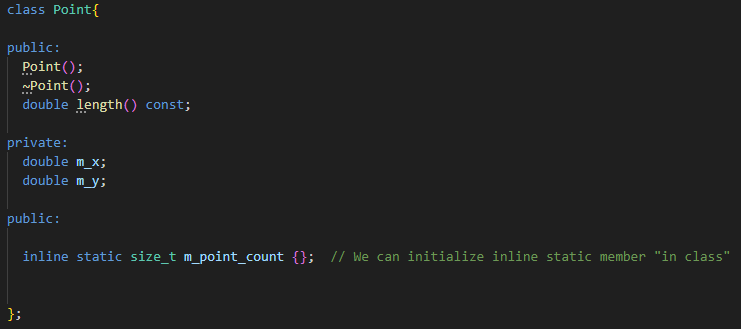
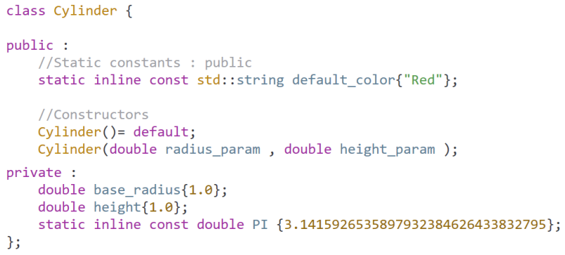
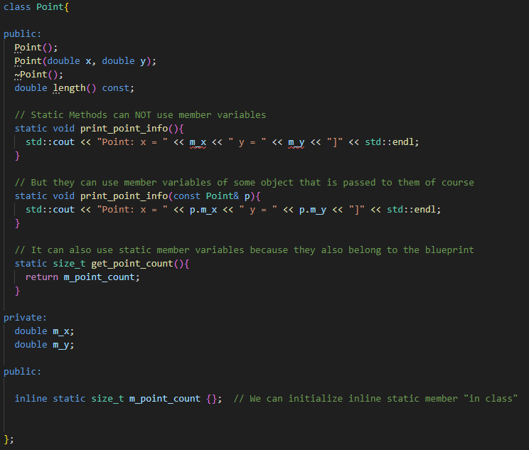

# Static and Const Members

## Static members

- They are not tied to any object
- They are tied to the blueprint itself
- They are created even before a single class object has been created
- Each instance of class has its own variables and functions
- However all the instances of the same class can share static members

- Static Initialization order is not guaranteed. If we have static variables that depend on other static variables, we may crash our application
  if the initialization order does not work in our favor

### Declaration

- We can not initialize them in header files at all unless they are guarded against multiple inclusions
- Otherwise we would end up with multiple definitions of the same data member which would violate One Definition Rule (ODR)
- But we can initialize it like this:

- We can not initialize non const static variables "in-class"
- But we can initialize const integral static variables "in-class"
- We can also initialize constexpr static variables "in-class"
- **It must also be in the public section of the class**

### Inline Static Members (C++17)

- We can initialize them "in-class"
  

- We suggest to compiler that the member can be defined in multiple translation units but it should treah all of the definitions as a single definition

### Static Constants (C++17)

- We do not need to keep constant outside of the class
- With static constants we can just keep them inside of the class
  

## Static member functions

- Functions that are attached to the class blueprint itself
- But because of that, static functions does not have access to member variables of the object
- Member variables belongs to object but static function to blueprint so it is logical that it does not have access to them

- Also we can notice that we can access private variables of that passed object, that is because we are inside of the class of that object