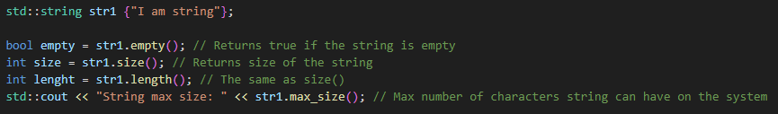

# Strings

## Character Manipulation

- By using \<cctype\> library We can check if character is:
  - alphanumeric 
  - alphabetic
  - etc...
- We can see all the functions [here](https://en.cppreference.com/w/cpp/header/cctype) 

## C-String manipulation

- We can use [\<cstring\>](https://en.cppreference.com/w/cpp/header/cstring) library to work with C-strings
- So check all the functions there
- We can check length of the string, compare strings, copy strings, merge two string into one and much more

### strlen

- Unlike std::size and ranged base for loop, we can use std::strlen even with array decayed into a pointer

## C++ String (std::string)

- Included by \<string> library

### Initializing std::string

### Concatenating std::string

### Accessing characters in the std::string

#### c_str() 

- returns const char *, so we should not use it to modify data in the string

### data()

- returns char *, so we can modify string with it

### std::string size and capacity

#### Capacity

- Current amount of memory allocated for the string
- Capacity is allocated automatically
- When we try to store in more characters than the current capacity, It will allocate larger memory space for the string

- We can also allocate higher capacity manually with 'reserve()' function

- Or we can reduce the capacity to the lowest possible number so the string will still fit

### Modifying std::string

#### Insert

- Inserts characters or strings inside the string
- There are many versions of this function (overloads)

#### Clear

- Clear function will delete stored string
- The size will be set to 0, but capacity remains the same

#### Erase

- Erase function will delete specified characters from the string

#### push_back and pop_back

- push_back() appends the specified characters to the end of the string
- pop_back() removes the last character from the string

### Comparing std::string

- Two strings are equal if they have the same size and the same characters in all positions
- Comparison is carried out lexicographically by default
- We should be careful to use only 'NULL terminated' strings otherwise it will go overbound trying to find it
- We can use '==','!=','<'',>','<','=','>=' operators or 'std::string::compare' function
- std::string::compare()
  - Returns zero if both string are equivalent
  - Returns negative value if the first string is lexicographically less than the second string
  - Returns positive value if the first string is lexicographically greater than the second string

### Searching std::string

### std::string From/To Number

- To create string from numeric value, we can use function std::to_string()

- To get numeric value from numeric string we can use according function from the official documentation [list](https://en.cppreference.com/w/cpp/string/basic_string)

### Other std::string functions

#### Replacing 

- More versions [here](https://en.cppreference.com/w/cpp/string/basic_string/replace)

#### Copying

#### Resizing

#### Swapping

### std::string_view

- String views cannot outlive its original
- We can use some functions as suffix(), preffix(), etc., which will change the view but not the original

## Difference between '\n' and 'std::endl'

- '\n' will move us on the next line but it does not directly flush std::cout
- 'std::endl' will move us on the next line but also it will flush std::cout

## Raw string literals

- We can use them to format text

- There is a problem if our raw string contains (" or ")
- But we can work around it with '---' 

