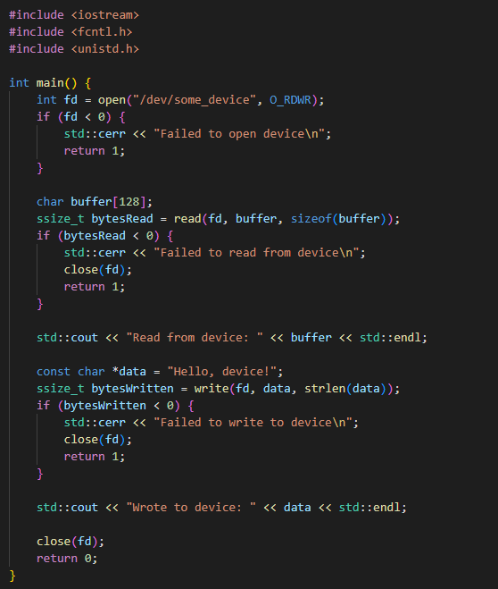

# System Level Programming

## Interrupts

- Signals sent to the CPU by hardware or software indicating an event that needs immediate attention
- They temporarily halt the current CPU operations to handle the interrupt event
- Mechanism for handling asynchronous events

- **Example**

## I/O Operations

- Involve reading from or writing to a device
- This can be done using system calls like **read()**, **write()**, **open()** and **close()** 

    

## Direct Memory Access DMA

- Allows device to transfer data to/from memory without involving the CPU, increasing efficiency and performance for I/O operations
- Allows devices to transfer data directly to/from memory

## Low Level Device Management

- Involves interacting directly with hardware such as setting up and controlling hardware registers
- Direct interaction with hardware registers