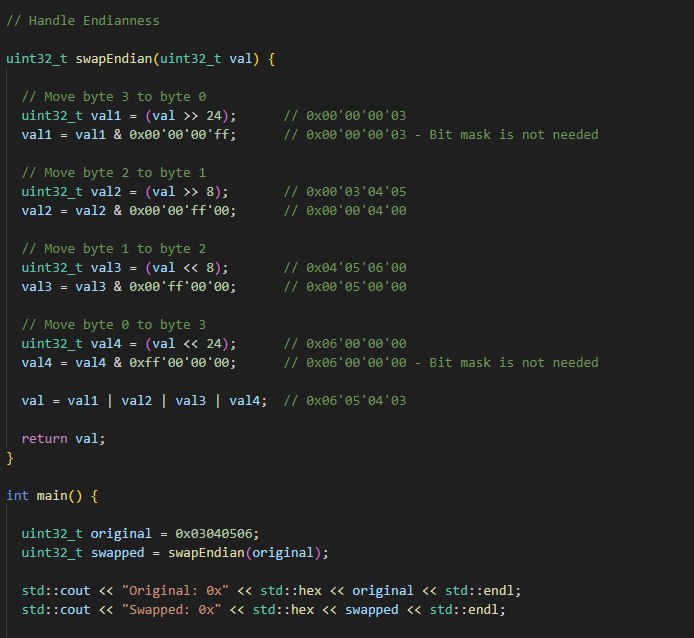
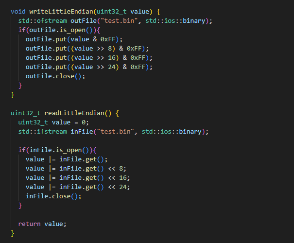

# System Level Programming

## Interrupts

- Signals sent to the CPU by hardware or software indicating an event that needs immediate attention
- They temporarily halt the current CPU operations to handle the interrupt event
- Mechanism for handling asynchronous events

- **Example**

## I/O Operations

- Involve reading from or writing to a device
- This can be done using system calls like **read()**, **write()**, **open()** and **close()** 

    

## Direct Memory Access DMA

- Allows device to transfer data to/from memory without involving the CPU, increasing efficiency and performance for I/O operations
- Allows devices to transfer data directly to/from memory

## Low Level Device Management

- Involves interacting directly with hardware such as setting up and controlling hardware registers
- Direct interaction with hardware registers

## Virtual Memory

- Memory management technique that provides and idealized abstraction of the storage resources that are actually available on a given machine
- It allows large programs to be run on systems with less physical memory
- It allows programs to use more memory than what is physically available by using disk space to extend RAM
- Virtual memory enables processes to use a continuous address space, simplifies memory management, and provides isolation between processes. 
- It allows the operating system to move data between physical memory (RAM) and disk storage (swap space) as needed.
- It relies on **paging**:
  - Data is moved between physical memory and disk storage
  - Paging can introduce performance overhead especially if there is frequent swapping

## Endianness

- Refers to byte order in memory
- **Little Endian** 
  - stores the least significant byte first
  - Number **0x12345678** will be stored as **78 56 34 12** in memory

- **Big Endian** 
  - stores the most signiicant byte first
  - Number **0x12345678** will be stored as **12 34 56 78** in memory
- C++ does not abstract endianness, it is determined by the underlying hardware architecture
- But provides mechanisms to check and handle it
- We can use unions or bitwise operations to handle endianness
- **Endianness Check**

    

- **Reading and Writing with Specific Endianness**
  - When dealing with binary data (e.g., files or network streams), you often need to read and write data in a specific endianness
  - Here’s an example using **std::ifstream** and **std::ofstream** for reading and writing little-endian integers:

    

- We should explicitly manage endianness when dealing with binary data formats and network communications to ensure our program can handle data correctly across different systems and architectures