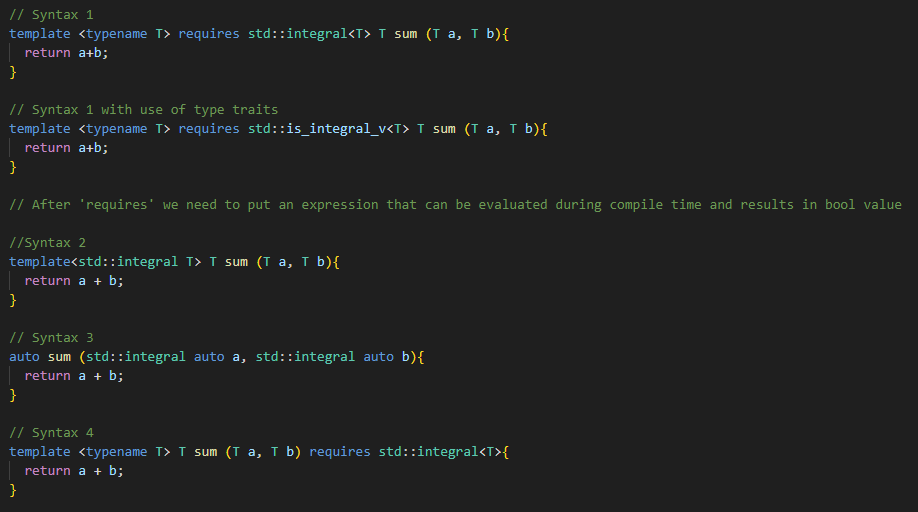

# Templates

- To avoid code repetition
- Templates are expanded at compile-time, like macros, difference is, the compiler does type checking before template expansion.
- Source code contains only function/class, but compiled code may contain multiple copies of same function/class
- Templates are not the actual C++ code. It is just blueprint from which the compiler will create the C++ code
- The real code that is generated by the compiler is called a template instance
- Template instance will be reused when a similar call is issued. No duplicates are generated.

## Function templates

- Generic function that can be used for different data types
- Examples are: sort(), max(), min(), printArray()

- Function templates are just blueprints, they are not a real function declaration and definition
- Real function declaration and definition are created when we call the function with arguments
- If template parameters are of the same type (T,T), then the arguments we call the function with must also match,
  otherwise we will get a compile error
- Template instances wont always do what we want. For example when we call our maximum function with pointers -> It will compare the pointers not values
  - If we want to use pointers we must declare that in the template (T* a, T* b)
- There are tools like cppinsights.io that can show us template instantiations
- The arguments passed to a function template must support the operations that are done in the body of the function

### Type deduction

### Template type parameters by reference

### Function Template specialization

- If we want to tell compiler to do exceptions for some special types when using templates, we can use template specialization
- In the example below the compiler would normally compare pointers for the const char * type and not the string. By using the template specialization
  the compiler will know that we should compare the string not the pointers.

- Template specialization is the real C++ code unlike the template itself, so we should not put it into the header files

### Function templates overloading

- We can of course overload the function templates as well even with the non-template functions

### Specialization vs Overloading

- Both specialization and overloading are useful when we want to do something little bit different for some specific data types
- Specialization is useful when we want to define different behavior for a particular type while using generic definition for all other types
- Overloading is useful when we want to define different behavior based on the number or kind of arguments rather than their types
- In summary (just guidelines):
  - If we want to provide different implementations based on type, use template specialization
  - If we want to provide different implementations based on the number or kind of arguments, use function overloading

### Function templates with multiple parameters

### Return Type Deduction with Auto

- The largest possible type is deduced so anything can fit
- But we can force compiler to deduce type from explicit argument list

- Deduces by value
- Definition has to be in front of call

### decltype and trailing return type

- To deduce type of an expression

- decltype is tricky to use for return type:

- But we can use trailing return type to fix it

- Also with use of the trailing decltype return, We can use 'auto' with split declaration and definition

- It is going to work because compiler can now see the return type through the decltype, 'auto' is just place holder
- Deduces references, keeps constness

#### decltype auto

- Mechanism to avoid duplication of decltype return as we can see in the previous codes
  

- But we can not split function code into declaration and definition
- Deduces references, keeps constness
- Definition has to be in front of call

### Default Arguments

- We can use default arguments with the template functions

### Non Type Template Parameters

- As of C++20, non-type template parameters can be of any basic type, enumeration type, pointer type or reference type
- Any class type that has only public members can also be used (c++20)
- C++17 and below, only int like types coud be used
- Benefits:
  - Efficiency when we want to pass in value that determines the behavior of a function at compile time
  - They enable optimizations at compile time, as their value are known during the compilation
- It could be useful when creating a compile-time sequence of numbers or when we need to perform some action a specific number of times at compile time
- These situations are not possible with regular function parameters, which are runtime entities
- However they should be used with caution because they can make code more complex and they can lead to longer compilation times if overused
  
#### Comparison with function parameter

### Auto Function Templates

### Named Template Parameters for Lambda

### Type Traits

- A mechanism to query information about a (templated) type at compile time

- More versions [here](https://en.cppreference.com/w/cpp/header/type_traits)

- We can use this mechanism to check type inside of the template function -> conditional compile time programming:

- We can also use _v syntax (C++17):

### constexpr if

- Makes conditional compilation easier and more flexible

- We know which function will be used during compilation time -> Parts discarded by constexpr if are not included in the template instances ! 

## Concepts (C++20)

- Mechanism to place constraints on our template type parameters
- Could be alternative to static asserts an type traits
- Two types:
  - Standard built in concepts
  - Custom concepts

- Some of the standard concepts:

- There are more syntaxes for the concepts that we can use:

- All of these do the same. In the example above, compiler will allow to pass only integral types into the template function

### Custom Concepts

- We can create our own concepts like this:
  

- Using custom concepts:

// Examples in Iterators and in training workspace

template <class INPUT, class ITEM>
INPUT cpp_find(INPUT zac, INPUT kon, ITEM item)
{
	for (; zac != kon; ++zac)
	{
		if (*zac == item) {  
			break; 
		}
	}

	return zac;
}
