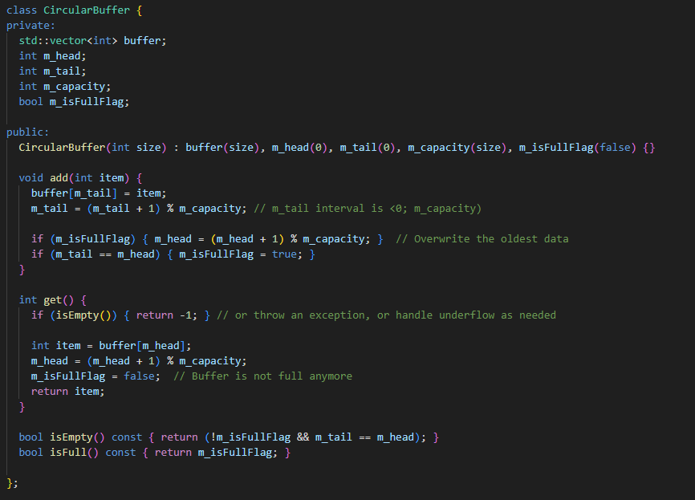

## Algorithms Data Structures

- **Merge Overlapping Intervals**
 
  - **Objective**
    - Write C++ program that merges overlapping intervals
    - We are given a collection of intervals represented as pairs of integers, where each pair represents the start and end of an interval
    - Our task is to merge all overlapping intervals and output the resulting intervals 
  - **Input**
    - A vector of pairs where each pair is an interval: { {1,3}, {2,6}, {8,10}, {15,18} }
  - **Output**
    - A vector of merged intervals. For the given example: { {1,6}, {8,10}, {15,18} }

  - **Requirements**
    - Implement function that takes a vector of interval pairs and returns a vector of mergd intervals
    - The input can contain intervals in any order and the intervals in the output should be sorted

  - **Hints**
    - Sort the intervals based on their starting points
    - Iterate through the sorted intervals and merge them if they overlap

  - **Solution**
    

- **Version-Control System**
  - Write a C++ program that simulates a basic version-control system for text files
  - This system should support saving versions of a file, restoring any saved version and viewing the history of changes

  - **Requirements**
    - Implement a class **VersionControl** with the following methods:
      - **void saveVersion(const std::string& content)**: Saves the current version of the content
      - **std::sting getVersion(int version)**: Retrieves the content of a specific version number. If the version does not exist, return an empty string
      - **std::vector<std::string> getHistory()**: Returns list of all saved version contents
    - Assume each call **saveVersion** increments the version number starting from 1 and maintain all versions of the content
    - Optimize for quick saves and version retrieval

  - **Hints**
    - Use suitable STL container to store the versions of the content
    - Consider the trade-offs in space and time complexity based on the container you choose 

  - **Solution**

    

## String

- **Custom String Compression Function**
  
  - **Objective**
    - Write a C++ program that implements a function to perform basic string compression using the counts of repeated characters
    - For exmaple: "aabcccccaaa" -> "a2b1c5a3"
    - If the compressed string would not become smaller than the original string, our function should return the original
    - We can assume that string has only uppercase and lowercase letters

  - **Requirements**
    - Implement function **compressString** that takes a string and returns a compressed string
    - The function shoud create the compressed string by concatenating repeated characters with their counts
    - The function should be case-sensitive
    - If the compressed string is longer than or equal to the original string, return the original string

  - **Hints**
    - Iterate through the string, keeping track of the current character count
    - When the current character changes, append the previous character and its count to the result
    - Consider edge cases, such as empty string or sting with all unique characters

  - **Solution**
    

## Algorithms

- **Cyrcular Buffer**
 
  - **Objective**
    - The buffer should be implemented with a fixed size, specified at the time of creation
    - Implement the following methods:
      - **void add(int item)**: Adds an item to the buffer. If the buffer is full it should overwrite the oldest data
      - **int get()**: Retrieves and removes the odest item from the buffer. If the buffer is empty it should return default value
      - **isEmpty()**: Returns true is the buffer is empty
      - **isFull()**: Returns true if the buffer is full
  
  - **Hints**
    - Use an array to store the buffer content
    - Keep track of the head and tail indices
    - Consider the edge cases such as adding to full buffer or retrieving from an empty one

  - **Solution**

    
    

- **Sum of Two numbers in Sorted Array**

  - **Objective**
    - Write a C++ program that determines if there are two distinct numbers in sorted array that add up to a specific target number
    - The function should return boolean value indicating whether such pair exists

  - **Requirements**
    - Implement a function with the following signature **bool hasPairWithSum(const std::vector<int>& numbers, int targetSum);**
    - The input vector **numbers** is sorted in ascending order
    - Optimize the function to have linear runtime complexity
  
  - **Hints**
    - Since the array is sorted, consider using two pointers o indices to travers array from both ends simultaneously
    - Think about how the sorted nature of the array can help optimize the search for the two numbers

    